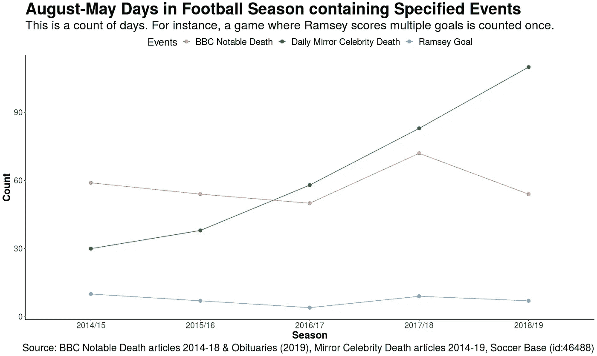

# 有阿隆·拉姆齐的诅咒吗？

> 原文：<https://towardsdatascience.com/is-there-a-curse-of-aaron-ramsey-3589d02dd278?source=collection_archive---------17----------------------->

“阿隆·拉姆齐的诅咒”暗示着:当前阿森纳足球运动员阿隆·拉姆齐进球时，一个名人很快就会死去。

这篇文章研究了这个“诅咒”的证据。

# 假定的诅咒

《每日星报》在 2018 年 4 月的[中描述了这种假设的现象:](https://www.dailystar.co.uk/news/latest-news/694207/Aaron-Ramsey-curse-list-goal-score-celebrity-death)

> 一个神秘的理论正在互联网上流传，当阿隆·拉姆齐进球时，一个知名的名人注定会在不久后去世。
> 
> 这位阿森纳和威尔士球员经常设法打进重要的进球——但有时也有不好的一面。

Are these celebrations a ghostly call of doom? (Photo: [Wikimedia Commons](https://commons.wikimedia.org/wiki/File:14_Ramsey_goal_celebrations_IMG_3783_(38012096206).jpg))

# 给我数据

阿隆·拉姆齐的进球记录来自[足球俱乐部](https://www.soccerbase.com/players/player.sd?player_id=46488)。这个分析只看每年 8 月到 5 月(简称足球年)之间的进球，涵盖 2014/15 到 2018/19。

“名人”的定义是主观的。我使用了两个不同的来源:每日镜报和英国广播公司。《每日镜报》每年都有“名人死亡”的在线文章。

同样，BBC 也有“显著死亡”的文章。对于 2016 年，由于名人死亡的数量很高，我只记录了在[BBC 文章](https://www.bbc.co.uk/news/magazine-38418802)中强调的“前 34 名”死亡的日期。

# 离门柱很远

总的来说，拉姆齐得分的天数和名人或名人去世的天数之间似乎没有关系。

The Daily Mirror celebrity death day count has increased.

我们还应该看看具体的说法:在阿隆·拉姆齐得分之后，名人或名人死亡的天数比例是多少？

我使用了八种不同的方法，分别对应于同一天和三天之后的死亡人数。

在研究期间有 37 天阿隆·拉姆齐进了一个球。名人或名人的死亡有一个基本比率——拉姆齐目标日确实超过了这个比例。

如果我们假设目标日是随机选择的(每一天都是一次试验)，我们的二项式假设意味着这个“诅咒”的证据是微弱的。这是一个过于简单的模型，没有考虑到足球运动员比赛天数的分布。

宣称:每当拉姆齐进球，就有一名名人死去，这显然是错误的。

# 出去射门

这八项措施并不是作为多重比较问题提出的，而是为了强调主观选择的影响。

使用任一数据集都是一种选择。名人的概念是主观的，我们很容易调整我们的定义来适应一个假定的模式。

选择一个时间范围来计算是一种选择。使用频率论者或贝叶斯方法是一种选择。

虽然这项研究只关注了这些联系，但暗示这些选择存在“诅咒”的说法并不可靠。

似乎没有阿隆·拉姆齐的诅咒。意大利的名人应该对拉姆齐自由转会尤文图斯没什么可担心的。

数据来源和基本分析包含在[的谷歌表单](https://docs.google.com/spreadsheets/d/1S0FGwVAp4EmIFC2akGmvJGqkJdHnqKlik02HBDVoxZQ/edit?usp=sharing)中。各种测试和数据可视化的 R 代码在[的一篇 R Pubs 文章](https://rpubs.com/anthonybmasters/is-there-a-curse-of-aaron-ramsey)中。