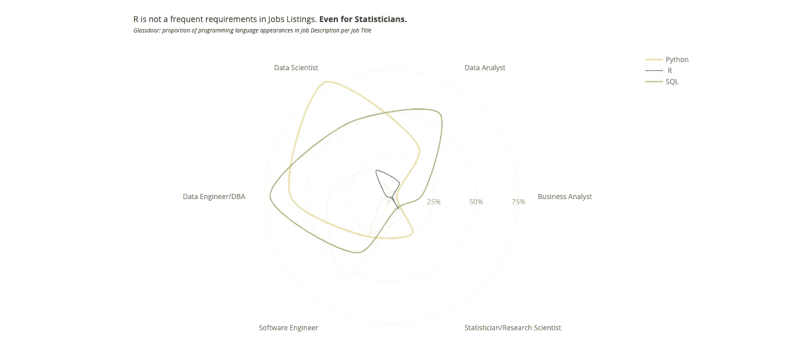

# 外面有工作吗？

> 原文：<https://towardsdatascience.com/is-there-any-job-out-there-81ca0b514166?source=collection_archive---------20----------------------->

## 有没有想过为什么找数据科学的工作这么难？看看 Kaggle Survey 和 Glassdoor 工作列表之间的比较。

> 喂？喂？喂？外面有工作吗？
> 能录用我就点头。
> 人力资源部有人吗？
> 
> 来吧…
> 我听说你情绪低落。
> 我可以减轻你的痛苦。
> 让你重新站起来。放松。
> 
> 改编自平克·弗洛伊德的《舒适的麻木》

去年，我做了一项分析，以了解是什么让数据科学家变得有价值？这个想法基本上是为了确定是什么让从事数据相关工作的人年收入超过 10 万美元。一年后，我从巴西搬到了英国，从数据科学转到了数据工程，从年收入 14k 美元到超过 100k 美元。

现在，我认为将数据专业人员的技能与世界各地的工作列表进行比较会很好。为了实现这个目标，我搜集了一些与职位相关的数据，并将结果与 Kaggle 进行的调查进行了比较。希望你发现它对规划你的职业生涯是有益的！

首先，让我们创建一个指标来比较这两个不同的数据集以及不同的国家。下面的雷达图显示了 Kaggler 的数量*(这是我将如何引用 ka ggle 用户)*以及与每个国家的总数成比例的工作列表。为了更好的理解，请看下面的例子。

**国家示例**

数据科学家= 30 个答案(或工作列表，如果是 Glassdoor)
开发人员= 90 个答案
总共= 120 个答案

**我们将策划:**
数据科学家= 25%
开发者= 75%

# 美国对中国

Percentage of Kaggle answers per country. Highlighted USA and China.

大多数国家的卡格勒比例与美国相同，数据科学家的比例高于其他职业。这确实有意义，因为 Kaggle 专注于数据科学。但是我们确实有一些异常值。从中国开始，软件工程师和数据工程师在 Kaggle 大量出现。**他们是想学数据科学转行吗？还是只是他们想加到现在角色上的一个知识？**

看看 Glassdoor 的工作列表，我们发现中国软件工程领域的工作比数据科学领域多得多。

**警告！如果你住在中国，是一名软件工程师，正在考虑迁移到数据科学，那么请重新考虑。在这个新的职业中，你可能会更难找到工作。**

**美国想要数据分析师！**如果你住在美国，想成为一名数据科学家，那么考虑找一份数据分析师的工作。这可能会容易得多，因为该地区的就业机会比 DS 多。

看一下 Kagglers 报道的薪水，我们发现与其他职位相比，中国支付给统计学家和研究科学家的薪水更高。然而，不幸的是，正如前面的图表所示，这个领域没有多少工作机会。在美国，薪水最高的是数据科学，其次是数据工程和软件工程。当然……美国在几乎所有的职位上都比其他国家支付更多。

# 巴西对印度

我们看到巴西和印度在所有职位上的 Kagglers 比例非常接近。然而，巴西有更高比例的统计学家和研究科学家，这可能表明在巴西学术界做博士的人比印度多。

查看工作列表，我们发现巴西与中国有相似之处:对软件工程师的巨大需求。

**来自巴西的数据科学家正在努力寻找工作！**考虑学软件工程，加入一家公司做初级开发。

**来自印度的卡格勒人！从商业分析师开始你的职业生涯有巨大的机会。**

看那个！数据工程在巴西的工资看起来很高！不过，要找到一份 DE 工作并不容易(记住，软件工程师的需求量要大得多)。在印度，数据科学家的报酬会更高。如果你想挣得更多，那么考虑搬到另一个国家。

# 一些欧洲国家

荷兰有更多的专业人士对 Kaggle 感兴趣，因此对数据科学感兴趣。对于其他国家，我们看到缺乏数据工程师和商业分析师。他们在目前的职位上快乐吗？

在欧洲，职位列表几乎是均等的(所有职位的比例几乎相同)，这意味着如果你想成为数据科学家或商业分析师，在职位提供方面不会有太大差异。但就竞争而言，如果我们将 Kaggle 的调查推广到现实世界，可能会有更多的数据科学候选人。

**来自欧洲的软件工程师！你在荷兰可能更容易找到工作！**

最后，当我们比较欧洲的工资时，我们发现他们几乎处于相同的范围(英国稍微高一点，可能是因为货币比欧元强)。现在我们可以说，商业分析师在欧洲确实很快乐，他们的平均收入甚至比技术人员还要高。

**来自英国和德国的软件工程师、数据工程师和数据科学家！**现在就停止编码，成为商业分析师！

**我开玩笑的。不要那样做。**还是做。

在上面的图表中，你可以看到机会在哪里，取决于你住在哪里。更多的工作列表意味着在该领域获得工作的机会更多。一个职位上有更多的人，可能意味着你在找工作时会面临更多的竞争。

# 多年的编码经验如何影响薪水？

我们确实期望随着经验的增加薪水会增加，事实就是这样！然而，你有没有看到那些根本不编码的人比那些开始编码的人挣得多一点？这可能是因为经理们坐在第一组。一旦你获得了一些动力编码，你的工资会持续增加。

我们能检验经理(没有编码经验)推动工资增长的假设吗？嗯……有点……我们希望经理们挣得更多，也更……老，对吗？让我们看看这是不是真的。

有理由推断，没有编码经验的人比没有什么经验的人挣得多，因为他们在管理岗位上。除了数据工程，我们有更年轻的人，没有编码经验，比那些开始编码的人挣得多。

# 公司规模如何影响薪水？

平均工资通常随着公司规模的增加而增加。数据科学家和统计学家/研究科学家认为，从一家初创公司跳槽到一家大公司时，他们的工资单会有最大的不同。商业分析师不能指望仅仅通过跳槽到一家更大的公司就能大幅增加工资。

薪水不是一切。在找大公司的工作之前，先考虑利弊。

# Python、R 和 SQL——在 Kaggle 和就业市场中的受欢迎程度

Python 已经成为所有职位的人使用的主要语言，大约 3/4 的受访者经常使用它。r 语言更不受欢迎(几乎没有软件工程师使用它)。

如果你想找一份数据科学方面的工作，那么 Python 是首选语言。Glassdoor 上超过 75%的数据科学职位在职位描述中都提到了 Python。

**Python 是市场偏爱的数据科学语言！**

统计学家和研究科学家比其他职业使用更少的 SQL。**事实上当时只有 1/4 的人使用 SQL！这表明学术界更习惯于平面文件而不是数据库。不幸的是，现实世界在**中没有出现。csv** 文件。**

嘿，你正在读硕士或博士，想找份工作！看上面那两张图！**学习 SQL！**

如果你想开始与数据打交道，那么了解 SQL 将有助于你获得商业和数据分析师的工作。现在如果你想走上数据工程的道路，SQL 和 Python 是必须的。软件工程师懂 Java 会更容易找工作。

**要想在数据世界谋得一份工作**，推荐学习的语言是 SQL！

我们看到 Kagglers 在 Python 的使用上做了充分的准备！虽然许多受访者使用 Bash 和 R，但工作描述中并没有频繁提到这些语言。业务分析师并不经常需要 SQL，但是了解它(就像 Kagglers 一样)会让你领先一步。总的来说，Kaggle 的软件工程师和数据工程师可能很难找到工作，因为经常需要 Java，而他们中的许多人不具备这种技能。

学习 Java 有助于你进入软件工程或数据工程

# 应该学习多少种编程语言？

学习(和使用)多种语言看起来不像是薪资方面的竞争优势。挑选三个，并在使用它们的时候成为真正的**专家**。限制你的语言，尤其是如果你没有处理数据的经验！

**停止学习多种语言！** Python，SQL，再多一门你选的语言应该就够了。

# 谁应该学习和使用云计算平台？

我们看到许多 Kagglers 数据科学家习惯于使用云平台！对于生产机器学习模型来说，这是一个好消息，因为如果数据科学家不在他们的本地环境中做任何事情，那么与模型一起生活会容易得多。

我可以确认这是真的！自从我从数据科学迁移到数据工程，我开始大量使用 AWS 产品。云计算平台有很多针对整个数据管道的托管服务。知道在哪里应用(以及如何使用)它们对于任何数据工程师来说都是至关重要的。

**注意！要从事数据和软件工程工作，你需要大量关于云计算平台的知识！**

# 数据库

**来自学术界的 Kagglers！再次强调，如果你想为市场做好准备，就应该更频繁地使用关系数据库。**

虽然他们在职位描述中不经常出现，但我们看到数据工程师和软件工程师的列表通常需要数据库引擎的知识，如 PostgreSQL、MySQL 和 SQL Server。具有 SQL Server 知识的数据分析师在找工作时可能会从中受益。

# 最后……外面有工作吗？

**是的有！**

*   也许你只是找错了地方，或者不具备某个职位的要求。
*   尝试将你的技能与正确的职位相匹配。
*   寻找其他领域的机会，在工作机会和专业人士之间有很多不匹配。
*   也许你的下一份工作不是数据科学家，而是数据分析师、数据工程师甚至软件开发员。

# 附录

## 从 Glassdoor 获取工作列表

我创建了一个简单的脚本来删除 [Glassdoor](https://www.glassdoor.com/) 列表。网络抓取是在 2019 年 12 月 10 日完成的，我能够检索到超过 165，000 个职位列表。这个过程的更多细节可以在这个 [GitHub 库](https://github.com/andresionek91/Job-Listing-Scraper)上找到。

数据经过处理，作为 [Kaggle 数据集](https://www.kaggle.com/andresionek/data-jobs-listings-glassdoor/)公开发布！由于 Glassdoor 网站的限制，数据提取仅限于每个国家每个搜索词的第 30 页。请检查一下，也可以随意处理这些数据！

## 2019 年 Kaggle 调查的公共数据集

我能做这项研究只是因为 Kaggle 发布了其第三次年度[机器学习和数据科学调查](https://www.kaggle.com/c/kaggle-survey-2019)的数据。该调查于 2019 年 10 月上线，为期三周，共收到 19717 份回复。结果包括谁在处理数据的原始数据，不同行业的机器学习情况，以及新数据科学家进入该领域的最佳方式。

## 带有复制学习代码的笔记本

在 Kabble 上可以公开获得复制这项研究的代码和所有图表的笔记本。点击此处查看！

## 其他考虑

*   我们假设受访者的回答是诚实和真诚的。
*   这可能不代表数据专业人员的全部(它只有 Kaggle 用户的答案)，但它是一个很好的代理。

*在此添加此图片只是为了能够将其定义为特色图片:*

