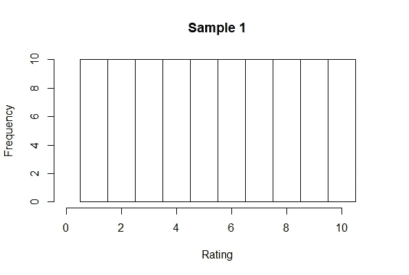
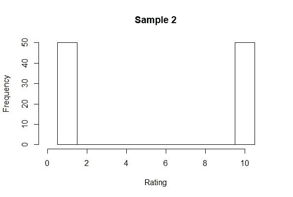

# 方差真的是不确定性的度量吗？

> 原文：<https://towardsdatascience.com/is-variance-really-a-measure-of-uncertainty-6ec6da21bb03?source=collection_archive---------18----------------------->

## 关于概率统计的思考

假设您正在收集评级数据的样本，范围从 1 到 10。假设您的样本由 100 个点组成，考虑两个可能的样本。

1.  10 个人从 1 到 10 给每个可能的值打分。
2.  50 个人给 1 分，50 个人给 10 分。

第一个样本对应于所有 10 个可能值的均匀分布。

Uniform Distribution

第二个样本对应于极值 1 和 10 处的双峰分布。

Bimodal Distribution

# 哪种分布更「不确定」？

如果我们将方差作为不确定性的度量，那么我们可以计算每个分布的样本方差，对于均匀样本，我们将得到 8.33，对于双峰样本，我们将得到 20.45。然后我们会得出结论，双峰样本更不确定。

但是在某种意义上，双峰样本比均匀样本更容易预测，不确定性更小。只有两个可能的值，而统一样本有十个可能的值，如果您必须准确预测个人给出的评级，您可能会在双峰样本上得到更正确的结果。

事实上，如果我们把熵作为不确定性的一种度量，那么我们就会知道，对于一个有限的支持，使熵(以及不确定性)最大化的分布就是均匀分布。

但是如果预测没有被评估为完全正确或错误呢？例如，如果有人给了 10 分，而你预测的是 9 分，你可能是不正确的，但已经足够接近了，这比你预测的 1 分要好。通过调整评估预测的方式，有可能得出均匀分布比双峰分布更可预测的结论，因此双峰分布将更加不确定。

# 方差或熵是更好的不确定性度量吗？

这个问题就看用户自己的判断了。没有一个最好的方法来捕捉不确定性的概念。例如，它可能取决于数据的属性(例如，方差不适用于分类数据，但熵适用)。

我的观点是，很容易将数学构建的公式与非数学思想混淆，在越来越多的人试图用数据欺骗你的时候，意识到这些问题是很重要的。