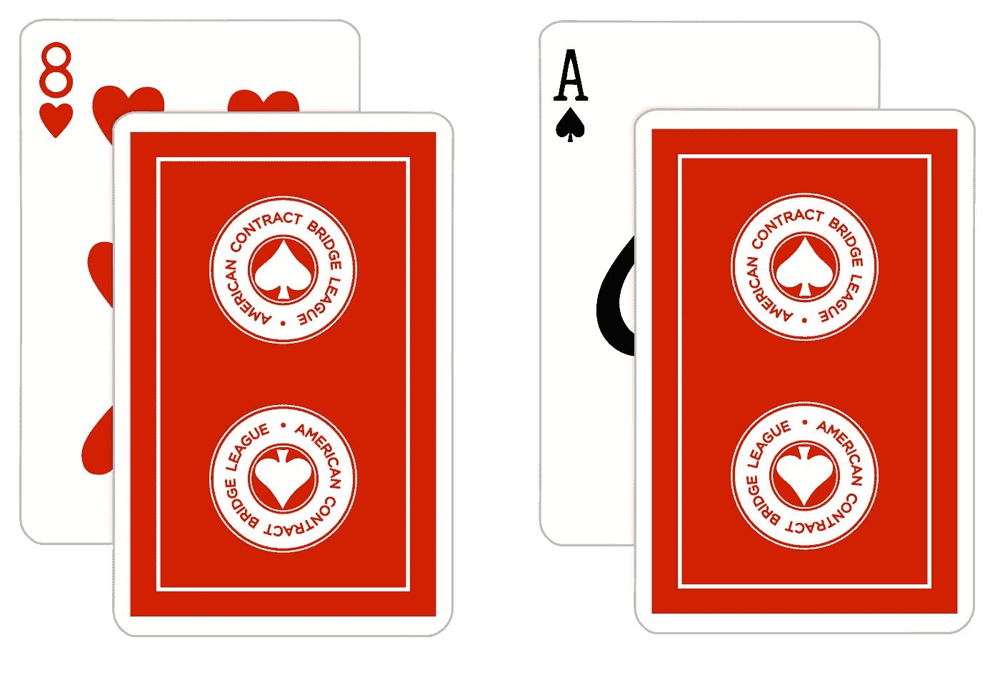

# 你的算法够自信吗？

> 原文：<https://towardsdatascience.com/is-your-algorithm-confident-enough-1b20dfe2db08?source=collection_archive---------10----------------------->

## 如何度量神经网络中的不确定性？

当机器学习技术被用于“关键任务”应用时，可接受的误差幅度变得非常低。

想象一下，你的模型正在驾驶一辆汽车，协助一名医生，甚至只是直接与一个(可能很容易被激怒的)终端用户进行交互。在这些情况下，您需要确保在对模型做出的预测采取行动之前，您对这些预测有信心。

> 随着模糊系统日益成为我们模糊生活的一部分，测量预测不确定性变得日益重要。

这里有一个好消息:有几种测量神经网络不确定性的技术，其中一些非常容易实现！首先，让我们感受一下我们将要测量的东西。


Photo credit: [Juan Rumimpunu](https://unsplash.com/@earbiscuits?utm_source=medium&utm_medium=referral).

# 给不确定性加上一个数字。

当你制作世界的模型时，你的模型不能总是提供准确的答案。

这部分是由于模型是一个非常复杂的世界的简化。因为有些信息是未知的，所以从模型中得到的预测会有一定程度的不确定性。

我们世界的某些部分(以及我们衡量它的方式)简直是混乱的。有些事情是随机发生的，这种随机性也是模型预测不确定性的一个来源。

[预测不确定性可分为 3 类](https://eng.uber.com/neural-networks-uncertainty-estimation/):

## **1。模型不确定性。**

模型的不确定性来自于对问题的“无知”。也就是说，模型的不确定性量化了那些*可以被模型*正确捕捉而不能捕捉的[事物。](https://en.wikipedia.org/wiki/Uncertainty_quantification)

[来自 Taboola 的 Yoel 和 Inbar 提供了一个有趣的例子:](https://engineering.taboola.com/using-uncertainty-interpret-model/)


You want to build a model that gets a picture of an animal, and predicts if that animal will try to eat you. You trained the model on pictures of lions and giraffes. Now you show it a zombie. Since the model wasn’t trained on pictures of zombies, the uncertainty will be high. If trained on enough pictures of zombies, this uncertainty will decrease.

有时也被称为**或 ***结构不确定性*** 。测量模型的不确定性是统计学的一个领域，被认为是特别具有挑战性的。其中一个原因是，随着模型变得越来越复杂，像*贝叶斯模型平均*这样的原则性技术变得非常昂贵。**

## ****2。模型设定错误。****

**如果您的模型在训练和验证期间产生了良好的预测，但在评估(或生产)期间却没有，那么它可能是错误指定的。**

**模型设定错误不确定性捕获模型根据与训练数据模式完全不同的新数据进行预测的情况。**

## ****3。固有噪声。****

**这是由数据集中存在的噪声产生的不确定性。这可能是由于不完善的测量技术或被测物体固有的随机性。**

****

**Imagine your dataset contains 2 images of cards facing down. You’re feeling optimistic and you want to build a model to predict the suit and value of each card. The first card is labeled as ace of spades and the other is labeled as 8 of hearts. Here, the exact same features (an image of a card facing down) can be linked to different predictions (either ace of spades or 8 of hearts). Therefore, this dataset is subject to lots of inherent noise.**

**固有噪声有时也被称为 ***任意的*** 或 ***统计不确定性*** 。固有噪声量与给定分类器的最低可实现误差率[贝叶斯误差率](https://en.wikipedia.org/wiki/Bayes_error_rate)相关联。可以想象，一个模型所能达到的最低可能错误率与数据本身的噪声所产生的错误量紧密相关。**

**这些概念严重依赖贝叶斯统计。我以简单的方式概述了这些想法，但这只是触及了这些深层主题的表面。**

**要了解贝叶斯神经网络中不确定性度量的更多信息，我推荐[看一看](/what-uncertainties-tell-you-in-bayesian-neural-networks-6fbd5f85648e) [Felix Laumann](https://towardsdatascience.com/@laumannfelix) 的这篇文章。为了深入解释数据科学背景下的贝叶斯统计， [Ankit Rathi](https://towardsdatascience.com/@rathi.ankit) 已经写了一系列关于这个主题的伟大文章。**

****

**Photo credit: [Avi Richards](https://unsplash.com/@avirichards?utm_source=medium&utm_medium=referral)**

# **实现不确定性。**

**此时，你可能在想:*“听起来不错，但是我如何在我的模型中实现不确定性呢？”*。**

**[贝叶斯神经网络](https://github.com/kyle-dorman/bayesian-neural-network-blogpost)默认情况下集成了不确定性，此外通常对过拟合和处理较小的数据集更加鲁棒。然而，用于构建贝叶斯神经网络的工具链仍在出现，并且无论是在训练期间还是在进行预测时，模型的计算成本都更高。**

**此外，将您的工作迁移到概率模型(如贝叶斯神经网络)将会很烦人。**

**从长远来看，概率深度学习将有可能成为默认。不过现在，将概率观点整合到我们现有工作中的实用技术是一个良好的开端！**

## **蒙特卡洛辍学。**

**几年前，剑桥大学的 Yarin 和邹斌发现了一种方法，可以在不改变神经网络结构或优化技术的情况下近似模型的不确定性。**

**下面是简短的版本:通过在测试时在每个权重层之前使用 dropout，并多次迭代运行您的预测，您可以近似贝叶斯不确定性。他们称这个过程为**蒙特卡洛辍学**:**

1.  **你给你的模型输入一个信息。**
2.  **您对单个输入进行多次迭代预测，每次都随机禁用神经网络的一小部分。**
3.  **你取平均产值。**这是你的预测。**最后，您测量迭代之间的方差。**这就是模型的不确定性。****

****直觉上，我是这样想的:**你的预测随着模型微小的结构变化而波动的越多，那个预测就越不确定。**

**实现蒙特卡洛辍学真的很容易。在这里，我从一个简单的密集网络开始，这个网络是用 Keras 构建的 [MNIST 问题](http://yann.lecun.com/exdb/mnist/)。默认情况下，仅在训练期间启用辍学层。要在测试时启用漏失层，请为每个层设置`training=True`。**

```
**img_dim = 28x_in = Input(shape=(img_dim, img_dim,))
x = Dropout(0.2)(x_in, **training=True**)
x = Dense(500, activation="relu")(x)
x = Dropout(0.2)(x, **training=True**)
x = Dense(250, activation="relu")(x)
x = Dropout(0.2)(x, **training=True**)
x_out = Dense(10, activation="softmax")(x)model = Model(inputs=x_in, outputs=x_out)
model.compile(loss="categorical_crossentropy", optimizer="rmsprop")**
```

**接下来，我们需要一个定制的预测函数，它可以迭代预测并返回这些迭代的均值和方差。在本例中，我们测量的是标准偏差而不是方差，因为它与平均值用相同的单位表示。**

```
**def predict_with_uncertainty(model, 
                             X, 
                             batch_size=None, 
                             num_iterations=100): last_layer = model.layers[-1] results = np.zeros((num_iterations,
                       X.shape[0],
                       last_layer.output_shape[1]), 
                       dtype="float") for i in range(num_iterations):
        results[i] = model.predict(X, batch_size=batch_size)

    **predictions = results.mean(axis=0)**
    **uncertainty = results.std(axis=0)**

    return predictions, uncertainty**
```

**现在，您可以用近似的不确定性进行预测了:**

```
**predictions, uncertainty = predict_with_uncertainty(model,your_data)**
```

****

**Photo credit: [Tim Gouw](https://unsplash.com/@punttim?utm_source=medium&utm_medium=referral)**

# **问题和批判。**

**正如我们所见，使用蒙特卡洛辍学真的很容易。也许连 ***都太容易*** 。[deep mind 的 Ian Osband 对该技术提出了批评](https://www.semanticscholar.org/paper/Risk-versus-Uncertainty-in-Deep-Learning-%3A-Bayes-%2C-Osband/dde4b95be20a160253a6cc9ecd75492a13d60c10),他指出一个简单模型的预测不确定性并没有随着数据的增加而降低。这就提出了一个问题，即它是否是贝叶斯不确定性的不准确近似，或者是否有任何潜在的假设需要变得更清楚。**

**关于这个问题，Sebastian schner 写了一篇很棒的博客文章，总结了他的评论。**

****在我工作的地方** [**神田**](https://www.kanda.dk/) **，我们对蒙特卡洛辍学的有效性有着复杂的体验。****

**像我之前的例子一样，对于一个在 MNIST 上训练的简单全连接模型，不确定性近似表现出预期的行为:当呈现噪声而不是手写数字时，近似的不确定性更高。我们发现 50-100 次蒙特卡洛淘汰迭代产生了令人满意的结果。**

**后来，我们有一个场景，我们需要在智能手机上本地运行图像识别任务，作为 AR 应用程序的一部分。我们使用迁移学习，在 [NASNet 移动架构](https://arxiv.org/pdf/1707.07012.pdf)之上构建一个分类器。**

> **在智能手机上运行 100 次 NASNet 迭代并不是一个好主意。**

**即使采用高度并行化，我们实际上也只能在设备上运行大约 20 次迭代，以便及时提供预测。**

**其次，不确定性估计不准确。当喂给一张随机噪音的图片时，不确定性出奇的低。值得注意的是，我们只在 NASNet 之上的分类器的密集连接部分实现了 dropout。**如果你愿意分享直觉，告诉我哪里出了问题，我很有兴趣阅读你的回复！****

# **结论。**

**首先，我们看了一下为什么量化机器学习模型中的不确定性很重要。然后，我向你介绍了关于预测不确定性的 3 种不同的思考方式:**模型不确定性、模型错误设定和固有噪声。****

**Monte Carlo dropout 是一种易于实现的近似贝叶斯不确定性的技术，但是对于近似是否真的准确还存在一些争议。实际上，我发现 Monte Carlo dropout 对简单模型有效，但对复杂模型的方法有一些问题，在准确性和性能方面。**

**我**在机器学习中整合贝叶斯概率只会在未来变得更加重要**，我期待看到更多的概率技术成为工具链的一部分。**