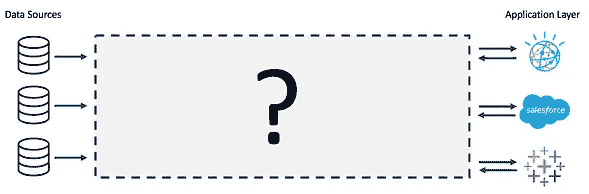
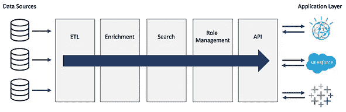
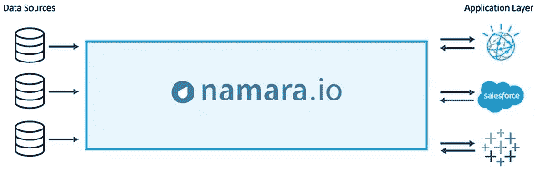

# 你的数据准备好 AI 了吗？

> 原文：<https://towardsdatascience.com/is-your-data-ready-for-ai-dfa3e318fc09?source=collection_archive---------41----------------------->

公司正迫不及待地推出任何有望实现人工智能和机器学习的解决方案。但是仓促的采用留下了一个重要的问题没有得到解答。

你的数据准备好 AI 了吗？

对于大多数公司来说，答案是否定的。

每个领域的行业领导者都在竞相采用复杂的系统，这些系统承诺将人工智能和人工智能引入他们的组织。高管们经常被一种技术的概念所说服，这种技术将使他们能够看到人类看不到的东西，对业务提出建议或改变，从而释放新的机会并提高效率。

虽然机会肯定存在，在某些情况下技术也是如此，但与大多数组织的数据环境的运营就绪性相比， [**AI 和 ML**](https://www.thinkdataworks.com/ai-ml) 呈现的可能性之间存在重大脱节。

*“AI 就像高中的性。每个人都说他们在做这件事，但很少有人真的在做，而那些在做的人都做错了。”*

在我们与不同领域(金融、保险、房地产等)的许多市场领先公司的决策者的讨论中，我们看到的是对数据仓库的非常扎实的理解，以及对可以开始解决其业务需求的丰富应用层的非常强烈的渴望。

然而，事实上，数据仓库和应用层代表了一个过程的开始和结束，在这个过程的中间通常缺少的是一个非常复杂的堆栈，它将一端的原始数据转换为另一端的可用信息。问题是，这个“中间”层不仅是一个难以解决的问题，而且对于许多制定 it 战略、预算和时间表的决策者来说，它也是一个主要的未知数。

“如果沃森能赢得 Jeopardy，它一定有认知能力来涉猎我的数据并开发洞察力，对吗？”

通常，组织有一个数据仓库策略或一个完全部署的数据仓库解决方案，其重点是将数据放在一个地方。这一战略通常会附带一份已经购买的应用程序清单或使用新技术(人工智能、ML、自动化、分析、可视化)的解决方案路线图。从高层次来看，问题似乎已经解决了:

把所有的数据收集在一起——检查。

购买将原始数据转化为洞察力的应用程序—勾选。

这里的概念是，一旦我们把所有的数据放在一个公共的地方，我们就可以把它插入任何我们想要的东西。简单。问题是，从数据仓库出来的数据缺乏一个通用的标准，位于数据之上的应用程序无法完全实现，因为…

…在数据(有湖或无湖)和尚未定义或实施的企业应用程序之间有一个巨大的细化层。为了解决这个问题，需要引入一个系统，该系统能够将数据从其母语转换为任何应用程序都可以学习理解的集中标准。不仅如此，它还必须能够持续不断地做到这一点，并且能够扩展到无限数量的新的和现有的数据源。

## 即使是最好的软件也需要好的数据。

归根结底，任何应用程序、自动化或人工智能/人工智能技术都需要由精细化、标准化的数据来驱动，才能发挥其最大能力。如果没有标准数据，您希望实施的、有望彻底改变您的业务的改变游戏规则的技术将局限于 it 可以访问的标准数据的最低公分母。通常，这意味着信息量极其有限，即使这些信息现在都来自同一个地方。
数据需要被提炼为燃料，并以所需的数量交付给 it 负责驱动的应用程序。这样做的系统，或者更好的是，检查所有必需框的数据提炼过程，看起来像这样:

或者，对于那些对我们用我们的平台 [**【纳马拉**](https://www.thinkdataworks.com/namara) 为我们的一些客户做的事情感兴趣的人，看起来是这样的:

许多真正成功的人工智能和人工智能技术的展示都是在极其干净和标准化的数据库的基础上展开的。但是在大多数组织中，数据仍然是完全隔离的。将数据集中到一个“湖”中或企业云上，可以将数据放在一个公共位置，但数据本身通常仍然缺乏标准化。这一层数据标准化仍然是许多组织尚未克服的巨大障碍。随着有远见的组织开始重视和利用新的外部数据源，问题的复杂性只会进一步增加。

## 各种各样的数据意味着各种各样的问题。

我们试图解决的问题是数据的多样性。适当的仓储有助于我们解决数量和速度问题，但一个完全开放的企业应用程序的世界要求我们回答这样一个问题:我们如何将来自多个地方的类似数据转换为一致的通用标准。

在许多组织中，答案是，“那是我们数据科学家的工作”。但如果我们真的去想，应该是吗？数据科学家是高技能、高收入的个人，他们的时间和精力应该集中在帮助企业以数据驱动的方式发展上。如果是这样的话，那么为什么他们会花这么多时间来查找、清理、标准化和监控数据呢？

简短的回答是，鉴于大多数组织没有合适的数据处理管道来生成理想的数据，以使他们的应用程序和科学家尽可能高效地工作，这是必然的。

这将大多数数据科学家变成了数据看门人，这也是大多数企业应用程序永远不会完全实现企业部署的原因。

# “问题不在于缺乏方向或能力。缺少精确的数据。”

数据湖或云的想法是好的，也是必要的概念。数据需要被汇集到不同的位置，以便多个函数可以出于多种原因访问它。许多好事成为可能，因为人们开始意识到知道他们的数据在哪里以及它实际上是由什么组成的好处。

现在，当我们展望商业智能的下一个阶段，一个带来自动化、人工智能和机器学习的阶段时，我们必须少考虑湖中的数据，而更多地考虑数据需要如何以标准的方式在整个组织中流动。我们已经不再需要一个可以容纳数据的容器，而是需要一个血管系统，让数据以所需的形状和形式流向所需的地方。

这似乎是一个巨大的飞跃，但实际上，这是完全可以实现的。事实上，所需的许多部分都显示在上面的图形中。就您自己而言，这不是一个快速或简单的构建，但如果您真正从企业角度思考，这是一个必须解决的问题。

这里的要点是不要停止寻找可以帮助释放巨大潜力的新技术。要记住的是，不管新的解决方案有多么闪亮和惊人，它们都需要火箭燃料来帮助它们升空。当我们谈论改变游戏规则的企业应用程序时，火箭燃料是标准化数据。改进 it 的流程需要与采用新的 [**商业智能工具和应用**并行实施。](https://www.thinkdataworks.com/integrations)

[**阅读更多**](https://www.thinkdataworks.com/data-normalization) 关于我们如何提供干净的数据库来推动人工智能技术的发展。

[**Namara**](https://app.namara.io/) 是政府、银行和一些世界上最大的公司所依赖的数据管理平台。我们将 Namara 设计成最安全、最协作的方式来访问、管理和集成推动您业务发展的数据。 [**今天报名免费**](https://app.namara.io/#/sign_up) 。

在应用程序上联系我们，或 [**在这里联系我们**](https://www.thinkdataworks.com/contact) 获得任何问题的答案。

【https://blog.thinkdataworks.com】最初发表于**。**