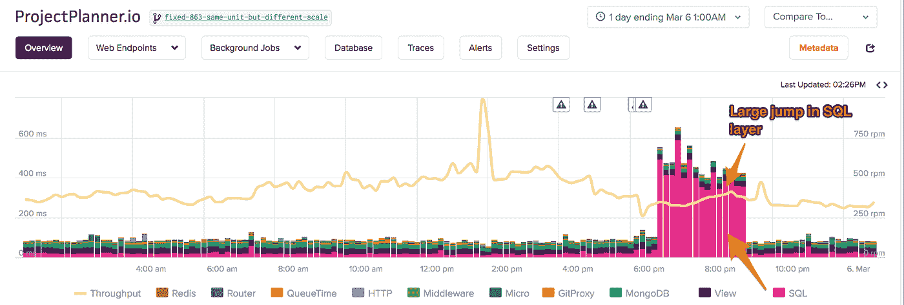

# 你的 Django 应用慢吗？去问数据科学家，而不是工程师

> 原文：<https://towardsdatascience.com/is-your-django-app-slow-ask-a-data-scientist-not-an-engineer-3c120384ffd9?source=collection_archive---------16----------------------->

我的职业是工程师。在调查一个缓慢的 Django 应用程序时，我依靠直觉。这些年来，我已经解决了很多性能问题，我的大脑采取的捷径经常奏效。然而，直觉可能会失败。它在复杂的 Django 应用程序中可能会失败，这些应用程序有许多层(例如:SQL 数据库、NoSQL 数据库、ElasticSearch 等)和许多视图。噪音太大了。

**如果我们不依赖工程师的直觉，而是像数据科学家一样进行性能调查，会怎么样？**在这篇文章中，我将以数据科学家的身份，而不是工程师的身份，讲述一个性能问题。我将分享来自一个真实性能问题的时间序列数据和我用来解决这个问题的 Google Colab 笔记本。

# 问题第一部分:噪音太大


Photo Credit: pyc [Carnoy](https://www.flickr.com/photos/pyc/4963466757/in/photolist-8yB4K4-pBRCcq-nZXkWu-bWsES4-29rmwqJ-boe2Vk-7vsTeb-9N2guL-ng4zzC-8hE5Cq-zouzT-areoZ2-nLQoy7-8hpHiQ-a5r9xQ-8hE5Ku-ofvatX-n3mHF-fHSwDM-inbd3a-7oT1q-4UsU2J-2526RGe-8LaPMa-32AUXJ-bka1JE-bka1Kf-9aBMJf-dqr3qB-dqrdUr-5sx8D-o4dwhQ-hR6gY-prMTu-4Tg8va-29MP5Hj-7F2BDK-7F6uoN-7EAp5f-7EAnS1-7E4qdX-JoapDG-7F6v6y-zosvP-7DrJvR-7Ewy2F-7F6v9N-6g9j2o-7Ewvci-7DrFoZ)

许多性能问题是由以下原因之一引起的:

1.  **一个缓慢的层**——仅仅是许多层(数据库、应用服务器等)中的一层速度缓慢，影响了 Django 应用中的许多视图。
2.  **慢速视图** —一个视图正在生成慢速请求。这对整个应用程序的性能有很大的影响。
3.  **高吞吐量视图** —一个很少使用的视图突然看到流量涌入，并触发应用程序整体响应时间的峰值。

**在调查性能问题时，我会从寻找相关性开始。**是否有任何指标同时变差？这可能很难:**一个拥有 10 层和 150 个视图的普通 Django 应用程序有 3000 个不同的时间序列数据集组合要比较！**如果我的直觉不能快速隔离问题，我自己也几乎不可能隔离问题。

# 问题第二部分:幻影相关性

确定两个时间序列数据集是否相关是[异常多变的](https://www.kdnuggets.com/2015/02/avoiding-common-mistake-time-series.html)。例如，尼古拉斯·凯奇每年出现在电影中的次数和游泳池溺水事件有关联吗？


[伪相关性](https://www.indiebound.org/book/9780316339438)是一整本书都在讲述这些看似清晰却毫无关联的相关性！那么，**为什么看时间序列图时，趋势似乎会引发相关性呢？**

这里有一个例子:五年前，我所在的科罗拉多地区经历了一场历史性的洪水。它关闭了进入埃斯蒂斯公园的两条主要路线之一，这是通往落基山国家公园的大门。如果你查看埃斯蒂斯帕克许多不同类型企业的销售收入，你会发现道路关闭时收入急剧下降，道路重新开放时收入增加。这并不意味着不同商店的收入是相关的。商店只是受到了相互依赖的影响:一条封闭的道路！

从时间序列中去除趋势的最简单方法之一是计算 [*第一差值*](https://people.duke.edu/~rnau/411diff.htm) 。要计算第一个差值，从每个点减去之前的点:

```
y'(t) = y(t) - y(t-1)
```

这很好，但当我盯着图表时，我的视觉大脑无法将一个时间序列重新想象成它的第一个差异。

# 进入数据科学

**我们面临的是数据科学问题，而不是性能问题！**我们想要识别任何高度相关的时间序列指标。我们希望看到过去的误导趋势。为了解决这个问题，我们将使用以下工具:

*   [Google Colab](https://colab.research.google.com/) ，一个共享的笔记本环境
*   常见的 Python 数据科学库，如 [Pandas](https://pandas.pydata.org/) 和 [SciPy](https://www.scipy.org/)
*   从应用程序性能监控(APM)产品 [Scout](https://scoutapp.com/) 收集的性能数据。如果您还没有帐户，请注册免费试用。

我将在 Google Colab 上浏览一个[共享笔记本。您可以轻松保存该笔记本的副本，从 Scout 输入您的指标，并在您的 Django 应用程序中确定最重要的相关性。](https://colab.research.google.com/drive/1VhCwtGLc-tWhB_gbGuBo_cfs7Q5J4dCI)

# 第一步:在 Scout 中查看应用程序

我登录 Scout，看到下面的概览图:



花费在 SQL 查询上的时间从晚上 7 点到 9 点 20 分大幅增加。为什么？这很可怕，因为几乎每个视图都要接触数据库！

# 步骤 2:将图层时间序列数据加载到 Pandas 中

首先，我想寻找层(例如:SQL、MongoDB、View)和 Django 应用程序的平均响应时间之间的相关性。层(10)比视图(150+)少，所以这是一个简单的起点。我将从 Scout 获取这个时间序列数据，并初始化一个熊猫数据框架。我将把这个数据争论[留给笔记本](https://colab.research.google.com/drive/1VhCwtGLc-tWhB_gbGuBo_cfs7Q5J4dCI#scrollTo=8KKzj89nfZ-9)。

将数据加载到熊猫数据框架后，我们可以[绘制这些图层](https://colab.research.google.com/drive/1VhCwtGLc-tWhB_gbGuBo_cfs7Q5J4dCI#scrollTo=j4PKi7wIfZ_L):


# 步骤 3:层关联

现在，让我们看看是否有任何层与 Django 应用程序的总体平均响应时间相关。在将每个层时间序列与响应时间进行比较之前，我们要计算每个时间序列的一阶差。对于熊猫，我们可以通过`diff()`功能轻松做到这一点:

```
df.diff()
```

在计算了第一个差异之后，我们可以通过`corr()`函数寻找每个时间序列之间的[相关性](https://en.wikipedia.org/wiki/Correlation_coefficient)。相关值的范围从 1 到+1，其中 1 表示最可能一致，0 表示最可能不一致。

我的笔记本生成了[以下结果](https://colab.research.google.com/drive/1VhCwtGLc-tWhB_gbGuBo_cfs7Q5J4dCI#scrollTo=hwm0KcDzfZ_Z):


`SQL`似乎与 Django 应用的整体响应时间相关。可以肯定的是，我们来确定皮尔逊系数 [p 值。](http://www.eecs.qmul.ac.uk/~norman/blog_articles/p_values.pdf)低值(< 0.05)表示总体响应时间很可能与 SQL 层相关:

```
df_diff = df.diff().dropna() p_value = scipy.stats.pearsonr(df_diff.total.values, df_diff[top_layer_correl].values)[1] print("first order series p-value:",p_value)
```

**p 值正好是** `**1.1e-54**` **。我非常确信缓慢的 SQL 查询与整体缓慢的 Django 应用程序有关。**总是数据库，对吧？

层次只是我们应该评估的一个维度。另一个是 Django 意见的响应时间。

如果视图开始响应缓慢，应用程序的整体响应时间可能会增加。我们可以通过查看我们的视图响应时间与整体应用程序响应时间的相关性来了解这种情况是否会发生。我们使用与图层完全相同的流程，只是将图层换成 Django 应用中每个视图的时间序列数据:


在计算每个时间序列的第一个差异后，`apps/data`确实与整个 app 响应时间相关。**p 值仅为** `**1.64e-46**` **，** `**apps/data**` **极有可能与 app 整体响应时间相关。**

我们差不多完成了从噪音中提取信号。我们应该检查任何视图的流量是否会导致响应时间变慢。

# 步骤 5:冲洗+重复 Django 查看吞吐量

如果视图的吞吐量突然增加，很少使用的昂贵视图可能会影响应用程序的整体响应时间。例如，如果用户编写一个脚本来快速重新加载一个昂贵的视图，就会发生这种情况。为了确定相关性，我们将使用与之前完全相同的过程，只是交换每个 Django 视图的吞吐量时间序列数据:


`endpoints/sparkline`看似有小关联。p 值是`0.004`，这意味着有 4/1000 的几率*不与`endpoints/sparkline`的流量和整体应用响应时间相关。因此，`endpoints/sparkline`视图的流量确实会导致应用程序整体响应时间变慢，但这比我们的其他两个测试更不确定。*

# 结论

使用数据科学，我们已经能够对比直觉多得多的时间序列指标进行排序。我们也能够在没有误导趋势搅浑水的情况下进行计算。

**我们知道 Django 应用的响应时间是:**

*   与我们的 SQL 数据库的性能密切相关。
*   与我们的`apps/data`视图的响应时间密切相关。
*   与`endpoints/sparkline`流量相关。尽管我们对这种低 p 值的相关性很有信心，但它没有前两种相关性那么强。

**现在是工程师的时间了！**有了这些见解，我会:

*   调查数据库服务器是否受到应用程序外部的影响。例如，如果我们只有一台数据库服务器，备份过程可能会降低所有查询的速度。
*   调查对`apps/data`视图的请求的组成是否已经改变。例如，拥有大量数据的客户是否开始更多地使用这种视图？Scout 的 [Trace Explorer](http://help.apm.scoutapp.com/#trace-explorer) 可以帮助调查这些高维数据。
*   推迟调查`endpoints/sparkline`的性能，因为它与整个应用程序响应时间的相关性不是很强。

**重要的是要意识到所有来之不易的经验何时会失效。我的大脑根本无法像我们的数据科学工具那样分析成千上万的时间序列数据集。伸手拿另一个工具是可以的。**

如果你想自己解决这个问题，请查看我在调查这个问题时使用的[我的谷歌共享笔记本](https://colab.research.google.com/drive/1VhCwtGLc-tWhB_gbGuBo_cfs7Q5J4dCI)。**下次您遇到性能问题时，只需从** [**Scout**](https://scoutapp.com/) **导入您自己的数据，让笔记本为您工作！**

*原载于*[*scoutapp.com*](https://scoutapp.com/blog/is-your-django-app-slow-ask-a-data-scientist-not-an-engineer)*。*