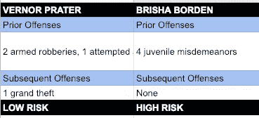
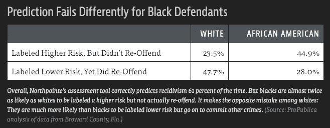
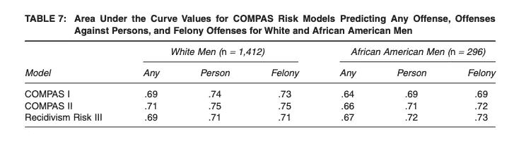
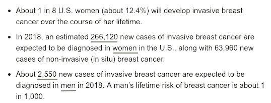
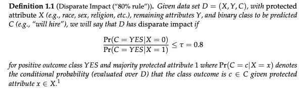
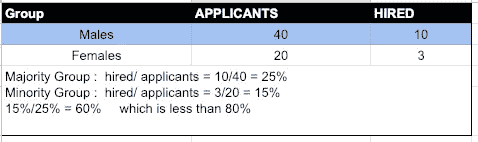
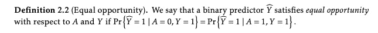
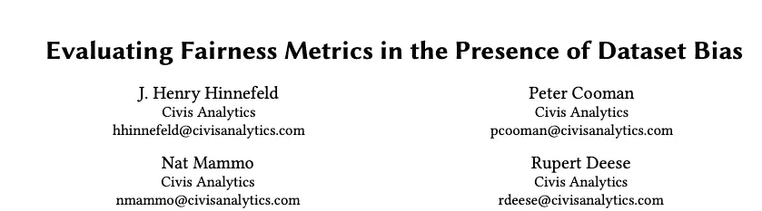
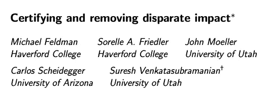
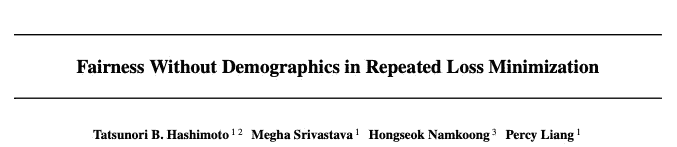

# 你的机器学习模型有偏差吗？

> 原文：<https://towardsdatascience.com/is-your-machine-learning-model-biased-94f9ee176b67?source=collection_archive---------6----------------------->

## 如何衡量模型的公平性，并决定最佳的公平性指标。

Photo by [rawpixel](https://unsplash.com/@rawpixel?utm_source=medium&utm_medium=referral) on [Unsplash](https://unsplash.com?utm_source=medium&utm_medium=referral)

> 机器学习模型正越来越多地用于做出影响人们生活的决策。有了这种权力，就有责任确保模型预测是公平的，没有歧视。

[***ProPublica***](https://www.propublica.org/about/)*，一个独立的调查性新闻机构，在 2016 年 5 月 23 日出了一个令人不安的故事，标题是* [***机器偏见***](https://www.propublica.org/article/machine-bias-risk-assessments-in-criminal-sentencing) ***。*** *它突出了美国司法系统的一个重大偏见，举了一个例子，一个名叫布里莎·博登的 18 岁女孩* *。2014 年，布里沙因盗窃自行车被捕。她被指控盗窃 80 美元。就在一年前，41 岁的弗农·普拉特因在附近的家得宝商店偷了价值 86.35 美元的工具而被捕。普拉特是一名惯犯，过去曾因多次盗窃和持械抢劫被定罪。另一方面，Brisha 在少年时犯过一些小过错，尽管并不严重。*

[***COMPAS******，*** *代表* ***惩教罪犯管理概况替代制裁*** *是美国各州用来评估刑事被告成为* ***累犯*** *的可能性的算法——这个术语用来描述重新犯罪的罪犯。根据 COMPAS 的评分，黑人博登被认为有更高的风险。白人 Prater 被评为低风险。*](http://www.northpointeinc.com/files/technical_documents/FieldGuide2_081412.pdf)

两年后，博登没有被指控任何新的罪行，而普拉特因另一项罪行正在服刑 8 年。 ***是算法全错了吗？***

COMPAS scores comparison

# ProPublica 与 COMPAS 的争议

[**ProPublica 对 **COMPAS** 工具的**](https://www.propublica.org/article/how-we-analyzed-the-compas-recidivism-algorithm) 的分析发现，黑人被告远比白人被告更有可能被错误地判断为处于更高的再犯风险，而白人被告比黑人被告更有可能被错误地标记为处于低风险。

*(*[*Source*](https://www.propublica.org/article/machine-bias-risk-assessments-in-criminal-sentencing)*: ProPublica analysis of data from Broward County, Fla.)*

Northpointe，该工具背后的公司回应说，该模型不是不公平的，因为它对白人和黑人都有几个类似的整体表现。为了证明这一点，他们查看了 AUC 分数

[http://www.northpointeinc.com/files/publications/Criminal-Justice-Behavior-COMPAS.pdf](http://www.northpointeinc.com/files/publications/Criminal-Justice-Behavior-COMPAS.pdf)

上表显示了非裔美国人和白人男性的任何逮捕结果的每个模型的结果。非裔美国男性的 AUC 从 0.64 到 0.73 不等，而白人的 AUC 从 0.69 到 0.75 不等。Northpoint 因此得出结论，由于白人男性的 AUC 结果与非裔美国男性的结果非常相似，他们的算法是完全公平的。

> 这给我们留下了一个非常重要的问题:**我们如何决定哪种公平的衡量标准是合适的？在回答这个问题之前，让我们先了解一下模型是如何产生偏差的。**

# 机器学习模型中的偏差

维基百科称，“……偏差是学习算法中错误假设的错误。高偏差会导致算法错过特征和目标输出之间的相关关系”。

今天，几乎每个领域都在使用机器学习模型。他们有能力决定一个人是否有资格获得住房贷款，一个人对什么样的电影或新闻感兴趣，一个人对广告有多大反应等等。机器学习模型也进入了刑事司法领域，并被用于决定罪犯在监狱等待假释的时间。但是我们如何确保这些模型没有偏见，没有不公平地歧视人们呢？

让我们考虑三种不同的情况:

## 案例 1:不同的组具有不同的基本事实阳性率

考虑以下美国乳腺癌统计数据:

[https://www.breastcancer.org/symptoms/understand_bc/statistics](https://www.breastcancer.org/symptoms/understand_bc/statistics)

现在，如果我们要建立一个分类器来预测乳腺癌的发生，根据这些统计数据，女性患乳腺癌的频率将比男性高两个数量级，概率比大约为 12%比 0.1 %。因此，在这种情况下，不同性别之间的基本事实阳性率存在非常合理的**差异，这将影响分类器的结果。**

## 案例 2:数据是对基本事实的有偏见的表示

当一个受保护的属性(类似于**性别、种族、年龄**)在数据集内被赋值时，数据集可以包含**标签偏差**。让我们看看如何？

2011 年，发布了一篇论文，该论文回顾了美国 364 所中小学办公室纪律推荐的记录模式。作者发现提到:

> 描述性和逻辑回归分析表明，来自非裔美国家庭的学生因问题行为而被提交到办公室的可能性是白人同龄人的 2.19 倍(初级)到 3.78 倍(中级)。此外，结果表明，来自**非裔美国人**和**拉丁裔家庭**的学生比他们的**白人**同龄人更有可能因为相同或类似的问题行为而被开除或停学。

因此，如果我们有一个这样的数据集，并着手建立一个分类模型，预测一个学生将来是否会有**行为问题**，并使用“**已被暂停**”作为其标签，那么我们就存在标签偏差，因为在该模型中，不同的组被赋予不同的标签，这并不能准确反映实际的学生问题行为。

## 案例 3:当模型预测的结果很重要时。

如果我们正在制作一个惩罚性的模型**，**模型的
决策的结果将是负面的，这可能就像惩罚某人一样。在这种情况下，人们可能会更关心**假**
**正**以避免根据模型的输出惩罚无辜者。

另一方面，当一个模型是**辅助性的，**模型决策的结果将是正面的，我们会更关心**假阴性**，这样我们就不会浪费我们的资源或资源在那些
不需要我们提供的好处的人身上。

> 我们需要仔细思考我们的模型的后果，它可以告诉我们什么样的错误对我们很重要。偏见很容易被引入到我们的数据集中，我们需要选择合适的公平指标来处理不同的情况。

# 选择合适的“公平”指标

看起来有特定的公平性度量，但是，我们如何决定在特定情况下哪种公平性度量是必要的？在我们正在构建的模型或正在解决的问题的背景下，我们应该如何定义公平？嗯，今天有很多公平的度量标准被用来确保最终的模型没有偏见，但不幸的是，它们有其局限性。

## [1。不同的影响](https://arxiv.org/abs/1412.3756))

这种度量有时也被称为“**统计奇偶校验**”。在美国法律中，无意偏见是通过完全不同的影响来编码的，当选择过程对不同的群体产生非常不同的结果时，即使它看起来是中性的，也会出现这种情况。这一法律决定取决于受保护阶层的定义(种族、性别、宗教习俗)和对这一过程的明确描述。

Certifying and removing disparate impact, Feldman et al. (https://arxiv.org/abs/1412.3756)

换句话说，我们取两组的肯定分类的概率，然后取它们的比率。让我们借助一个例子来理解这个指标，在这个例子中，我们需要确定在一家公司招聘期间是否有不同的影响。

**由于 60%小于 80%，因此存在完全不同的影响**

**权衡:**正如我们所看到的，这个指标意味着基本事实的阳性率必须相同。然而，在上面讨论的[案例 1](https://medium.com/p/94f9ee176b67/#5725) 中，这种公平的衡量标准将会落空，因为不同性别之间的真实阳性率存在两个数量级的差异。

## [2。机会均等](https://arxiv.org/pdf/1610.02413.pdf)

这是另一个比较保护组之间真实阳性率的流行指标。在监督学习中，它是对特定敏感属性进行区分的标准，目标是基于可用特征预测某个目标。定义平等机会的论文节选:

*在二元的情况下，我们常常把结果 Y = 1 认为是“有利”的结果，比如“没有拖欠贷款”、“被大学录取”或者“获得晋升”。一种可能的放宽均等优势的方法是只在“优势”结果组中要求不歧视。也就是说，要求偿还贷款的人首先有获得贷款的平等机会(没有对那些最终将违约的人提出任何要求)。这导致我们放松了我们称之为“平等机会”的观念。*

Equality of Opportunity in Supervised Learning, Hardt et al. ([https://arxiv.org/pdf/1610.02413.pdf](https://arxiv.org/pdf/1610.02413.pdf))

**权衡:**同样，该指标无助于解决[案例 2](https://medium.com/p/94f9ee176b67/#7e4e) 中的情况。其中数据集包含标签偏差的可能性很高。“平等机会”衡量标准是基于与标签的一致，如果标签本身有偏见，那么我们就没有解决公平问题。

# 模型不仅仅是“数学”。

我们从上面的讨论中收集到的是，模型的“偏见”和“公平”具有潜在的伦理含义，因此我们仍然需要一些人类的判断来做出关于我们如何在我们的环境中定义和衡量公平的适当决定。

当机器学习模型首次被用于决策时，人们认为既然它们依赖于数学和计算，它们就应该是公平的。但是通过上面的例子，我们知道这个神话是如何被揭穿的。现在人们说，“**加上这个约束会让我的模型变得公平**”这还是不对的。我们不能仅仅依赖数学；我们仍然需要一个人来运用人类的判断。

# 解决方法是什么？

在真实世界的数据中检测偏差并不容易，也没有放之四海而皆准的解决方案。[**Civis Analytics**](https://www.civisanalytics.com/)**，**一家数据科学和分析公司进行了一项[案例研究](https://arxiv.org/pdf/1809.09245.pdf)，该研究检验了六种不同的公平指标在预测中检测不公平偏见的能力，这些预测是由包含已知人工偏见的数据集训练的模型生成的。他们的一个发现是，“在评估机器学习设置的公平性时，从业者必须仔细考虑他们希望建模的基本事实中可能存在的不平衡，以及他们将用来创建这些模型的数据集的偏差来源”。

构建机器学习模型时可以采用的一些最佳实践是:

*   思考模型的输入和输出。
*   可用的公平性度量可以在一定程度上有所帮助。我们应该明智地使用它们。
*   使用多元化的团队来创建模型
*   总是研究数据，它的来源，也检查预测。
*   在训练模型时，可以采用一些方法来使其公平，但是应该清楚术语“公平”的含义和上下文。这些方法包括:

[https://arxiv.org/pdf/1809.09245.pdf](https://arxiv.org/pdf/1809.09245.pdf) || [https://arxiv.org/pdf/1412.3756.pdf](https://arxiv.org/pdf/1412.3756.pdf)

[https://arxiv.org/pdf/1806.08010.pdf](https://arxiv.org/pdf/1806.08010.pdf)

# 结论

机器学习已经在许多应用和领域证明了它的实力。然而，机器学习模型的工业应用的关键障碍之一是确定用于训练模型的原始输入数据是否包含歧视性偏见。这是一个重要的问题，可能有伦理和道德的含义。然而，对此并没有单一的解决方案。对于模型的输出影响人们的情况，将公平置于利润之前是明智的。

***参考*** *:本文灵感来源于*[*Civis Analytics*](https://medium.com/u/654ed03ca126?source=post_page-----94f9ee176b67--------------------------------)*的 J. Henry Hinnefeld 题为“* [*测量模型公平性*](https://www.youtube.com/watch?v=V3tmxMf2UH8) *”的精彩演讲。非常感谢他强调了人工智能和机器学习如此重要的一个方面。*