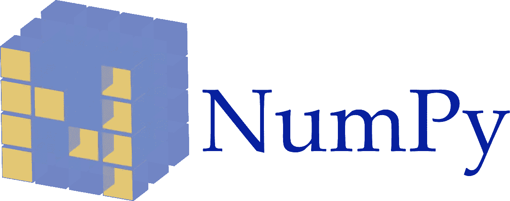
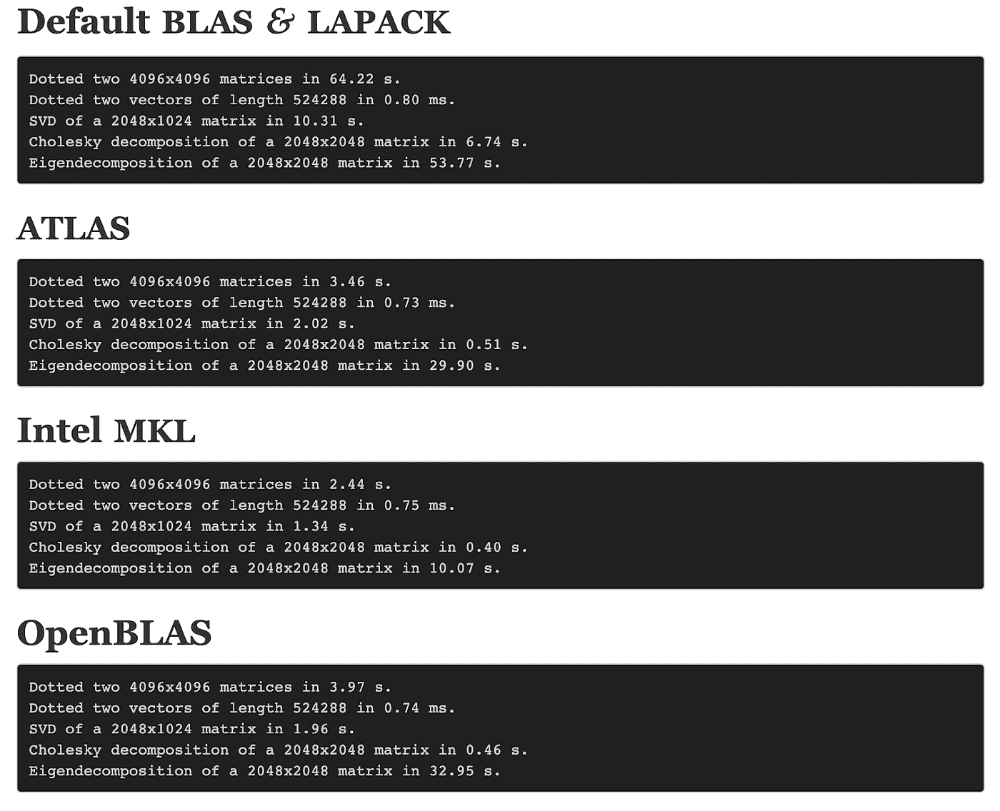

# 你的 Numpy 是否针对速度进行了优化？

> 原文：<https://towardsdatascience.com/is-your-numpy-optimized-for-speed-c1d2b2ba515?source=collection_archive---------13----------------------->

## 如何发现你的 Numpy 是否使用了快速 BLAS 库？



The Numpy [Logo](https://en.wikipedia.org/wiki/NumPy#/media/File:NumPy_logo.svg), Wikipedia.

如果您的研究工作高度依赖于基于数字的计算，如向量或矩阵的加法和乘法等。然后，建议运行一些检查，以查看 Numpy 是否使用了针对速度优化的三个库之一，而不是 Numpy 的默认版本。

有 4 个 Blas 和 Lapack 版本可供选择，据我所知，Numpy 会从下面的(2，3，4)库中选择一个，如果你的系统中没有这两个版本，它会默认使用第一个。

## 图书馆:

1.  默认 BLAS 和 Lapack
2.  [OpenBLAS](https://www.openblas.net/)
3.  [英特尔 MKL](https://software.intel.com/en-us/mkl)
4.  [图集](http://math-atlas.sourceforge.net/)

## 基准

幸运的是，网上有两个基准测试，第一个[是 2015 年制作的，比较了 OpenBLAS、英特尔 MKL 和 ATLAS，它倾向于 MKL 和 ATLAS，但值得注意的是，自 2015 年以来发生了很多变化。](https://github.com/tmolteno/necpp/issues/18)



Figure 1: a comparison of four BLAS libraries

[第二张](http://markus-beuckelmann.de/blog/boosting-numpy-blas.html)一张(图 1)是 2017 年的，更完整。它显示了所有四个库的比较，结果有利于 OpenBLAS，英特尔 MKL vs ATLAS，而 MKL 略微领先。对向量和矩阵乘法、奇异值分解、乔莱斯基分解和特征分解进行了比较。

## 哪个图书馆？

如果你想知道 Numpy 目前使用的是哪一个，简单的答案是:

> 导入 numpy
> print(numpy . show _ config())

[长回答](https://stackoverflow.com/questions/37184618/find-out-if-which-blas-library-is-used-by-numpy)就是你得挖开外壳，看看装的是哪个。

对于编号为< 1.10:

> 【

For Numpy≥1.10:

> 【

immediately after you will have to follow some symlinks.

```
$ldd /usr/lib/python2.7/dist-packages/numpy/core/_dotblas.so 
    linux-vdso.so.1 =>  (0x00007fff12db8000)
    libblas.so.3 => /usr/lib/libblas.so.3 (0x00007fce7b028000)
    libc.so.6 => /lib/x86_64-linux-gnu/libc.so.6 (0x00007fce7ac60000)
    libm.so.6 => /lib/x86_64-linux-gnu/libm.so.6 (0x00007fce7a958000)
    libpthread.so.0 => /lib/x86_64-linux-gnu/libpthread.so.0 (0x00007fce7a738000)
    /lib64/ld-linux-x86-64.so.2 (0x00007fce7ca40000)$ readlink -e /usr/lib/libblas.so.3
/usr/lib/openblas-base/libblas.so.3
```

Please note that these examples were pasted from this SO [的帖子](https://stackoverflow.com/questions/37184618/find-out-if-which-blas-library-is-used-by-numpy)。

非常感谢你阅读这篇文章，如果你有任何评论，请随时回复。

我要感谢我的同事巴拉克·亚伊尔·赖夫在这个问题上启发了我。

Ori Cohen 博士拥有计算机科学博士学位，主要研究机器学习。他是 TLV 新遗迹公司的首席数据科学家，从事 AIOps 领域的机器和深度学习研究。