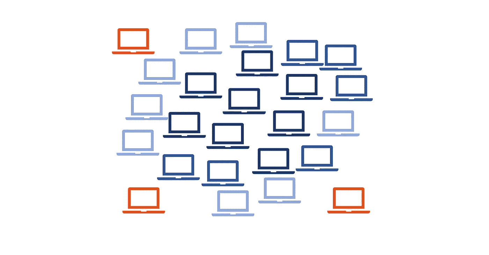
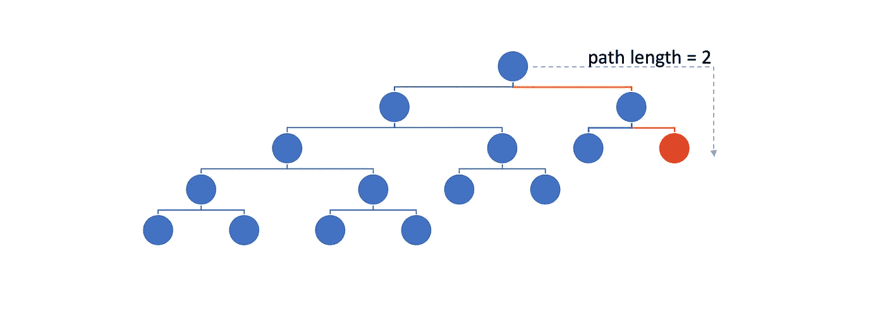

# 隔离森林和火花

> 原文：<https://towardsdatascience.com/isolation-forest-and-spark-b88ade6c63ff?source=collection_archive---------4----------------------->

## PySpark 隔离带的主要特点和使用方法



> 隔离森林是一种用于异常/异常值检测的算法，基本上是一种找出异常值的方法。我们将介绍主要特征，并探索使用 Pyspark 隔离林的两种方法。

# 用于异常值检测的隔离林

> *大多数现有的基于模型的异常检测方法构建正常实例的简档，然后将不符合正常简档的实例识别为异常。[……][隔离森林]明确隔离异常，而不是剖析正常点*

来源:[https://cs . nju . edu . cn/Zhou zh/Zhou zh . files/publication/ICD m08 b . pdf](https://cs.nju.edu.cn/zhouzh/zhouzh.files/publication/icdm08b.pdf)

> 隔离意味着将一个实例从其余实例中分离出来

## 隔离林的基本特征

*   它使用**正常样本作为训练集**，并允许少数异常样本(可配置)。你基本上给算法提供了你的正常数据，如果你的数据集不是那么精确，它也不会介意，只要你调整了`contamination`参数。换句话说**它学习正常看起来是什么样子，能够区分异常**，
*   它的基本假设是异常很少并且很容易**区分，**
*   它具有低常数的**线性时间复杂度**和**低存储器需求*，**
*   它之所以**快**是因为它没有利用任何距离或密度度量，
*   **能否很好的放大**。对于可能有大量不相关属性的高维问题，它似乎工作得很好。

*低内存需求来自于这样一个事实，即不必完全构建森林中的每棵树，因为异常应该具有比正常实例短得多的路径，所以可以使用最大深度来切断树的构建。

> 隔离森林利用了异常现象的两个特征:它们是 ***少数*** 和截然不同的/不同的

## 异常分数和路径长度

检测异常的一种方法是根据路径长度或异常分数对数据点进行排序；异常是排在列表顶部的点

**路径长度**:到达外部节点之前的边数



Example of a path length calculation

**异常分值**

这基本就是算法的输出，分别是 **≤1 和≥0** 。这就是图中路径长度的来源。通过估计整个森林的平均路径长度，我们可以推断出一个点是否异常。

如果一个实例的异常分数非常接近 1，那么可以肯定地说这个实例是异常的，如果它是< 0.5 then it is probably a normal instance and if it is ~= 0.5 then the entire sample does not have any distinct anomalies.

## Important parameters in Isolation Forest

*   **树的数量/估计者**:森林有多大
*   **污染**:数据集包含异常实例的部分，例如 0.1%或 10%
*   **max samples** :从训练集中抽取的用于训练每棵隔离树的样本数。
*   **最大深度:**树应该有多深，这个可以用来修剪树，让事情变得更快。

> **该算法学习正常情况下的样子，以便能够区分异常情况**

# 如何配合 PySpark 使用

## sci kit-学习方法

Scikit-learn 方法需要我们创建一个 udf，以便能够根据数据帧进行预测。这是利用 Scikit-learn 模型的通常方式。注意，我们不能使用 spark 并行化训练部分——但是我们可以使用参数`n_jobs=-1`来利用我们机器上的所有内核。另一件需要记住的重要事情是将`random_seed`设置为特定的值，以便结果是可重复的。

我们需要做的就是安装 scikit-learn 及其依赖项`pip install sklearn numpy scipy`

然后我们可以从一个简单的例子开始，一个有四个样本的数据帧。

A simple example using a udf and broadcast variables for the classifier and the scaler

处理这个 udf 有多种方法，例如，您可以从一个文件加载 udf 中的模型(由于并行化，这可能会导致错误)，或者您可以将序列化的模型作为一个列传递(这将增加您的内存消耗*很多*)，但是我发现使用广播变量在时间和内存性能方面效果最好。

如果有更好的方法，请告诉我:)

## 火花-ML 方式

目前 Spark ML 库中还没有 iForest 的官方包。然而，我发现了两个实现，一个是 LinkedIn 的，只有 Scala 实现，另一个是杨的，可以和 Spark 和 PySpark 一起使用。我们将探讨第二个问题。

使用 [spark-iforest](https://github.com/titicaca/spark-iforest) 的步骤杨:

1.  克隆存储库
2.  构建 jar(为此你需要 [Maven](https://maven.apache.org/install.html)

```
cd spark-iforest/

mvn clean package -DskipTests
```

3.要么将它复制到`$SPARK_HOME/jars/`中，要么在 spark 配置中作为额外的 jar 提供它(我更喜欢后者，这样更灵活):

```
cp target/spark-iforest-<version>.jar $SPARK_HOME/jars/
```

或者

```
conf = SparkConf()
conf.set('spark.jars', '/full/path/to/target/spark-iforest-<version>.jar')spark_session = SparkSession.builder.config(conf=conf).appName('IForest').getOrCreate()
```

4.安装 spark-iforest 的 python 版本:

```
cd spark-iforest/python

pip install -e .   # skip the -e flag if you don't want to edit the project
```

我们已经准备好使用它了！再次强调，将随机种子设置为特定的可再现性是很重要的。

Pyspark Isolation Forest example using use [spark-iforest](https://github.com/titicaca/spark-iforest) by Fangzhou Yang

## 结果

在这两个例子中，我们使用了一个非常小而简单的数据集，只是为了演示这个过程。

```
data = [
    {**'feature1'**: 1., **'feature2'**: 0., **'feature3'**: 0.3, **'feature4'**: 0.01},
    {**'feature1'**: 10., **'feature2'**: 3., **'feature3'**: 0.9, **'feature4'**: 0.1},
    {**'feature1'**: 101., **'feature2'**: 13., **'feature3'**: 0.9, **'feature4'**: 0.91},
    {**'feature1'**: 111., **'feature2'**: 11., **'feature3'**: 1.2, **'feature4'**: 1.91},
]
```

该算法的两个实现都得出结论，第一个样本与其他三个样本相比看起来异常，如果我们看一下特征，这是有意义的。

请注意输出的不同范围:[-1，1]与[0，1]

```
Output of scikit-learn IsolationForest (-1 means anomalous/ outlier, 1 means normal/ inlier)
+--------+--------+--------+--------+----------+
|feature1|feature2|feature3|feature4|prediction|
+--------+--------+--------+--------+----------+
|     1.0|     0.0|     0.3|    0.01|        -1|
|    10.0|     3.0|     0.9|     0.1|         1|
|   101.0|    13.0|     0.9|    0.91|         1|
|   111.0|    11.0|     1.2|    1.91|         1|
+--------+--------+--------+--------+----------+Output of spark-iforest implementation (1.0 means anomalous/ outlier, 0.0 normal/ inlier):
+--------+--------+--------+--------+----------+
|feature1|feature2|feature3|feature4|prediction|
+--------+--------+--------+--------+----------+
|     1.0|     0.0|     0.3|    0.01|       1.0|
|    10.0|     3.0|     0.9|     0.1|       0.0|
|   101.0|    13.0|     0.9|    0.91|       0.0|
|   111.0|    11.0|     1.2|    1.91|       0.0|
+--------+--------+--------+--------+----------+
```

## **编辑:**

似乎 IForest 目前只能处理`DenseVector`输入，而`VectorAssembler`同时输出`Dense`和`Sparse`向量。因此，不幸的是，我们需要使用一个`udf`将向量转换为`Dense`。

```
**from** pyspark.ml.linalg **import** Vectors, VectorUDT
**from** pyspark.sql **import** functions **as** F
**from** pyspark.sql **import** types **as** Tlist_to_vector_udf = F.udf(**lambda** l: Vectors.dense(l), VectorUDT())data.withColumn(
    **'vectorized_features'**,
    list_to_vector_udf(**'features'**)
)
...
```

# 结论

隔离森林，在我看来，是一个非常有趣的算法，轻便，可扩展，有很多应用。绝对值得探索。

**对于 Pyspark 集成:**
我广泛使用了 Scikit-learn 模型，虽然它运行良好，但我发现随着模型大小的增加，传播模型和完成一个预测周期所需的时间也会增加。不出所料。

我还没有对 PySpark ML 方法进行足够的测试，以确保两种实现给出相同的结果，但是在我在示例中使用的小型、无意义的数据集上，它们似乎是一致的。我肯定会对此进行更多的实验，以调查它的伸缩性和结果有多好。

我希望这是有帮助的，并且知道如何结合使用隔离森林和 PySpark 将为您节省一些时间和麻烦。任何想法，问题，更正和建议都非常欢迎:)

如果您想了解更多关于 Spark 的工作原理，请访问:

[](/explaining-technical-stuff-in-a-non-techincal-way-apache-spark-274d6c9f70e9) [## 用非技术性的方式解释技术性的东西——Apache Spark

### 什么是 Spark 和 PySpark，我可以用它做什么？

towardsdatascience.com](/explaining-technical-stuff-in-a-non-techincal-way-apache-spark-274d6c9f70e9) [](/adding-sequential-ids-to-a-spark-dataframe-fa0df5566ff6) [## 向 Spark 数据帧添加顺序 id

### 怎么做，这是个好主意吗？

towardsdatascience.com](/adding-sequential-ids-to-a-spark-dataframe-fa0df5566ff6) 

如果你来自熊猫世界，想要快速接触 Spark，请查看考拉:

[](/from-pandas-to-pyspark-with-koalas-e40f293be7c8) [## 从熊猫到有考拉的派斯帕克

### 考拉项目使数据科学家在与大数据交互时更有效率，通过实现熊猫…

towardsdatascience.com](/from-pandas-to-pyspark-with-koalas-e40f293be7c8) 

# 有用的链接

隔离林论文:[https://cs . nju . edu . cn/Zhou zh/Zhou zh . files/publication/ICD m08 b . pdf](https://cs.nju.edu.cn/zhouzh/zhouzh.files/publication/icdm08b.pdf)

[](https://scikit-learn.org/stable/modules/generated/sklearn.ensemble.IsolationForest.html) [## sk learn . ensemble . isolation forest-sci kit-learn 0 . 21 . 3 文档

### class sk learn . ensemble . isolation forest(n _ estimators = 100，max_samples='auto '，contaminance = ' legacy '…

scikit-learn.org](https://scikit-learn.org/stable/modules/generated/sklearn.ensemble.IsolationForest.html) [](https://medium.com/@hyunsukim_9320/isolation-forest-step-by-step-341b82923168) [## 逐步隔离森林

### 概观

medium.com](https://medium.com/@hyunsukim_9320/isolation-forest-step-by-step-341b82923168)  [## 的的喀喀/火花森林

### 隔离森林(iForest)是一种关注异常隔离的有效模型。iForest 使用树结构来…

github.com](https://github.com/titicaca/spark-iforest) [](https://github.com/linkedin/isolation-forest) [## LinkedIn/隔离-森林

### 这是隔离森林无监督离群点检测算法的 Scala/Spark 实现。这个图书馆是…

github.com](https://github.com/linkedin/isolation-forest) 

# 然后

使用 Shapley 值了解隔离森林的预测-按比例估计要素重要性:

[](https://medium.com/mlearning-ai/machine-learning-interpretability-shapley-values-with-pyspark-16ffd87227e3) [## 机器学习的可解释性——带有 PySpark 的 Shapley 值

### 解读隔离森林的预测——不仅仅是

medium.com](https://medium.com/mlearning-ai/machine-learning-interpretability-shapley-values-with-pyspark-16ffd87227e3)