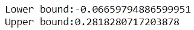

# 异常检测:使用统计规则隔离森林

> 原文：<https://towardsdatascience.com/isolation-forest-with-statistical-rules-4dd27dad2da9?source=collection_archive---------5----------------------->


这是一篇关于使用隔离林进行**异常检测的后续文章。在上一篇文章中，我们看到了时间序列预测和分类的异常检测。对于隔离森林，我们必须处理**污染参数**，它将我们数据中的**百分比点**设置为异常。**

虽然这可能是看到初始结果的一个好的开始，但这将使您陷入一个问题，在任何点 **x%的点将被异常返回**。让我们来看看一种可能的方法来避免它。

现在，让我们从在数据集上直接实施隔离林开始，该数据集的值为时间戳和 cpu_utilization:

链接到数据集([https://github . com/numenta/NAB/tree/master/data/realAWSCloudwatch](https://github.com/numenta/NAB/tree/master/data/realAWSCloudwatch))

```
import pandas as pd
import numpy as np
full_df=pd.read_csv('ec2_cpu_utilization_5f5533.csv')
full_df.head()
```


从 2 月 14 日到 2 月 28 日，我们在 5 分钟内有大约 4000 个数据点。

```
print(full_df['timestamp'].min())print(full_df['timestamp'].max())
print(len(full_df['timestamp']))
```


Min & Max Timestamps with number of data points

将这些点可视化，以了解时间序列数据的概况:

```
# Using graph_objects
from plotly.offline import download_plotlyjs, init_notebook_mode, plot, iplot
import plotly.plotly as py
import matplotlib.pyplot as plt
from matplotlib import pyplot
import plotly.graph_objs as go
init_notebook_mode(connected=True)
import plotly.graph_objs as go
fig = go.Figure(data=[go.Scatter(x=full_df['timestamp'], y=full_df['value'])])
iplot(fig)
```


我将筛选特定一天的数据，以便进行简单的可视化。2 月 24 日似乎是一个很好的选择，因为数据中有一个下降和显著的峰值。

```
df=full_df.loc[(full_df[‘timestamp’]>’2014–02–24 00:00:00')&(full_df[‘timestamp’]<’2014–02–24 23:59:59')]
df.head()
plot_data=go.Scatter(x=df['timestamp'], y=df['value'])
fig=go.Figure(data=[plot_data])
iplot(fig)
```


现在，让我们开始将它与隔离森林模型进行拟合，根据我的直觉，将**污染参数**设置为 4%。

```
from sklearn.ensemble import IsolationForest
#to_model_column='value'
clf=IsolationForest(n_estimators=10, max_samples='auto', contamination=float(.04), \
                        max_features=1.0, bootstrap=False, n_jobs=-1, random_state=42, verbose=0,behaviour='new')
clf.fit(df[['value']])
df['scores']=clf.decision_function(df[['value']])
df['anomaly']=clf.predict(df[['value']])
df.head()df.loc[df['anomaly'] == 1,'anomaly'] = 0
df.loc[df['anomaly'] == -1,'anomaly'] = 1
df.value_counts()
```


```
def plot_anomaly(df,metric_name):
    df.timestamp = pd.to_datetime(df['timestamp'].astype(str), format="%Y-%m-%d %H:%M:%S")
    dates = df.timestamp
    #identify the anomaly points and create a array of its values for plot
    bool_array = (abs(df['anomaly']) > 0)
    actuals = df["value"][-len(bool_array):]
    anomaly_points = bool_array * actuals
    anomaly_points[anomaly_points == 0] = np.nan
    #A dictionary for conditional format table based on anomaly
    color_map = {0: "'rgba(228, 222, 249, 0.65)'", 1: "red"}#Table which includes Date,Actuals,Change occured from previous point
    table = go.Table(
    domain=dict(x=[0, 1],
                y=[0, 0.3]),
    columnwidth=[1, 2],
    # columnorder=[0, 1, 2,],
    header=dict(height=20,
                values=[['<b>Date</b>'], ['<b>Actual Values </b>'],
                        ],
                font=dict(color=['rgb(45, 45, 45)'] * 5, size=14),
                fill=dict(color='#d562be')),
    cells=dict(values=[df.round(3)[k].tolist() for k in ['timestamp', 'value']],
               line=dict(color='#506784'),
               align=['center'] * 5,
               font=dict(color=['rgb(40, 40, 40)'] * 5, size=12),
               # format = [None] + [",.4f"] + [',.4f'],
               # suffix=[None] * 4,
               suffix=[None] + [''] + [''] + ['%'] + [''],
               height=27,
               fill=dict(color=[df['anomaly'].map(color_map)],#map based on anomaly level from dictionary
               )
               ))
    #Plot the actuals points
    Actuals = go.Scatter(name='Actuals',
                     x=dates,
                     y=df['value'],
                     xaxis='x1', yaxis='y1',
                     mode='line',
                     marker=dict(size=12,
                                 line=dict(width=1),
                                 color="blue"))
    #Highlight the anomaly points
    anomalies_map = go.Scatter(name="Anomaly",
                               showlegend=True,
                               x=dates,
                               y=anomaly_points,
                               mode='markers',
                               xaxis='x1',
                               yaxis='y1',
                               marker=dict(color="red",
                                           size=11,
                                           line=dict(
                                               color="red",
                                               width=2)))
    axis = dict(
        showline=True,
        zeroline=False,
        showgrid=True,
        mirror=True,
        ticklen=4,
        gridcolor='#ffffff',
        tickfont=dict(size=10))
    layout = dict(
        width=1000,
        height=865,
        autosize=False,
        title=metric_name,
        margin=dict(t=75),
        showlegend=True,
        xaxis1=dict(axis, **dict(domain=[0, 1], anchor='y1', showticklabels=True)),
        yaxis1=dict(axis, **dict(domain=[2 * 0.21 + 0.20, 1], anchor='x1', hoverformat='.2f')))
    fig = go.Figure(data=[table, anomalies_map, Actuals], layout=layout)
    iplot(fig)
    pyplot.show()plot_anomaly(df,'anomalies')
```


```
print("Percentage of anomalies in data: {:.2f}".format((len(df.loc[df['anomaly']==1])/len(df))*100))
```


看起来不错，有一些小的错误异常，因为我们的绘图显示，我们已经捕捉到了重大的尖峰和其他一些下降和尖峰。现在让我们看看污染参数的作用。


Inliers occur together , it takes around 2 splits to separate x(i) whereas an outlier x(0) is separated in 4 splits

**隔离森林将每个点**从其他点中随机分离出来，并根据其分裂次数构建一棵树，每个点代表树中的一个节点。**离群值出现在树中更靠近根的位置**，而内嵌值出现在更深的位置。在隔离森林的情况下，基于 **n_estimators 和 max_sample** 参数创建森林，并从中得出分数。

可以使用**score _ samples/decision _ function**来获得每个点的归一化异常分数，这里越负，它就异常，基于 sklearn 计算。

直到这一步**污染因素对分数**没有影响。从这里开始，当我们应用 predict 以返回异常时，1/0 污染作为分数的临界值/百分点，并将前 x 个百分点的负分数作为异常返回。(例如:如果污染设定为 0.05/5%，那么负得分最高的 5%的点被标记为异常)

```
df['scores'].hist()
```


**得分为正的内场球员在得分为正的右侧击球**。分数为负的点是异常点。这是这个特定输入点的分数分布。一旦我们在此基础上最终确定了我们的模型，并预测了未来的点，那么我们的污染得分截止值可能会发生变化，给出 4%的异常点，但得分的分布可能会发生变化。为了克服硬编码的分数百分比总是被标记为异常而不考虑分数的变化，我们可以使用一些统计算法，如 **Z-Score 或分数上的 IQR**，来检测分数的变化并更好地对异常进行分类。

```
def iqr_bounds(scores,k=1.5):
    q1 = scores.quantile(0.25)
    q3 = scores.quantile(0.75)
    iqr = q3 - q1
    lower_bound=(q1 - k * iqr)
    upper_bound=(q3 + k * iqr)
    print("Lower bound:{} \nUpper bound:{}".format(lower_bound,upper_bound))
    return lower_bound,upper_bound
lower_bound,upper_bound=iqr_bounds(df['scores'],k=2)
```


```
df['anomaly']=0
df['anomaly']=(df['scores'] < lower_bound) |(df['scores'] > upper_bound)
df['anomaly']=df['anomaly'].astype(int)
plot_anomaly(df,'iqr based')
```


标记为异常的点的百分比在这里大约是 2%,在 IQR k 被设置为 2。

```
print("Percentage of anomalies in data: {:.2f}".format((len(df.loc[df['anomaly']==1])/len(df))*100))
```


现在让我们用另一个数据来验证这一点，考虑到同样的污染，以及 IQR 相同的 k 值:

```
df=full_df.loc[(full_df['timestamp']>'2014-02-17 00:00:00')&(full_df['timestamp']<'2014-02-17 23:59:59')]
# Using graph_objects
plot_data=go.Scatter(x=df['timestamp'], y=df['value'])
fig=go.Figure(data=[plot_data])
iplot(fig)
```


通过查看这一天的曲线图，数据看起来不同，异常更少。

```
from sklearn.ensemble import IsolationForest
#to_model_column='value'
clf=IsolationForest(n_estimators=10, max_samples='auto', contamination=float(.04), \
                        max_features=1.0, bootstrap=False, n_jobs=-1, random_state=42, verbose=0,behaviour='new')
clf.fit(df[['value']])
df['scores']=clf.decision_function(df[['value']])
df['anomaly']=clf.predict(df[['value']])
df.loc[df['anomaly'] == 1,'anomaly'] = 0
df.loc[df['anomaly'] == -1,'anomaly'] = 1
plot_anomaly(df,'anomalies')
```


```
print("Percentage of anomalies in data: {:.2f}".format((len(df.loc[df['anomaly']==1])/len(df))*100))
```


是的，这里我们从可视化中看到了更多的**错误异常**。这里的**异常点百分比保持不变**，因为我们对新时间帧的数据使用了相同的污染。

```
df['scores'].hist()
```


```
lower_bound,upper_bound=iqr_bounds(df['scores'],k=2)
df['anomaly']=0
df['anomaly']=(df['scores'] < lower_bound) |(df['scores'] > upper_bound)
df['anomaly']=df['anomaly'].astype(int)
plot_anomaly(df,'iqr second case')
```



```
print("Percentage of anomalies in data: {:.2f}".format((len(df.loc[df['anomaly']==1])/len(df))*100))
```


**在这种情况下，异常值的百分比在这种方法中下降，因为分数中反映的数据分布已经改变。**

在实时异常检测中，隔离森林上的统计规则组合会更好地工作，因为您会对未来的数据流进行建模、部署和预测，这些数据流的分布可能会随时间变化，并且新数据的**分数会不同**。

此外，IQR 的这个 **k 参数可以基于对检测到的异常的反馈进行调整。如果有假阳性，那么 k 应该减少，如果有假阴性，那么 k 应该减少以发现更多的异常。**

随后将介绍隔离林算法的一些细节，新增加的热启动和解释来自隔离林的结果。

***加在*** *上:下面是一个多元的* ***异常 3d 可视化*** *用* ***情节性地表达*** *其中我发现很酷在所有 3 个维度上玩它，看看异常情况。*