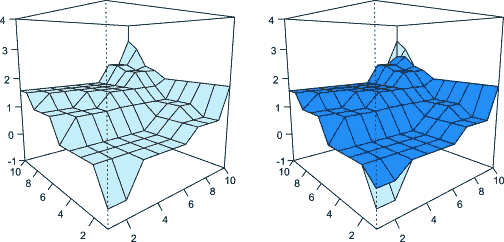
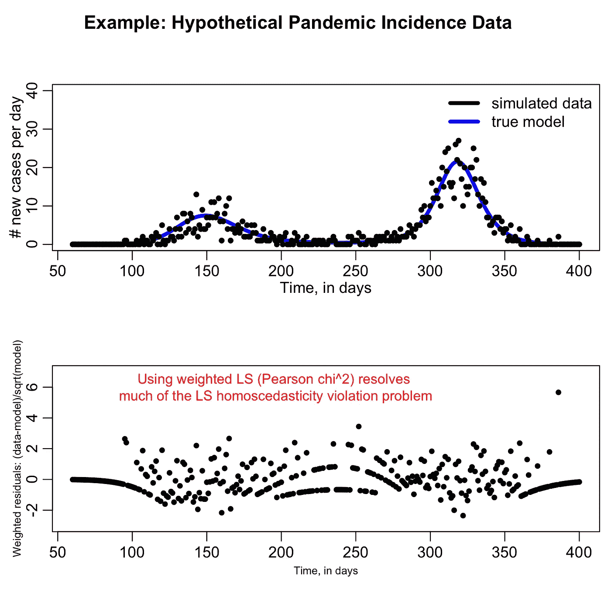

# 保序回归是你可能没听说过的最酷的机器学习模型

> 原文：<https://towardsdatascience.com/isotonic-regression-is-the-coolest-machine-learning-model-you-might-not-have-heard-of-3ce14afc6d1e?source=collection_archive---------3----------------------->

术语“等渗”源自希腊语词根“iso”和“tonos”根“iso”不仅仅是一种文件格式，它实际上意味着**等于**。另一方面，“托诺斯”意味着**伸展**。等渗这个词可以指从材料和物理科学到文科的许多东西。

等拉伸回归(保序回归)是一个非常酷的统计推断模型。我对等渗回归的痴迷一直在扩大，因为这个模型实在是太有趣了，太酷了。

保序回归是一种自由形式的线性模型，可以用来预测观察值序列。然而，保序回归与加权最小二乘法等类似模型有两个主要区别。等张函数不能是非减函数。这是因为等张函数是单调函数，即保持或反转给定顺序的函数。

保序回归使用一个有趣的概念，称为“顺序理论”序理论将偏序集和预序集的概念作为实数的推广。这意味着一个等张函数总是以这样或那样的方式被扭曲，使用统计学来推断下一步该做什么。这很有趣，也很不同，因为大多数数学模型**不会这么做。虽然贝叶斯数学肯定是相似的，但决策并不完全相同。**

这个概念是众多使保序回归对多维标度极其可行的概念之一。多维标度是特征之间相关性的可视化。这种数学方法对于显示距离矩阵中的信息特别有用。

有趣的是，保序回归实际上完全基于另一个模型:

> 加权最小二乘法

但同时，完全不同。不幸的是，保序回归背后的数学对我来说太复杂了，我希望有一天能很好地掌握它，并将其实现到我的 Julia 包中。

幸运的是，一位了不起的统计学家 Fabian Pedregosa 经历了将等渗回归到 Python 中的过程，尽管它已经在 R 中使用了很长时间。

不管保序回归的可用性、复杂性或重要性如何，你必须承认:

> 这很酷

希望很快我就有时间学习并在车床上实现它，这样我们就可以把 Julia 添加到拥有它的语言列表中了！信不信由你，只有三大语言有保序回归的开源包！希望在未来，它将被扩展，并被更多地宗教化到语言中，尽管有多复杂！