# 现在是 2019 年，让您的数据可视化与 Plotly 互动

> 原文：<https://towardsdatascience.com/its-2019-make-your-data-visualizations-interactive-with-plotly-b361e7d45dc6?source=collection_archive---------0----------------------->

## 使用 Express 和袖扣快速找到制作令人惊叹的数字的方法

如果您仍在使用 Matplotlib 在 Python 中进行数据可视化，那么是时候从交互式可视化库中查看视图了。


The view from the top of Mt. Plotly

Plotly 允许你只用几行代码就能制作出漂亮的、交互式的、可导出的图形。

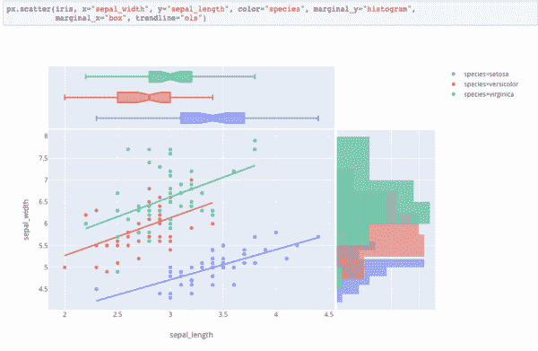

Plotly Express examples from [Plotly](https://medium.com/@plotlygraphs/introducing-plotly-express-808df010143d) announcement

然而，没有地图，普洛特利山上的道路🗻会很慢而且令人沮丧。

以下是阻碍冒险者前进的绊脚石:

*   混乱的初始设置，在没有帐户的情况下脱机工作
*   一行又一行要写的代码
*   过时的文档
*   太多不同的 Plotly 工具，很难保持直线(破折号，快递，图表工作室，和袖扣)

经过几次尝试，我找到了地图、工具和到达山顶的捷径。在这篇文章中，我将带你上山，向你展示如何开始脱机工作，如何在一行代码中制作图形，然后调整它们，去哪里寻求帮助，以及什么时候使用什么工具。

我们开始爬山吧。这景色值得一看。相信我。😃


# Plotly

普罗特利背后的公司也叫[普罗特利](https://plot.ly/)。它已经开源了一系列交互式可视化产品。它通过为许多产品提供增强的功能来赚钱。它还提供收费的私人托管服务。该公司总部设在蒙特利尔，在波士顿设有办事处。

plotly.py 在幕后使用 [D3.js](https://d3js.org/) 。Plotly 有 R、Julia 和许多其他语言 API 包装器。请注意，并非所有语言都有可用的示例文档。

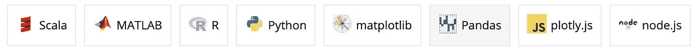

Instruction options in Plotly docs

在本文中，我们将重点关注使用 Python 的选项。在本指南中，我使用 Python 3.7 和以下库版本。

```
cufflinks                0.15
jupyterlab               0.35.5
plotly                   3.8.1      
plotly-express           0.1.7
```

确保你用的是 0.15 的袖扣(0.13 和最近的 Plotly 版本不太搭)。

2020 年 5 月更新:Plotly 4.7.1 是最新版本。下面的大部分，但不是全部，仍然适用于新版本。注意 *express* 模块是作为 *plotly* 包的一部分导入的。

# plotly.py

您不需要创建一个帐户来使用 Plotly，这与一些文档示例可能看起来的情况相反。使用 Plotly 也不需要在线。

将 vanilla plotly.py 模块安装在 [conda](https://docs.anaconda.com/anaconda/) 或`pip install plotly`中。

导入模块并将其配置为脱机工作:

```
import plotly.offline as pypy.init_notebook_mode(connected=False)
```

现在你不会得到一个错误，你需要一个帐户。我们已经通过了上山路上的第一个障碍。😄

这是一个交互式的地球仪图形的例子，它允许你用滑块轻松地改变投影类型和位置。由于媒体对文件类型的限制，您无法在此处与该图进行交互，但您可以在[文档](https://plot.ly/pandas/lines-on-maps/)中与该图进行交互。

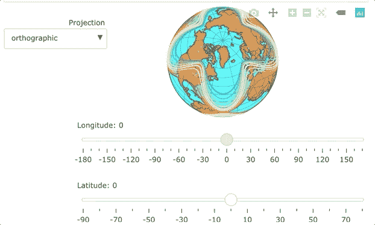

下面是一个冗长的要点，由制作这个奇特图形所需的[文档](https://plot.ly/pandas/lines-on-maps/)改编而来的 plotly.py [代码](https://plot.ly/~jackp/17248.embed)。

Plotly 对象由一个或多个*数据*组件和一个*布局*组件组成。两者都有子组件。大部分(但不是全部)格式是在布局中控制的。

避免使用 vanilla plotly.py 的主要原因是图形定义通常很冗长。指定代码的行数和行数既慢又容易出错。我们无疑遇到了收养道路上的第二个障碍。幸运的是，我们通常可以选择两条备用路线中的一条，稍后我们将对此进行探讨。

如果我们确实需要继续使用老的 plotly.py 路径，我们将需要深入研究文档。官方文档很漂亮，但是经常让我花很长时间去寻找如何调整的方法。

Plotly 确实有一个不错的论坛[这里](https://community.plot.ly/)也有一些有用的 SO 问题，但是很多例子没有更新来显示 plotly.py v3 代码。这里有 [v3.0 迁移指南](https://github.com/plotly/plotly.py/blob/master/migration-guide.md#data-array-properties-may-not-be-specified-as-scalars)可以帮上一点忙。确保您正在寻找的任何示例都使用 v3，或者准备将它们翻译成 v3。

接下来我们要看的两个 Plotly 产品提供了简化 plotly.py API 的高级包装器。如果你和熊猫一起工作，他们可以节省你大量的时间。让我们探索这些替代路线。


Forrest path

# 表达

Plotly Express 于 2019 年 3 月发布，正在积极开发中，支持更多图表。计划是 2019 年夏天折叠成 Plotly 4.0。

Express 可以将从熊猫数据帧中制作许多图形所需的代码减少 10 倍。Express 希望您的数据帧以[整齐的格式](https://en.wikipedia.org/wiki/Tidy_data)到达，其中每行代表一个观察值，每列代表一个变量。

用`pip install plotly_express`安装 Express。

要在 JupyterLab 中使用它，请在您的终端中运行以下命令:

`jupyter labextension install @jupyterlab/plotly-extension`

下面是使用传统的快速导入从数据帧制作条形图的代码:

```
import plotly_express as px px.bar(my_df, x='my_x_column', y='my_y_column')
```

维奥拉。你已经从你的数据框架中得到了一个条形图(在我上面有“我的 _”的地方替换你的东西)。

您可以调整单线图定义中的许多值。例如，通过更改定义来添加标题，如下所示:

```
px.bar(my_df, x='my_x_column', y='my_y_column', title='My Chart Title")
```

如果你想深入到一个特定的设置，你可以返回底层的 Plotly 图。假设您想要将文本值添加到您的条形图中。您需要保存自动返回的图形并引用其数据属性。你可以这样做:

```
_my_fig = px.bar(my_df, x='my_x_column', y='my_y_column', title='My Chart Title')_my_fig.data[0].update(
    text=my_df['my_y_column'],  
    textposition='inside',
    textfont=dict(size=10)
)_my_fig.iplot()
```

预警:我发现了快递[文档](https://www.plotly.express/plotly_express/)！它在我的谷歌搜索中没有排在前列，所以我有一段时间没有找到它。现在你有了。尽情享受吧！😃

Express 允许您快速制作许多图形类型，但并不是您想要的所有类型都可用。例如，堆积条形图目前不是一个简单的选择。对于那些你想带着袖扣走另一条路到达山顶的人。


The other path

# 袖扣

袖扣与 Express 非常相似，因为它是 Plotly API 的包装器，以简化与熊猫的工作。袖扣是一个第三方开源项目，已经存在了四年多。

用`pip install cufflinks`安装。

导入模块并配置文件以供脱机使用。

```
import cufflinks as cf
cf.set_config_file(offline=True)
```

许多体型只需要一行袖扣代码。例如，堆积条形图是一件轻而易举的事。

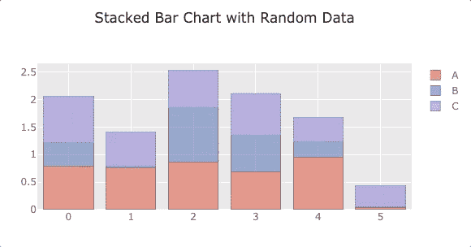

Example cufflinks stacked bar chart

代码如下:

```
df = pd.DataFrame(np.random.rand(6, 3), columns=['A', 'B', 'C'])df.iplot(kind='bar', barmode='stack', title='Stacked Bar Chart with Random Data')
```

请注意，您将使用`.iplot()`制作袖扣造型。

像 Express 一样，Cufflinks 返回基本的 Plotly 数字，以便您可以进行更精细的修改。与袖扣不同，您需要在您的图形定义中指定`asFigure=True`来返回图形。然后，您可以像在 Express 中一样更新图形。如果你想改变 yaxis 的名称和范围，这里是它的样子。

```
my_fig = df.iplot(kind='bar', barmode='stack', title='Stacked Bar Chart with Random Data', asFigure=True)_fig.layout.yaxis = dict(title='Members', range=[0, 600])
```

这是袖扣[文档](https://plot.ly/ipython-notebooks/cufflinks/)。

不幸的是，有些东西用袖扣是做不到的，比如散点图。

# 3 个选项的比较

下面是用 plotly.py、Express 和 Cufflinks 创建的图形的类似布局的代码比较。

## plotly.py

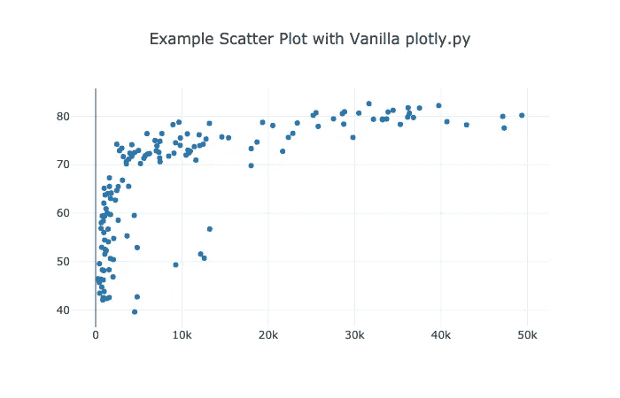

```
fig = {
    'data': [
        {
            'x': df2007.gdpPercap, 
            'y': df2007.lifeExp, 
            'text': df2007.country, 
            'mode': 'markers', 
            'name': '2007'},
    ],
    'layout': {
        'title': "Example Scatter Plot with Vanilla plotly.py"
    }
}py.iplot(fig)
```

## 表达

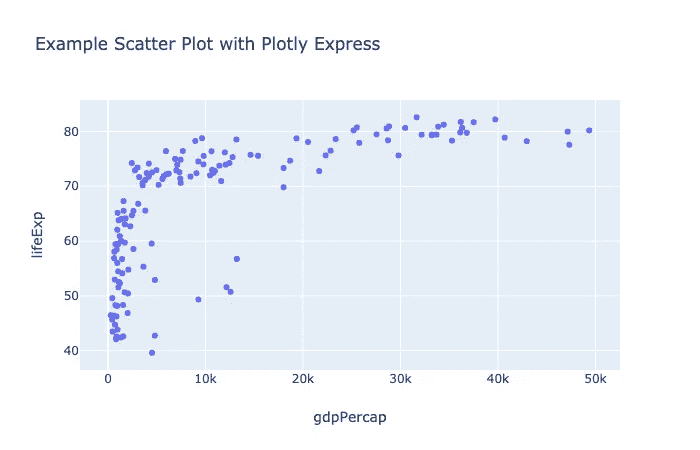

```
px.scatter(
    df2007, 
    x="gdpPercap", 
    y="lifeExp", 
    title='Example Scatter Plot with Plotly Express'
)
```

那就是又短又甜！默认格式有点不同，您可以自动获得轴标题。让我们看看袖扣中的相同图表。

## 袖扣

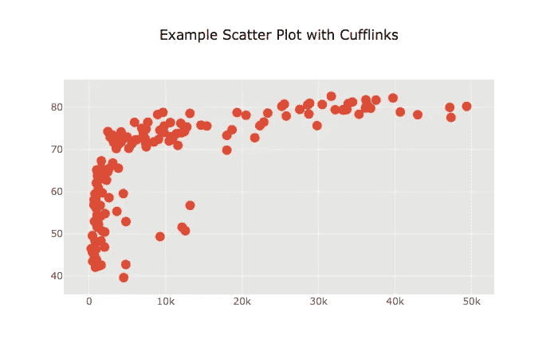

```
df2007.iplot(
    kind='scatter', 
    mode='markers', 
    x='gdpPercap', 
    y='lifeExp', 
    title='Example Scatter Plot with Cufflinks'
)
```

这是非常相似的代码，但是图中的默认值略有不同。

快递和袖扣都可以节省你的按键次数。⌨️对于许多更复杂的图表来说尤其如此。😃

让我们看看如何返回和访问底层 plotly 数字。

## 更新 Cufllinks 和 Express 图

让我们访问由袖扣创建的图形的布局，并添加轴标题。

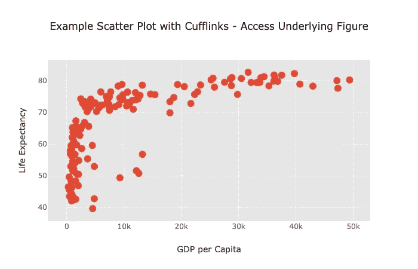

```
fig = df2007.iplot(
    kind='scatter', 
    mode='markers', 
    x='gdpPercap', 
    y='lifeExp', 
    asFigure=True,
    title='Example Scatter Plot with Cufflinks - Access Underlying Figure'
)fig.layout.xaxis.title = "GDP per Capita"
fig.layout.yaxis.title = "Life Expectancy"fig.iplot()
```

以下是如何用 Express 做同样的事情。回想一下，使用 Express，您不需要指定`asFigure=True`。

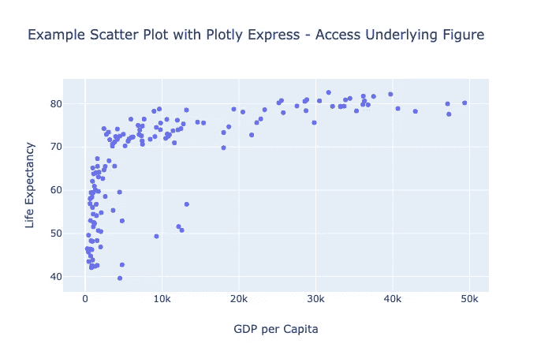

```
fig = px.scatter(
    df2007, 
    x="gdpPercap", 
    y="lifeExp", 
    title='Example Scatter Plot with Plotly Express - Access Underlying Figure'
)fig.layout.xaxis.title = "GDP per Capita"
fig.layout.yaxis.title = "Life Expectancy"fig.iplot()
```

您可以访问第一个数据跟踪来添加文本标签，如下所示:

```
fig.data[0].update(
 text=df2007['gdpPercap'],
 textposition=’inside’,
 textfont=dict(size=10)
)
```

# 在 plotly.py、Express 和袖扣中选择

空间真的很混乱。不久前的某个时候，我以为我在一个项目的某个部分使用了 Express，当时我正在使用袖扣！🤦‍♂

我是 Python 的中的[禅的忠实粉丝:“应该有一种——最好只有一种——显而易见的方法来做这件事。”两种方式导致研究时间、选择疲劳和错误。](https://www.python.org/dev/peps/pep-0020/)

不幸的是，现在没有一个单一的高级 API 来制作每种图形类型。不过，我肯定会尽可能使用袖扣或快递。

当你想建立一个数字时，我建议你检查快递和袖扣文档。请记住，快递需要整洁的数据框架，而袖扣更灵活。使用两个库中符合您的需要并且格式最接近您想要的格式的库。袖扣是我首先要找的地方。

这两个库之间的默认格式可能非常引人注目。例如，对于数据帧中 X、Y 和 Z 列的一些随机数据，您可以通过以下袖扣代码获得:

```
df.iplot(kind=’scatter’, mode=’markers’, x=’X’, y=’Y’, title=’Random Data’, categories=’Z’)
```

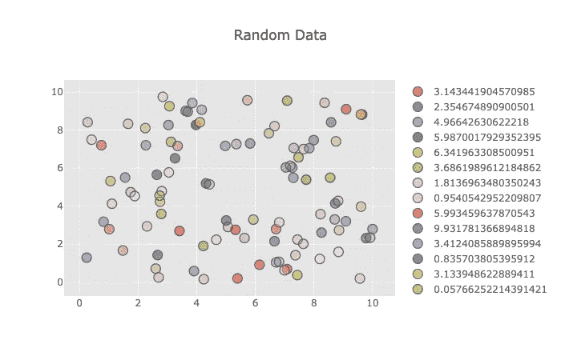

Cool Default Cufflink Scatter Plot

或者这个用这个明示的代码:

```
px.scatter(df, x=’X’, y=’Y’, color=’Z’, title=’Random Data’)
```

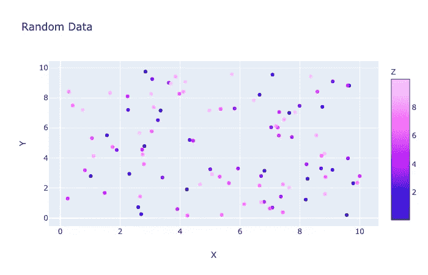

Different Presets with Express

那是相当不同的！

# 保存文件

一旦你创建了一个图形，你可以将鼠标悬停在它上面，点击相机图标，将其导出为. png 文件，或者点击*导出到 plot.ly* 链接，将互动图像保存到 Plotly 的服务器上。

或者，您可以下载交互式 HTML 格式的文件，如下所示:

```
py.offline.plot(my_fig, filename=’my_example_file.html’)
```

如果你需要更多的图像格式，你可以使用 Plotly 的 [orca](https://github.com/plotly/orca) 包下载文件格式包括。png，。你需要先安装 orca。该软件包目前在 pypi.org 上不可用，所以你不能用 pip 安装它。你可以通过 conda 安装它，也可以从 orca [GitHub 页面](https://github.com/plotly/orca)安装特定于操作系统的版本。那么就不需要导入 orca 库了。点击阅读更多关于虎鲸[的信息。](https://plot.ly/python/static-image-export/)

下面是安装 orca 后创建一个. png 文件的代码。

```
import plotly as plotly
plotly.io.write_image(fig, file='my_figure_file.png', format='png')
```

正如你所看到的，有几种方法可以让你的数字脱离 Plotly。😃

让我们简单介绍一下 Plotly 生态系统的另外两个组件，这样你就知道什么是什么了。

# 破折号

使用 Plotly [Dash](http://Dash is a Python framework for building analytical web applications.) 你可以使用 Python 为你的团队或世界制作 web 应用仪表板。截至 2019 年 5 月 1 日，有近 9000 个 GitHub 明星的免费开源版本。Plotly 提供了一套 Dash 附加组件。我没怎么用过 Dash。也许这将是未来文章的重点。跟着[我](https://medium.com/@jeffhale)确保你不会错过。😄

# 图表工作室

[Plotly Chart Studio](https://plot.ly/online-chart-maker/) 让您在浏览器中轻松创建或编辑图表。Plotly 称其为“世界上最复杂的创建 D3.js 和 WebGL 图表的编辑器”。不需要编码。有一个免费版本，但如果你想保存私人图表文件，年费从 99 美元起。

既然我们已经登上了 Plotly 山顶，让我们快速浏览一下 Python 范围内的其他数据可视化山峰。

# 额外收获:其他 Python 数据 Viz 选项

本文并不打算详尽地介绍数据可视化选项，但是我将提到数据科学家需要了解的其他几个重要选项，这样您就有了一个相当全面的了解。


用 Python 制作可视化的老方法是使用普通的 Matplotlib API。


熊猫 Matplotlib API 很适合快速绘制。它创建常规的 Matplotlib 对象。

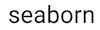

Seaborn 是一个优秀的 Matplotlib 高级包装器，可以让你快速制作多种类型的统计可视化。不幸的是，这些选项不是交互式的，并且是建立在一个 [15 年历史的 Matplotlib 基础上的](https://jakevdp.github.io/blog/2013/03/23/matplotlib-and-the-future-of-visualization-in-python/)，这个基础不是非常容易使用。


[散景](https://bokeh.pydata.org/en/latest/)是 Plotly 的竞争对手。它是开源的、交互式的，并且与 Python 兼容。


[Holoviews](http://holoviews.org/getting_started/Introduction.html) 是 MatplotLib、Bokeh 和 now Plotly 的高级包装器。我知道有人喜欢全息视图。


r 乡亲们喜欢 RStudio 的闪亮。它让用户创建交互式 web 应用程序可视化。


[Tableau](https://www.tableau.com/) 和 [Microsoft PowerBI](https://powerbi.microsoft.com/en-us/) 是另外两个与 Python 集成的流行的拖放数据可视化创建选项。Tableau 真的很好，但是需要你付钱来保持你作品的私密性。


我发现 PowerBI 有点不太直观，但它也非常强大，非常受欢迎。

上面列出的大多数交互式图形软件都使用 D3.js。超级受欢迎。

# 包装和资源

如果你是一名数据科学家，我鼓励你仔细检查。这是一个制作交互式可视化的现代工具箱。从山顶上看，似乎这个神秘的庞然大物不太可能很快减速。

也许最终会有一种清晰的方法，使用 Ploly 的高级 API 选项来制作你想要的任何东西。现在，我建议你尽可能用熊猫搭配袖扣或 Express，以节省时间并做出令人惊叹的可视化效果。

这里有一些很好的 Plotly 资源:

*   Will Koehrsen 在这里有一个很好的袖扣入门指南[。](/the-next-level-of-data-visualization-in-python-dd6e99039d5e)
*   [下面是 plotly.py 首席开发人员 Jon Mease](https://www.youtube.com/watch?v=cuTMbGjN2GQ) 的演讲，展示了在 JupyterLab 中使用 plotly.py v3.0 可以做些什么。你可以在你的笔记本上得到帮助，制作一些非常酷的小部件。如果你还没有切换到在 JupyterLab 中运行你的 Juypter 笔记本，这可能是你需要的推动力。😃

PSA:当你使用颜色时，考虑一下色盲人群的可及性。使用色盲友好的调色板很容易。这是我从 [ggplot](http://www.cookbook-r.com/Graphs/Colors_(ggplot2)/) 中采纳的一个。


Color swatch

```
color_list = ["#E69F00", "#56B4E9", "#009E73", "#F0E442", "#D55E00", "#0072B2",  "#CC79A7"]
```

我写关于数据科学、Python 和 DevOps 的文章。查看我的文章[这里](https://medium.com/@jeffhale)如果你对这些感兴趣的话，注册我的[时事通讯](https://dataawesome.com)。

[](https://dataawesome.com)

快乐的阴谋！