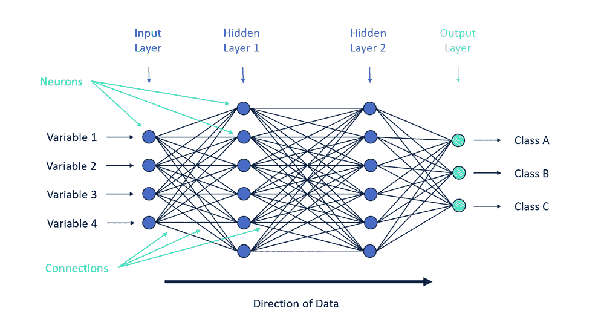
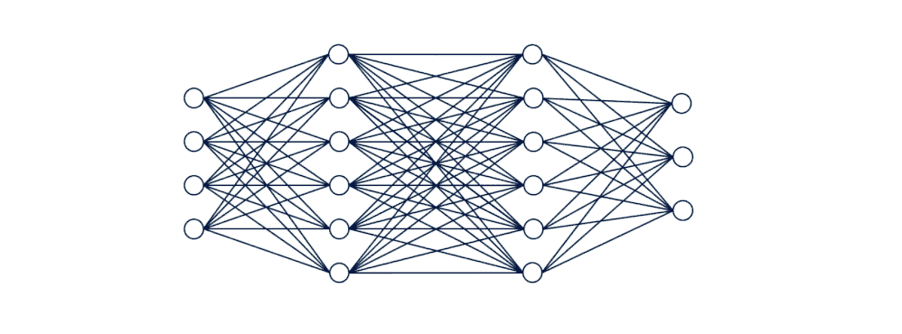
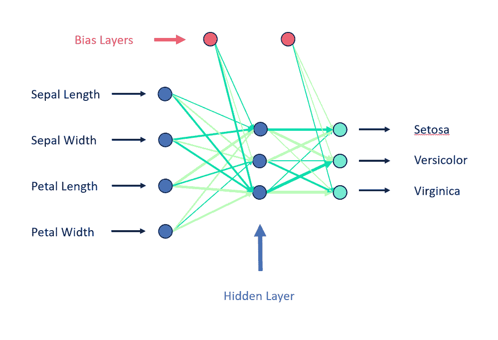

# 这很容易:神经网络导论

> 原文：<https://towardsdatascience.com/its-a-no-brainer-an-introduction-to-neural-networks-10e2738c2d7e?source=collection_archive---------20----------------------->

## 神经网络的温和介绍，现在与僵尸。

神经网络是 1944 年首次提出的一种人工智能方法。神经网络大致模拟人脑，由大量简单的处理节点(称为神经元)组成，这些节点高度互联，并通过这些网络连接发送数据以估计目标变量。

在这篇文章中，我将讨论简单神经网络的结构和训练(特别是[多层感知器](https://en.wikipedia.org/wiki/Multilayer_perceptron)，又名“香草神经网络”)，以及演示一个简单的神经网络。

*问题:为什么僵尸只和聪明的女人约会？*

答案:他们只是喜欢有头脑的女人。

**神经网络如何工作**

一般来说，神经网络模型由成千上万个密集连接的神经元(节点)组成。在大多数神经网络模型中，神经元被组织成层。这包括输入层和输出层，输入层包括所有提供的预测变量的神经元，[隐藏层](https://www.techopedia.com/definition/33264/hidden-layer-neural-networks)。神经网络的隐藏层有效地将输入转换成[输出层可以解释的东西](https://stats.stackexchange.com/questions/63152/what-does-the-hidden-layer-in-a-neural-network-compute)。输出图层返回类别标注(分类)或估计值(回归)。

在每个神经元处，所有输入值被加在一起，然后用[激活函数](https://en.wikipedia.org/wiki/Activation_function)(例如 [sigmoid 函数](https://en.wikipedia.org/wiki/Sigmoid_function))进行处理，这将确定神经元是否被“激活”。通常，在激活函数之前，偏差也将包括在该计算中。偏差类似于[回归模型](https://en.wikipedia.org/wiki/Regression_analysis)中的[截距项](https://en.wikipedia.org/wiki/Y-intercept)。

然后使用阈值来确定神经元是否会“触发”，这意味着激活所有到下一层的传出连接。神经网络可以是[前馈](https://en.wikipedia.org/wiki/Feedforward_neural_network)，意味着所有数据只向前传递，或者是[递归](https://en.wikipedia.org/wiki/Recurrent_neural_network)，可以包括通过网络层的循环或回路。多层感知器只是前馈。

神经元之间的每个连接都被赋予一个(正的或负的)数字权重。对于每个连接，当一个神经元达到或超过给定阈值时，这个权重乘以神经元的数值，将被传递给下一层中连接的神经元。如果没有达到阈值，神经元将不会被激活，并且来自该神经元的数据将不会传递给下一层中的任何神经元。

在分类模型中，输出层中具有最高值的神经元将确定每个记录的模型估计标签。对于回归模型，神经网络通过单个输出节点返回值。

如果这个快速概述没有意义，或者如果你想知道更多关于数学的知识，3BLUE1BROWN 有一个非常棒的视频叫做[，但是我推荐观看什么是神经网络](https://www.youtube.com/watch?v=aircAruvnKk)。

**如何训练神经网络**

多层感知器神经网络通常使用一种称为[反向传播](https://en.wikipedia.org/wiki/Backpropagation)的方法进行训练，这涉及通过计算[成本(损失)函数](https://en.wikipedia.org/wiki/Loss_function)的[梯度](https://en.wikipedia.org/wiki/Gradient)来调整神经网络中神经元的权重。

为了开始训练神经网络，所有的初始权重和阈值都是随机生成的。然后，训练数据通过输入层输入，并通过模型，直到到达输出层。在输出层，计算成本函数以估计模型在估计已知目标变量中的表现。当网络自信地估计正确的值时，成本函数的输出被最小化，并且随着错误分类而增加。训练算法的目标是最小化成本函数值。

然后调整神经网络中的权重和阈值，以最小化成本函数(这是微积分部分)，直到模型收敛于局部最小值。重复该过程，并且基于训练数据和成本函数继续调整权重和阈值，直到具有相同标签的所有数据产生相似的值。

3BLUE1BROWN 关于神经网络系列的第 2 部分和[第 3 部分](https://youtu.be/Ilg3gGewQ5U)分别涵盖了训练和反向传播，如果您想了解更多，可能会对您有所帮助。还有一本关于神经网络和深度学习的优秀开源教科书，作者是迈克尔·尼尔森(Michael Nielsen)，这里有。

**前馈神经网络的剖析**

R 包 [nnet](https://cran.r-project.org/web/packages/nnet/nnet.pdf) 可以生成一个简单的[单隐层前馈神经网络](https://en.wikipedia.org/wiki/Feedforward_neural_network)。前馈指的是数据可以在层间传递的方向。前馈模型只能向“下游”传递数据。单一隐藏层也是这个特定实现的一个重要方面。虽然用户可以调整隐藏层中包含的神经元数量，但隐藏层的数量不能增加。这些神经网络确实属于多层感知器的类别。

具有单个隐藏项的经过训练的前馈神经网络的结构可能如下所示:

浅绿色的线(浅绿色)是负权重，深绿色的线(青苹果)是正权重。线条粗细用于描述分配给每个连接的相对权重。

预测变量(如果你还没有猜到，这个神经网络是用臭名昭著的虹膜数据集训练的)包括在第一层中。

图顶部描绘的偏置层(粉红色)将常数值应用于神经元(类似于回归模型中的截距项)。隐藏层的激活函数将是 [sigmoid](https://en.wikipedia.org/wiki/Sigmoid_function) ，输出层的[激活函数](https://en.wikipedia.org/wiki/Activation_function)将取决于目标场。[二元分类](https://en.wikipedia.org/wiki/Binary_classification)将使用[逻辑](https://en.wikipedia.org/wiki/Logistic_function)激活函数，[多项式分类](https://en.wikipedia.org/wiki/Multiclass_classification)将使用 [softmax 函数](https://en.wikipedia.org/wiki/Softmax_function)，回归(具有连续目标变量的模型)将应用[线性](https://en.wikipedia.org/wiki/Linear_function)激活函数。

用于训练模型的成本函数(使用反向传播方法)也将取决于目标变量。对于分类模型(目标变量是分类的)，成本函数是称为[交叉熵](https://en.wikipedia.org/wiki/Cross_entropy#Cross-entropy_minimization)的熵度量。对于回归模型(目标变量是连续的)，用于训练神经网络的成本函数是[残差平方和](https://en.wikipedia.org/wiki/Residual_sum_of_squares)。

数据集中的每个记录(观测值)都通过这个网络传递。根据预测变量的值，每层中的不同神经元将被激活，从而对输出层中的记录进行估计。

希望，这已经打破了神经网络周围的坚硬外壳，让你能够消化好的，多肉的部分。

这篇文章最初发表在 Alteryx 数据科学博客上，可以在这里 找到 [*。*](https://community.alteryx.com/t5/Data-Science-Blog/It-s-a-No-Brainer-An-Introduction-to-Neural-Networks/ba-p/300479)