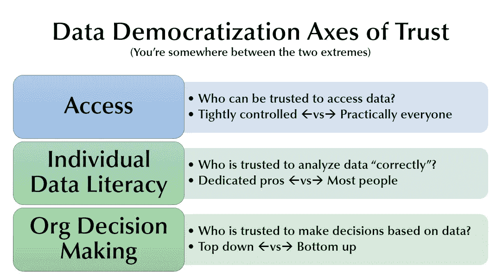

# 这完全是关于信任:对向您的组织开放数据的看法

> 原文：<https://towardsdatascience.com/its-all-about-trust-views-on-opening-up-data-to-your-org-ce2fe99174ac?source=collection_archive---------11----------------------->

## “民主化”的数据和洞察力，开放访问，数据透明，它有很多名字，很多人想要它，但对你来说正确的决定取决于你的组织。

今天我只讨论信任问题的各个层面，技术/实践方面的考虑留待以后再说。

每个组织都需要决定谁有权访问这些数据，无论是隐式的还是显式的。*届时，贵公司的“正确”答案将是独一无二的。*作为数据科学家，我们经常被视为良好数据实践的管理者，并经常被要求成为推动数据驱动文化的领导者。但是我们如何决定做什么呢？

# 为什么“数据民主化”经常出现？

广泛共享数据的基本愿望源于组织中的信息自然倾向于留在组织的本地部分。您让财务团队查看他们的数据，让客户支持团队查看他们的数据，让产品团队查看他们的产品指标。除非有跨组织边界推送或拉取信息的积极努力，否则事情往往会因为惯性而停留在本地。

从表面上看，计算似乎很简单:组织中的所有人都需要做出决策。做出好的决策需要好的证据和数据，这些数据来自整个组织。因此，我们应该确保决策者可以访问他们需要的数据，以最大限度地提高他们的效率。

然而，多年来在许多科技公司工作，我目睹了公司如何。在一个极端，你会发现一些公司根本不愿意让员工接触大量信息和数据。在另一个极端，有些公司几乎无一例外地允许访问任何东西。您在这个范围中的位置似乎取决于您特定的组织现实。

# 很多不同的观点，感谢 DS-Twitter！

我最近很好奇不同的数据科学家认为他们的公司在数据民主化光谱中处于/应该处于什么位置，所以我在 Twitter 上问了一些人。

有这么多好的回答，我会试着总结和强调一些例子。

# 不同种类的信任

当综合我自己的经验和我得到的广泛反馈时，我似乎很清楚，公司内部数据共享的范围围绕着几种不同的信任。你在每个轴上所处位置的独特组合决定了你所分享的内容，而改变你所分享的内容就意味着改变你所处的位置。

# #1 —访问

我们可以从最明显的轴开始，谁可以访问什么数据开始。首先，这有许多外部限制。例如，遵守法规可能会严格限制哪些人可以访问某些类型的数据，医疗保健数据、个人数据、信用卡数据都属于这一类。这些通常是不可协商的，必须导航。

然后是敏感数据，如公司机密、计划等。你可以在一定程度上分享这些信息，只要你信任有权限的人。一些组织完全不相信某些级别的员工有任何与此类信息相关的东西，其他组织几乎分享所有信息。这是组织愿意进行风险权衡的结果。

但是除了这些敏感的数据之外，还有非常广泛的数据可以帮助人们更好地完成工作，而不会带来重大风险。我认为公司的大部分数据都属于这个范围。我的观察是，倾向于雇用数据科学家和分析师的公司已经有了在公司范围内由数据驱动的某种程度的愿望，所以访问限制往往是在光谱的更开放的一边。

在这种背景下，我并不感到特别惊讶，许多数据科学家似乎倾向于在可行的情况下让人们更多地访问数据。这是下一个信任轴上的“实用”部分。

# #2 —个人数据素养

当数据在公司范围内可访问时，管理人员普遍关心的一个问题是“如果有人获取了数据，进行了错误的分析，并据此做出了糟糕的决策，该怎么办？护栏在哪里？”这是公司内部数据[素养](https://twitter.com/Alan_D_Duncan/status/1111721076978077699)状态的一个基本问题。这里有两类人，一类是糟糕的演员，一类是根本不具备分析技能的人。

人们真的很担心不良行为者会利用不良数据来证明不良、T2 甚至恐怖的决策是没有保障的。然而，一群[好人](https://twitter.com/teej_m/status/1111356052883136512) [人](https://twitter.com/mgershoff/status/1111514809038561280)附和道，这种不确定决策的[风险](https://twitter.com/ShaneKnowsData/status/1111596750035476481)总是存在的，不管数据是否可用。组织中有不良行为者是一个更大的组织问题，而不仅仅是数据问题。

相反，[许多](https://twitter.com/outoftheverse/status/1111686155668316160) [更多的](https://twitter.com/permeablerock/status/1111626132653252609) [人](https://twitter.com/shermozle/status/1111522752496730113)，包括我自己在内，把拥有不具备分析技能的人作为一个[教育和培训的机会](https://twitter.com/outoftheverse/status/1111685830320349184)。人们，甚至那些没有数据凭证的人，都被鼓励与数据打交道。需要注意的是，当他们想用数据来做决定时，他们应该让更擅长数据的人来检查他们的工作。它为数据科学家/分析师等提供了一个学习更好方法的机会，同时也对数据有了更多的关注，寻找机会和不一致之处。

强大的流程和学习数据素养的文化可以充当护栏。是的，对于一个外行人来说，查看数据并利用它来弄清楚他们在组织中的角色是如何工作的是没问题的，尤其是如果数据已经在某种程度上被清理和策划的话。但前提是他们意识到自己不是使用数据的专家，并且有一个支持网络参与其中。这是一种“信任，但要核实”的心态，在许多实际情况下都行得通。

如果你采用这种模型，实际的数据科学家有多少时间、资源和兴趣(不是每个人都想教)致力于此将在很大程度上决定你能在多大程度上信任这个轴上的人。

# 组织的决策

最后，您的组织如何在决策中委托信任对数据民主化的努力有很大的影响。

一个自上而下严格组织、拥有集中决策和权力结构的公司使用数据和信息的方式不同于一个自下而上、决策权力分散的公司。

虽然技术领域常见的自下而上型组织一般倾向于更广泛地共享数据，但这不一定是必然的。出于不同的原因，两者可能实际上都希望数据广泛地为每个人所用，但它所采取的确切形式将会非常不同，以适应现有的结构。组织内部的结构可能会使人们不去寻找数据来帮助他们决策。组织内部的激励机制会使人们倾向于反对风险，或者成为风险寻求者。这要视情况而定，你必须花很长时间认真考虑事情，才能决定你想站在哪里。

# 数据是变革的力量

人们倾向于认为组织已经“准备好”进行数据民主化，就像这是组织的一个模糊属性。我认为，从“每个人都有数据”到“每个人都有洞察力”是一个非常大的飞跃，这是推动组织更加数据化的第一步。

人们越熟悉交互数据、使用数据提问以及利用分析师和数据科学提供的技能，他们就越容易在工作中采用这些技术。

# **感谢**

感谢所有在 twitter 上就这个话题发表了许多有用评论的伟大人们。试图综合众多观点时，我的大脑仍然很痛。

我还想特别提到这份[数据景观宣言](https://medium.com/scout24-engineering/scout24-data-landscape-manifesto-f9816ea10af8)，Scout24 [向我推荐了这份宣言](https://twitter.com/cloudHPC/status/1111721738759532544)，这是一个极好的例子，说明了一个组织在这些问题上的立场。对他们有用，明显 YMMV。