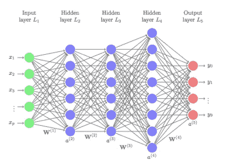
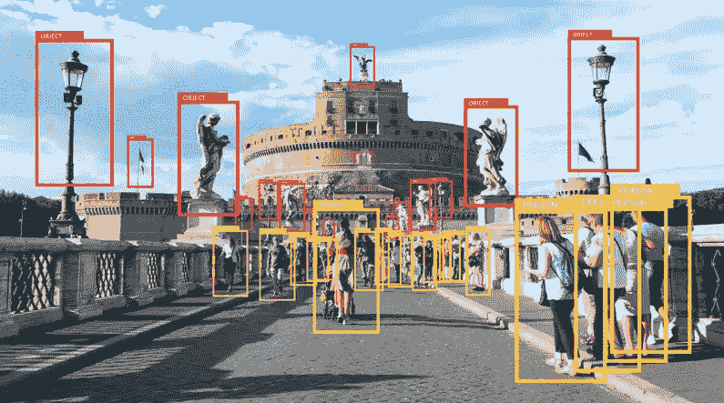

# 这是深度学习时代:数据的新前沿

> 原文：<https://towardsdatascience.com/its-deep-learning-times-a-new-frontier-of-data-a1e9ef9fe9a8?source=collection_archive---------22----------------------->

## 图像、音乐、情感等等

当人们听到“深度学习”这个短语时，许多人对它的真正含义只有一个模糊的概念。深度学习是一种机器学习范式，使用人工神经网络作为学习模型。

## 但首先，这有什么关系？

它可以帮助我们的生活变得更加容易和方便。

## 好的，那么**，它是如何工作的？**

Image: [UC Business Analytics R Programming Guide](http://uc-r.github.io/)

在人工神经网络中，有三种层:**输入层**、**隐藏层**和**输出层**。

在输入层，输入向量 x=(x *1* ，x *2* ，…，x *p* )被提供给一个系统，以便测试该系统。在输出层，提供最终输出。隐藏层位于输入层和输出层之间。当隐藏层增加时，它变得*深*。深度学习是一种机器学习范式，使用这种*深度*人工神经网络作为学习模型。此外，深度学习非常有用，因为它是一种无监督的机器学习方法，这意味着它不需要标记的数据。

**因为这项技术，我们拥有了丰富的数据，可以用于深度学习。我们来看一些常见的数据例子。**

# #1:图像

Image: Justin Freid/Martechtoday

从视觉信息中获取数据的方式其实并不是什么新鲜事。面部识别技术是过去十年中已经使用的典型例子。苹果公司的 Face ID 让我们对这项技术感到熟悉。

然而，实际上，很少有人意识到它的变化有多大。识别视觉信息是随着深度学习发展起来的。

彭博最近发布了一个新的网站，当人们使用网络摄像头或智能手机摄像头时，它可以扫描任何东西。当我通过我的网络摄像头扫描我的 iPhone 背面时，程序识别了苹果的标志，然后苹果的股票信息就弹出来了，包括当前的股价，公司信息，新闻稿等等。现在，无论何时人们通过相机扫描任何图像，都可以获得完整的数据。

**基于深度学习的时尚 app asap 54**，也是一个很好的运用深度学习的例子。当用户拍摄或上传他们想用累积的输入视觉值找到的任何衣服的照片时，该应用程序会建议相似的衣服和风格。

# #2:音乐

Photo by [Natalie Cardona](https://unsplash.com/@nataliedivine?utm_source=medium&utm_medium=referral) on [Unsplash](https://unsplash.com?utm_source=medium&utm_medium=referral)

我们来谈谈音乐。很多与音乐相关的公司都在使用音乐作为他们的数据。

Shazam 应用程序只需点击应用程序上的一个按钮，就可以找到歌曲的信息，包括标题、专辑、发行日期等等。当人们在听他们想要识别的歌曲时点击一个按钮，该应用程序会分析正在播放的音频片段，然后可以找出这首歌是什么。

据 [Trey Cooper](https://medium.com/@treycoopermusic/how-shazam-works-d97135fb4582) 称，截至 2018 年，Shazam 上已经存储了 800 万首歌曲/音频文件。此外，随着更多的歌曲(输入值)被添加，准确性也将增加。

# #3:情感

Photo by [Szabo Viktor](https://unsplash.com/@vmxhu?utm_source=medium&utm_medium=referral) on [Unsplash](https://unsplash.com?utm_source=medium&utm_medium=referral)

最近出现的最有趣的数据类型是 ***情感*** 。人们已经分析了情感数据，以弄清楚人们如何以及为什么表达他们的情绪，这些情绪往往会被讽刺、评论、评论、消息或标签中的模糊语言所掩盖。

自然语言工具包(NLTK)通常用于分析这类数据。来自 Kaggle 的对电影评论的情感分析是一个很好的例子，因为在分析电影评论的文本后，数据科学家可以从不同方面得出结论，例如某部电影有多受欢迎。目前，已经通过对文本进行分类来分析情感，并且包括人的情感的大量文本足以作为数据输入。

然而，现在，情感也可以用其他不同的方式来分析。人们在社交媒体对话、短信中使用表情符号，甚至制作自己的表情符号来表达情感。随着越来越多的年轻人和成年人使用表情符号而不是长文本进行在线互动和交流，分析表情符号变得令人惊讶地更加必要。

情绪分析公司 Canvs ai 顺应这一趋势推出了一种新方法。今天，他们不仅通过文本，还通过表情符号来分析人们的情绪。据该公司称，他们将表情符号分为 56 种情绪，而不仅仅是将情绪分为积极或消极的类别。看起来，随着人们在在线对话中继续使用表情符号，通过使用表情符号作为输入值来分析他们的情绪的准确性将会增加。

# *下一个数据集是什么？*

Photo by [Annie Spratt](https://unsplash.com/@anniespratt?utm_source=medium&utm_medium=referral) on [Unsplash](https://unsplash.com?utm_source=medium&utm_medium=referral)

换句话说，数据不再局限于视觉图像、声音或文本。如今，一切都可以是数据，可以积累起来进行分析。由此，我们可以想象未来什么样的东西可以是数据。

一种可能性是**闻**是一种新形式的数据。有时，当人们在餐馆吸入饭菜的香味时，他们想知道他们正在吃什么。如果气味可以用作数据，我们可以使用一个应用程序来获得具有相似气味的食物列表。食谱和最近的食品杂货店的信息，我们可以在那里得到的成分将一起弹出。当积累了足够的关于气味的数据时，我们可以检查臭味是气体泄漏还是仅仅是新地毯的气味。然而，我们应该期待未来数据分析方式的巨大变化。