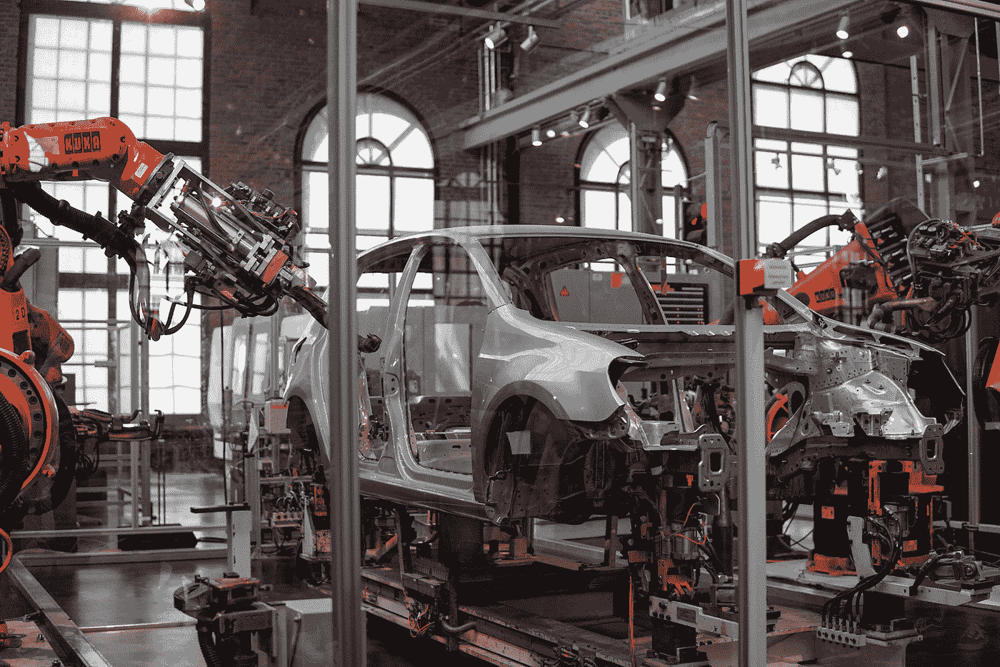
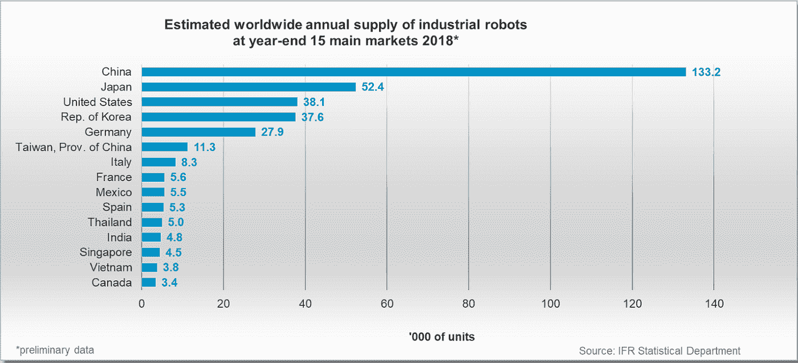
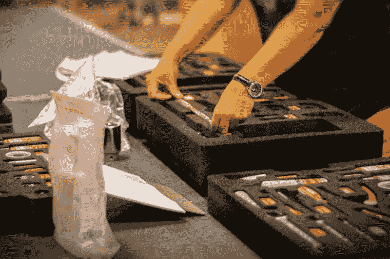
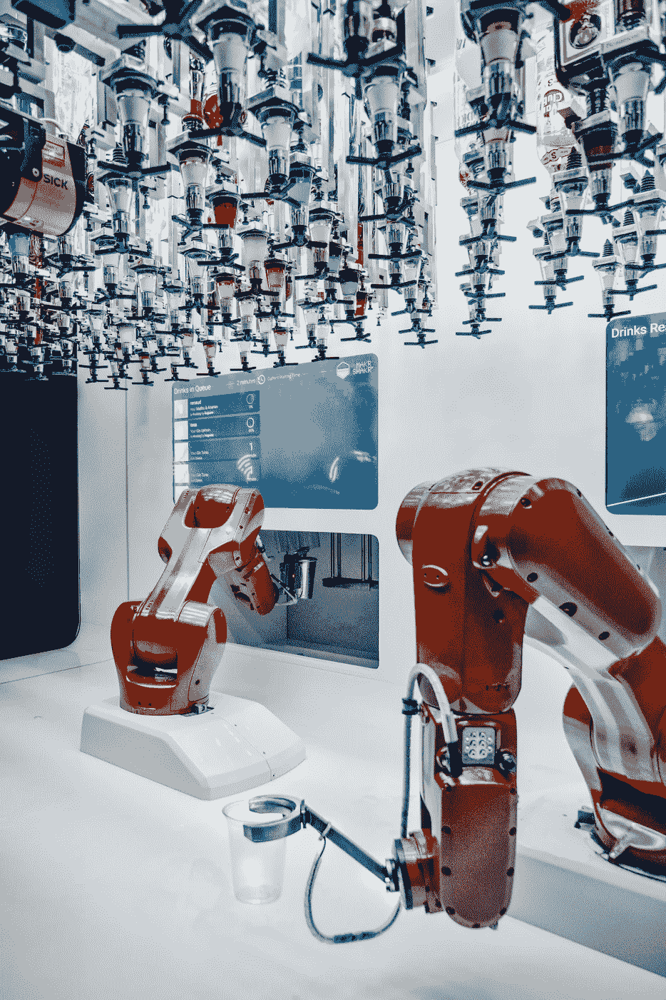

# 它在这里！人工智能机器人将如何革新制造业

> 原文：<https://towardsdatascience.com/its-here-how-ai-robot-will-revolutionize-manufacturing-44ce784438d4?source=collection_archive---------24----------------------->

## 尽管制造业一直被认为是自动化程度最高的行业，但全自动化工厂似乎仍然遥不可及。然而，人工智能定义的机器人有望改变这种情况。*拥有更好灵巧性和自主学习能力的机器人将如何改变制造流程和行业格局？企业应该如何应对机器人 2.0 带来的颠覆性创新？*

*在我之前的* [*机器人 2.0 系列文章*](https://medium.com/@Bastiane) *中，我们讨论了 AI 将如何实现自主学习。以及它将如何让机器人完成过去无法完成的精细动作。*

*我描述了* [*AI 如何推出机器人 2.0 时代*](https://medium.com/swlh/redefining-robots-demystify-next-generation-ai-enabled-robotics-fec64bfeb66c?source=---------12------------------) *。并谈到了*[*AI 机器人在物流行业的应用*](https://medium.com/hackernoon/why-is-warehouse-automation-so-important-for-ai-watchers-6f802e70271d?source=---------11------------------) *。通过观察 AI 机器人的第一个应用场景，我们可以预测这项技术最终将如何影响我们的生产力、就业和日常生活。*

在本文中，我们将关注制造业。目前，大多数机械臂和自动化设备用于制造业。然而，令大多数人惊讶的是，许多制造过程仍然保持手工操作。人工智能机器人将改变这一现状。拥有更好灵巧性和自主学习能力的机器人将如何改变流程和行业格局？企业应该如何应对机器人 2.0 带来的颠覆性创新？

> “未来已经到来——只是分布不均匀。”—威廉·吉布森

**制造自动化的现状**

根据国际机器人联合会(IFR)最近发布的报告，2018 年全球工业机器人手臂出货量创下新纪录，达到 38.4 万台。中国仍是全球最大的市场(占 35%)，其次是日本和美国。

汽车和电子制造行业仍然是工业部门最大的应用市场(60%)，远远领先于其他行业，包括金属、塑料和食品。具体原因在[我的第一篇文章](https://medium.com/swlh/redefining-robots-demystify-next-generation-ai-enabled-robotics-fec64bfeb66c?source=---------12------------------)里也讨论过。

source: IFR Statistical Department

source: IFR Statistical Department

此时，您可能想知道:

> 几十年前，工业机械臂被引入制造业。自动化应该已经应用到可能的领域。留给创新的空间有多大？

没想到的是，即使是自动化程度最高的汽车行业，离成为“熄灯工厂”，实现全自动化的工厂还有很大距离。

例如，大部分的汽车装配仍然是手工完成的。这是这个过程中最耗费人力的部分。一个汽车厂平均三分之二的员工在装配线上。

就连一向追求创新、崇尚高度自动化的特斯拉 CEO 埃隆·马斯克(Elon Musk)也不得不公开承认，特斯拉的生产线自动化进度没有达到预期。

> 为什么自动化这么难？自动化至今无法克服的技术局限是什么？

**1。灵活性和适应性**

今天的自动化生产线是为大规模生产而设计的。自动化有效地降低了成本，但也导致缺乏灵活性。更短的产品生命周期，越来越多的小批量但高度定制的生产要求更高的柔性。而且人类往往比机器人更能适应变化。

**2。灵活性和任务复杂性**

尽管技术进步很快，人类仍然比机器人拥有更高水平的灵活性。从我与电子合同制造商的交谈中，我了解到尽管组装过程已经高度自动化，但配套程序仍然主要是手工操作。

配套在制造业和仓储业都很常见。这是提高生产效率的重要一步。它指的是收集组装产品所需的各种组件、对其进行包装并将其放入套件中的过程。

然后，机器人从工具箱中取出零件并进行组装。这个装配阶段的自动化相对容易，因为每个零件都处于固定的位置和角度。相反，在装配过程中，零件必须被识别并从箱子中取出，它们在箱子中以无序的方式存放。各部分的各自位置不同，导致可能的重叠或缠绕，对传统的机器视觉和机器人技术提出了挑战。

**3。视觉和非视觉反馈**

许多复杂的装配操作依赖于操作员的经验或“直觉”。无论是安装汽车座椅，还是将零件装入套件，这些看似简单的动作都需要操作者根据各种视觉和触觉信号来调整其动作的角度和力度。

传统的自动化编程对于这种微调任务没有用，因为检索或放置项目的每个实例并不完全相同。它需要人类从多次尝试中学习和归纳的能力。这样能力的掌握，尤其是深度强化学习，才能给机器人带来最大的改变！

KIT Toolkit — source: kitting-assembly.ca

> **机器人 2.0:AI 机器人可以执行哪些以前无法完成的任务？**

AI 给机械臂带来的最大变化是:过去机械臂只能重复执行工程师的书写过程。尽管它们准确而精密，但它们无法应对环境或过程的变化。

由于人工智能，机器现在可以学习自己处理各种各样的对象和任务。具体来说，与传统机械臂相比，人工智能机器人在三个主要领域取得了重大突破:

1.  **视觉系统**

即使是最先进的 3D 工业相机也不具备人眼在确定深度和距离以及识别透明包装、反射表面或可变形物体方面的准确性。

这解释了为什么很难找到一个可以提供准确深度并识别大多数包裹和物品的相机。不过由于 AI，这种情况很快就会被改变。

机器视觉在过去几年取得了巨大的进步，从深度学习、语义分割和场景理解都有创新。

这些改进了使用商品相机的深度和图像识别，允许制造商获得准确的图像信息，并成功识别透明或反光物体包装，而无需昂贵的相机。

Deep learning object recognition examples, from left to right: Mask, Object Modeling, Grasp Point Prediction — source: OSARO

**2。可扩展性**

与传统的机器视觉不同，深度学习不需要预先注册或构建每个项目的 3D CAD 模型。人工神经网络可以在训练后自动识别图像中的目标。

无监督或自我监督学习也可用于减少手动标记数据或特征的需求，使机器更接近人类学习。

ML 减少了对人工干预的需要，并使机器人能够处理新零件，而不需要工程师重写程序。随着机器通过运行收集越来越多的数据，机器学习模型的准确性也将进一步增强。

目前，典型的生产线通常具有周边设备，如摇床、进料器和传送带，以确保机器人能够准确地获取所需的部件。

如果机器学习进一步发展，机械臂变得更加智能，也许有一天这些比机械臂贵四五倍以上的外设就不再需要了。

另一方面，由于深度学习模型一般存储在云端，这也让机器人可以互相学习，分享知识。例如，如果一个机械臂在一夜之间学会了组合两个部分，它就可以将新模型更新到云中，并与其他机器人共享。这样节省了其他机器的学习时间，也保证了质量的一致性。

**3。智能放置**

一些对我们来说似乎很容易的指令，如小心处理或整齐排列物品，对机器人来说是一个巨大的技术挑战。“小心处理”是如何定义的？是在物体接触桌面时立即停止施力吗？还是把物体移到离桌子 6 厘米的地方，然后让它自然落下？还是在你接近桌面时逐渐减速？这些不同的定义如何影响物品放置的速度和准确性？

将物品摆放整齐更是难上加难。即使我们忽略了“整洁”的定义，我们也必须首先从正确的位置拿起物品，以准确地将物品放置在所需的位置和角度:机械臂仍然没有人类灵巧，目前的大多数机械臂仍然使用吸盘。在实现像人类关节和手指那样的精细运动技能方面，仍有很大的改进空间。

其次，我们需要能够立即确定要抓握的物体的角位置和形状。以上图中的杯子为例。机械臂需要知道:杯子是朝上还是朝下？是应该横着放还是竖着放？以及路上是否有其他物品或障碍物？这样，机器人就可以决定把杯子放在哪里，以最有效地利用空间。

我们从出生开始就在不断地学习拿起和放下物品的各种任务。这些复杂的任务可以本能地完成。但是机器没有这样的经验，必须重新学习任务。

利用人工智能，机械臂现在可以更准确地判断深度。它还可以通过训练进行学习，并确定杯子是朝上还是朝下，或者处于其他状态。

对象建模或体素化可用于预测和重建 3D 对象。它们使机器能够更准确地呈现实际物品的大小和形状，并更准确地将物品放置在所需的位置。

***所有这些对制造业格局意味着什么？我们会看到重大的行业洗牌吗？在下一代自动化时代，谁能抓住机会巩固自己的地位？我们将在下一篇文章中详细讨论这一点。***

如果你想看更多这样的文章，请点击这里！

Bastiane Huang 是 OSARO 的产品经理，OSARO 是一家总部位于旧金山的初创公司，致力于开发软件定义的机器人技术。她曾在亚马逊的 Alexa 小组和哈佛商业评论以及该大学的未来工作倡议中工作。 [*她写的是关于 ML、机器人和产品管理的文章。跟随她来到这里*T5。](https://bastiane.substack.com/)