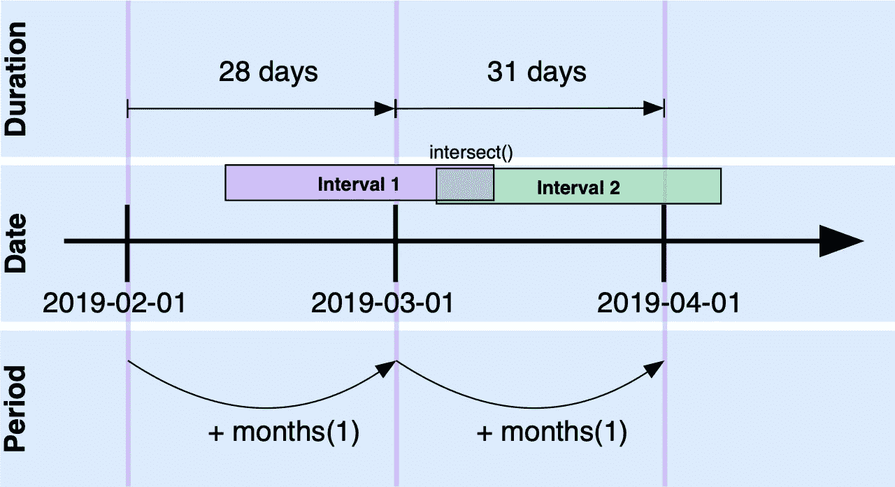
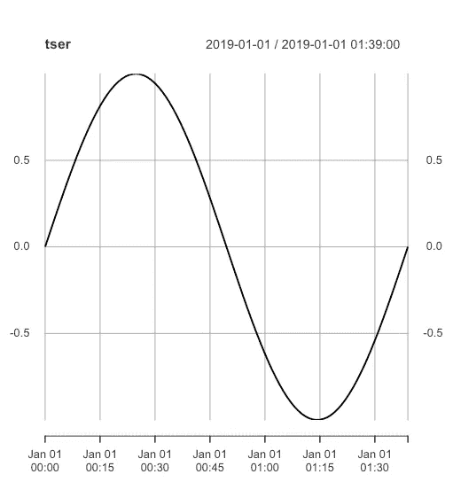
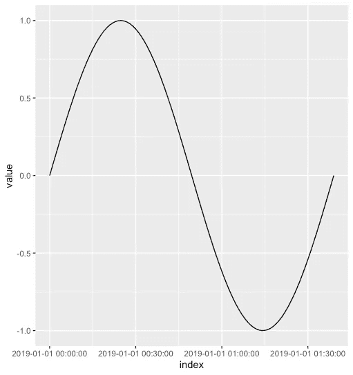

# 这只是时间问题，华生医生！理解 R 中的日期和时间

> 原文：<https://towardsdatascience.com/its-merely-a-matter-of-time-dr-watson-2fd74a648842?source=collection_archive---------35----------------------->

## **如何正确处理 R 中的时间——日期、时间、周期、持续时间、通量电容、时间旅行、时间间隔——什么？我在时间丛林里给你一些帮助。**


The processing of time often appears weird. Photo by [Jon Tyson](https://unsplash.com/@jontyson?utm_source=unsplash&utm_medium=referral&utm_content=creditCopyText) on [Unsplash](https://unsplash.com/search/photos/clock?utm_source=unsplash&utm_medium=referral&utm_content=creditCopyText)

每当我需要用 R(和其他编程语言)处理日期和时间时，我通常会遇到困难——解析、打印、时区、夏令时、时差。也许你和我一样是那些可怜的人中的一员。所以这篇文章是写给那些总是忘记这些概念的人和我未来的自己的。这篇文章是提示、包和函数的松散连接，展示了如何处理日期和时间。

# 概观

r 中时间点的标准表示(即日期和时间)使用所谓的 UNIX 纪元时间或 **POSIX 时间**，这是自`1970–01–01T00:00:00Z`以来经过的秒数(这是 ISO8601^1 格式，表示 1970 年 1 月 1 日 00:00:00 AM，协调世界时 UTC)。对于 1970 年之前的时间点，此计数为负。这同样适用于自 1970 年 1 月 1 日以来的天数。

# 基本日期和时间类

基础包中用于表示日期、时间和时差的最重要的类是

*   `base::Date` —没有时间和时区的日期，编码为自 1970-01-01 以来的有符号天数(负数表示该日期之前的年份)。
*   `base::POSIXct` — **日历时间** —日期和时间，由 1970 年 1 月 1 日 00:00:00 以来的秒数和时区表示。通常，这是计算(如时差)的最佳表示。POSIXct 使用您平台上的系统实现。亚秒可以用这个类编码。请注意，闰秒通常在大多数平台上被忽略。
*   `base::POSIXlt` **—当地时间** —日期和时间分为所有日期/时间部分(工作日、年份等)。).如果您需要处理例如工作日，这很有用。
*   `base::difftime` —用浮点数和一个单位(“秒”、“天”)表示的两个日期或日期/时间之间的差异。

在 R 中键入`?DateTimeClasses`来获取这些类的引用。

显示所有数据组件的`unclass()`函数可以很容易地研究这些类的实例结构。用`class(x)`你可以得到给定对象`x`的类名。

注意，所有这些类的实例都是由相应的`as.xxxx()`函数生成的，例如

```
base::as.POSIXct(“2019–01–01 00:00:00”, tz=”UTC”)
```

**解析日期时间字符串的示例**

```
> t1 <- as.POSIXct(‘2019–01–01 15:00:00’, tz=’UTC’)> class(t1)[1] “POSIXct” “POSIXt”> unclass(t1)[1] 1546354800attr(,”tzone”)[1] “UTC”
```

# Lubridate 包

**lubridate** R 包([https://lubridate.tidyverse.org](https://lubridate.tidyverse.org))在日期和时间的处理上引入了一点舒适。尤其是带有日期和时间的计算更加简洁。除了日期(由`base::Date`表示)和时间(由`base::POSIXct`表示)**之外，lubridate** 增加了以下类

*   `lubridate::Duration` —两个日期/时间之间经过的确切时间。可以从日期/时间中增加或减少持续时间。使用从`dnanoseconds()`到`dweeks()`的`lubridate::dxxxx`功能可以创建一个持续时间值。注意:持续时间`dmonth()`和`dyear()`是一个月/年的**平均值**。因此，有第二个类代表通常可以理解的月/年值:
*   `lubridate::Period` —周期是与公历相关联的时差的度量。因此，如果您将一个月添加到一个日期值中，即使这几个月的持续时间不同，也会出现相同的天数(见图 1 )!使用年()、月()、周()等。此处的功能。
*   `lubridate::Interval` —对由两个日期/时间(开始和结束)组成的时间间隔进行编码。集合操作可以用这个类来执行(`setdiff`、`intersect`、`union`)。



Fig. 1: An overview showing all relevant date-time related objects. The **duration** of a **period** variates depending on the dates/times to which it is added. Intervals have a clear **start** and **end date/time**. Set operations can be performed with intervals such as intersection, difference, or containment using %within%.

lubridate 包有很多解析不同格式的日期和时间的函数，例如

```
time1 <- lubridate::ymd_hms(“2019–01–01 14:45:00”)date1 <- lubridate::ymd(20190101)
```

## 周期

周期是对年和月特别有用的常识性度量，如下所示:

因此，2016 年是闰年:

```
library(lubridate)(ymd(20160101) + years(1)) — ymd(20160101)Time difference of 366 days
```

因此，2017 年不是闰年:

```
(ymd(20170101) + years(1)) — ymd(20170101)Time difference of 365 days
```

## 期间

持续时间是基本单位(皮秒、微秒、毫秒、秒、分钟、小时、天、周)内的精确时间量。由于月份和年份不是同质的(有更短和更长的年份)，这些持续时间不适合用作精确的度量。

与上面的例子相反，`dyears(1)`是平均年正好有 365 天，所以在闰年你会得到以下结果(这通常不是你想要的):

```
library(lubridate)
(ymd(20170101) + dyears(1) — ymd(20170101)
Time difference of 365 days
```

## 间隔

间隔由两个日期组成，如下所示

```
library(lubridate)
I1 <- interval(
        ymd(20170101),
        ymd(20171231))
```

或者像这样的日期/时间点

```
I2 <- interval(
         ymd_hms(“2019–01–01 14:30:00”),
         ymd_hms(“2019–01–01 15:30:00”))
```

您可以在这里检查日期/时间是否包含在这样的间隔中

```
ymd(20170317) %within% I1[1] TRUEymd(20180317) %within% I1[1] FALSE
```

`setdiff()`、`union()`、`intersect()`等操作与`lubridate::Interval`类协同工作。

# 亚秒级分辨率的打印和解析

**解析**微秒级分辨率可以通过`base::strptime()`函数完成(注意格式字符串中的“`%OS`”参数允许解析亚秒级):

```
time1 <- base::strptime(“2019–03–30 17:35:12.456789”,
              format = “%Y-%m-%d %H:%M:%OS”, tz = “UTC”)
```

或者，使用**润滑**方法可以更简单地获得相同的结果(这里我使用了日期-时间的 ISO8601 编码——见下一节):

```
time1 <- lubridate::as_datetime(“2019–03–30T17:35:12.456789Z”)
```

可以使用下面的 R 表达式执行返回字符串的转换:

```
print(base::strftime(time1, “%Y-%m-%d %H:%M:%OS6 %Z”))[1] “2019–03–30 17:35:12.456789 UTC”
```

注意格式字符串中的“`%OS6`”。这是为了打印小数秒的 6 位数字。

# 日期和时间的字符表示

“令人高兴的是”,日期和时间的文本 ASCII 表示存在巨大的可变性，这使得日期时间的处理和解析非常具有挑战性。每当你有机会决定使用哪种时间格式时，我都会推荐使用 UTC 的 ISO8601 格式。即使在其他时区处理，UTC 时间代码在全球范围内都是清晰的——您不必摆弄时区或夏令时(从而在时间线中引入一年两次跳跃:一次跳跃到未来，一次跳跃到过去——并且没有通量电容器)。

示例:字符串“`2019–01–02T23:50:12.225Z`”是采用 UTC 时区的 ISO8601 时间代码(即字符串末尾的`Z`)。可以像这样用`lubridate::as_datetime()`函数解析

```
time1 <- lubridate::as_datetime(‘2019–01–02T23:50:12.225Z’)
```

## 从文件加载时间序列

从文件中加载时间序列的一个非常好的包是 **readr** 包([https://readr.tidyverse.org](https://readr.tidyverse.org))，它允许解析带有日期/时间列的表格。通过使用`readr::col_date`、`readr::col_time`和`readr::col_datetime`给出一个列定义，可以给 **readr** 一个解析`readr::read_csv()`中日期的格式。寻找 `readr::parse_date`和 `readr::parse_datetime`功能。

## 加载带有日期列的 CSV 文件的示例

```
library(readr)col_spec <- cols(
   x = col_double(),
   y = col_date(format = “%Y-%m-%d”))df1 <- read_csv(readr_example(“challenge.csv”),
                col_types = col_spec)
```

# 绘制时间序列

基础包提供了 ts()函数来创建一个规则的时间序列。一个 **ts** 时间序列有一个起始点(有时解释为年份)和一个`frequency`——或者是一个`deltat` ，它们被设置为与起始点相关。

通过将日期和时间附加到数据帧的每一行(在 **xts** 中称为`index()`)，该概念被扩展为支持不规则采样时间序列的 **xts** package⁴。xts 套装基于**动物园** package^5.

就个人而言，我更喜欢使用【https://ggplot2.tidyverse.org】库[来绘制图形。通过一些简单的步骤，一个 **ts** 或 **xts** 时间序列可以转换成一个**tible**数据帧用于绘图。对于转换时间序列来说，重要的是`generics::tidy()`函数将时间戳属性提取到一个**索引**列中。](https://ggplot2.tidyverse.org)

结果图如下所示:



Time-series in **xts**.



Time-series in **ggplot**.

有关处理时间序列的更多资料，请参见[7，8]。

# 松散的末端

## 闰秒

由于这个世界在数学上(以及在许多其他方面)并不完美，所以有时会有闰秒(通常是正数)，因此有些日子会有 86401 秒，而不是 86400 秒。否则——迟早——由于平均太阳日并不完美，我们的挂钟会漂移。

全局变量. leap.seconds 包含当前时区的所有闰秒。对于另一个时区，您可以使用`format(.leap.seconds, tz=’CET’)`打印闰秒。

有趣的是，正如 POSIX 提出的那样，时差应该考虑闰秒。然而，由于这使得所有的时间计算过于复杂，它们通常在大多数系统中被忽略！在 R 的 DateTimeClasses 文档中，编写了以下提示:

> 在任何平台上，R do **而非**使用的[…]“posi xct”时间包括闰秒

## 表示日期和时间的其他包装/R 类别

在其他常用的包中有一些额外的类代表日期和时间(这个小列表显然不是详尽的):

*   `chron::chron` —按时间顺序排列的对象
*   `zoo::yearmon` —表示包括年份在内的月度数据
*   `zoo::yearqtr` —包括年度在内的季度数据表示
*   `timeDate::timeDate`

希望这篇文章有助于找到解决 r 中日期和时间处理困难的方法。

## 参考

[1]日期和时间格式— ISO 8601。[https://www.iso.org/iso/iso8601](https://www.iso.org/iso/iso8601)，[https://en.wikipedia.org/wiki/ISO_8601](https://en.wikipedia.org/wiki/ISO_8601)

[2] R 代表数据科学— Ch。16 日期和时间，【https://r4ds.had.co.nz/dates-and-times.html】T4

【3】闰秒。维基百科。[https://en.wikipedia.org/wiki/Leap_second](https://en.wikipedia.org/wiki/Leap_second)

[4] xts:可扩展时间序列，[https://cran.r-project.org/package=xts](https://cran.r-project.org/package=xts)

[5] zoo:规则和不规则时间序列的 S3 基础设施(Z 的有序观测)，[https://cran.r-project.org/package=zoo](https://cran.r-project.org/package=zoo)

[6] chron:可以处理日期和时间的时序对象，[https://cran.r-project.org/package=chron](https://cran.r-project.org/package=chron)

[7]使用 dplyr 介绍时间序列分析，[https://blog . explorative . io/Introducing-Time-Series-Analysis-with-DP lyr-60683587 cf8a](https://blog.exploratory.io/introducing-time-series-analysis-with-dplyr-60683587cf8a)

[8]时间序列分析，[http://r-statistics.co/Time-Series-Analysis-With-R.html](http://r-statistics.co/Time-Series-Analysis-With-R.html)