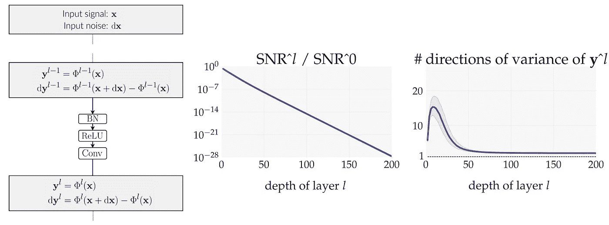

# 有必要将批处理规范化和跳过连接结合起来

> 原文：<https://towardsdatascience.com/its-necessary-to-combine-batch-norm-and-skip-connections-e92210ca04da?source=collection_archive---------11----------------------->

## 这些技术必须齐头并进

Image by geralt from pixabay

这篇文章基于我在 ICML 2019 年发表的[论文](https://arxiv.org/abs/1811.03087)。它试图提供新颖的见解来回答以下问题:

*   为什么深度神经网络(DNNs)的特定架构有效，而其他架构无效？
*   批量范数[2]和跳过连接[3]起到了什么作用？

回答这些问题是一个热门的研究课题，事关重大。事实上，这样的答案将推进对 DNNs 的理论理解，并有可能进一步改进它们的设计。

# 如何评估一个架构的质量？

首先，第一个关键的观察是，任何从输入到输出的 DNN 映射都需要指定两个元素:(1)架构；(2)架构内部的模型参数值——权重和偏差。通过固定架构和改变架构内的模型参数获得的所有 DNN 映射的集合被称为**假设类**。

假设类的目的是对训练施加约束。实际上，训练在于找到同时满足以下条件的 DNN 映射:(1)属于假设类；(2)与训练数据一致。DNN 映射必须属于假设类的约束是表达真实映射本身属于假设类的先验知识的一种方式。本质上，这种先验知识使得仅使用训练数据的测试数据的**归纳**成为可能。出于这个原因，先前的知识通常被称为**感应偏置**(要了解更多细节，我建议读者参考 Shalev-Shwartz 和 Ben-David 的这本伟大的[书](https://www.cs.huji.ac.il/~shais/UnderstandingMachineLearning/))。

回到我们最初的目标，我们可以通过评估归纳偏差的质量来评估架构的质量。这种评估可以使用以下过程来执行:修复体系结构，并在体系结构内随机抽取模型参数。如果用该过程采样的大多数 DNN 映射具有不好的属性，这意味着对不好的属性存在归纳偏差，即坏的属性在训练期间将被偏爱。反过来，这将导致**无法适应**——即欠拟合——当坏属性与低训练损失不相容时，或者导致**泛化能力差**——即过拟合——当坏属性与低训练损失相容但不太可能泛化时。

在能够应用这个过程之前，我们仍然需要使 DNN 映射的“坏性质”的概念更加精确。

# DNN 映射有什么不好的性质？

让我们考虑一个固定的 DNN 映射，由**固定架构**和**固定架构内的模型参数**指定。这个固定的 DNN 映射接收一个**随机输入**并通过它的层传播这个输入。我们通过定义以下内容来跟踪传播:

*   **随机信号***:***y**^*l =*φ^*l*(**x**)，通过将固定 DNN 映射φ^*l*到层 *l* 应用到随机输入 **x** 得到
*   随机噪声**随机噪声**:d**y**^*l =*φ^*l*(**x**+d**x**)-φ^*l*(**x**)**、**作为随机腐败 d **x** 产生的层腐败

现在，DNN 映射的“坏特性”可以定义为信号和噪声的不必要行为:或者信号 **y** ^ *l* 变得无意义，或者噪声 d **y** ^ *l* 失去控制。更准确地说，两种“病理”可以被定义为将这种“不良属性”推向极端(我们关注这两种“病理”，因为它们是在我们的上下文中观察到的，但是其他“病理”可以在其他上下文中被定义和观察到):

Pathological Signal

*   **病理信号:**信号 **y** *^l* 失去其变化方向，并在深层沿一条线集中。这种病理例如与多类分类的一次性目标(具有通常等于类的数量减 1 的多个变化方向)不兼容。对这种病理的诱导性偏见可能导致无法治愈。

Pathological SNR

*   **病理 SNR:** 噪声 d**y**^l 相对于信号**y** *^l* ，信噪比 SNR *^l* 随 *l 呈指数衰减*这种病理可能兼容低训练损失， 但是测试集上的任何输入讹误 d **x** 都会导致讹误信号**y**t20】^l+d**y**t24】^l =φ^*l*(**x**+d**x**)变成纯噪声——即无意义。 对这种病理学的归纳性偏见可能导致不良的概括。

# 将我们的过程应用于各种架构

现在让我们将我们的过程应用于**卷积****DNNs**—**—**的各种架构，包括作为空间大小等于 1 的特例的**全连接 DNNs**—具有 **ReLU** 激活函数:

*   没有批次定额的 DNNs **和没有** 跳过连接的**病理信号**——即 **y** *^l* 的#个方差方向在深层接近 1

*   没有批次标准的 DNNs **和有**跳过连接的**同样有**病理信号**——即 **y** *^l* 的#个方差方向在深层接近 1**

*   具有批处理规范的 DNNs **和没有**跳过连接的**遭受**病理 SNR** — 即 SNR*^l*/SNR*^*0*随 *l* 呈指数衰减***

**

*   *带有批次标准的 DNNs **和带有**跳过连接的**不会出现任何问题——即在所有深度都保持**良好运行*****

**

# *这是怎么回事？*

**

*吸引病理学的主要力量是前馈层组成的**乘法性**(conv 层和 ReLU 层可以分别看作是与随机矩阵相乘和与 Bernouilli 随机向量相乘):*

*   *没有跳跃连接的 DNNs **在深层是病态的，因为它们受到简单前馈乘法的影响***
*   *没有批范数的 DNNs **和具有**跳过连接的**在深层是病态的，因为残差和跳过连接分支**中大致相等的方差不**有效地对抗前馈乘法***
*   *具有批处理规范的 DNNs **和具有**跳过连接的**在所有深度都保持良好性能，因为剩余连接分支和跳过连接分支**之间的信号方差的衰减比率∝1/(*l*+1)**有效地对抗前馈乘法***

# *结论*

*让我们总结一下我们的结果(为了更深入地挖掘，我建议感兴趣的读者参考[论文](https://arxiv.org/abs/1811.03087)和[代码](https://github.com/alabatie/moments-dnns)):*

*   *批范数和跳过连接的组合在深网中编码了一个**性能良好的**感应偏置**T21***
*   *然而，这些技术的好处很难理清。只有当它们结合时——通过将剩余分支稀释到跳过连接分支——它们才能抵消前馈乘法*

*我希望这些结果将打开理解深网的新视角。*

# *放弃*

*为了便于阐述(并且不改变分析)，与本文相比，本文中的一些符号被简化了:*

*   *采用了预激活视角，每层 *l* 在卷积后开始，在卷积后再次结束*
*   *#方差方向**y**t28】^l 在文中对应于**y**t32】^l 的有效秩*
*   *SNR *^l /* SNR^0 在本文中对应于归一化灵敏度平方的倒数*

# *参考*

*[1] A. Labatie，[表征行为良好与病理性深度神经网络](https://arxiv.org/abs/1811.03087) (2019)，ICML 2019*

*[2] S. Ioffe 和 C. Szegedy，[批量归一化:通过减少内部协变量移位加速深度网络训练](https://arxiv.org/abs/1502.03167) (2015)，ICML 2015*

*[3]何国光，张，任，孙，[深度剩余网络中的身份映射](https://arxiv.org/abs/1603.05027) (2016)，2016*