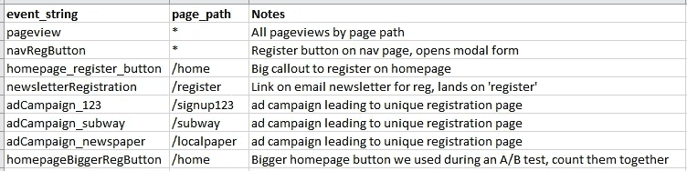
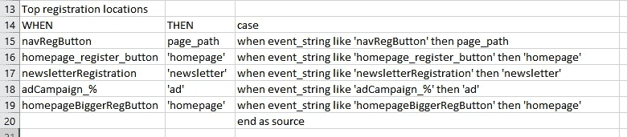
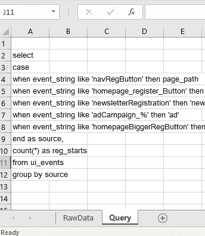
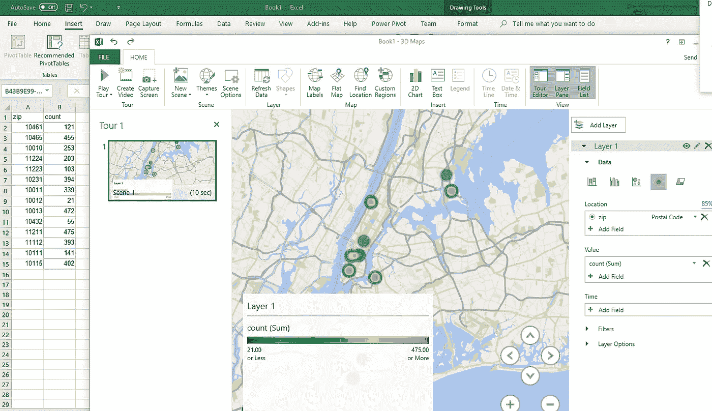
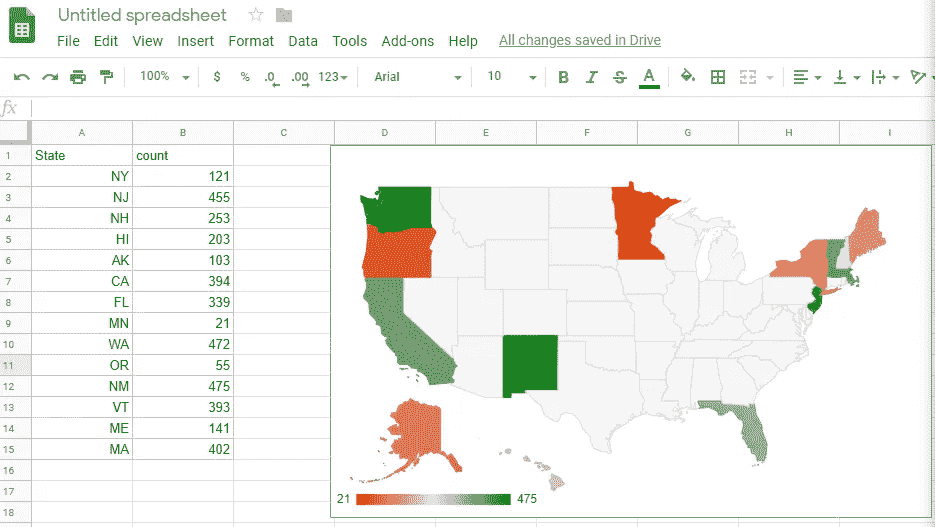

# 在数据科学中使用电子表格是可以的

> 原文：<https://towardsdatascience.com/its-ok-to-use-spreadsheets-in-data-science-c1d0eff95b8b?source=collection_archive---------8----------------------->

## 因为它们在一堆混乱的次优数据科学环境中很棒。

如今有了这么多先进的数据工具，很容易认为电子表格对于严肃的数据科学工作来说太原始了。事实上，有超过 20 年的文献警告人们电子表格的弊端，这听起来像是一个“真正的数据专家”应该知道不要使用这些过时的东西。

但它可能是最伟大的瑞士军队数据电锯，用于那些没人愿意承认他们每天都要做的丑陋工作。在理想情况下，它们是不必要的，但当技术债务、时间压力、糟糕的数据质量以及除了电子表格什么都不懂的利益相关者结合在一起时，它们是无价的。

# 电子表格有一个坏的说唱，这是很值得的

早在数据科学领域出现之前，由于电子表格是商业中最普遍的程序之一，已经有大量文章吹捧电子表格的各种缺陷。恐怖故事比比皆是。有电子表格错误导致[学术工作中的重大错误](http://rooseveltinstitute.org/researchers-finally-replicated-reinhart-rogoff-and-there-are-serious-problems/)和[论文钻研各种电子表格错误](https://arxiv.org/ftp/arxiv/papers/0804/0804.0797.pdf)的例子。甚至还有一整个[“欧洲电子表格风险利益集团(EuSpRiG)](http://www.eusprig.org/)(成立于 1999 年！)致力于电子表格风险管理，即如何避免因电子表格混乱而毁掉你的业务。

许多问题源于人类的弱点。太容易犯公式错误或以不被注意的方式改变公式。各种函数的实际输出偶尔会有问题(内置于 Excel 的[统计功能在 15 年前就有了这样的问题](http://biostat.mc.vanderbilt.edu/wiki/pub/Main/TheresaScott/StatsInExcel.TAScott.slides.pdf)，有些可能会持续)。有时候，工作表的复杂性会激增，这简直令人困惑。

已经有大量的功能来防止人类的失败点，但人类通常没有耐心和远见来处理这类事情。当然，我们可以使用单元格保护、锁定、验证等。，但就像备份数据一样，它通常被放在一边“供以后使用”，实际上从未发生过。

其他大部分问题是当人们试图让一个电子表格做太多事情，像成为一个[数据库](https://www.flockfiler.com/why_not_spreadsheet.php)、[数据仓库](https://en.wikipedia.org/wiki/Spreadmart)、[项目管理工具](http://elynxx.com/top-4-reasons-why-spreadsheets-are-the-wrong-tool-for-managing-projects/)时，更强大和用户友好的专用解决方案已经存在。说“使用正确的工具来完成工作”很容易，但是通常电子表格怪物都是从小工作开始，然后成长为更多的东西。

所有这些问题都很有道理。我会把这些视为理所当然。这意味着你需要意识到一个好的工具可能会被以可怕的方式滥用。取而代之的是，我将继续讨论电子表格仍然很适合放在你的后口袋里。

# “EDA 的电子表格？酷。”—每个人

与我交谈过的大多数从业者都同意，以探索/原型的方式使用电子表格是完全可以做到的(他们自己可能不会这样做，但他们并不认为这有什么错)。你通常是在摆弄一个小的数据样本来找出什么是可能的。在这一点上，几乎没有期望你会产生精炼的代码或分析。根据你对 Excel、Google Sheets 或 Libreoffice vs pandas 和 R 的熟悉程度，你甚至可以工作得更快。

我真的[痴迷于](/data-science-foundations-know-your-data-really-really-know-it-a6bb97eb991c)在构建分析或编写代码之前熟悉我的数据集。当然，你可以看看描述性统计数据，但它们可能会欺骗你很多:

Such an awesome animation

真正了解数据的唯一方法是查看分布、可视化，并直接以原始形式对其进行采样。电子表格通常非常适合这种情况。我倾向于认为这比用熊猫随意地在大块大块的行上闲逛要不那么笨拙。

关键特性是在电子表格中试验数据转换的速度有多快。快速 VLOOKUP 将让您测试两个混乱的表之间的简单连接，以找到损坏的或重复的键。您可以通过几次击键和点击将数据放入数据透视表，并检查某些聚合。通过这种方式可以发现很多错误，因为您将尝试一个简单的算术，它会因为不可靠的数据而中断，您可以快速检查实际发生了什么，并将其添加到您要清除的数据错误列表中。

类似的操作在熊猫身上也很容易，但需要更多的打字，并保持头脑中的细节，比如什么功能应用于什么等等。因此，这里的理想情况是使用电子表格进行探索，原型化出您想要应用的数据转换，检查一些发行版，然后用 Python 或 R 编写一个合适的模型，现在一切都在您的脑海中变得更加清晰了。知道何时停止的诀窍是，如果你正在认真考虑写一个宏或什么的，就停下来。

# 处理荒谬的半重复编码

跟踪系统充满了任意字符串和数字的任意组合，您需要对其进行查询以进行计数。也许有一个潜在的模式适合你的用例，让你元编程，也许没有。这对于多年来有许多人添加/改变具有不同命名约定甚至不同后端栈的各种跟踪代码的系统来说尤其是一个问题。



An example of a typical tracking system that’s had a few years to grow production cruft

很多时候，除了编写某种脆弱的硬编码映射函数之外，没有其他方法来处理上述数据集。老实说，在多年的生产过程中保持所有东西的一致性和文档化是一个挑战，camelCase 和下划线的组合就说明了这一点。为了进行有意义的分析而进行简单的汇总是一件极其痛苦的事情。

```
-- ProductLead: "Where do my registrations come from?"
-- Analyst: "Why do you hate me?"select 
case       
when event_string like 'navRegButton' then page_path       
when event_string like 'homepage_register_button' then 'homepage'      
when event_string like 'newsletterRegistration' then 'newsletter'
when event_string like 'adCampaign_%' then 'ad'
when event_string like 'homepageBiggerRegButton' then 'homepage'
end as source,
count(*) as reg_starts
from ui_events
group by source
```

想出像上面这样庞大的 case 语句是一件痛苦的事情，保持它的组织性更糟糕。我称之为 *semi-* repetitive，因为如果它确实是重复的，你就能够编写一个函数，很容易地捕捉它的行为。由于技术债务，这个有一堆愚蠢的自定义边缘案例，所以它有不可取的 [Kolmogorov 复杂性](https://en.wikipedia.org/wiki/Kolmogorov_complexity)。输入使用电子表格来保持事情有点理智。



Sometimes you gotta break some eggs to make a registration source tracker

这是理想的吗？大概不会。但是我甚至不确定在这种情况下理想状态到底是什么样子。另一种选择是将所有这些硬编码到 Python 中进行分析，这在这种混乱的情况下同样脆弱。一个更干净的解决方案是以某种方式重构你的跟踪代码在过去、现在和未来是如何设置的，并创建一个系统来防止这种情况发生，但我还没有聪明到设想这样一个系统不会被未来的使用所滥用。

# 与不太懂技术的人分享打包的数据

这就是为什么所有级别的 BI 工具都有一种“导出到 CSV/Excel”的特性。许多非常聪明的分析人员不太了解用 Python 或 r 编写代码。他们不会看着一本写有代码的笔记本说“啊哈！让我做一些调整来检验我自己的假设。”但是，如果你给他们一张相当干净的数据表，他们会处理得很好。

那么，为什么不采用通用数据传输格式 CSV 呢？可以，但是这使得留下一个*数据源踪迹*变得更加困难。您可以将所有需要的相关信息打包到电子表格的一个选项卡中，无论是相关查询、脚本链接还是其他。



Always leave a data trail

这样做的原因是为了确保当不可避免的“这从何而来？”问题来自第三方，实际上有一个答案，而不必做大量疯狂浪费时间的调查工作。

# 当你是一个地图新手的时候

即使你有精确的经纬度坐标，地图也很难制作。映射邮政编码更加疯狂(像 [FIPS 到邮政编码的转换是一个不小的痛苦](https://github.com/bgruber/zip2fips))。我见过的大多数例子[都涉及](https://www.trulia.com/blog/tech/the-choroplethr-package-for-r/)一个[显著的](https://stackoverflow.com/questions/1441717/plotting-color-map-with-zip-codes-in-r-or-python) [数量](/visualizing-data-at-the-zip-code-level-with-folium-d07ac983db20)的[包](https://jakevdp.github.io/PythonDataScienceHandbook/04.13-geographic-data-with-basemap.html)到[工作](https://stackoverflow.com/questions/47602744/draw-boundary-by-zip-code-and-create-a-heat-map)，这是假设你只是想要一个静态图像。好的一面是，我们不必启动 GIS 软件来做这种事情。

谢天谢地，令人惊讶的是，对于那些无法区分墨卡托和梅赛德斯的人来说，近年来电子表格已经开始填补“我现在需要一张快速地图”的空白，截至 2019 年撰写本文时，Excel 处于这一领域的前沿。Google Sheets 也有一些地图功能，但功能仍然不够强大。



Excel 3d Mapping feature: It’s like MAGIC



Google Sheets Maps: Not as magical, but still pretty magic

制作这些地图是一项高技术壮举，您需要处理疯狂的地图轮廓，通常需要人工智能/人工智能来解释一条数据是邮政编码还是其他位置，地图位置通常有重复的名称，数据点需要根据显示缩放级别进行聚合…因此为您抽象所有这些工作具有巨大的价值。

# 结论——电子表格是不错的选择

就需要维护的电子表格而言，它们代表了一种技术债务。诀窍是不要让它成为技术债务，避免使用电子表格作为长期的活文档。虽然我们经常被训练不要产生一次性工作，但矛盾的是，电子表格几乎是快速一次性工作的理想选择。通常当我们把它们放在身边时，它们会变成一种令人讨厌的东西。