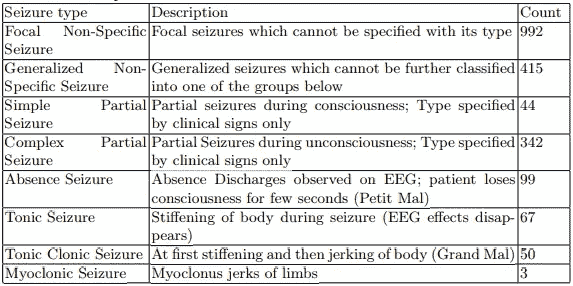
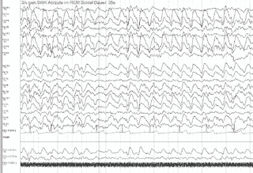
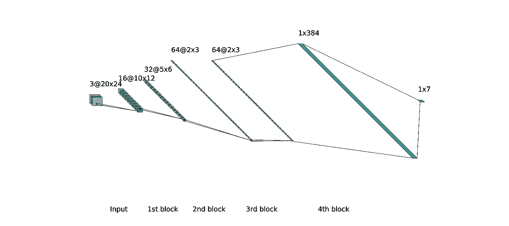
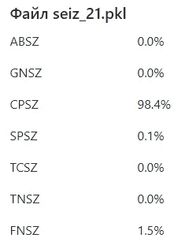
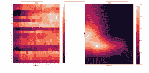
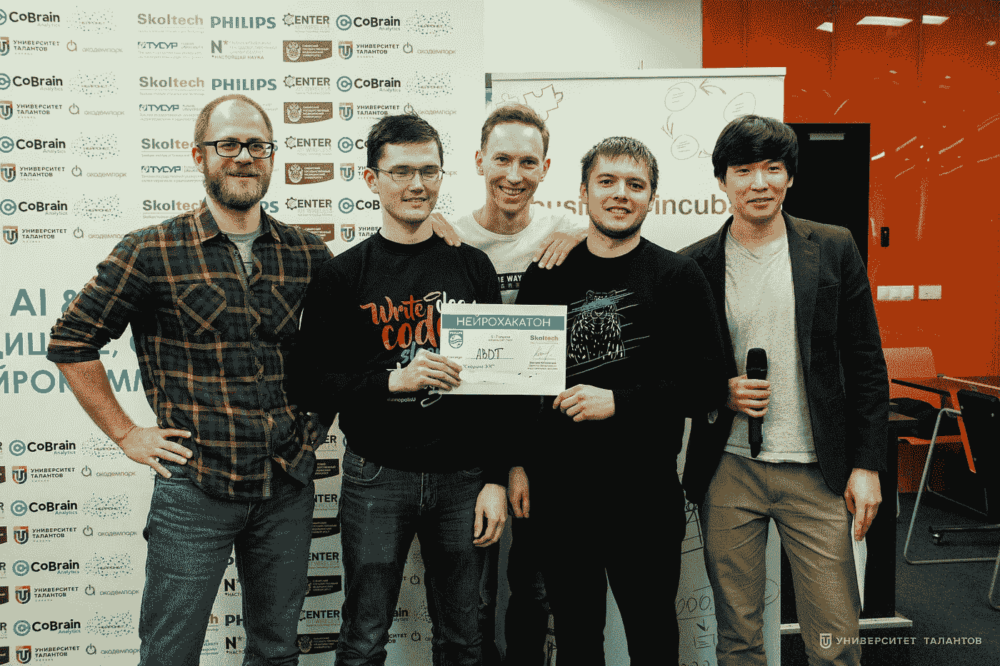

# 如果你在排行榜上排名第二，就有可能赢得 ML 黑客马拉松

> 原文：<https://towardsdatascience.com/its-possible-to-win-ml-hackathon-if-you-ranked-2nd-on-leaderboard-2b82a23474ea?source=collection_archive---------28----------------------->

在机器学习中，高精度的模型是成功的关键。尽管如此，模型是为最终用户构建的。这个故事将告诉您终端用户视角如何为数据科学的成功增加有价值的分数。

## 介绍

几周前，我们参加了由 Skoltech 研究机构主办的机器学习黑客马拉松。它发生在我们神奇的家乡俄罗斯喀山，持续了将近 2 天。一定要看看这个关于我们家乡的门户网站。

[](https://visit-tatarstan.com/en/) [## 参观鞑靼斯坦共和国的官方旅游门户——鞑靼斯坦

### 像当地人一样走路。从内部体验喀山的 5 种方式更多关于指南 100 参观鞑靼斯坦纪念品…

visit-tatarstan.com](https://visit-tatarstan.com/en/) 

注意:前方剧透。我们在私人排行榜上排名第二，但我们仍然赢了，我将告诉你如何赢。

## 黑客马拉松概述

黑客马拉松有三条赛道:

1.  基于网络的医生标签工具
2.  分类癫痫类型的机器学习算法
3.  开放跟踪医学领域人工智能的任何解决方案

作为数据科学家，我们毫不意外地选择了第二条路线。

## 问题描述

这项任务有两个方面:

1.  建立一个模型，从脑 EEG 信号中正确分类 8 种癫痫。
2.  构建一个 web 应用程序，输入一个文件并为最终用户提供一个预测。



**Table 1\. Types of Epilepsy Seizures**

有 2012 个观察数据是从患有癫痫发作的患者那里收集的。每个观察值都包含基于时间的样本，并使用两种流行的方法进行预处理。关于数据预处理的更多细节请参见[这篇文章](https://arxiv.org/pdf/1902.01012.pdf)。



**Figure 1\. Raw EEG Signals (tribute to WikiMedia Commons)**

在预处理之后，我们收到了每个观测的两个文件:

1.  形状的三维阵列[样本数、通道数、频率数]
2.  形状的二维数组[样本数，频率数]

## 基准

测试方案是在文件水平上 5 倍交叉验证分割的平均加权 F1 分数，即文件被分割成 5 倍，然后它们才必须被解析，因为一个文件内的样本是高度相关的。如果你想知道如何计算交叉验证的 F1 加权分数，这里有 python 代码:

```
import numpy as np
from sklearn.metrics import f1_score
# assuming you have fold-wise true labels and predicted labels 
# as a list of tuples
val_scores = [f1_score(true_labels, predicted_labels, average=”weighted”) for true_labels,predicted_labels in fold_labels_and_predictions)]
mean_f1 = np.mean(val_scores)
```

本文作者在样本水平上提取矩阵的特征值，训练各种分类器，其中 K 近邻算法优于其他算法。他们使用方法 1 能够达到 88.4%的分数，使用方法 2 能够达到 90.7%的分数。

## 排行榜

至于排行榜，我们的本地 5 倍简历充当了公开分数的代理。至于个人得分，我们只有在演示我们的解决方案后才能知道。

但是，开头有一句主持人很重要的话。得分最高的团队不仅会根据个人得分进行排名，还会根据网络应用的质量进行排名。

## 神经网络

我们决定使用卷积神经网络，因为许多研究人员证明它非常适合癫痫检测任务。此外，我们发现脑电信号的采集过程受到在人体头部放置扫描仪的拓扑结构的影响。幸运的是，第一种预处理为 2D 卷积提供了合适的输入。

## 结构

我们为我们的通信网尝试了不同的主干网:

*   预训练的 Imagenet 型号(ResNet18、VGG11)
*   具有随机权重的 Imagenet 架构(也称为 ResNet18、VGG11)
*   从零开始的简单 CNN

显然，在 Imagenet 上预训练的模型表现不佳，因为输入没有共同点。具有随机权重的 ResNet 和 VGG 架构也没有优于简单的 convnet。我认为这是因为我们输入的空间维度非常小(20 像素高，24 像素宽)，而这些模型的第一个卷积层的滤波器大小为 7。我们最终会丢失一堆信号，有时输出维数为负(就像 AlexNet 一样)。

也就是说，经过长时间的实验，我们决定采用这个小模型:

*   3 块卷积、泄漏 ReLU、批量标准化和最大池
*   1 块卷积、泄漏 ReLU 和批量归一化
*   1 个全连接层



**Figure 2\. Our CNN Architecture**

## 输入

因为我们使用了方法 1 预处理的数据集，所以我们的输入是[num_samples，20，24]的形状，而 num_samples 的范围可以从 3 到 100 以上。因此，我们尝试了不同的输入:

*   连续样本的随机窗口，窗口大小等于 1、3、5 和 10
*   所有样本的平均值，即输入形状为[1，20，24]
*   将标准差、最大值、最小值和平均值相加
*   将第 10、25、50、75 和 90 个百分点与平均值相加

不再说话，随机窗口根本不起作用。因此，我们取了所有样本的平均值，培训变得更加有趣，我们的指标几乎达到了 **90%** 。添加其他统计指标似乎没有帮助，通常我们的分数会下降。然而，第 25 和第 75 百分位给了我们 **1%** 的提升，我们让他们继续输入我们的形状[3，20，24]。

## 培训结果

几次迭代后，我们发现学习率在 *0.002* 和 *0.005* 之间的*亚当*优化器给我们带来了最高的性能，在交叉验证分数中增加了额外的 **1%** 。每个折叠被训练了 40 个时期。

最终的局部性能作为所有 5 次折叠的平均值来测量。我们以一倍最大值在 **93.71%** 触及 **92.39%** 。在所有队伍展示了他们的成绩后，我们排在第二位，比领先者落后 **1%** 。

在公布私人评分后，我们的业绩跃升至 **94.5%** 。遗憾的是，我们落后了 1%。

## Web 应用程序

现在，你应该记得胜利还有一个标准。是的，一个 web 应用程序，医生可以提交一个文件并得到一个预测。



Table 2\. Sample Model Output

我们决定分头努力开发一个漂亮的 web 应用程序表单。不要犹豫，从我们的[驱动器](https://drive.google.com/file/d/13izID-COxJMEefORIZiDObVPyY6qPOo3/view?usp=sharing)下载一些示例文件来测试这个表单。很简单。只需上传一个或几个文件，以获得每个文件的预测。您还可以下载 CSV 格式的预测文件。

## 模型可解释性

我希望您已经花了一分钟来查看我们的应用程序。如果你有，你应该会注意到一个不寻常的图表，如下图所示。



**Figure 3\. Grad-CAM Output Interpretation**

我们记得，在医学中，不仅要有非常高的精确度，还要有简洁的解释，这一点很重要。这就是为什么我们花时间带来[梯度加权类激活映射](http://gradcam.cloudcv.org/)给我们的用户一个工具来解释为什么我们的模型做出任何决定。简而言之，它使用类别预测、反向传播梯度和类别激活图来指出输入中感兴趣的区域。

这就是我们如何得到上面这两幅图像的。左图是样本平均值的热图，也称为输入矩阵，右图是 Grad-CAM 算法的输出，引起医生对最有影响的输入值的注意。

## 成功的解决方案

嗯，那是我们所有的秘制酱。我们将高精度模型与简单而完整的网络应用程序相结合，并用可视化模型解释来丰富一切。尽管我们在加权 F1 分数方面获得亚军，但黑客马拉松评审团赞赏我们考虑了医生如何最有效地使用这一解决方案。

此外，我们利用了从以前的黑客马拉松中学到的经验，即有一个团结的团队只致力于一个问题是非常重要的。我们有很好的专业组合，没有浪费我们有限的时间和精力在其他任务上。

**关于团队的更多信息**

*   我(Rustem Galiullin)——机器学习研究员——从事模型表演。
*   机器学习工程师 Almaz Melnikov 让我们的网络应用充满了功能，并整合了我们的神经网络。
*   前端开发人员 Konstantin Yarushkin 为我们的网络应用开发了一个模板。



Our smiley faces after winning

## 资源

1.  项目网络应用[https://deepl.herokuapp.com/](https://deepl.herokuapp.com/)
2.  我们的 gitlab 回购[https://gitlab.com/MelnikovAlmaz/epilepticsearch.git](https://gitlab.com/MelnikovAlmaz/epilepticsearch.git)
3.  pytorch 的 Grad-CAM 实施[https://github.com/jacobgil/pytorch-grad-cam](https://github.com/jacobgil/pytorch-grad-cam)
4.  Grad-CAM 项目【http://gradcam.cloudcv.org/ 
5.  关于 https://www.skoltech.ru/en 斯科泰克