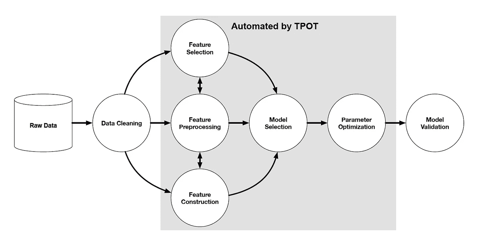
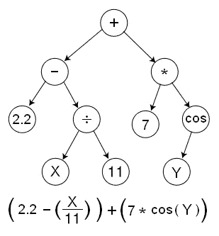
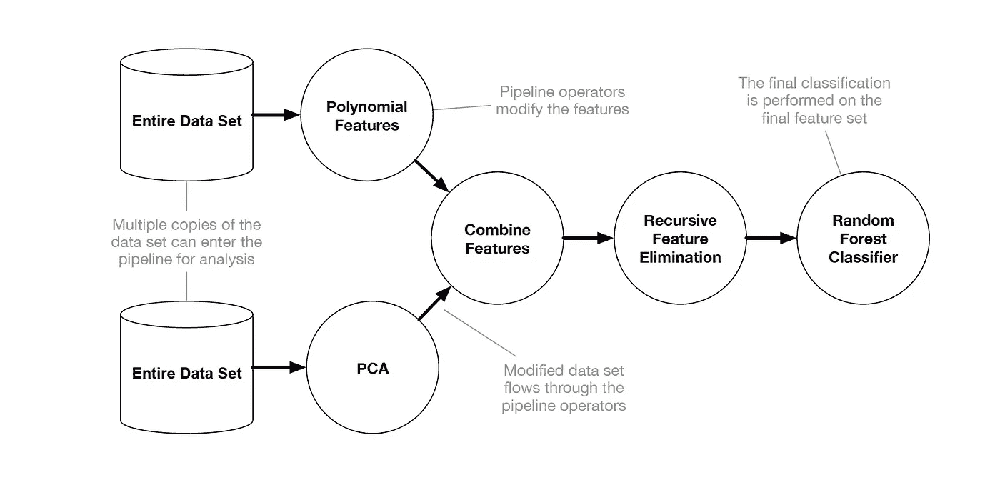
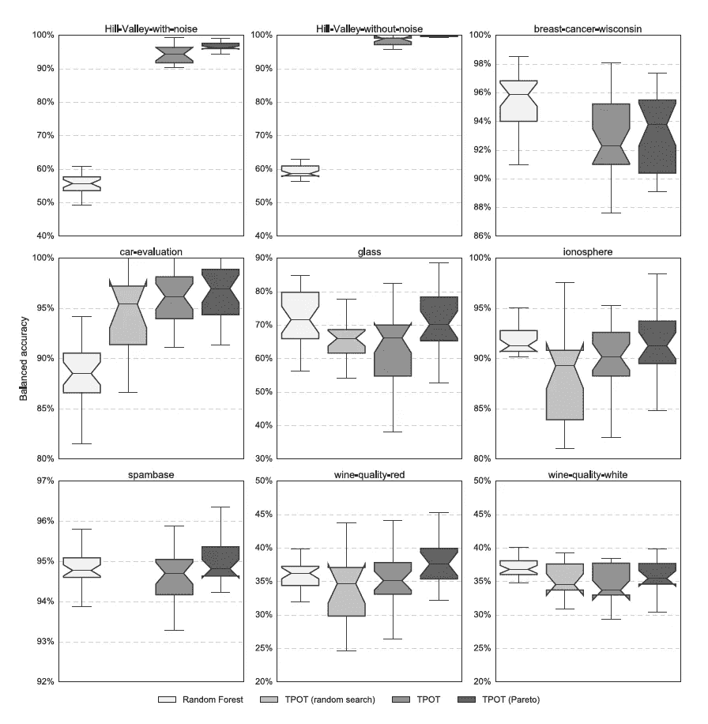

# 是时候更多地考虑管道了

> 原文：<https://towardsdatascience.com/its-time-to-think-more-about-the-pipeline-5346c039a803?source=collection_archive---------25----------------------->

tool 工具简介

[TPOT](https://github.com/EpistasisLab/tpot) (Tree-Based Pipeline Optimization Tool)

看到数据科学始终关注改进算法和技术来分析激增的数据以提取模式，这总是令人兴奋的。这些模式可以创造新的见解或成为新的决策方法，而如果没有数据科学过程的帮助，这些模式很难学习。

然而，该过程通常需要从业者的技能和经验。他们应该能够收集足够的和适当的数据集，清理和预处理它，挑选和比较多个模型，调整模型的参数，并阐明结果。这个处理元素链构成了数据分析的管道。虽然许多数据科学家急切地改进每个元素(更常见的是模型，它类似于管道中的生产元素，因此是有趣的部分)，但促进管道设计也很重要。因此，自动化管道不仅可以帮助数据科学家，也可以让非专家更容易使用。

数据科学中的管道表示数据科学项目的主流，包括从数据清理、特征工程、模型选择、模型优化和模型验证的不同阶段。

最近，我看了一篇[的论文](https://arxiv.org/pdf/1603.06212v1.pdf)，是关于一个叫做 TPOT(基于树的管道优化工具)的自动化管道优化工具。在加州大学欧文分校机器学习库中的一些基准数据集上进行测试，该工具展示了类似于基本机器学习分析的出色数据分析结果。同时，该工具需要用户较少的先验知识。TPOT 可以自动探索预处理和模型操作的组合，并且在某些情况下，胜过基本的机器学习分析。

([Source](https://arxiv.org/pdf/1603.06212v1.pdf):)

在完成探索性数据分析和数据清理之后，TPOT 可以自动探索数据科学项目阶段的组合。这些阶段包括特征选择、特征预处理(例如 PCA)、特征构建、模型选择(例如选择随机森林模型或监督向量机模型)和参数优化。然后，TPOT 可以发现输出最佳结果的最佳组合，即分类问题的最高准确度。

在 TPOT 之前，数据科学家已经开发了一些机器学习自动化方法。其中一个著名的库是 grid research，它探索从业者提供的参数组合，以找到最适合的模型。最近，已经发现随机评估参数集执行更好的结果，例如，贝叶斯优化。

机器学习自动化的另一种方式是特征构建，它从原始特征构建新的中间特征以实现更好的性能。

TPOT 机器学习自动化工具是一种替代方式，通过遗传编程建立基于树的流水线进化。TPOT 使用几个基本的管道操作符，然后将它们组合成一个基于树的管道。之后，可以通过遗传编程来进化基于树的流水线，以处理最终输出。

([Source](https://en.m.wikipedia.org/wiki/Genetic_programming):)

传统上，遗传编程使用叶和节点构建树来表示优化特定标准的数学运算。叶子是操作数，节点是运算符，当它们组合在一起时，可以更新最终结果。

基本的流水线操作包括预处理、分解、特征选择和建模。预处理程序包括“标准标量”、“鲁棒标量”(缩放特征)和“多项式特征”(生成新特征)。分解是“随机化 PCA”，一种使用随机化 SVD 的主成分分析。特征选择包括“RFE”(递归特征消除策略)、“选择最佳”(选择前 k 个最佳特征)、“选择百分位数”(选择前 n 个百分位数特征)和“方差阈值”(过滤掉不满足最小方差阈值的特征)。该模型包括“决策树分类器”、“RandomForestClassifier”、“GradiantBoostClassifier”、“支持向量机”、“LogisticRegression”和“KNeighborsClassifier”。

([Source](https://arxiv.org/pdf/1603.06212v1.pdf):)

为了组装基于采油树的管道，TPOT 使用类似于上图所示的结构。在数据集的多个副本中，每个数据集都通过四类操作符中的一类进行传递。之后，可以将它们组合起来形成新的数据集，从而创建组合要素。那么你可能会问如果算子是模型呢，那岂不是和最后的“RandomForestClassifier”相矛盾？答案是，一旦操作符是一个模型，模型输出将覆盖以前的预测。此外，先前的预测将成为新的特征。最后的“RandomForestClassifier”是最终的预测。

然后，TPOT 使用进化计算技术遗传编程(GP)来优化基于树的流水线。遗传编程有助于表示每个算子及其参数的计算，以最大限度地提高精度。每个计算都是一个序列，可以被修改、删除或插入到基于树的流水线中。还有 TPOT 管道的变体，如 TPOT-帕累托管道，它可以最大限度地提高预测的准确性，同时最小化管道的复杂性。

为了评估 TPOT 的性能，测试了来自 UC Irvine 机器学习库的 7 个数据集。结果如下所示。

([Source](https://arxiv.org/pdf/1603.06212v1.pdf):)

TPOT(随机研究)用管道的随机生成来表示 TPOT。请注意，TPOT 的缺失箱线图(随机搜索)表明计算时间超过 120 小时。每个箱线图中的凹口代表中位数的 95%置信区间。

如图所示，在大多数数据集中，TPOT 的性能与随机森林相似。然而，对于一些数据集，如 Hill Valley 和 car evaluation，TPOT 和 TPOT (Pareto)优于其他两种算法。通常，TPOT(随机搜索)有一个主要缺点，即运行时间过长。另一方面，TPOT 和 TPOT (Pareto)的所有重复在 48 小时内运行。TPOT(随机搜索)的另一个缺点是复杂。总体而言，TPOT (Pareto)流水线在保持紧凑性的同时实现了最佳精度。

优化整个流水线计算应该同等重要，而不是关注流水线的子集。机器学习流水线的自动设计可以通过节省时间量和为模型创建新的基线而有益于机器学习实践者。此外，由于它的可访问性，它对非专家也是有益的。

非常感谢您的阅读！干杯！