# 雅可比正则化

> 原文：<https://towardsdatascience.com/jacobian-regularization-7db8836538cc?source=collection_archive---------22----------------------->

## L1 和 L2 正则化的推广

Photo by [Tom Mussak](https://unsplash.com/@tom_mu?utm_source=medium&utm_medium=referral) on [Unsplash](https://unsplash.com?utm_source=medium&utm_medium=referral)

L1 和 L2 正则化，也称为拉索和山脊，是众所周知的正则化技术，用于各种算法。这些方法的思想是使预测函数平滑并避免过拟合。考虑这个多项式回归的例子:

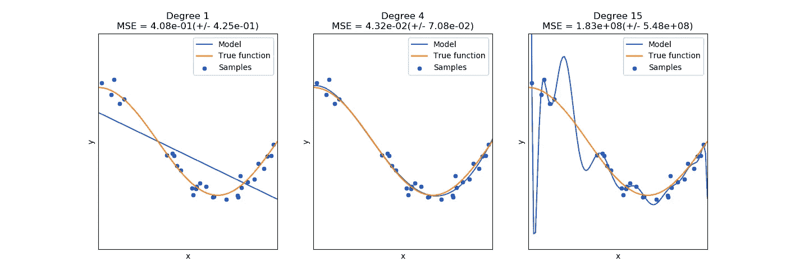

Source: [https://scikit-learn.org/stable/auto_examples/model_selection/plot_underfitting_overfitting.html#sphx-glr-auto-examples-model-selection-plot-underfitting-overfitting-py](https://scikit-learn.org/stable/auto_examples/model_selection/plot_underfitting_overfitting.html#sphx-glr-auto-examples-model-selection-plot-underfitting-overfitting-py)

在本例中，我们将不同次数的多项式拟合到数据中，其中高斯噪声被添加到一个函数中，该函数在这里被标识为橙色曲线。我们看到，对于 15 次多项式，预测曲线非常不平滑，并且该模型不能很好地概括，这与预测曲线非常接近原始曲线的 4 次多项式模型相反。

提高平滑度和避免过拟合的一种方法是在成本函数中加入正则项:

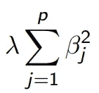

Source: [http://statweb.stanford.edu/~tibs/sta305files/Rudyregularization.pdf](http://statweb.stanford.edu/~tibs/sta305files/Rudyregularization.pdf)

这里，参数β通常不包括截距。这个正则项将试图降低参数，以提高平滑度。但是会用同样的力把参数拉下来。但是在多项式回归的情况下，惩罚较高次项比惩罚较低次项更有意义。于是，L2 正则化的推广被称为[吉洪诺夫正则化](https://en.wikipedia.org/wiki/Tikhonov_regularization)，当 **β** 的平方和被吉洪诺夫矩阵和向量 **β** 的乘积的平方范数所代替。寻找 Tiknonov 矩阵的最优值通常是困难的过程，尤其是对于神经网络，其中参数的数量是巨大的。

为了解决这个问题，在最近的论文“利用雅可比正则化的鲁棒学习”中提出了一种新的方法来提供可以对简单和复杂模型都起作用的正则化过程

之前已经指出，L2 正则化等同于向输入层添加高斯噪声。事实上，对于前馈网络，输入噪声始终给出比 L2 正则化更好的结果。该论文(和其他几篇论文)的作者使用这一思想来推导适用于简单和复杂模型的广义正则化项。想法是，对于小扰动，我们可以使用 logit 函数的泰勒展开式(在我们应用 sigmod 或 softmax 之前最后一层的输出):

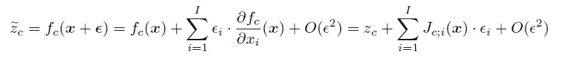

这里我们介绍了一个雅可比 **J** :

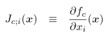

其中 c 是输出类(对于多类分类问题), I 是输入的组成部分。正则项将试图最小化输入-输出雅可比矩阵的 Frobenius 范数:

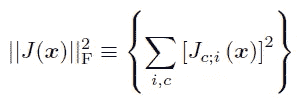

因此，我们正在最小化的总成本函数如下所示:

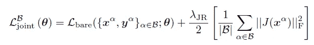

这种方法由 Jure Sokoli、Raja Giryes、Guillermo Sapiro 和 Miguel RD Rodrigues 在他们的论文*Robust large margin deep neural networks*中提出，但由于多类分类问题的计算复杂性，没有得到太多关注。本文通过在单位球面上随机采样来逼近雅可比矩阵，从而克服了这些挑战。为了计算导数，我们可以使用所有现代深度学习框架中可用的自动微分。

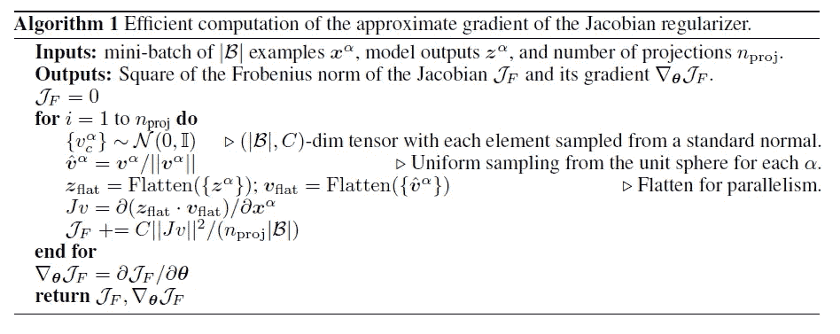

我们可以将类似的方法应用于我们在开始时讨论的多项式回归。我们将曲线建模为多项式函数:

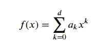

这里 d 是多项式的次数。这种情况下的雅可比矩阵是 1×1 矩阵:

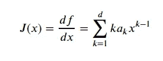

那么正则项可以写成:

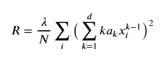

这里我们对观测值 I 求和。注意，这将是 a 的复二次函数，可能与简单的 L2 正则化函数非常不同。还要注意，这个估计值可能有偏差，必须应用某种贝塞尔校正。本文中没有讨论这一点，但是估计偏差并进一步改进结果是很有趣的。

可以预见，如果我们将函数建模为一次多项式(这将使其成为线性回归)，正则化项将变为:

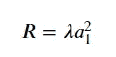

那正是 L2 正规化！

# 结论

神经网络的正则化仍然是一个活跃的研究领域，我们回顾的这篇论文以及其他几篇论文继续推进它，提高准确性，同时也为正则化技术奠定了坚实的理论基础。雅可比正则化不仅可以应用于神经网络，还可以应用于其他算法，例如多项式回归。