# 理解 Javascript“this”关键字(上下文)

> 原文：<https://towardsdatascience.com/javascript-context-this-keyword-9a78a19d5786?source=collection_archive---------9----------------------->


Photo by [sydney Rae](https://unsplash.com/@srz?utm_source=medium&utm_medium=referral) on [Unsplash](https://unsplash.com?utm_source=medium&utm_medium=referral)

当一个人开始学习 javascript 时，上下文是总会造成很多困惑的话题之一，也是面试官经常问的话题。

> 让我们开始…

## 什么是语境？

Context 总是关键字`this`的值，它是对“拥有”当前正在执行的代码或函数的对象的引用。

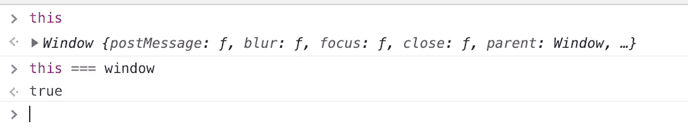

我们知道`window`在浏览器中是一个全局对象，所以如果我们在控制台中键入`this`，它应该返回窗口对象，它确实返回了。

在 node.js CLI 中，如果你尝试做上面的事情，你会得到一个拥有所有全局使用的函数的对象，比如`console`、`process`等等。(试一次)。

> 注意:`*this*`关键字的值取决于函数运行/调用/使用的对象。因此`this`关键字有不同的值，这取决于它的使用场合。
> 
> 注意:从现在开始，这个和上下文可以互换使用。

## 上下文—全局和函数内部。

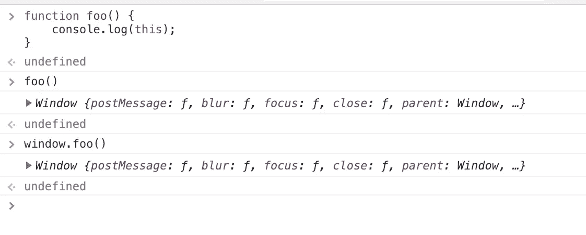

this at the global level called on the global object

`foo`是在全局级定义的函数，在全局级对象上调用，即`window`，所以调用`foo`和`window.foo`是一样的。因此上下文是一个`window`对象。

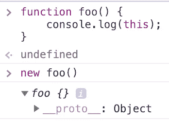

this inside function called on function object at global level

然而，如果我们在全局层次上做`new foo()`，那么将得到`this`作为`foo`对象。

> 注意:`new`操作符创建一个对象的实例。函数的上下文将被设置为创建的对象实例。

## **上下文—在二级功能下**

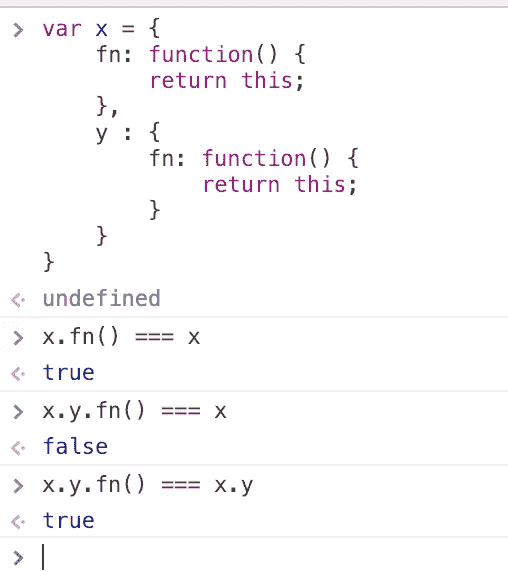

## **上下文——当函数被全局定义并在对象下使用时(**隐式绑定**)。**

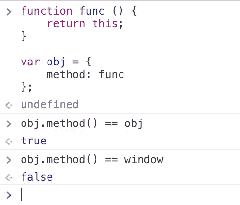

> 注意:从上面我们可以看出`this`关键字的值取决于被调用的函数，而不是定义函数的地方。

## 上下文在“使用严格”中如何表现？

当在一个函数中使用`use strict`时，上下文即该关键字的行为不同。上下文保持它被调用时的样子。

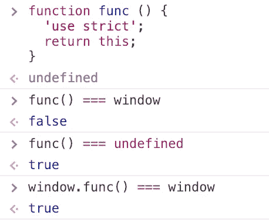

> 注意:我们的整个程序可能应该是`strict`或`non-strict`。然而，有时你包含一个第三方库，它比你自己的代码有不同的严格性，所以必须注意这些微妙的兼容性细节。

## 上下文在箭头函数中如何表现？

就上下文而言，箭头函数的工作方式不同于常规函数。`this`将总是引用词法范围([在这里是关于范围](https://codeburst.io/still-confused-in-js-scopes-f7dae62c16ee))，即`this`保留封闭词法上下文的值。

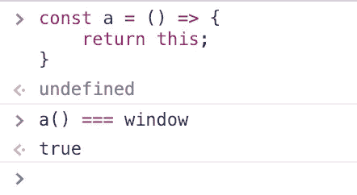

在全局代码中，它将被设置为全局对象，因此我们得到上面的 true。

## 上下文在对象的原型链上如何表现？

上下文遵循同样的规则，即如果函数在对象的原型链上，`this`指的是方法被调用的对象。

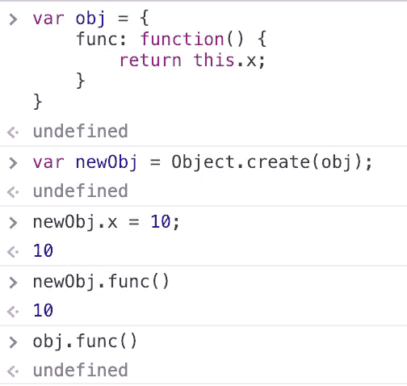

如果我们调用`obj.func()`将会得到`undefined`，如果`func`被调用于从定义了`x`的`obj`创建的`newObj`，那么它将会返回值 10。

## 上下文在事件处理程序中如何表现？

案例事件处理程序中的上下文指的是接收事件的**元素**。

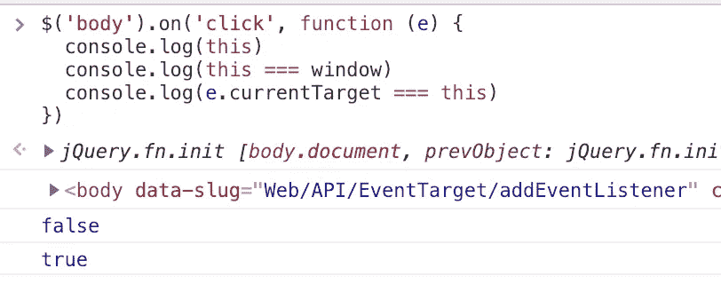

这里我们在 DOM 的 body 标签上添加了一个 jquery click 事件，我们可以看到上下文返回了 body 元素。

## 上下文在执行上下文中是如何表现的？

如果你不知道什么是执行上下文([这里读](http://davidshariff.com/blog/what-is-the-execution-context-in-javascript/#first-article))。简而言之，执行上下文是函数执行的“环境”或[范围](https://codeburst.io/still-confused-in-js-scopes-f7dae62c16ee)。每次调用一个函数，都会创建一个新的`execution context`。对一个`execution context`的每个调用有两个阶段

1.  创建—调用函数时
2.  激活—执行功能时

`this`的值在创建阶段确定，而不是在执行时确定。然而，`this`判定规则保持不变。

## 上下文和范围有什么不同？

范围和上下文是完全不同的概念，但通常被新开发人员互换使用。

范围是运行时代码中某个特定部分的变量、函数或对象的可访问性。[点击此处了解更多关于示波器的信息。](https://codeburst.io/still-confused-in-js-scopes-f7dae62c16ee)

每个函数调用都有一个关联的范围和上下文。

## 如何显式改变上下文？

我们可以通过使用`call()`、`apply()`和`bind()`方法来动态地改变任何方法的上下文。

**调用—** 第一个参数`call`是您想要使用的**上下文**。之后，您可以在**中传递任意数量的逗号分隔值。**

```
foo.call(context, param1, param2, param3 );
```

**应用—** 这与`call`相同，但在自变量数量的意义上有所不同。仅应用支持的 2 个参数，**上下文和值数组**。

```
foo.apply( context,[param1, param2, param3]);
```

**Bind —** 它返回一个新函数，该函数永久绑定到`bind`的第一个参数，不管该函数是如何使用的。`bind`不立即调用绑定的函数，而是返回一个我们稍后可以运行的新函数。

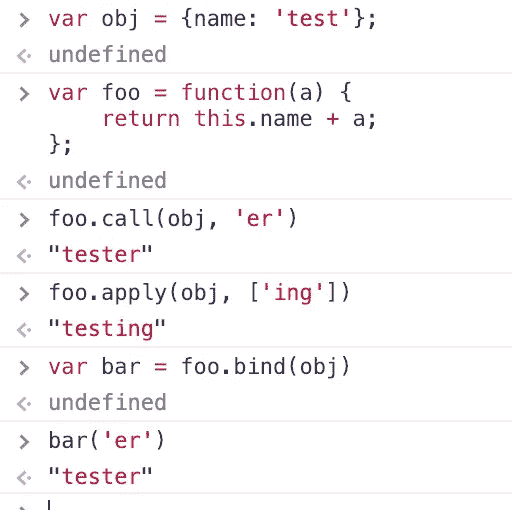

为什么我们需要显式地改变上下文？

1.  当我们需要调用定义在一个对象内部的函数时，比如说`x`，但是在其他对象上，比如说`y`，我们可以使用显式方法来这样做，以**增加** **的可重用性**。

2.[**Currying and partial application**](https://codeburst.io/javascript-currying-vs-partial-application-4db5b2442be8)是另一个使用上下文显式变化的部分。

3.使**效用函数**像

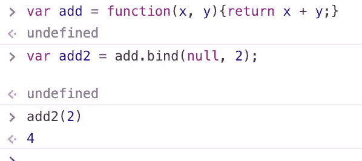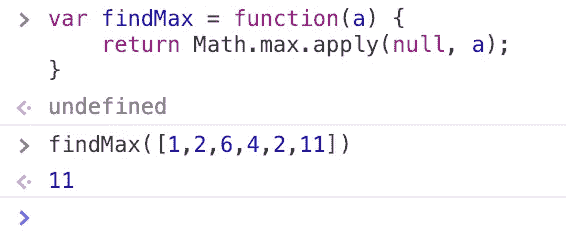

4.**继承**是另一个可以使用上下文显式更改的地方。

> 如果你知道更多原因，请在下面评论:)

## 我们需要考虑上下文的情况有哪些？

我们可能会丢失上下文，即在中获取`this`的`undefined`值

## 1.嵌套函数

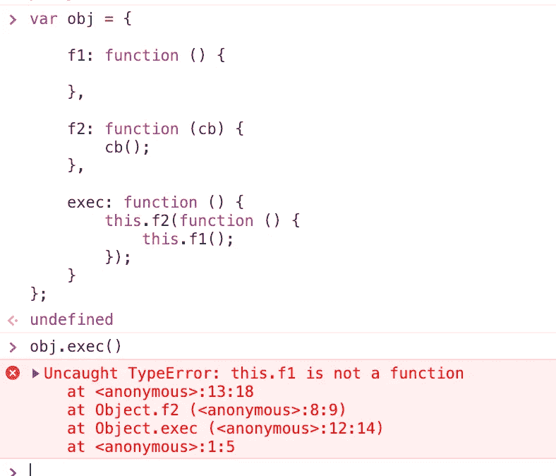

我们需要保留调用回调函数时引用的`obj`对象的上下文，在上面的例子中，这种情况不会发生，我们会得到错误。

我们可以通过用下面的代码替换`exec`来消除上面的错误

```
// use of bind
exec: function () {
    this.f2(function () {
        this.f1();
    }.bind(this));
}// use of arrow function
exec: function () {
    this.f2(() => {
        this.f1();
    });
}// another way not recommended though
exec: function () {
   var that = this;
    this.f2(() => {
        that.f1();
    });
}
```

## 2.方法作为回调

```
let obj = {
  name: "test",
  waveHi() {
    return ('Hi',this.name);
  }
};

setTimeout(obj.waveHi, 1000)
```

上面会返回`Hi undefined`，想一秒为什么？这是因为最后一行将会变成

```
let f = obj.waveHi;
setTimeout(f, 1000);
```

并且，`setTimeout`得到了与对象`obj`分开的函数`obj.waveHi`

解决方案是

```
// Wrapping function
setTimeout(function() {
  obj.waveHi(); // Hi Test
}, 1000);// Arrow function
setTimeout(() => obj.waveHi(), 1000); // Hi Test// use of bind
let waveHi = obj.waveHi.bind(obj);
waveHi() // Hi Test
```

> 注意:
> 
> 1.创建“绑定方法引用”需要匿名包装函数和调用成本。在特定情况下，利用闭包可能是更好的选择。
> 
> 2.任何类型的函数引用(作为值赋值，作为参数传递)都会失去函数的原始绑定。

如果您想被添加到我的电子邮件列表中，请考虑在这里输入您的电子邮件地址 和**关注我的** [**medium**](https://medium.com/@ideepak.jsd) **阅读更多关于 javascript 的文章，并关注**[**github**](https://github.com/dg92)**查看我的疯狂代码**。如果有什么不清楚或者你想指出什么，请在下面评论。

你可能也会喜欢我的其他文章

1.  [Javascript 执行上下文和提升](https://levelup.gitconnected.com/javascript-execution-context-and-hoisting-c2cc4993e37d)
2.  [Javascript —生成器-产出/下一个&异步-等待🤔](https://medium.com/datadriveninvestor/javascript-generator-yield-next-async-await-8442d2c77185)
3.  [Javascript 数据结构与映射、归约、过滤](https://levelup.gitconnected.com/write-beautiful-javascript-with-%CE%BB-fp-es6-350cd64ab5bf)
4.  [Javascript- Currying VS 部分应用](https://medium.com/datadriveninvestor/javascript-currying-vs-partial-application-4db5b2442be8)
5.  [Javascript ES6 —可迭代程序和迭代器](https://medium.com/datadriveninvestor/javascript-es6-iterables-and-iterators-de18b54f4d4)
6.  [Javascript —代理](https://medium.com/datadriveninvestor/why-to-use-javascript-proxy-5cdc69d943e3)， [Javascript —作用域](https://medium.com/datadriveninvestor/still-confused-in-js-scopes-f7dae62c16ee)

## 如果你喜欢这篇文章，请随时分享，并帮助他人找到它！

**谢谢！**