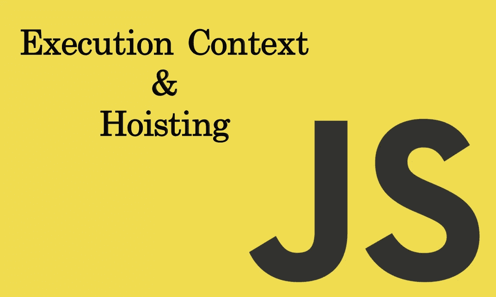
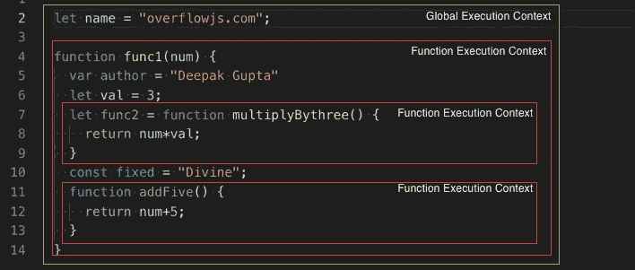
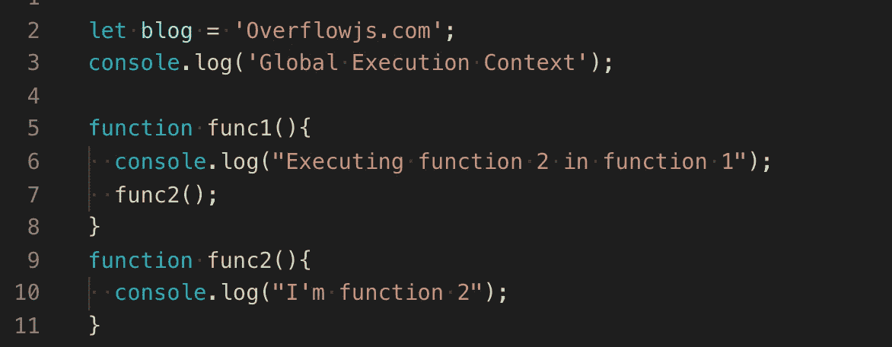
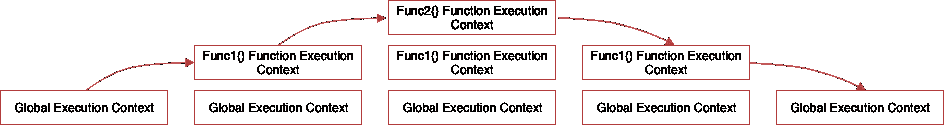
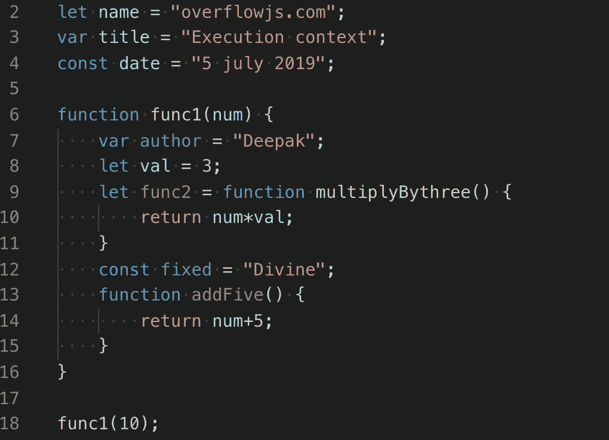

# Javascript 执行上下文和提升

> 原文：<https://towardsdatascience.com/javascript-execution-context-and-hoisting-c2cc4993e37d?source=collection_archive---------17----------------------->



这篇文章是写给那些不知道 JavaScript 是如何执行的人的。

先决条件:你应该知道

1.  [JavaScript 中的作用域](https://medium.com/@ideepak.jsd/still-confused-in-js-scopes-f7dae62c16ee?)
2.  [JavaScript 中的这个关键字](https://medium.com/@ideepak.jsd/javascript-context-this-keyword-9a78a19d5786?)
3.  [电脑中的堆栈](https://en.wikipedia.org/wiki/Stack_(abstract_data_type))

在我们开始之前，你能回答下面的问题吗？

## Javascript 是解释语言还是编译语言？

是的，Javascript (JS)是一种解释型语言，仍然有自己的编译器形式，运行在所谓的 Javascript 引擎中。

每个网络浏览器都有自己的 JavaScript 引擎形式，例如 Chrome 有 v8，Mozilla 有 spider monkey 等，尽管它们都有相同的目的。JavaScript 引擎只是将 JavaScript 源代码转换成编译器可以理解的语言，然后执行它。

那我们开始吧，

# 执行上下文

javascript 代码运行的环境构成了执行上下文。

执行上下文决定了哪段代码可以访问变量、函数、对象等。

如果你读过作用域的文章，那么你应该知道什么是全局作用域和局部作用域(函数作用域)。

类似地，执行上下文也有不同的类型—

## 1.全局执行上下文

每当代码第一次运行时，或者当代码不在任何函数中时，它就会进入全局执行上下文。在整个代码执行过程中，只有一个全局执行上下文。

在浏览器的情况下，全局执行上下文做两件事

1.  创建一个“窗口”对象。
2.  窗口对象引用了“this”关键字。

## 2.函数执行上下文

每当代码执行发现一个函数，它就创建一个新的函数执行上下文。可以有任意数量的函数执行上下文。



上面，全局执行上下文包含“name”变量和对“func1”的函数引用。而包含变量和函数引用三个函数执行上下文将被创建。文章中进一步解释了细节。

# 执行堆栈/调用堆栈

Javascript 在浏览器中一次只能运行一件事，这意味着它是单线程，所以它在所谓的执行堆栈中对其他动作、事件和函数进行排队。

每当浏览器加载脚本时，堆栈中的第一个元素是全局执行上下文。然而，当一个函数执行时，一个执行上下文被创建并虚拟地放置在全局执行上下文之上。一旦函数执行完毕，它就会从执行堆栈中弹出，并将控制权返回给它下面的上下文。

我们举个例子，把上面的形象化。



> 步骤 1:当上述代码加载到浏览器中时，Javascript 引擎创建一个全局执行上下文，并将其推送到当前执行堆栈中。
> 
> 步骤 2:假设最后我们调用了 func1()，然后 Javascript 引擎为该函数创建了一个新的执行上下文，并将其推到全局执行上下文的顶部
> 
> 步骤 3:在 func1()中，我们调用了 func2()，因此 Javascript 引擎为该函数创建了一个新的执行上下文，并将其推到 func1 执行上下文的顶部。
> 
> 第四步:当 func2()函数结束时，从当前堆栈中弹出它的执行上下文，控件到达它下面的执行上下文，也就是 func1()函数执行上下文。
> 
> 步骤 5:当 func1()完成时，它的执行堆栈被从堆栈中移除，控制到达全局执行上下文。一旦执行完所有代码，JavaScript 引擎就会从当前堆栈中删除全局执行上下文。

# 执行上下文阶段

执行上下文主要有两个阶段。

1.  创造
2.  执行

让我们一个一个来看看

## 创建阶段

在函数执行之前，这里会发生一些事情。

1.  首先，为每个函数或变量创建一个到外部环境的连接，这就形成了作用域链。这告诉执行上下文它应该包含什么，以及它应该在哪里寻找解析函数的引用和变量值。

*   对于全球环境来说，外部环境是零。然而，全球范围内的所有环境都以全球环境为其外部环境。
*   如果函数‘a’包含在函数‘b’中，那就意味着‘a’有一个外部环境‘b’。

2.在扫描作用域链之后，创建一个环境记录，其中全局上下文(将是 web 浏览器中的一个窗口)、变量、函数和函数参数的创建和引用是在内存中完成的。

3.最后，在第一步创建的每个执行上下文中确定“this”关键字的值(在全局执行上下文中，“this”指的是窗口)。

> 注意:如果你发现理解这个关键字行为有困难，那么我强烈推荐[这个](https://overflowjs.com/posts/This-keyword-In-Javascript-2019-Javascript-Context.html)。

因此，我们可以将创建阶段表示为

```
creationPhase = {
'outerEnvironmentConnection': {
        /* scope chain resolution*/ 
    },    
'variableObjectMapping': {
        /* function arguments, parameters, inner variable and function declarations are created or referenced in memory */ 
    },
    'valueOfThis': {},

}
```

## 执行阶段

在这个阶段，代码开始在创建阶段形成的执行上下文中运行，并逐行分配变量值。

当执行开始时，引擎在其创建阶段对象中寻找引用来执行该函数。如果它没有在自己的环境中找到它，它将继续沿着作用域链向上移动，直到到达全局环境。

如果在全局环境中没有找到引用，它将返回一个错误。但是，如果找到了引用并且正确执行了函数，则该特定函数的执行上下文将从堆栈中弹出，引擎将移动到下一个函数，它们的执行上下文将被添加到堆栈中并执行，依此类推。

让我们通过例子来看看上面的两个阶段，以便对它有一个更好的了解。



因此，在创建阶段，全局执行上下文将如下所示:

```
globalExecutionObj = {
    outerEnvironmentConnection: null,
    variableObjectMapping: {
        name: uninitialized,
        title: undefined,
        date: uninitialized,
        func1: func,
    },
    this: window //Global Object
}
```

> 注意:上面的`let`(名称)和`const`(日期)定义的变量在创建阶段没有任何关联的值，但是`var`(标题)定义的变量被设置为`undefined` 。

这就是为什么您可以在声明`var` 定义的变量之前访问它们(虽然是`undefined`)，但是在声明`let`和`const`变量之前访问它们时会得到一个引用错误。

这就是我们所说的提升，即所有使用`*var*`的变量声明都被提升到它们的函数/局部范围的顶部(如果在函数内声明)或全局范围的顶部(如果在函数外声明)，而不管实际声明是在哪里进行的。

在执行阶段，变量赋值已经完成。因此，在执行阶段，全局执行上下文看起来会像这样。

```
globalExectutionObj = {
    outerEnvironmentConnection: null,
    variableObjectMapping: {
        name: "overflowjs.com",
        title: "Execution context",
        date: "5 july 2019",
        func1: pointer to function func1,
    },
    this: window //Global Object
}
```

注意:在执行阶段，如果 JavaScript 引擎在源代码中声明变量`let`的实际位置找不到它的值，那么它将为它分配`undefined`的值。

现在，当到达“func1”时，将形成一个新的函数执行上下文，其创建对象如下所示

```
func1ExecutionObj = {
    outerEnvironmentConnection: Global,
    variableObjectMapping: {
       arguments: {
            0: 10,
            length: 1
        },
        num: 10,

        author: undefined,
        val: uninitialized,
        func2: undefined
        fixed: uninitialized
        addFive: pointer to function addFive()
    },
    this: Global Object or undefined
}
```

在执行阶段，

```
func1ExecutionObj = {
    outerEnvironmentConnection: Global,
    variableObjectMapping: {
       arguments: {
            0: 10,
            length: 1
        },
        num: 10,

        author: "Deepak",
        val: 3,
        func2: pointer to function func2() 
        fixed: "Divine"
        addFive: pointer to function addFive()
    },
    this: Global Object or undefined
}
```

在该函数完成其执行之后，全局环境被更新。然后全局代码完成，程序结束。

如果您想被添加到我的电子邮件列表中，请考虑在这里输入您的电子邮件地址 和**关注我的** [**medium**](https://medium.com/@ideepak.jsd) **阅读更多关于 javascript 的文章，并关注**[**github**](https://github.com/dg92)**查看我的疯狂代码**。如果有什么不清楚或者你想指出什么，请在下面评论。

你可能也会喜欢我的其他文章

1.  [Javascript —生成器-产出/下一个&异步-等待🤔](https://medium.com/datadriveninvestor/javascript-generator-yield-next-async-await-8442d2c77185)
2.  [Javascript 数据结构与映射、归约、过滤](https://levelup.gitconnected.com/write-beautiful-javascript-with-%CE%BB-fp-es6-350cd64ab5bf)
3.  [Javascript- Currying VS 部分应用](https://medium.com/datadriveninvestor/javascript-currying-vs-partial-application-4db5b2442be8)
4.  [Javascript ES6 —可迭代程序和迭代器](https://medium.com/datadriveninvestor/javascript-es6-iterables-and-iterators-de18b54f4d4)
5.  [Javascript —代理](https://medium.com/datadriveninvestor/why-to-use-javascript-proxy-5cdc69d943e3)

谢谢！