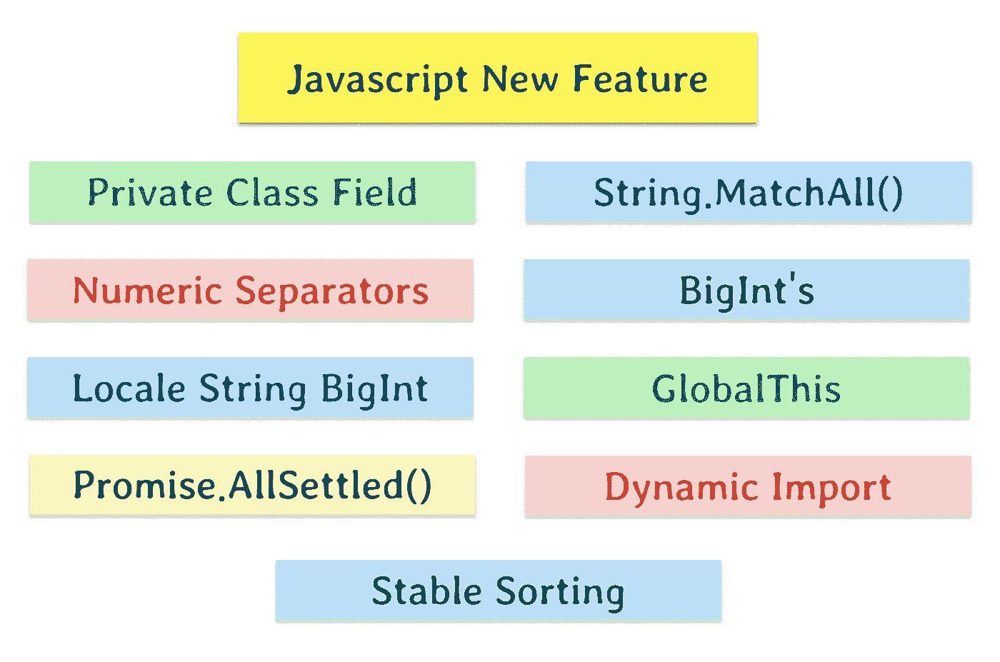
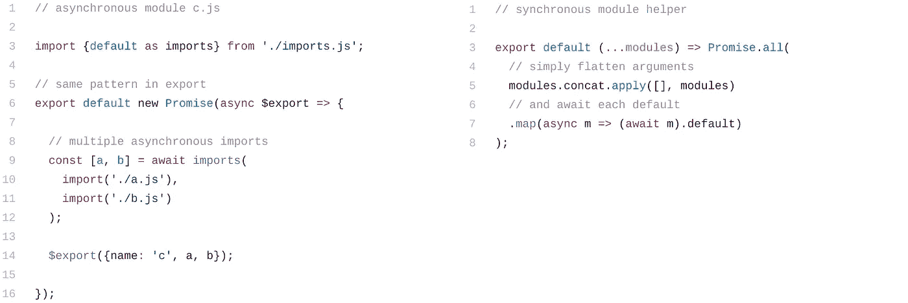

# Javascript 新特性

> 原文：<https://towardsdatascience.com/javascript-new-features-part-1-f1a4360466?source=collection_archive---------4----------------------->

## Javascript 已经从仅仅是一个 web 浏览器扩展到了编程的所有领域。



Private Class Field, String.matchAll(), Numeric Separators BigInt, Local String BigInt, GlobalThis, Promise.allSettled(), Dynamic Import

Javascript 已经从 web 浏览器扩展到所有编程领域。

1.  Node.js —用于 CLI 和服务器。
2.  电子—用于跨平台桌面应用。
3.  React native —用于跨平台移动应用。
4.  物联网——低成本物联网设备，现在支持 javascript。

最近对 v8 引擎的更新大大提高了性能。从节点版本 8 到节点版本 11，javascript 解析速度提高了 2 倍，promise on an 速度提高了 11 倍。内存消耗降低了 20%。因此在性能和可用性方面有所改进。

在本文中，我们将看到一些可以在 chrome 浏览器(版本≥76)或 Node.js(版本≥11) CLI 中测试的现有和预定功能。

# 私有类字段👇

直到 ES6，我们才能够直接声明`private`属性。是的，有像下划线约定(`_propertyName`)、[闭包、符号或 weak map](https://curiosity-driven.org/private-properties-in-javascript)这样的方式。

但是现在私有类字段使用哈希`#`前缀。让我们通过一个例子来学习它。

```
class Test { a = 1;          // .a is public
  #b = 2;         // .#b is private
  static #c = 3;  // .#c is private and static incB() {
    this.#b++;
  }}const testInstance = new Test();// runs OK
testInstance.incB();// error - private property cannot be modified outside class
testInstance.#b = 0;
```

> 注意:目前还没有办法定义私有函数，尽管一个 [TC39 第三阶段:草案提案](https://github.com/tc39/proposal-private-methods)建议在名字上使用散列前缀`*#*`。🤞

# String.matchAll()👇

如果我有一个字符串，带有一个包含许多捕获组的全局正则表达式，我经常想遍历所有的组。目前，我的选择如下:

1.  **string . prototype . match()with/g—**如果我们将`.match()`与一个设置了标志`/g`的正则表达式一起使用，您将在一个数组中获得它的所有完全匹配。
2.  **string . prototype . split()—**如果我们使用拆分字符串和正则表达式来指定分隔符，并且如果它包含至少一个捕获组，那么`.split()`返回子字符串交错的数组。

上述方法的问题在于，只有在正则表达式上设置了`/g`并且正则表达式的属性`.lastIndex`在每次匹配发生时都发生了变化的情况下，它们才有效。这使得在多个位置使用相同的正则表达式很危险。

matchAll() 有助于解决上述所有问题。让我们看看它的定义和用法

给定一个字符串和一个正则表达式，`.matchAll()`返回所有匹配一个*字符串*和一个*正则表达式*的结果，包括捕获组。

```
let regexp = /t(e)(st(\d?))/g;
let str = 'test1test2';let array = [...str.matchAll(regexp)];console.log(array[0]);
// expected output: Array ["test1", "e", "st1", "1"]
```

> 注意:`*.matchAll()*`返回一个迭代器，不是真正的可重启 iterable。也就是说，一旦结果用尽，就需要再次调用方法并创建一个新的迭代器。

# 数字分隔符👇

如果你很难读懂一长串数字，这就是你搜索的终点。

数字分隔符允许人眼快速解析，尤其是当有大量重复数字时:

```
1000000000000 -> 1_000_000_000_000
1019436871.42 -> 1_019_436_871.42
```

现在更容易分辨第一个数字是万亿，第二个数字是 10 亿量级。

它也适用于其他基础，例如:

```
**const** fileSystemPermission = 0b111_111_000;
**const** bytes = 0b1111_10101011_11110000_00001101;
**const** words = 0xFAB_F00D;
```

您也可以在分数和指数中使用分隔符:

```
**const** massOfElectronInKg = 9.109_383_56e-31;
**const** trillionInShortScale = 1e1_2;
```

> 注意:解析由`*_*`分隔的整数可能有些棘手，因为`*Number('123_456')*`给出 NAN，而`*parseInt('123_456')*`给出`*123*`。

# BigInt 的👇

`BigInts`是 JavaScript 中一个新的数字原语，可以表示精度大于 2⁵-1 的整数。有了`BigInts`，你可以安全地存储和操作大整数，甚至超过`Numbers`的安全整数限制。

`BigInts`正确执行整数运算，不溢出。让我们通过一个例子来理解:-

```
const max = Number.MAX_SAFE_INTEGER;
// 9007199254740991
max+1;
// 9007199254740992
max+2;
// 9007199254740991
```

我们可以看到`max + 1`产生的结果与`max + 2`相同。

对超出安全整数范围(即从`Number.MIN_SAFE_INTEGER`到`Number.MAX_SAFE_INTEGER`的整数)的任何计算都可能会失去精度。为此，我们只能依赖安全范围内的数字整数值。

于是，`BigInts`应运而生，`BigInts`可以通过在任意整数文字上加上`n`后缀来创建。例如，`123`变成`123n`或者全局`BigInt(number)`功能可以用来将`Number`转换成`BigInts.`

让我们用`BigInt` s 重新看看上面的例子

```
BigInt(Number.MAX_SAFE_INTEGER) + 2n;
// 9007199254740993ntypeof 123n
// "bigint2"
```

> 注意:数字分隔符对 BigInts 特别有用，例如:
> 
> `***const*** *massOfEarthInKg = 6_000_000_000_000_000_000_000_000n;*`

`BigInts`支持最常用的运算符。二进制`+`、`-`、`*`、`**`都按预期工作。`/`和`%`工作，根据需要向零方向舍入。

```
(7 + 6 - 5) * 4 ** 3 / 2 % 3;
// → 1
(7n + 6n - 5n) * 4n ** 3n / 2n % 3n;
// → 1n
```

> 注意:一个问题是不允许在`*BigInts*`和`*Numbers*`之间混合操作

# 带 BigInt 的区域设置字符串👇

`**toLocaleString()**`方法返回一个带有 BigInt 的语言敏感表示的字符串。

```
let bigint = 123456789123456789n;// German uses period for thousands
console.log(bigint.toLocaleString('de-DE'));
// → 123.456.789.123.456.789// Arabic in most Arabic speaking countries uses Eastern Arabic digits
console.log(bigint.toLocaleString('ar-EG'));
// → ١٢٣٬٤٥٦٬٧٨٩٬١٢٣٬٤٥٦٬٧٨٩// India uses thousands/lakh/crore separators
console.log(bigint.toLocaleString('en-IN'));
// → 1,23,45,67,89,12,34,56,789// the nu extension key requests a numbering system, e.g. Chinese decimal
console.log(bigint.toLocaleString('zh-Hans-CN-u-nu-hanidec'));
// → 一二三,四五六,七八九,一二三,四五六,七八九// when requesting a language that may not be supported, such as
// Balinese, include a fallback language, in this case Indonesian
console.log(bigint.toLocaleString(['ban', 'id']));
// → 123.456.789.123.456.789
```

# globalThis 关键字👇

JavaScript 的变量作用域是嵌套的，形成一棵树，它的根是全局作用域，`this`关键字的值是对“拥有”当前正在执行的代码或函数的对象的引用。

要了解更多关于这个关键字和全球范围的信息，请阅读我下面的文章

> [Javascript 中的作用域](https://medium.com/datadriveninvestor/still-confused-in-js-scopes-f7dae62c16ee)
> 
> [理解 Javascript“this”关键字(上下文)](https://medium.com/datadriveninvestor/javascript-context-this-keyword-9a78a19d5786)

通常我们用一个函数来计算全局，比如

```
const getGlobalThis = () => {

  // in webworker or service worker
  if (typeof self !== 'undefined') return self;

  // in browser 
  if (typeof window !== 'undefined') return window;

  // in Node.js
  if (typeof global !== 'undefined') return global;

  // Standalone javascript shell
  if (typeof this !== 'undefined') return this;

  throw new Error('Unable to locate global object');
};const theGlobalThis = getGlobalThis();
```

上面的函数并没有涵盖我们需要全局这个值时的所有情况。

1.  在`use strict`的情况下，该值为`undefined`
2.  当我们在 javascript 中形成一个包时，它通常被一些可能与全局不同的代码所包裹。
3.  在独立的 javascript 引擎外壳环境中，上述代码将不起作用

为了解决上述问题，引入了关键字`globalThis`,它可以在任何时候任何环境下返回全局对象。

> 注意:由于向后兼容性，全局对象现在被认为是 JavaScript 无法摆脱的错误。它会对性能产生负面影响，并且通常会引起混淆。

# Promise.allSettled()👇

如果你想知道 javascript 中的承诺是什么，那么看看这个— [JavaScript 承诺:介绍](https://developers.google.com/web/fundamentals/primers/promises)。

有一点要点，承诺是 JavaScript 向您承诺工作将会完成(或者如果工作无法完成可能会失败)的方式。

新方法返回一个承诺，该承诺在所有给定承诺都已解决(即解决或拒绝)后解决，并带有一个对象数组，每个对象描述每个承诺的结果。

```
const promise1 = Promise.resolve(3);
const promise2 = new Promise((resolve, reject) => setTimeout(reject, 100, 'foo'));
const promises = [promise1, promise2];Promise.allSettled(promises).
  then((results) => results.forEach((result) => console.log(result.status)));// expected output:
// "fulfilled"
// "rejected"
```

这与`Promise.all`不同，因为一旦 iterable 对象中的承诺被拒绝，它就会拒绝。

下面是当前支持的承诺方法的比较

# 动态导入👇



Static vs Dynamic Import

这个很疯狂在我们深入之前，我们先来看看什么是静态导入。

静态导入只接受字符串作为模块说明符，并通过运行前“链接”过程将绑定引入局部范围。

静态的`import`语法只能在文件的顶层使用。

```
import * as module from './utils.mjs';
```

静态`import`支持重要的用例，比如静态分析、捆绑工具和树抖动。

但是关于什么

*   按需(或有条件地)导入模块
*   在运行时计算模块说明符
*   从常规脚本中导入模块(与模块相对)

这是不可能的，直到**动态导入** — `import(moduleSpecifier)`为所请求模块的模块名称空间对象返回一个承诺，这是在获取、实例化和评估模块的所有依赖项以及模块本身之后创建的。

```
<script type="module">
  (async () => {
    const moduleSpecifier = './utils.mjs';
    const module = await import(moduleSpecifier)
    module.default();
    // → logs 'Hi from the default export!'
    module.doStuff();
    // → logs 'Doing stuff…'
  })();
</script>
```

> 注意:使用静态的`*import*`作为初始的绘制依赖，特别是对于折叠内容。在其他情况下，考虑用动态`*import()*`按需加载依赖项。

# 稳定的分类—(现在获得一致可靠的结果)👇

在[算法意义上的稳定](https://en.wikipedia.org/wiki/Sorting_algorithm#Stability)是指:*它是否保持顺序或者“相等”的项目*？

让我们通过一个例子来理解

```
const people = [
  {name: 'Gary', age: 20},
  {name: 'Ann', age: 20},
  {name: 'Bob', age: 17},
  {name: 'Sue', age: 21},
  {name: 'Sam', age: 17},
];// Sort people by name
people.sort( (p1, p2) => {
  if (p1.name < p2.name) return -1;
  if (p1.name > p2.name) return 1;
  return 0;
});console.log(people.map(p => p.name));
// ['Ann', 'Bob', 'Gary', 'Sam', 'Sue']// Re-sort people by age
people.sort( (p1, p2) => {
  if (p1.age < p2.age) return -1;
  if (p1.age > p2.age) return 1;
  return 0;
});console.log(people.map(p => p.name));
// We're expecting people sorted by age, then by name within age group:
// ['Bob', 'Sam', 'Ann', 'Gary', 'Sue']// But we might get any of these instead, depending on the browser:
// ['Sam', 'Bob', 'Ann', 'Gary', 'Sue']
// ['Bob', 'Sam', 'Gary', 'Ann', 'Sue']
// ['Sam', 'Bob', 'Gary', 'Ann', 'Sue']
```

如果你得到的是最后三个结果中的一个，那么你可能正在使用 Google Chrome，或者可能是没有实现 Array.sort()作为“稳定”算法的各种浏览器中的一个。

这是因为不同的 JS 引擎(跨不同的浏览器)采用不同的路线来实现排序，另外，一些 javascript 引擎对短数组使用稳定排序，而对长数组使用不稳定排序。

这导致不一致的排序稳定性行为和许多混乱。这就是为什么在开发环境中，与排序相关的一切似乎都可以工作，但在生产环境中，由于测试排序的阵列大小不同，我们开始看到其他情况。

> 注意:有第三方库，我强烈推荐 [Lodash](https://lodash.com/) ，它有稳定的排序

但是现在这个问题已经解决了，我们在大多数浏览器上都有一个稳定的排序。语法保持不变。

由于这篇文章有很多需要消化和测试的特性，我们将在下一篇文章中继续介绍更多的新特性。

如果您想加入我的电子邮件列表，请考虑在这里输入您的电子邮件地址[](https://goo.gl/forms/MOPINWoY7q1f1APu2)****关注我在**[**medium**](https://medium.com/@ideepak.jsd)**上阅读更多关于 javascript 的文章，在**[**github**](https://github.com/dg92)**上查看我的疯狂代码**。如果有什么不清楚或者你想指出什么，请在下面评论。**

**你可能也会喜欢我的其他文章**

1.  **[VS Web 开发生产力的代码扩展](https://medium.com/better-programming/vs-code-extension-for-web-dev-productivity-fa541654161f)**
2.  **[Javascript 执行上下文和提升](https://levelup.gitconnected.com/javascript-execution-context-and-hoisting-c2cc4993e37d)**
3.  **[Javascript —生成器-产出/下一个&异步-等待🤔](https://medium.com/datadriveninvestor/javascript-generator-yield-next-async-await-8442d2c77185)**
4.  **[理解 Javascript 'this '关键字(上下文)](https://medium.com/datadriveninvestor/javascript-context-this-keyword-9a78a19d5786)。**
5.  **[Javascript 数据结构与映射、归约、过滤](https://levelup.gitconnected.com/write-beautiful-javascript-with-%CE%BB-fp-es6-350cd64ab5bf)**
6.  **[Javascript- Currying VS 部分应用](https://medium.com/datadriveninvestor/javascript-currying-vs-partial-application-4db5b2442be8)**
7.  **[Javascript ES6 —可迭代程序和迭代器](https://medium.com/datadriveninvestor/javascript-es6-iterables-and-iterators-de18b54f4d4)**
8.  **[Javascript —代理](https://medium.com/datadriveninvestor/why-to-use-javascript-proxy-5cdc69d943e3)**
9.  **[Javascript —作用域](https://medium.com/datadriveninvestor/still-confused-in-js-scopes-f7dae62c16ee)**

# **如果你喜欢这篇文章，请随意分享，以帮助他人找到它！**

# ****谢谢！****