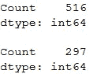
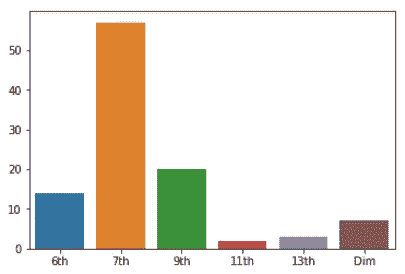

# 爵士&波沙·诺瓦:兄弟姐妹(？)

> 原文：<https://towardsdatascience.com/jazz-bossa-nova-c6c5fae5edb4?source=collection_archive---------19----------------------->

## Python 研究


Frank Sinatra & Tom Jobim in a studio recording in 1967\. Photo: Warner Bros

在巴西音乐学的背景下，人们普遍认为爵士乐和波萨诺瓦有许多相似之处，但不清楚谁影响了谁，以及如何影响的。尽管有些人凭直觉认为，仅仅断言爵士乐受到了波萨诺瓦的影响是不正确的，尽管爵士乐以前就“诞生”了。相反，这两种风格相互影响。60 年代末，汤姆·乔宾在巴西以外的地方获得巨大成功，这使得他与弗兰克·辛纳特拉合作录制了一张专辑，这一点尤其正确。光是他对爵士乐的影响就很大，更不用说其他音乐家，如塞尔吉奥·门德斯、路易斯·邦法和若昂·吉尔伯托，他们都和美国爵士乐手一起录制过专辑。

这项研究的目的是用 Python 可视化和理解波沙·诺瓦和爵士乐和弦的相似性。我将使用网络抓取——一种数据提取技术，通过网站的 *html* 代码“抓取”网站内容——收集流行爵士乐和波萨诺瓦歌曲的和弦。为此，我将使用网站 [CifraClub](http://www.cifraclub.com.br) ，这是一个巴西和弦网站，其中包含波萨诺瓦和爵士歌曲。

***也就是说，这项研究仅基于一个地点，因此结论可能会有偏差。理想情况下，这项研究应该在多个地点进行。**

> 完整的代码可以在 github gist 的文章末尾找到。
> 
> 这项研究直接影响了莱昂纳多·塞尔的工作，可以在他的网站上找到[https://leosalesblog.wordpress.com/](https://leosalesblog.wordpress.com/)
> 
> 如果你对如何进行网络搜集有任何疑问，我建议你事先了解网络搜集是如何工作的，因为这项研究的目的不是解释网络搜集，而是将它作为一种工具来使用。

# 问题

这项研究将试图回答以下问题:

1.  每个流派中最常见的和弦有哪些？
2.  每个流派有多少种不同的和弦？
3.  有哪些和弦在爵士乐中出现的多，在波萨诺瓦中出现的少？反之亦然？
4.  爵士乐和波沙·诺瓦有哪些共同的和弦？

# **1。导入库**

首先 *st* off，让我们导入所需的库: *Matplotlib* 和 *Seaborn* 将被导入用于数据可视化；*熊猫*，用于数据分析*；Bs4* 和*请求*，进行网页抓取。

```
import matplotlib.pyplot as plt
import seaborn as snsimport pandas as pdimport requests
from bs4 import BeautifulSoup
```

# **2。网页抓取**

既然库已经被导入，我们将从和弦站点抓取哪些歌曲，以及我们如何创建一个一次抓取许多歌曲的机制？

幸运的是，该网站有一个“点击率最高”的页面，上面有每个流派的 100 首点击率最高的歌曲。在每一个流派中，100 首歌曲中的每一首都有一个链接，链接到一个带有和弦的页面。这太完美了。我们需要做的只是在 bossa nova 和 jazz 页面中抓取 100 个 URL，然后为 200 首歌曲中的每一首抓取和弦。

```
url_list = []
genres = ['bossa-nova','jazz']
for genre in genres:
    url = 'https://www.cifraclub.com.br/mais-acessadas/'+genre+'/'
    site = requests.get(url)
    soup = BeautifulSoup(site.text) songs = soup.find('ol',{'id':'js-sng_list'})
    for link in songs.find_all('a'):
        links = link.get('href')
        url_list.append('http://www.cifraclub.com.br'+links)
```

有了这段 Python 代码，我们现在有了一个包含 200 个链接的列表——前半部分包含 100 首最常访问的 bossa nova 歌曲，后半部分包含 100 首最常访问的爵士乐歌曲。

现在，让我们从每首歌里刮出和弦。这类似于我们之前所做的，除了现在我们感兴趣的是和弦的文本，而不是链接。

```
all_chords = []genres_urls = [url_list[0:99],url_list[100:198]]
for genre_urls in genres_urls:
    chords_list = []
    genre_chords = []
    for url in genre_urls:
        site = requests.get(url)
        soup = BeautifulSoup(site.text) chords_raw = soup.find('pre')
        for chords in chords_raw.find_all('b'):
            chord = str(chords).strip('<>b/')
            chord = chord.replace('-','m').replace('<b>','').replace('</b>','').replace('/','') #Continue next line
            chord = chord.replace('(','').replace(')','').replace('+','M').replace('dim','°').replace('maj','M')
            chords_list.append(chord)
    genre_chords.append(chords_list)
    all_chords.append(genre_chords)
```

`all_chords`是一个列表的列表，其中 100 首波萨诺瓦歌曲中的所有和弦作为其第一元素，100 首爵士歌曲中的所有和弦作为其第二元素。

我还标准化了符号，去掉了任何可能来自于 *html 的`<b>`或`</b>` 。此外，我已经删除了括号和斜线，并将加号和减号改为“M”和“M”，因此该算法将 A7/9 和 A7(9)，以及 D7+和 D7M 视为同一事物。*

我在这里遇到了一个小问题，因为，不知道什么原因，200 个 URL 中有 1 个指向了一个没有和弦的页面，而是一个吉他软件文件。因为这只是一个网址，我决定删除它。那是第 200 首歌，所以我就把 `*url_list[100:199]*` *改成了* `*url_list[100:198]*` *。*

# 3.制作 Python 词典

现在我们已经收集并标准化了这两种风格中每首歌的每个和弦，让我们看看每个和弦出现了多少次。

```
def freq_chords(chords_list):
    dic = {}
    count = 0
    for unique_chord in [chords for chords in set(chords_list)]:
        for total_chords in chords_list:
            if unique_chord==total_chords:
                count += 1
        dic[unique_chord]=count
        count=0
    return dicbossa_dic = freq_chords(all_chords[0][0])
jazz_dic = freq_chords(all_chords[1][0])
```

# 4.熊猫数据框

现在，让我们把每本字典变成熊猫的数据框架。为了美观起见，我将“出现次数”列重命名为“计数”。

```
bossa_df = pd.DataFrame.from_dict(bossa_dic,orient='index')
bossa_df.columns = ['Count']
jazz_df = pd.DataFrame.from_dict(jazz_dic,orient='index')
jazz_df.columns = ['Count']
```

# 5.数据分析

现在，让我们来回答帖子开头的问题。

> 每个流派中最常见的和弦有哪些？

```
bossa_df.sort_values(by='Count',ascending=False,inplace=True)
jazz_df.sort_values(by='Count',ascending=False,inplace=True)f, axes = plt.subplots(1,2,sharey=True,figsize=(10,5))
ax1 = sns.barplot(x=bossa_df[:10].index,y=bossa_df[:10].Count,ax=axes[0])
ax1.set_title('Bossa Nova')
ax2 = sns.barplot(x=jazz_df[:10].index,y=jazz_df[:10].Count,ax=axes[1])
ax2.set_title('Jazz')for ax in f.axes:
    plt.sca(ax)
    plt.xticks(rotation=90)
plt.show()
```


Most common chords in each genre

***洞察 1)*** 我们可以看到，波沙·诺瓦最常见的和弦是小七和弦。在爵士乐中，它们大多是自然大和弦；

***洞察 2)*** 再者，爵士乐中最常见的和弦出现频率几乎是波沙·诺瓦最常见和弦的两倍；

> 每个流派有多少种不同的和弦？

```
print(bossa_df.count())
print()
print(jazz_df.count())
```



```
print(bossa_df.std())
print()
print(jazz_df.std())
```


***洞察 3)*** 波沙·诺瓦的歌曲比爵士歌曲有更多的和弦；

***洞察 4)*** 爵士和弦有大得多的标准差。这是因为有些和弦在爵士乐中出现得如此频繁——爵士乐中最常见的和弦几乎是波沙·诺瓦和弦的两倍——以至于其他和弦的出现偏离平均值更多；

> 有哪些和弦在爵士乐中出现的多，在波萨诺瓦中出现的少？反之亦然？

让我们创建一个新的数据帧，它将是 bossa nova 和弦出现和 jazz 和弦出现之间的差异。我们将放弃任何 NA 值，因为它们代表了只存在于一个流派中的和弦。

```
dif_df = bossa_df - jazz_df
dif_df.columns = ['Difference']
dif_df.sort_values(by='Difference',inplace=True)dif_df = dif_df.dropna()
```

我们现在在数据框中有一列，它告诉我们一个和弦在波沙·诺瓦比在爵士乐中更频繁。越接近 0，它们在两种类型中出现的次数就越多。

```
f, axes = plt.subplots(1,2,figsize=(10,5),sharey=True)
sns.barplot(dif_df[171:].index,dif_df[171:].Difference,ax=axes[1])
sns.barplot(dif_df[:10].index,dif_df[:10].Difference,ax=axes[0])
for ax in axes:
    plt.sca(ax)
    plt.xticks(rotation=90)
```


这里我们有顶部和底部的 10 个和弦。左边的图表告诉我们什么和弦在爵士乐中出现得最多，在波沙·诺瓦中出现得最少。在右边，我们有相反的情况。

***洞察 5)*** 爵士乐不仅本身使用了更多的自然和弦，而且比波沙·诺瓦还多了很多。

***顿悟 6)*** 波沙·诺瓦几乎从不使用自然小调和弦，而是更喜欢总是加入一个扩展音(第七、第九等。).

> 爵士乐和波沙·诺瓦有哪些共同的和弦？

我将规定一个 10 次出现的容限，也就是说，一个和弦在爵士乐或波沙·诺瓦音乐中最多只能出现 10 次。

```
common = dif_df[dif_df[‘Difference’].isin(range(-10,10))]
```

所以，符合这个条件的和弦数量相当多。数据帧有 107 行(歌曲)，所以我们需要找到一种方法来过滤或分类这些和弦。

我们试着把它们分成 6，7，9，11，13，减和弦的和弦，通过这个镜头看数据。

```
contains6 = common[common.index.str.contains('6')]
contains7 = common[common.index.str.contains('7')]
contains9 = common[common.index.str.contains('9')]
contains11 = common[common.index.str.contains('11')]
contains13 = common[common.index.str.contains('13')]
containsdim = common[common.index.str.contains('°')]
```

我现在将把每个扩展和弦的出现次数加起来(第六，第七，等等。).请记住，一个和弦，比如 G7/9，会同时出现在“第七”和“第九”中。

```
sns.barplot(x=['6th','7th','9th','11th','13th','Dim'],
            y=[len(contains6),len(contains7),len(contains9),len(contains11),len(contains13),len(containsdim)])
```



7) 七度是爵士和波沙·诺瓦共有的和弦中最频繁的延伸。

倒置呢？这些和弦中有多少是转位和弦？

```
inversions = []
for i in range(0,len(common)):
    for letter in ['A','B','C','D','E','F','G']:
        if common.iloc[i].name.find(letter)!=-1:
            for letter2 in ['A','B','C','D','E','F','G']:
                if common.iloc[i].name.find(letter2)!=-1:
                    if letter != letter2:
                        if common.iloc[i].name not in inversions:
                            inversions.append(common.iloc[i].name)
```

让我们再画一次图，加上反转。

```
sns.barplot(x=['6th','7th','9th','11th','13th','Dim','Inv.'],
            y=[len(contains6),len(contains7),len(contains9),len(contains11),len(contains13),len(containsdim),len(inversions)])
```


***洞察 8)*** 爵士和波沙·诺瓦都很喜欢倒装！

# 结论

尽管这两个流派都以复杂的和声著称，但显然波萨诺瓦似乎不仅有更多的和弦，而且有更多的和弦延伸。我怀疑这是否意味着波萨诺瓦在和声上更复杂，至少不明显。我敢打赌，爵士乐中的和弦名称不像波萨诺瓦那样确定。你可以随意玩 D7 或 D7/9 来代替 D；作曲家不会命令你选择哪一首。如果是真的，这是有意义的，因为爵士乐有很强的即兴成分，而这在波萨诺瓦并不存在。此外，当在 G 和 G9 或 G7/13 之间选择时，波萨诺瓦的作曲家显然倾向于拒绝一个普通的 G。在波萨诺瓦的所有扩展中，小调第七显然是最受欢迎的，而普通的小调和弦非常不受欢迎。如果你玩的是 Am，而不是 Am7，听起来很可能会很奇怪。在博萨诺瓦，小调七度和预期的一样普遍。最后，转位在爵士乐和波萨诺瓦中都非常流行。他们非常适合为一个和弦做不同的展示。D 和 D/F#本质上是相同的，但“听”的方式不同。这对两种流派都很有用，它们都在寻找重新诠释和弦的方法。

> 整个代码