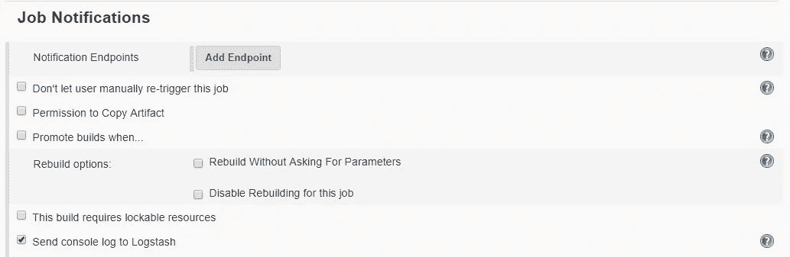

# Jenkins 事件、日志和指标

> 原文：<https://towardsdatascience.com/jenkins-events-logs-and-metrics-7c3e8b28962b?source=collection_archive---------4----------------------->

如何收集关于 Jenkins 的信息以进行分析和数据可视化


如果您支持一个相当大的 Jenkins 实例，或者您支持大量的实例，您可能已经面临一个性能问题。像许多持续集成(CI)应用程序一样，Jenkins 在小范围内工作得很好，但如果没有适当的照顾和喂养，可能会严重退化。本文将展示几个例子，说明如何导出 Jenkins 事件、日志和指标，以帮助发现改进的机会。


## Jenkins 应用指标

Jenkins Prometheus 插件在 Jenkins 中公开了一个 Prometheus 端点，允许 Prometheus 收集 Jenkins 应用程序指标。该插件实际上只是对[指标插件](https://wiki.jenkins.io/display/JENKINS/Metrics+Plugin)的包装，通过 REST 端点公开 JVM 指标，该端点以 Prometheus 可以理解的格式返回数据。除了 JVM 信息之外，该插件还公开了关于作业队列、执行器数量的信息，以及其他特定于 Jenkins 的信息。[指标插件](https://wiki.jenkins.io/display/JENKINS/Metrics+Plugin)提供了一个通过端点公开的指标列表。

一旦 Prometheus 插件安装在 Jenkins 中，它所公开的数据可以通过“管理 Jenkins”页面进行配置:


Manage Jenkins -> Configure System -> Prometheus plugin

Prometheus 插件优于大多数其他 metrics 插件，因为它比许多其他插件返回更多的系统信息。如果你需要将数据发送到不同的目的地，你可以使用其中一个[普罗米修斯导出器](https://prometheus.io/docs/instrumenting/exporters/)。如果普罗米修斯绝对不是一个选项，但是，有几个替代方案。一个替代方案是[Jenkins Metrics Graphite Reporting](https://plugins.jenkins.io/metrics-graphite)插件。这个插件导出的数据远比 Prometheus 插件有限，但它允许您获得关于执行程序计数和 HTTP 响应统计的基本信息。

与 Prometheus pull 模型不同，Graphite 插件将数据推送到任何能够接受 Graphite 消息的服务器。例如，您可以配置 [InfluxDB Graphite 插件](https://docs.influxdata.com/influxdb/v1.7/supported_protocols/graphite/)并将指标直接发送到 InfluxDB。或者您可以配置 Logstash Graphite 输入插件并将指标发送到 Logstash 支持的任何输出位置。


如果您管理大量的 Jenkins 实例，通过 UI 配置这些设置可能会很繁琐。在这种情况下，可以使用 Jenkins REST API 向每个实例提交一个 Groovy 脚本:

```
curl -v -d "script=$(cat /tmp/script.groovy)" --user username:ApiToken [http://jenkins01.yourcompany.com:8080/scriptText](http://jenkins01.yourcompany.com:8080/scriptText)
```

下面显示的 Groovy 代码提供了一个如何配置 Jenkins Metrics Graphite 插件向外部系统发送数据的例子。

```
import jenkins.metrics.impl.graphite.GraphiteServer;
import jenkins.metrics.impl.graphite.PluginImpl;
import jenkins.model.*;
import org.codehaus.groovy.runtime.InvokerHelper;// Construct an object to represent the Graphite server
String prefix = "jenkins";
String hostname = "graphite.yourcompany.com";
int port = 2003;
GraphiteServer server = new GraphiteServer(hostname, port, prefix);
List<GraphiteServer> servers = new ArrayList<GraphiteServer>();
servers.add(server);
GraphiteServer.DescriptorImpl descriptor = 
Jenkins.getInstance().getDescriptorByType(GraphiteServer.DescriptorImpl.class);
descriptor.setServers(servers);
```


## 詹金斯事件

Jenkins Statistics Gatherer 插件可用于将每个事件的 JSON 消息发送到外部 REST 端点。其中一个应用是将消息发送到 Elasticsearch，以便在 Kibana web 界面中可视化。Jenkins 事件对应于 Jenkins 主服务器上发生的操作，例如:

*   项目创建(创建、删除或更新作业时)
*   作业执行(当构建开始和完成时)
*   作业步骤执行(当作业中的每个步骤开始和结束时)
*   作业队列(当作业进入或改变作业队列中的状态时)
*   SCM 签出(当作业从源代码管理中签出文件时)

有很多方法可以将事件发布到 Elasticsearch。一些受欢迎的选项包括:

*   [*Logstash HTTP 输入插件*](https://www.elastic.co/guide/en/logstash/current/plugins-inputs-http.html)`->`*log stash elastic search 输出插件*
*   FluentD HTTP 输入插件`->` FluentD Elasticsearch 输出插件
*   汇合休息代理`->`卡夫卡`->` Logstash 卡夫卡输入插件`->` Logstash Elasticsearch 输出插件

为了简单起见，本文将坚持使用 Elasticsearch 产品，并假设使用 Logstash 作为将事件接收到 Elasticsearch 中的方法。无论您选择哪种解决方案，过程本质上都是一样的。

一旦在 Jenkins 中安装了 Statistics Gatherer 插件，就可以将其配置为通过 Jenkins UI 发送消息:


Manage Jenkins -> Configure System -> Statistics Gatherer

上面的屏幕截图显示了如何配置 Statistics Gatherer 插件，以将 HTTP 消息发送到在`[http://logstash.yourcompany.com/](http://logstash.yourcompany.com/)`监听的 Logstash HTTP 输入插件。

***重要提示:***

*   *启用 HTTP 发布？为了发送消息，必须选择*”选项。此选项仅在点击此配置部分中的“*高级…* ”按钮时可见。
*   末尾的`/jenkins-<msg>/`路径是可选的，但是可以通过允许在`request_path`信息上定义 Logstash 过滤器来帮助提供关于哪个 Jenkins 事件类型被提交的一些附加信息。
*   发布工件的构建可以为每个工件生成唯一的 JSON 字段，这可能超过 Elasticsearch 索引所允许的字段数量。要避免这种情况，请使用 Logstash 过滤器去除任何不需要的字段:

```
filter {
    mutate {
        remove_field => [ "[build][artifacts]" ]
    }
}
```

如前所述，Jenkins 脚本控制台或 REST 端点可用于自动化插件的配置。Groovy 脚本的内容如下所示:

```
import org.jenkins.plugins.statistics.gatherer.StatisticsConfiguration;
import jenkins.model.*;String baseUrl = "http://logstash.yourcompany.com";StatisticsConfiguration descriptor = Jenkins.getInstance()
    .getDescriptorByType(StatisticsConfiguration.class);descriptor.setQueueUrl("[${baseUrl}/jenkins-queue/](http://logstash.yourcompany.com/jenkins-queue/)");
descriptor.setBuildUrl("[${baseUrl}](http://logstash.yourcompany.com/jenkins-queue/)[/jenkins-build/](http://logstash.yourcompany.com/jenkins-build/)");
descriptor.setProjectUrl("[${baseUrl}](http://logstash.yourcompany.com/jenkins-queue/)[/jenkins-project/](http://logstash.yourcompany.com/jenkins-project/)");
descriptor.setBuildStepUrl("[${baseUrl}](http://logstash.yourcompany.com/jenkins-queue/)[/jenkins-step/](http://logstash.yourcompany.com/jenkins-step/)");
descriptor.setScmCheckoutUrl("[${baseUrl}](http://logstash.yourcompany.com/jenkins-queue/)[/jenkins-scm/](http://logstash.yourcompany.com/jenkins-scm/)");descriptor.setQueueInfo(Boolean.TRUE);
descriptor.setBuildInfo(Boolean.TRUE);
descriptor.setProjectInfo(Boolean.TRUE);
descriptor.setBuildStepInfo(Boolean.TRUE);
descriptor.setScmCheckoutInfo(Boolean.TRUE);descriptor.setShouldSendApiHttpRequests(Boolean.TRUE);
```

在这个过程的最后，您应该在 Elasticsearch 中拥有一个 Jenkins 事件消息的集合，然后可以在 Kibana 可视化和仪表板中使用它来做出关于构建性能、失败率或各种其他问题的明智决策。


Kibana Search = type: build AND jobName: rest_open AND result: SUCCESS

## Jenkins 应用程序日志

Jenkins 主进程和从进程在文件系统上生成应用程序日志。这些日志包含有关 Jenkins 流程的信息，有助于识别通过用户界面不易识别的问题。通过将这些日志发送到 Elasticsearch，可以使用 Kibana web 界面对信息进行索引和模式搜索。日志的每一行都成为 Elasticsearch 中的一条 JSON 记录。

将应用程序日志内容传送到 Elasticsearch 的最简单方法是使用 Filebeat，这是一个由 Elastic 提供的日志传送程序。Filebeat 可以配置为使用任意数量的日志，并将它们发送到 Elasticsearch、Logstash 或其他几个输出通道。我建议将日志发送到 Logstash，这样就可以应用适当的 Logstash 过滤器将这些行解析成 JSON 字段。这对于 HTTP 访问日志特别有用，因为它使用可预测的日志记录格式。例如，Logstash 中的`COMBINEDAPACHELOG` grok 过滤器可用于将访问日志条目解析成结构化的 JSON 数据。

下图显示了 Kibana 的“Discover”界面，该界面对于搜索日志条目非常有用。示例演示了如何过滤主机名与`cdptestjml01`匹配并且日志行包含单词`docker`的所有 Jenkins 日志:

```
filebeat.host.name: cdptestjml01 
AND filebeat.source: jenkins 
AND message: docker
```


Kibana Discover Screen

在最新的 Kibana 6.5.x 版本中，增加了一个“日志”视图，它允许你有一个类似于你在命令提示符下运行`tail -f`命令得到的视图的日志流视图:


Kibana Logs Screen

## Jenkins 构建日志

与应用程序日志类似，每个 Jenkins 作业都会生成一个控制台日志。这些也可以运到 Elasticsearch。这可以在 Jenkins master 上使用 Filebeat 来完成，或者根据你的需要使用 [Logstash Jenkins 插件](https://plugins.jenkins.io/logstash)来完成。使用 Filebeat 类似于上面所描述的，所以为了便于说明，我将在这里介绍 Logstash Jenkins 插件。

一旦安装，插件必须配置为指向中央服务器。有几种“索引器类型”可供选择。此示例显示了 SYSLOG 索引器类型的使用。这还需要 Logstash 服务器启用一个 [syslog 输入插件](https://www.elastic.co/guide/en/logstash/current/plugins-inputs-syslog.html)，这样它就可以接收 syslog 消息，如此处所示。


Manage Jenkins -> Configure System -> Logstash

如前所述，如果您管理多个 Jenkins 实例，使用 Groovy 脚本来配置插件可能会更容易:

```
import jenkins.plugins.logstash.LogstashInstallation;
import jenkins.plugins.logstash.LogstashInstallation.Descriptor;
import jenkins.plugins.logstash.persistence.LogstashIndexerDao.IndexerType;
import jenkins.model.*;Descriptor descriptor = (Descriptor) 
    Jenkins.getInstance().getDescriptor(LogstashInstallation.class);
descriptor.type = IndexerType.SYSLOG;
descriptor.host = "logstash.yourcompany.com";
descriptor.port = 5045;
descriptor.key  = "JenkinsTestEnv";
descriptor.save();
```

以下示例显示了如何在单个作业配置页面上启用 Logstash 插件:



Job Configuration -> Job Notifications

***重要提示:***

*   Logstash 插件可以为所有作业全局启用，也可以为每个单独的作业启用。考虑到可能生成的数据量，最好只收集特定作业的日志(尤其是当开发人员碰巧在他们的构建脚本中启用了调试日志记录时)。

# 摘要

有许多插件可以让你发送或检索 Jenkins 的数据。第一步是确定你需要什么数据以及你将如何存储它。如果您希望定期从 Jenkins 收集时间序列数据，那么可以考虑使用时间序列数据库，并使用 [Grafana](https://grafana.com/) 可视化结果。流行的数据库选项包括:

*   [InfluxDB](https://www.influxdata.com/)
*   [普罗米修斯](https://prometheus.io/)
*   [时间刻度 B](https://www.timescale.com/)

对于事件或日志等其他数据， [Elastic](https://www.elastic.co/) 产品是目前最受欢迎的选择。Elasticsearch 数据库是存储事件消息的绝佳解决方案，而 Kibana 是一个用户友好的界面，用于创建仪表板来呈现数据。尽管 Elastic 试图将时间序列功能集成到他们的产品中，但与 Grafana 结合的专用时间序列数据库可能更易于使用和管理。一旦您从任何或所有这些来源获得了历史数据，您就可以开始对您的 Jenkins 环境的状态做出明智和理性的决策。