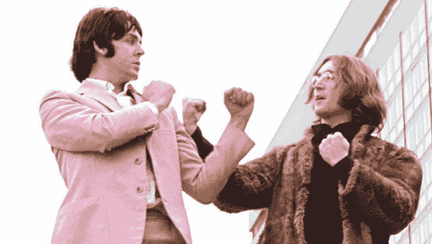
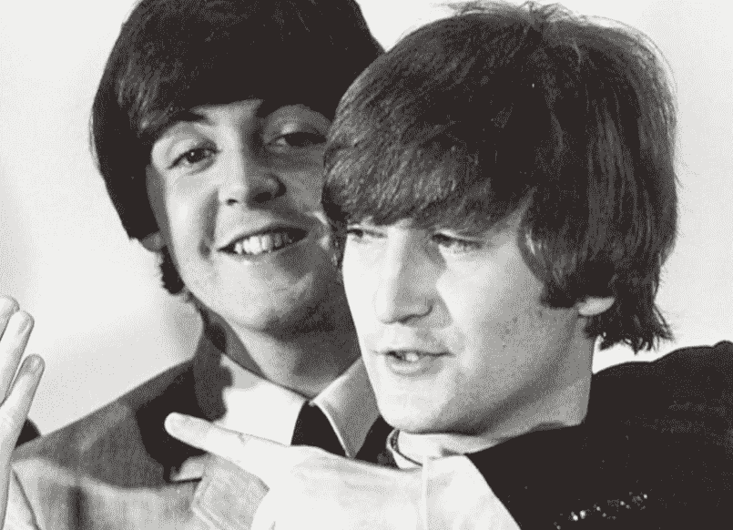
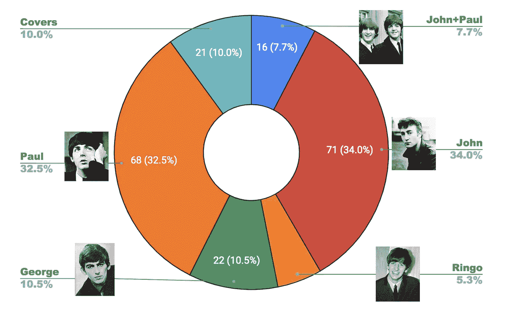
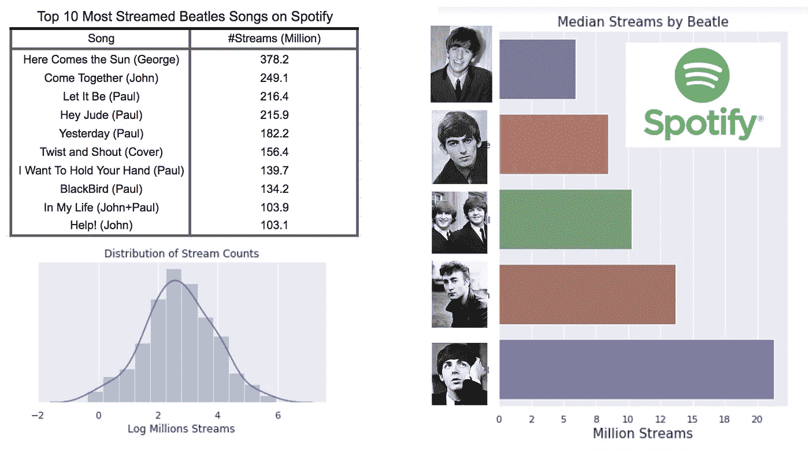
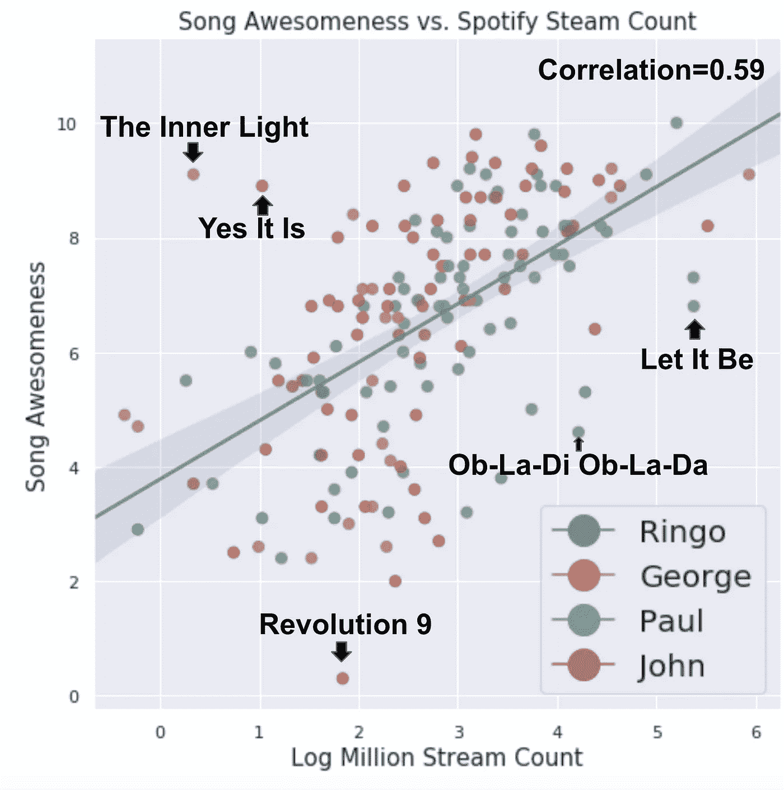
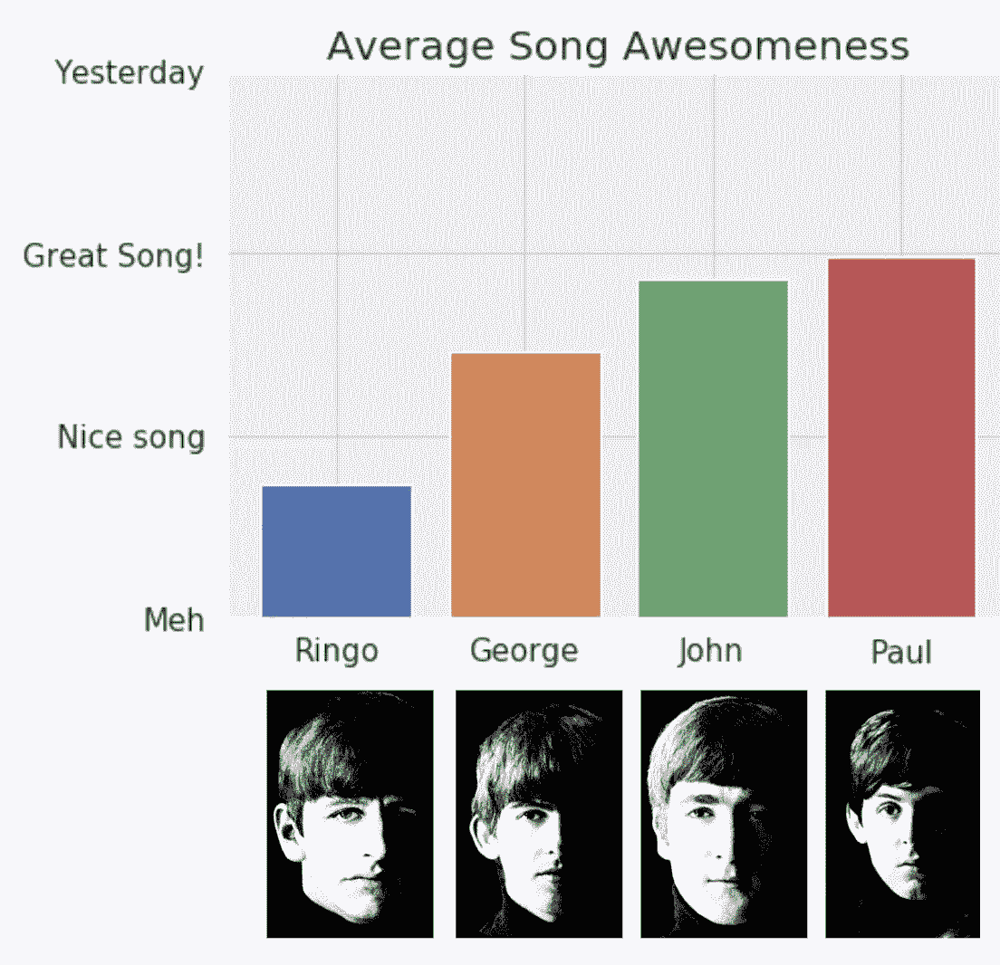
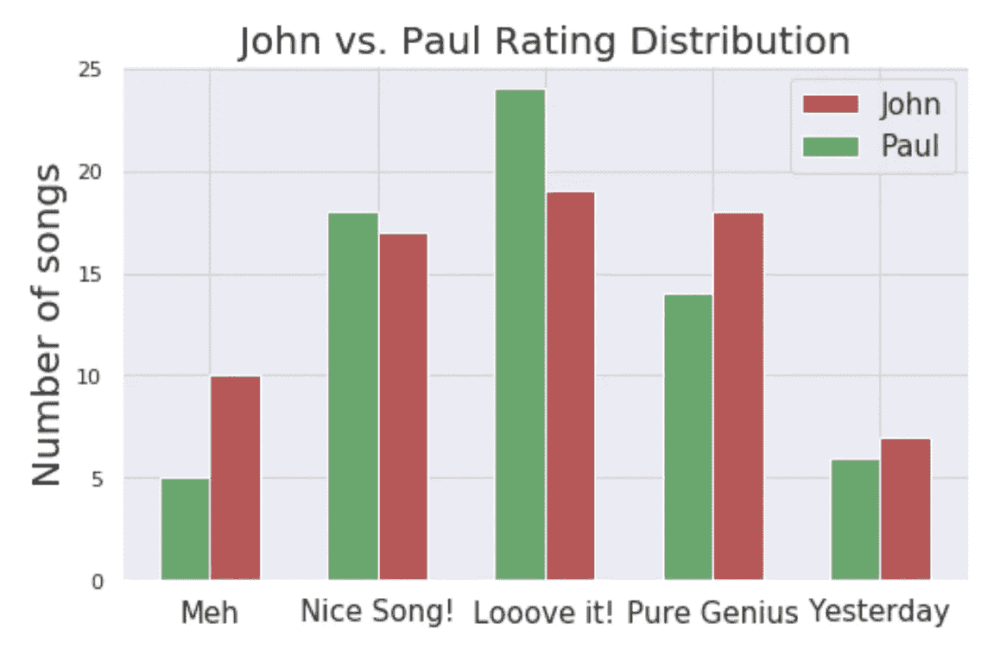
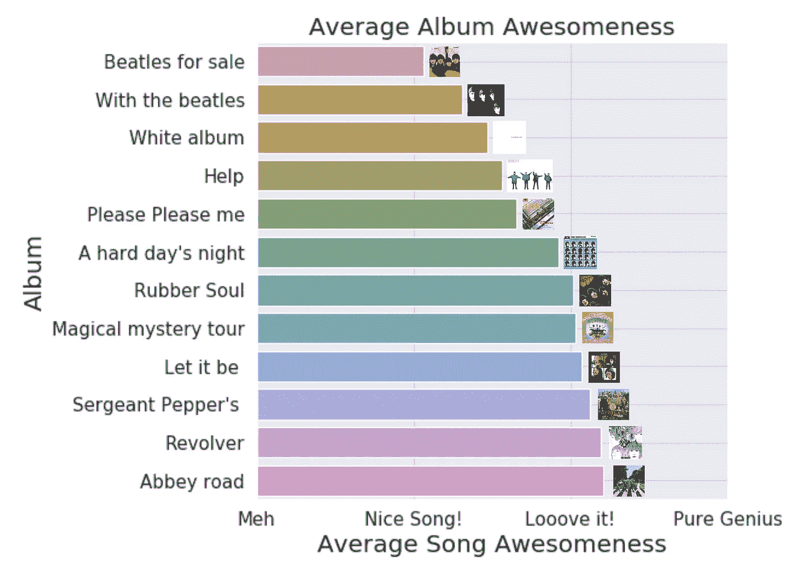

# 约翰还是保罗？数据解决了古老的“谁是第一披头士”的问题

> 原文：<https://towardsdatascience.com/john-or-paul-data-resolves-the-age-old-who-was-the-1-beatle-question-fca8d8232df5?source=collection_archive---------1----------------------->

最近我有很多空闲时间；或者更确切地说，很多时候我手里都拿着一个新生儿。那么当你没有手的时候，你有很多时间做什么呢？听听甲壳虫乐队！对于一个婴儿来说，有什么比有史以来最伟大的乐队更好的音乐世界入门呢？

## 保罗和约翰:从好朋友到敌人

Youtube 的推荐系统很快锁定了我，向我展示了大量关于披头士的事实和八卦。没有什么故事比约翰和保罗之间错综复杂的关系更耐人寻味了。他们从十几岁的闺蜜开始，逃学到保罗爸爸的房子里演奏音乐。忠于他们的 BFF 誓言，他们决定分享他们创作的每一首歌的荣誉，因此大多数甲壳虫乐队的歌曲都由列侬/麦卡特尼正式命名。接下来，他们花数年时间睡在同一个房间里，从汉堡的[破旧公寓](https://www.beatlesbible.com/1960/08/17/live-indra-club-hamburg/)，在德国夜总会玩摇滚翻唱，到披头士狂热，最后成为，嗯，比耶稣更有名的。从青少年时期的友谊开始，逐渐变成了一场激烈的自我驱动的竞争，最终在痛苦的离婚般的分手中破裂。金融纠纷，暗箭伤人的指控，所有的一切。看到这样的真爱死去令人心碎…

就像任何离婚一样，保罗不是圣人，但我发现自己特别反感约翰在分手后的最终公开评论。他几乎无处不在。一些亮点:说“保罗死于音乐”，把保罗的婚礼描述成葬礼，声称保罗的音乐[对电梯](https://www.cheatsheet.com/entertainment/the-paul-mccartney-song-that-made-john-lennon-so-angry.html/)有好处，在“[等歌曲中嘲讽保罗，你晚上怎么睡得着？](https://www.youtube.com/watch?v=teD9t-lO_o0)”。哎哟！80 年代对保罗的一次采访让他承认这有多伤人，尤其是因为[知道约翰的批评会持续下去](https://www.youtube.com/watch?v=dkHEf--YNng)。如果约翰说他是甲壳虫乐队的真正天才，谁能反驳呢？并且坚持了下来——直到今天，许多粉丝认为约翰是甲壳虫乐队背后的艺术力量，而保罗只是一个庸俗的歌曲作者。需要为自己对有史以来无可争议的最伟大乐队的贡献辩护，尤其是面对你前闺蜜的指控，这一定是多么令人沮丧。

但是如果约翰是对的呢？如果约翰真的是迄今为止最伟大的披头士成员呢？乔治在这场竞争中处于什么位置？

## 我们来看数据！

甲壳虫乐队痛苦分手的一线希望是，约翰和保罗都觉得可以自由地为每首歌尽可能多地邀功，实质上解开了列侬/麦卡特尼的归属；我使用了[这个](http://www.myrsten.nu/worldnet/beatlesongs.htm)数据源，它指定了*主*作曲家作为参考，即使是他们合作的歌曲(基本上是他们所有的歌曲)。我将林戈演唱的曲目分成了自己的类别，因为约翰和保罗通常都为林戈创作简单的歌曲，这些歌曲符合他的演唱能力和无忧无虑的的个性，但却不是他们最好的素材。

让我们先来看看歌曲数量:在甲壳虫乐队录制的 208 首歌曲中，71 首大多是约翰写的，68 首大多是保罗写的，22 首是乔治写的，21 首是他们早期的翻唱歌曲，16 首是约翰+保罗的歌曲(他们平均贡献的歌曲)，10 首是林戈唱的，其中有两首是他自己写的(*和 [*章鱼的花园*约翰和保罗在歌曲创作方面几乎同样多产，远远领先于乔治，后者只是在他们后来的专辑中才开始做出重要贡献。](https://www.youtube.com/watch?v=De1LCQvbqV4)*

## *那么谁写的歌更好呢？*

*艺术的“缺点”之一是它不可客观测量。谁能说一首歌比另一首好呢？为了解决这个棘手的问题，让我们先从分析*受欢迎程度*的客观指标开始，然后再来分析最主观的量化*我自己的偏好*！(作为博文作者的额外津贴……)*

## *Spotify 来拯救我们！*

*Spotify 很牛逼吧？以下分析依靠 Spotify 流计数挖掘人气。让我们深入了解一下:*

**

**Top left: most streamed Beatles songs. Bottom left: Log normal distribution of stream counts for all Beatles songs. Right: Median stream count per Beatle**

*在披头士流传最广的 10 首歌曲中，有 5 首是保罗写的，2 首是约翰写的，1 首是乔治写的。有趣的是，流计数的分布几乎是完美的*对数正态分布*。这是为什么呢？对数正态分布出现在许多因素相互叠加产生倍增效应的情况下。造成这种情况的一个可能的假设是网络效应；如果你真的喜欢一首歌，你可能会比你只是稍微喜欢的那首歌多放很多次。这将使这首歌更有可能被推荐(无论是你还是 Spotify 的算法)，从而导致一种指数现象。*

*对歌曲计数中位数的分析显示了一些有趣的事实:*

*   *保罗是最受欢迎的甲壳虫乐队成员！他的中流数几乎是约翰的两倍。对我来说，这是一个相当出乎意料的结果。*
*   *乔治的歌远不如保罗或约翰的受欢迎。乔治的流数很有趣:他的*平均*流数实际上高于约翰，但这主要是受他的前三首歌的影响:[太阳来了](https://www.youtube.com/watch?v=xUNqsfFUwhY)、[什么的](https://www.youtube.com/watch?v=UelDrZ1aFeY)和[而我的吉他轻轻哭泣](https://www.youtube.com/watch?v=VJDJs9dumZI)，这占了他的流的 80%，而《太阳来了》一曲就解释了超过 50%的 3.78 亿的流。那些都是很棒的歌，但是剩下的 19 首歌就没那么受欢迎了。他第四受欢迎的歌曲实际上在 208 首歌曲中只排在第 84 位。George 的案例很好地说明了为什么 [*中值比*](https://creativemaths.net/blog/median/)*平均值更好，尤其是在对数正态分布等非对称分布中。**
*   **林戈的歌曲是最不流畅的。他是个有趣的家伙。也是个很好的鼓手。我们爱你，林戈！作为一个人，但作为一个歌手/歌曲作者就不那么重要了。**

**为保罗欢呼！但是人气真的是质量最好的指标吗？如果 Spotify 流计数可以作为衡量质量的标准，德雷克和爱莉安娜·格兰德应该是流行音乐史上最优秀的音乐家。如果你听起来没有，那么你肯定是读错了博客文章…**

## **超越流行:主观分析**

**我听了甲壳虫乐队的 208 首歌中的每一首(那是 14 个小时的播放时间，我已经提到我手上有一个新生儿的时间了吗？)并对每首歌进行了 0 到 10 分的评分。你可以在这里看到数据集。这明显是一个**非常** **主观**的评级！优美的旋律，有趣的和声和充满激情的歌词在我的书中获得了高分。让我们先来看看我自己的偏好与 Spotify 受欢迎程度的关系:**

****

**歌曲的精彩程度(由我评定)和 Spotify 流计数之间存在 0.59 的强皮尔逊相关性。值得注意的是几首与这种相关性明显不同的歌曲:乔治的可爱的印第安灵感**和约翰的 [*是的，它是*](https://www.youtube.com/watch?v=acWj7M0-9rY) 其扣人心弦的和声都表现过度，而约翰的无聊前卫 [*革命 9*](https://www.youtube.com/watch?v=SNdcFPjGsm8) *(* 谢谢洋子！)是表现最差的。保罗太可爱[*Ob-la-di Ob-la-da*](https://www.youtube.com/watch?v=_J9NpHKrKMw)和[顺其自然](https://www.youtube.com/watch?v=QDYfEBY9NM4)都获得了相当高的分数，但远低于他们在 Spotify 上的受欢迎程度。****

**接下来，该吃主菜了。让我们来看看披头士的《牛逼》:**

****

*   **保罗和约翰很接近，保罗略微领先。**
*   **林戈的歌没那么好。 [*在朋友们的帮助下*](https://www.youtube.com/watch?v=0C58ttB2-Qg) 是林戈评价最高的歌曲，但这绝对是一次性的:他其余所有的歌曲都在最好听的范围内。约翰和保罗努力做到兼容并蓄，确保林戈的影响超越了他的鼓点，这让我们非常尊重他们，但这些可爱的尝试几乎从未触及真正伟大的披头士歌曲的独创性。**
*   **乔治有一些好歌，但他不是保罗或约翰。虽然他有几首歌在纯粹的天才级别中排名很高([什么的](https://www.youtube.com/watch?v=UelDrZ1aFeY)、[太阳来了](https://www.youtube.com/watch?v=xUNqsfFUwhY))，但他也有不少不那么令人印象深刻的歌曲。他是一个令人敬畏的吉他演奏者，他的吉他演奏在披头士的歌曲中起着至关重要的作用，但他很难跟上保罗和约翰的歌曲创作天才。**

****

**深入挖掘一下约翰和保罗的竞争，我们可以看到约翰实际上有更多真正令人敬畏的歌曲，但他也有更多 Meh-ish 歌曲。保罗则比较稳定，他的大部分歌曲都在《爱它！类别，但达到纯粹天才评级的歌曲略少。**

## **结论:保罗是最伟大的甲壳虫乐队成员**

**根本没有明确的赢家，但如果追问的话，我会说这个分析显示保罗是比 T2 稍微好一点的歌曲作者。有一点可以有把握地说，约翰是**而不是**甲壳虫乐队背后唯一的艺术驱动力，因为他有时试图将自己描绘成后甲壳虫乐队，保罗可以自信地宣称他是有史以来最优秀的两位歌曲作者之一。要记住的一件重要的事情是，他们从来没有真正自己创作过歌曲，几乎总是参加彼此歌曲的录制，即使是在他们分手前充满苦涩的日子里。约翰的 [*我要你(她好重)*](https://www.youtube.com/watch?v=wNL6bd7SpDE) 如果没有保罗惊人的低音线*会是什么样？*或者保罗的[买不到我的爱](https://www.youtube.com/watch?v=srwxJUXPHvE)没有约翰的和声和节奏吉他？或者这么多披头士的歌曲没有乔治美妙的吉他独奏？**

****

**John helping Paul with his song in a picture taken by Linda McCartney**

**另一方面，在听过他们所有的歌曲后，很明显每个人都有自己的天赋:保罗是一个纯粹意义上的音乐家，不断创造出美妙的旋律(仅举几个例子，[昨天](https://www.youtube.com/watch?v=NrgmdOz227I)，[米歇尔](https://www.youtube.com/watch?v=WoBLi5eE-wY))，甚至在他的旋律基础演奏中做到了这一点。另一方面，约翰是更完整的艺术家，他在某些方面只是偶然地用音乐来表达自己。他是一个伟大的音乐家，但人们可以说他的歌词和音乐一样伟大，如果不是更好的话(宇宙中的，[无名之辈](https://www.youtube.com/watch?v=8scSwaKbE64)，B [因为](https://www.youtube.com/watch?v=hL0tnrl2L_U))。他的情感谱要黑暗得多，这在某种程度上帮助他创作了更具冲击力的摇滚歌曲。**

**谢谢约翰和保罗！虽然他们对彼此的爱没有他们的音乐遗产持续得久，但如果没有这些千载难逢的天才之间的特殊关系，这个世界将不再是同一个地方。**

# ****奖励曲目:披头士专辑间的比较****

**让我们根据手动评分的歌曲“牛逼程度”的平均值来给披头士的所有专辑排名:**

****

**原来， ***Abbey Road 是甲壳虫乐队最好的专辑*****左轮手枪和佩珀中士紧随其后。这是一个特别惊人的壮举，因为在录制《艾比路》的时候，甲壳虫乐队已经很少说话了，他们的交流几乎只限于录音室里的音乐。我觉得这个分析对白色专辑不公平，因为它实际上有最多的歌曲被评为“天才”。这表明了这种双专辑的不一致性——如果甲壳虫乐队将白色专辑缩减为包含两张专辑中最佳歌曲的一张专辑，它的平均评级也会跃升至榜首。我也觉得橡胶灵魂在这里被稍微低估了；虽然它缺少许多天才级别的歌曲，但我觉得这是一个总和大于其部分的情况，这并没有反映在这首歌曲的统计数据中。****

***那都是乡亲们！***