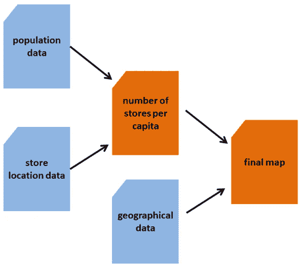
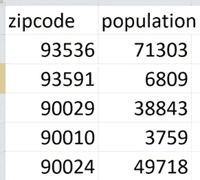
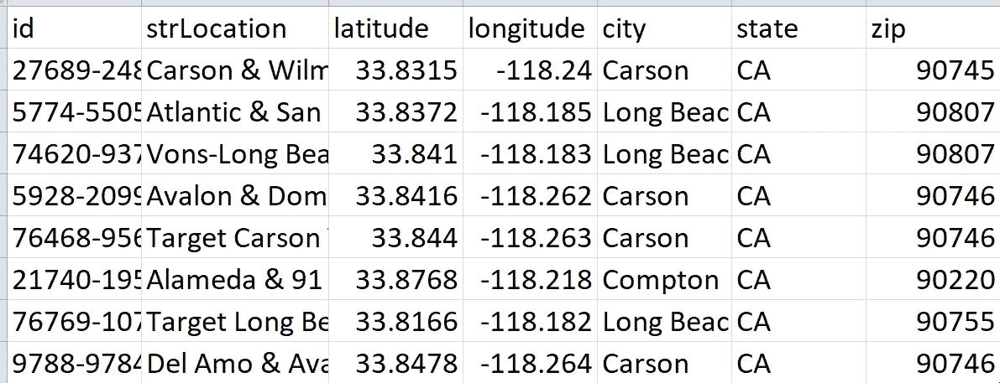
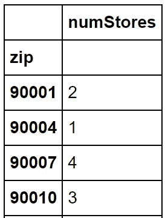
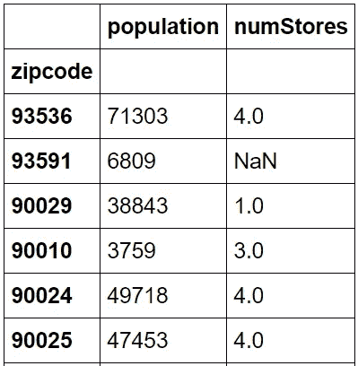
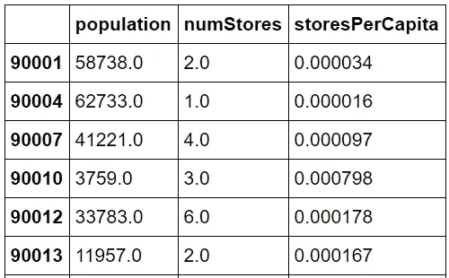
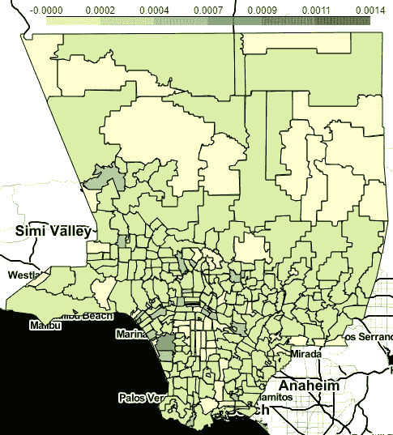
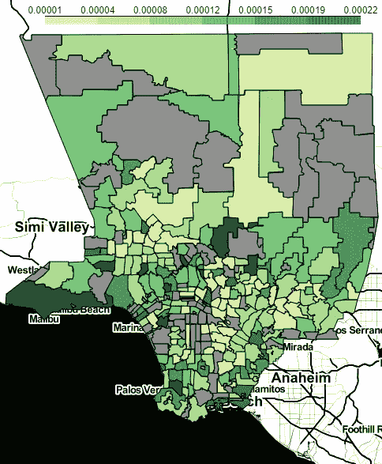

# 联接数据源

> 原文：<https://towardsdatascience.com/joining-data-sources-8ca72f19747?source=collection_archive---------21----------------------->

Photo by [Christopher Burns](https://unsplash.com/photos/Wiu3w-99tNg?utm_source=unsplash&utm_medium=referral&utm_content=creditCopyText) on [Unsplash](https://unsplash.com/search/photos/welding?utm_source=unsplash&utm_medium=referral&utm_content=creditCopyText)

现实世界中的大多数“数据科学”都涉及到创建一个数据集、一个可视化、一个需要从非常不同的来源提取和连接数据来讲述一个连贯故事的应用程序。

跳过玩具数据集，让我们来看一个将不同数据源连接成一个综合地图的完整应用程序。具体来说，我们将回答这个问题:

> ***洛杉机县哪个邮政编码区的人均星巴克门店最多？***

举例来说，如果你的工作是在洛杉矶县寻找新星巴克店的最佳地点，你可能会对这个问题的答案非常感兴趣。

# 定义最终目标

我们的最终目标是创建洛杉矶县的地图。我们的 choropleth 地图基本上满足以下要求:

> *-所有的* ***邮政编码边界*** *都要画出来*
> 
> *-每个邮政编码应根据人均星巴克门店数量*以可变强度 *着色*

# *我们需要什么类型的数据？*

*好的，所以我们肯定需要某种地理数据来绘制邮政编码的形状。我们还需要洛杉矶县每家星巴克的位置信息。当然，我们需要一些邮政编码为的 LA 县的人口信息。总而言之，我们需要:*

> ****1。*** *洛杉矶县邮政编码边界的地理数据(最好是 GeoJSON 文件，是描述复杂形状的 JSON)**
> 
> ****2。*** *洛杉机郡每家星巴克店的位置(最好是带有每家店邮政编码的电子表格)**
> 
> ***3*。*** *洛杉矶县人口按邮政编码(最好是电子表格)**

# *我们可以在哪里找到数据？*

*厉害！我们已经确定了我们理想中需要的数据类型。现在，让我们考虑一下 ***在哪里*** 我们会得到这些数据集。*

*地理数据似乎很容易，在谷歌上搜索“ *la county zipcode geojson* ”最终让我找到了合适的 geojson，存储在我的 GitHub [这里](https://github.com/ritvikmath/StarbucksStoreScraping/blob/master/laZips.geojson)。*

*事实证明，星巴克门店的位置数据要复杂得多。我发现的数据集要么是**过时了**，要么只是**特定的州而不是特定的县**。为了获得这些数据，我必须对官方的[星巴克商店定位器](https://www.starbucks.com/store-locator)做一些非常仔细的 API 查询。事实上，这个过程非常有趣，足以让我单独写一篇关于它的文章:*

* [## 使用 Python 快速收集脏数据

### 洛杉矶县有多少家星巴克？

towardsdatascience.com](/quick-and-dirty-data-gathering-with-python-9d3d4b8cba13) 

对于人口数据集，我在网上找到了一些我想要的预制电子表格，但老实说，我不确定它们的有效性。我认为直接从美国人口普查局获得人口数据要安全得多。获取这些数据需要非常具体地调用人口普查局 API，我有一整篇文章专门介绍这个过程:

 [## 通过 5 个简单的步骤获得人口普查数据

### 为您的项目收集人口数据的简明指南

towardsdatascience.com](/getting-census-data-in-5-easy-steps-a08eeb63995d) 

您可以在我的 GitHub 上找到所有三个结果数据集:

*   洛城县的 GeoJSON 是[这里的](https://github.com/ritvikmath/StarbucksStoreScraping/blob/master/laZips.geojson)
*   洛杉矶县星巴克位置数据集是[这里是](https://github.com/ritvikmath/StarbucksStoreScraping/blob/master/starbucksInLACounty.csv)
*   洛杉矶县人口(按邮政编码)数据集是[这里是](https://github.com/ritvikmath/StarbucksStoreScraping/blob/master/laZipPopulations.csv)

# 我们将如何连接数据集？

好了，我们已经得到了想要的数据。现在，让我们想出一个策略，如何将所有这些结合在一起，制作出我们想要的地图。为了制作地图，我们需要洛杉矶县每个邮政编码的人均星巴克门店数量。目前，我们有创建该指标所需的两个部分，人口数据和商店数据，但需要将它们结合在一起。

因此，使用**两阶段方法**是有意义的。第一阶段将把人口数据与商店位置数据结合起来，第二阶段将把产生的**人均商店**数据集与地理数据结合起来。

大概是这样的:

# **第一阶段:加入人口和店铺位置数据**

让我们看一下这两个电子表格的快照，以确定如何将它们连接起来。

## 人口数据

## 存储位置数据

看起来我们应该能够将邮政编码列上的两个数据集连接起来，但是有一个问题。商店位置数据包含洛杉矶县每家星巴克商店的一行，但我们真的希望每个邮政编码占一行，商店总数占另一列。让我们使用 python 来做一些**快速和肮脏的数据转换**！

一旦我们转换了商店位置数据集，它就包含邮政编码作为索引，邮政编码中的星巴克商店数量作为列。

现在，让我们将两个数据集连接在一起:

随后， ***joinedDf*** 看起来是这样的:

> ***怎么有些词条是南？*** *好吧，如果某个邮政编码存在于人口数据集中，而不存在于商店数据集中，那么它的***numStores****值就会缺失，反之亦然。我们马上会处理这个问题。**

*现在，让我们通过将商店数量除以每个邮政编码的总人口来创建人均商店指标。我们还将删除所有人均商店为空或无穷大的邮政编码(如果邮政编码的人口为零)。*

*由此产生的 ***joinedDf*** 看起来像是:*

**

*不错！第一阶段已经完成。我们有一个数据框架，其中包含每个邮政编码的人均商店数。*

# *阶段 2:使用地理数据绘制人均商店地图*

*现在我们有了包含人均商店的数据集，我们可以在洛杉矶县的地图上绘制这些值，其形状细节存储在我们的地理数据中。让我们创建我们的 choropleth 地图吧！*

*你生成的***laChoropleth.html***地图将是交互式的，当你打开它时，你将能够点击、拖动和缩放。我们来看看结果如何。*

**

*我们确实在地图上看到一些不同深浅的绿色，但是似乎没有太多的变化。这通常发生在 choropleth 图中，当所讨论的变量存在较大的异常值时。对于我们的例子，这意味着对于 ***商店人均*** 来说，有一些邮政编码的 ***值非常大，而大多数邮政编码的值相对较小。****

*我们将在这里做一个折衷，**通过 ***storesPerCapita 删除邮政编码的前 10%*** 。** 在生成的地图中会有更多缺失的邮政编码，但保留下来的邮政编码会显示出更好的色谱。我们还将缺失的邮政编码涂成灰色，这样我们就可以知道它们确实缺失了。这是我们最后的舞蹈。*

**

*正如我们所看到的，由于各种原因，**有相当多的邮政编码**缺失。这可能是因为缺少人口或商店数量的值，或者可能是因为人口为零，或者可能是因为我们在上一步中选择了将其删除。不管怎样，留下的邮政编码显示出比原来的 choropleth 更好的颜色渐变**。你绘制地图的确切方式**完全取决于你**！***

*希望本指南演示了如何收集、连接并最终可视化不同的数据源，对您未来的数据工作有所帮助。**感谢阅读！****