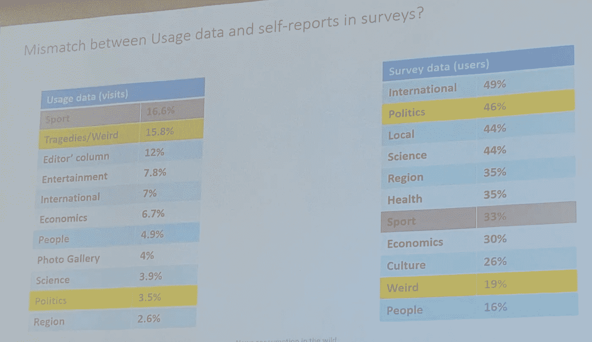
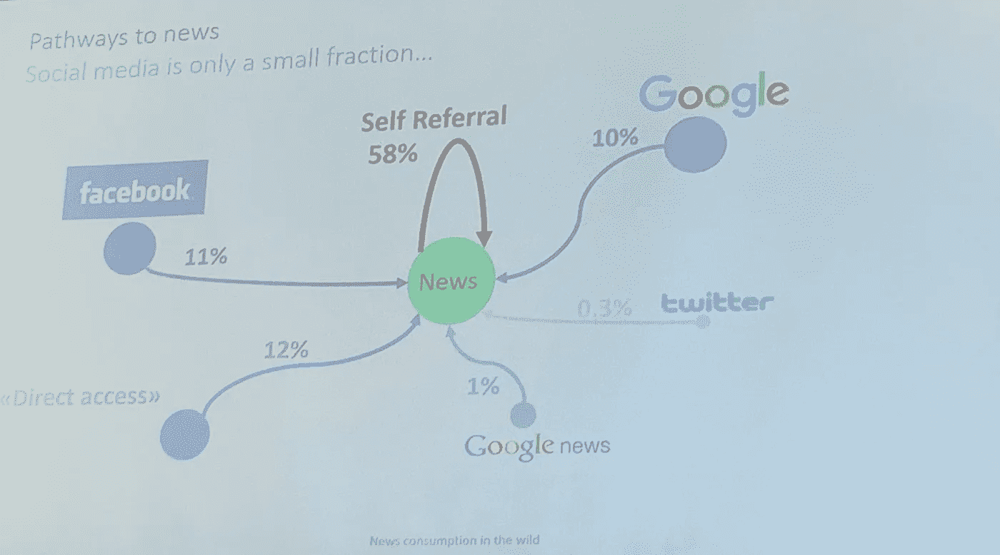
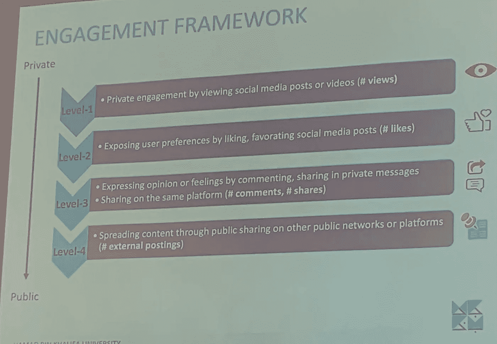
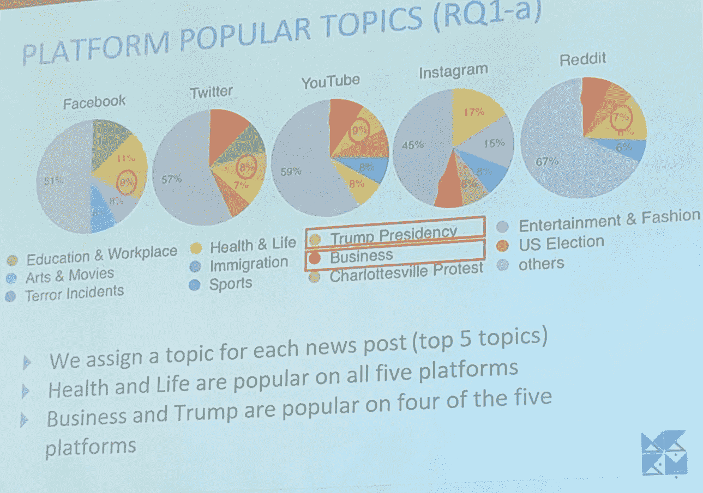
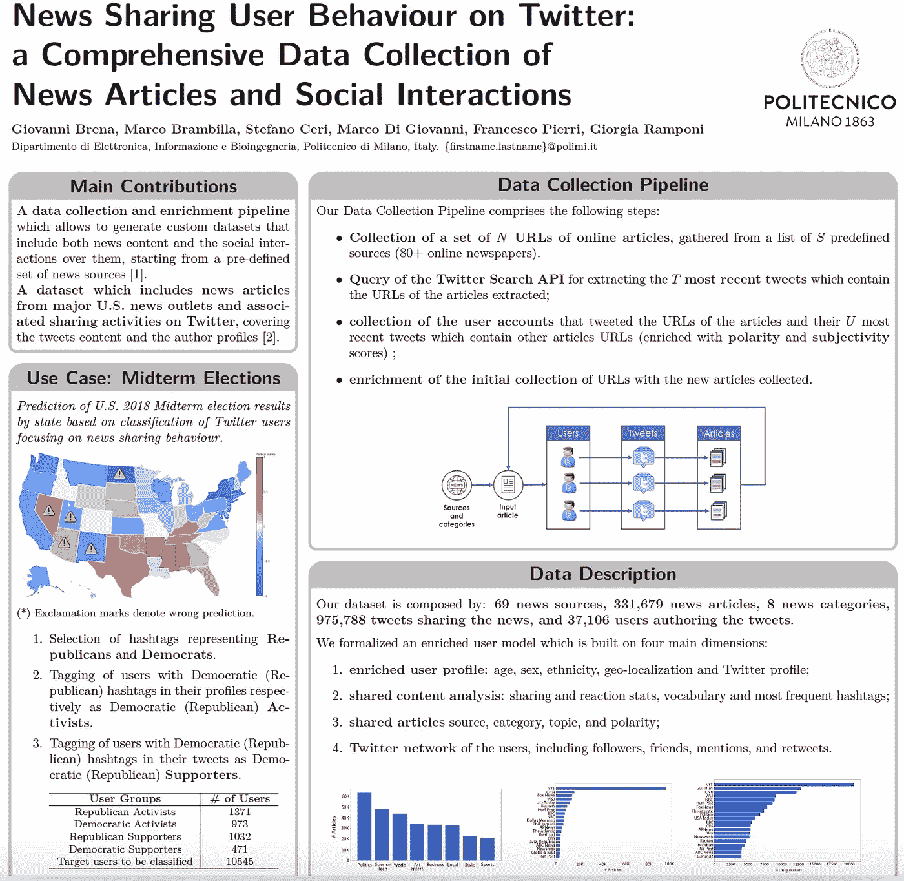

# 社交媒体时代的新闻业:探索新闻、记者、假货、分享行为和兴趣

> 原文：<https://towardsdatascience.com/journalism-in-the-age-of-social-media-exploring-news-journalists-fakes-sharing-behaviour-5f553d79c77c?source=collection_archive---------21----------------------->

## 在线新闻和社交媒体使用中的数据科学

Photo by [Roman Kraft](https://unsplash.com/@romankraft?utm_source=medium&utm_medium=referral) on [Unsplash](https://unsplash.com?utm_source=medium&utm_medium=referral)

如今，理解新闻业并非易事。首先，对于今天的记者，还没有一个共同的、可靠的定义。从某种意义上说，现在任何人都可以当记者。

一种可能的解释是，记者是新闻行业的专业人士，属于一个实践团体。

可以检测记者的分类器的现有实现可以达到 95%的精确度。

下一步是了解文章是否可靠和不可靠。存在能够自动检测和解释分类的方法。

最后，重要的一点是在线新闻媒体如何与社交媒体和新闻的社交分享联系起来。贝尔实验室( [@BellLabs](https://twitter.com/BellLabs) )对人们在新闻中看到的内容和他们分享的内容进行的一项研究显示，两者之间存在很大差异。

..但是获取新闻在很大程度上不是基于社交媒体。58%的新闻媒体推荐是自我推荐。只有 0.3%是通过推特。

跨社交媒体平台转载新闻是用户的典型行为，但每个平台都有自己的规范。我们可以定义一个递增的参与度:

不同的操作适用于不同的平台。此外，主题的受欢迎程度在不同的平台上是不同的:

所有这些都与**我们最近关于社交媒体上新闻分享行为的工作(和开放资源)密切相关**。具体来说，我们已经发布了关于该主题的开放资源，如:

*   一个数据收集和丰富管道，允许从一组新闻源开始，生成包括新闻内容和社会互动的自定义数据集。
*   该数据集包括来自美国主要新闻媒体的新闻文章和 Twitter 上的相关分享活动，涵盖了推文内容和作者简介。

您可以出于任何目的访问这些资源，因为它们分别在 GitHub 和 Harvard Dataverse 上公开提供。你可以在[的幻灯片分享](https://www.slideshare.net/mbrambil/news-sharing-user-behaviour-on-twitter-a-comprehensive-data-collection-of-news-articles-and-social-interactions-149408556)上找到简短的描述。

可在 AAAI 图书馆上直接获得[描述性论文。](https://www.aaai.org/ojs/index.php/ICWSM/article/view/3256)

这篇报道是关于 2019 年 6 月 13 日新闻发布会期间在 [ICWSM 2019](http://icwsm.org/2019/) (国际网络和社交媒体 AAAI 会议)上展示的作品。论文全文可在 AAAI 图书馆在线查阅，第 13 卷，第 01 期。

Photo by [Elijah O'Donnell](https://unsplash.com/@elijahsad?utm_source=medium&utm_medium=referral) on [Unsplash](https://unsplash.com?utm_source=medium&utm_medium=referral)