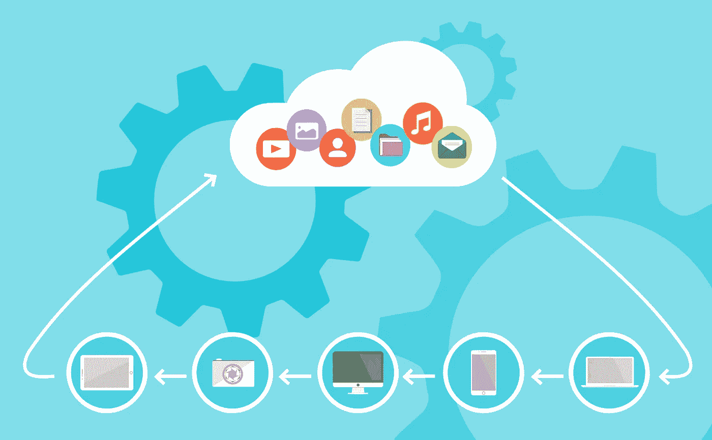

# 什么是云之旅？

> 原文：<https://towardsdatascience.com/journey-cloud-transformation-48a05b20aef?source=collection_archive---------28----------------------->

## 您不能错过这趟列车，请加入云转型

时机成熟了，伙计们。过去几年我们看到的情况令人不安。云作为一个概念出现，十年后将改变我们的生活。想想你的照片，它们没有存储在云中，可以在任何地方访问。如今，从开发人员到首席执行官，每个人都知道有一个叫做云的机会。本文在简要介绍了云的优势之后，展示了如何移动您的本地应用程序。

# 云优势是什么？

在云时代之初，说服人们去云的关键词是“它很便宜”。嗯，经过十年的云计算，我们明白这不是成本的问题。在某些情况下，我们体验到云的成本高于本地解决方案。云的关键词是灵活性、效率和战略。

## 灵活性

IT 项目中最常见的需求是标记时间。如今，每个人都需要比竞争对手更快的解决方案。这种持续的匆忙与实施内部解决方案的常规时间安排相冲突。此外，你需要尝试很多解决方案才能有竞争力。这意味着，并不是所有你将要完成的项目都会结束，或者会有漫长而丰富的生命。但是硬件最终不能简单地转售，sysadmin 的时代一去不复返了。在这种情况下，云帮助了我们。它非常灵活，因此您可以根据自己的需求进行扩展和收缩。此外，你肯定，如果你有足够的钱买它，将有足够的资源给你。

## 效率

本地解决方案很难维护，需要付出大量努力来保持高效。你需要监控物理数据中心，监控基础设施，与 ISP 签订最好的合同，并为冗余硬件等无用资源付费。你还必须支付入侵测试、保险等安全方面的费用。基本上，云提供商比单个公司更有效率，因为这是他们的工作。他们充分利用成本，能够承担更好的安全检查。而且认为对 AI API 等最有价值的服务。有多少公司可以雇佣一个机器学习工程师请他解决一个图像分类问题？也许更快和更便宜的最终支付昂贵的即用服务。

## 战略价值

对于所有非 IT 公司来说，花时间在 IT 上是一个混乱的时代。技术是使公司获得(更多)业务的要素，但是……谁真正看到了它的战略性报酬？云提供了许多降低运营成本的机会，并允许公司管理层专注于主要的业务流程或流程。像更新你的 WordPress 网站或者你的 CRM 这样的傻事不再是问题。这种事情必须自动发生。

Foto di [200 Degrees](https://pixabay.com/it/users/200degrees-2051452/?utm_source=link-attribution&utm_medium=referral&utm_campaign=image&utm_content=1989339) da [Pixabay](https://pixabay.com/it/?utm_source=link-attribution&utm_medium=referral&utm_campaign=image&utm_content=1989339)

# 我如何迁移到云？

云对于那些从零开始的人来说很容易，比如创业公司。当你从白皮书开始，你没有限制，你的第一个约束是要快。你不需要让已经存在的东西活着。基本上，问题是:

> 如何将现有的应用程序迁移到云中？

有许多选项和方法，但我们可以将问题简化为三种不同的解决方案:

1.  换档并抬起。
2.  重构
3.  重建
4.  替换

## 将应用转移和提升到云

转移和提升的基础是尽可能少地将应用程序放到云上。这意味着完成迁移的时间更短，软件层的工作量更少。对此的支持通常是 PaaS(平台即服务),并解决与物理基础设施相关的问题。顺便说一句，软件上没有任何改变，所以应用程序可能会在伸缩性和性能上保持一些限制。

## 重构

为了获得比简单地将应用程序转移到云更多的优势，我们可以重构一些 pat 并获得一些最佳收益。这一选择的驱动力是找到最具影响力的变化，并有选择地应用。

> 例如，您可以将数据库移动到云数据库，但保持相同的接口。这可以使用云数据库服务来完成，它可以被看作是常规的 SQL 数据库，但基于云。这对于大多数应用程序来说是相当透明的，并且很容易带来性能的提高。解决这个问题的好方法是 [Aurora DB](https://aws.amazon.com/rds/aurora/) 或者 [Azure MySQL](https://azure.microsoft.com/services/mysql/)

## 重建

重构和再工程之间没有任何概念上的区别，两者都是对现有代码的工作，从云机会中获得更多的好处。实际的区别在于这种变化的范围。重构包括许多软件部分和细节的改变。这种实践有助于通过小的变化获得好处。但是在野生世界里，并不总是小变化就足够了。在某些情况下，您还需要对基础架构进行更改，这称为重新设计。

> 例如，按照前面的示例，您会发现简单地从本地 mysql 切换到云版本对您来说是不够的，还需要扩展和可用性，以及您需要移动到 NoSQL 解决方案的内容。你可以在 Azure 上使用 Cosmos DB，在 [Google Cloud](https://medium.com/u/4f3f4ee0f977?source=post_page-----48a05b20aef--------------------------------) 上使用 Firebase，或者在 [IBM Cloud](https://www.ibm.com/cloud) 上使用 DashDB。

## 替换

实际上，这是最常用的解决方案。似乎很奇怪的是，简单地把你的价值几千美元的应用程序扔掉是最常见的解决方案。顺便说一下，[福布斯](https://www.forbes.com/sites/louiscolumbus/2018/09/23/roundup-of-cloud-computing-forecasts-and-market-estimates-2018/#3b642810507b)给了我们一个有趣的统计。企业 SaaS 市场现在为软件供应商创造了 200 亿美元的季度收入。这一数字每年增长 32%。即使我们不知道新软件和移动软件之间的百分比，我们也可以假设这些数字中有很多是由本地软件完成的，而这些本地软件被 SaaS 的替代软件所取代。

*   **得到标准溶液。**这也有助于标准化公司内部流程
*   **降低维护成本:**无需维护基础设施或支付维护或更新费用。你得到了该产品的最新版本
*   重新设计一个旧的应用程序意味着重写它。公司实际使用的软件已经丢失了几十年，重新设计比重做更昂贵。即使在没有任何垂直替换的情况下，从头开始可能是更便宜的选择。

# 带什么回家

十年前，云是一个赌注，但现在是一个切实的机会。每家公司都应该已经引入并开始着手实施。这一举动不必是瞬间的。你可能需要时间来完全转向云，对于许多公司来说，这可能根本不可能。

> 第一步是承认搬迁不可能一蹴而就，而是一个漫长的旅程。

这一旅程进入了一种称为“混合云”的状态，在这种状态下，本地结构与云结构协同工作。使用 **shift & lift** 技术可以快速移动大多数应用程序，但是如果您保持数据中心在线以满足其他需求，这可能不会带来太多价值。在很多情况下，你可以通过对软件的小改动获得很多好处(**重构**和**再造**)，但是大多数公司只是在他们的软件寿终正寝时才采用 **SaaS** 解决方案。