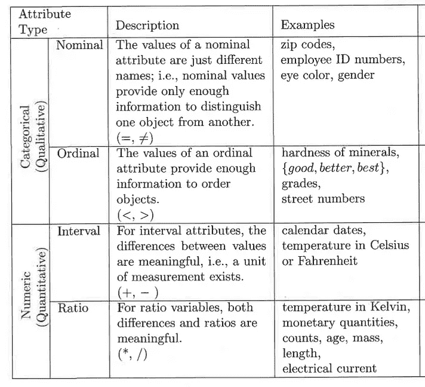
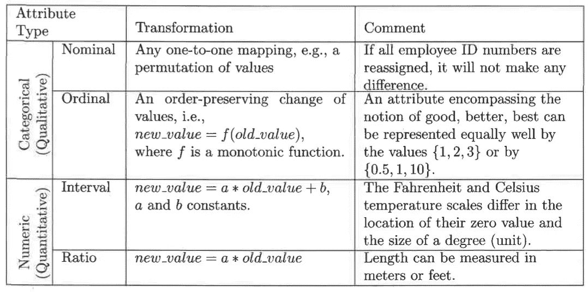

# 数据科学之旅

> 原文：<https://towardsdatascience.com/journey-into-data-mining-3b5ccfa5343?source=collection_archive---------22----------------------->

## 数据挖掘和机器学习导论

G 鉴于每秒钟数据量的增加，人们越来越倾向于**数据科学**和**机器学习**。要想擅长它们，就需要在`Data Mining`领域有强大的基础。

U 对**数据科学**的理解来自于从概念上理解什么是**数据**，如何处理我们得到的数据(数据对于每个问题总是不同的)，以及如何在将数据交给机器学习算法之前有效地预处理数据。我目前正在编写代码示例，完成后我会尽快添加它们。

> 请容忍我的概念性部分，我知道这可能有点无聊，但如果你有强大的基础，那么没有什么可以阻止你成为一名伟大的**数据科学家**或**机器学习工程师**。

Photo by [Mika Baumeister](https://unsplash.com/@mbaumi?utm_source=unsplash&utm_medium=referral&utm_content=creditCopyText) on [Unsplash](https://unsplash.com/search/photos/data?utm_source=unsplash&utm_medium=referral&utm_content=creditCopyText)

L 我们先问自己一个问题，**什么是数据？**

→简单来说，数据是一组**对象**及其**属性**的集合。数据对象的其他名称有记录、点、向量、模式、事件、事例、样本、观察或实体。

现在，我们必须知道什么是**属性？**

→它是一个物体的属性或特征。例如:一个人眼睛的颜色。这也称为其他名称，如变量、字段、特性、尺寸、特征等。

然而，为了讨论和更精确地分析物体的特征，我们给它们分配数字或符号。为了明确地做到这一点，我们需要一个**测量标尺**。那么，**测量尺到底是什么？**

→嗯，是把一个数值或符号值(属性值)和一个对象的属性关联起来的规则(函数)。例如，我们将某人分为男性或女性。

从上面的讨论中，很明显，用于表示属性的值可能具有不是属性本身的属性，反之亦然。这可以借助一个例子来理解:雇员年龄和 ID 号，这两个属性是用整数值定义的，但它们有不同的意义。谈论员工的平均年龄是有意义的，但不要谈论员工的平均 ID。

他要求根据属性的特征将属性分成不同的类型。数字的下列性质(运算)通常用于描述属性。

1.  清晰度:=和**≦**
2.  顺序:，且≥
3.  加法:+和-
4.  乘法:*和/

给定这些属性，我们可以定义四种类型的属性:**标称、序数、区间、**和**比率**。我在下面提供了两个表格来解释这些属性类型和它们的转换。

Table 1: Attribute Type Explanation, Table 2: Transformation that defines attribute levels

**名义**和**序数**属性统称为**范畴**或**定性**属性。顾名思义，**定性**属性，比如员工 ID，缺少数字的大部分属性。即使用数字表示，即整数，也应该更像符号一样对待。

剩下的两类属性，**区间**和**比率**，统称为**数量**或**数值**属性。**数量属性**用数字表示，具有数字的大部分性质。请注意，数量属性可以是整数值，也可以是连续的。

不同类型的属性符合上述不同的属性。**标称**符合**区别**。**序号**遵循**区别**和**顺序**。**间隔**遵循**区别**、**顺序**和**有意义**差异**。**比率**符合**所有四个**属性(**区别、顺序、加法和乘法**)。**

L 最后，在结束这篇帖子之前，我想说一下**连续**、**离散**和**非对称**属性。它们是理解真实数据的关键部分，因为大多数数据集都是由它们的组合组成的，所以区分变得相当重要。

> 什么是离散属性？

→它只有有限或可数无限的值集。示例:邮政编码

→这些通常表示为**整数**值。

> 什么是连续属性？

→它有实数作为属性值。例如:温度、高度等。

→这些值实际上只能用有限的数字来测量和表示。这意味着它们被表示为浮点变量。

> 什么是不对称属性？

→在这种情况下，只有非零值是重要的。

例如，考虑一个数据集，其中每个对象都是一名学生，每个属性都记录了一名学生是否在大学上过某门特定的课程。对于特定的学生，如果学生选择了与该属性相关联的课程，则该属性的值为 1，否则为 0。因为学生只选修了所有可用课程的一小部分，所以这种数据集中的大部分值都是 0。因此，关注非零值更有意义，效率也更高。这篇关于数据及其属性的文章到此结束。

这篇帖子的后续是[这里](/types-of-data-sets-in-data-science-data-mining-machine-learning-eb47c80af7a)。

 [## 数据科学、数据挖掘和机器学习中的数据集类型

### 以及它们的一般特征…

towardsdatascience.com](/types-of-data-sets-in-data-science-data-mining-machine-learning-eb47c80af7a) 

[我正在免费赠送一本关于一致性的电子书。在这里获得你的免费电子书。](https://colossal-hustler-1290.ck.page/c717067eb6)

如果你喜欢阅读这样的故事，那么你应该 [**在你的收件箱**](https://tarun-gupta.medium.com/subscribe) 中获取我的帖子，如果你想支持我成为一名作家，考虑[注册成为一名媒体成员](https://tarun-gupta.medium.com/membership)。每月 5 美元，你可以无限制地阅读媒体上的故事。如果你注册使用我的链接，我会赚一小笔佣金，不需要你额外付费。

 [## 加入我的推荐链接-塔伦古普塔

### 作为一个媒体会员，你的会员费的一部分会给你阅读的作家，你可以完全接触到每一个故事…

tarun-gupta.medium.com](https://tarun-gupta.medium.com/membership) 

感谢阅读。如果你喜欢这篇文章，请访问我在这里的其他文章:

 [## 标记故事列表的快速链接—感谢您的访问

### 我也有一份以快节奏出版为目标的出版物。读书成为作家。

tarun-gupta.medium.com](https://tarun-gupta.medium.com/thank-you-for-visiting-my-profile-9f708062c75e)