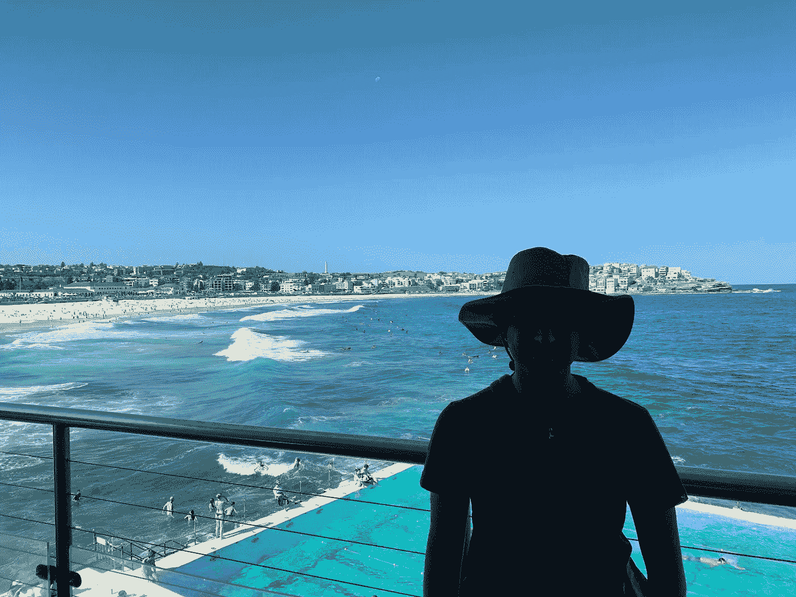

# 世界冠军之旅-2019 年微软创新杯

> 原文：<https://towardsdatascience.com/journey-to-the-world-championship-microsoft-imagine-cup-2019-9e7f15e37442?source=collection_archive---------18----------------------->

# 被微软视为“技术奥林匹克”的世界最大挑战之旅

这是一个基于真实事件的故事，讲述了来自印度韦洛尔理工学院的三名工程系学生参加由微软主办的由微软创意杯命名的世界最大工程挑战赛的旅程。

Microsoft Imagine Cup 2019

I magine Cup 是由微软公司赞助和主办的一年一度的比赛，它将全世界的学生开发者聚集在一起，帮助解决一些世界上最棘手的挑战。它被计算机科学和工程视为“技术奥林匹克”，被认为是与技术和软件设计相关的顶级竞赛和奖项之一。所有创新杯参赛者都创建了创新杯主题的项目:

[microsoftimaginecup](https://www.instagram.com/microsoftimaginecup/) — 12 teams…each with a story to tell, each with an idea to share, an idea that could impact the world. Every single second felt like…a chance to grow,” shares Ansh on his team, Alpha-India’s [#ImagineCup](https://www.instagram.com/explore/tags/imaginecup/) journey.

> "**想象一个科技帮助解决最棘手问题的世界**"

每个人都来自不同的背景和文化。一个是充满激情的设计师(Ansh Mehra)，第二个是用心的铁杆研究员(Hemant H Kumar)，最后是我(Saransh Mittal)，脑子里充满了意想不到的精彩想法，有着创新解决方案的愿景，这些解决方案具有巨大的社会影响，并有可能解决现实世界的问题。旅途中的每一天都让我们学到了新的有价值的东西。

我们是 28000 名学生中的一员，他们申请了来自亚洲地区 20 多个国家的 2019 年微软创新杯。结果已经公布，前 12 名团队有机会在世界面前展示他们的产品。我们一生只有一次机会代表印度参加亚洲锦标赛。

# 那么我们是怎么知道想象杯的呢？

## 微软学生技术社区

HackHarvard 2018 at Harvard University, Boston

我是大学技术社区的一员，这个社区是由各种非常勤奋的学生作为微软的学生伙伴为微软创立的。在社区招募我的那天，我的一个学长向我介绍了想象杯。即使我在参观哈佛大学之前就很清楚这个比赛，我总是低估我的批判性思维和能力，总是认为我没有足够的能力参加世界锦标赛。我会在未来的想象杯印度总决赛的审判日之后证明自己是错的。

## 在哈佛大学举办的 HackHarvard 2018

Saransh Mittal at Harvard University, Boston

这一切都要追溯到 2018 年 10 月，当时我们去哈佛大学参加 HackHarvard 2018。我们在黑客马拉松上开发了一个应用程序的原型，并向很多人推销。幸运的是，负责微软学生合作伙伴项目的创新杯团队成员 Susan Ibach 喜欢我们的想法，并看到了将其转化为大项目的潜力。她激励我们进一步研究这个想法，进一步改进原型，并为 2019 年微软创新杯提交一份新的提案。

我们尽了最大努力在评委面前推销这个想法，但很快意识到我们的应用程序太基础了，无法产生真正的影响。尽管我们没有赢得波士顿黑客大会，但我们相信我们必须在理念和产品上有很大的改进。我们刚刚开发了一个应用程序，可以检查一种食品是否含有某种成分。我们回来后开始开发我们的移动应用程序。我们集思广益，试图为我们现有的技术体系找到一个合适的想法，来解决我们产品中的某些缺陷，从而解决问题。

Prototype of the SPOT created at HackHarvard 2018 by team Alpha-India

> “永远不要对自己或自己的想法失去信心”

# 关于我们的想法和概念

## SPOT——将增强现实引入零售店

The project we presented at the Microsoft Imagine Cup 2019

考虑一个场景，杰克和他 7 岁的女儿艾伦去中国旅行。劳累了一天后，他们进入一家超市买东西，却发现所有的商品都有中文信息。由于对坚果过敏，艾伦已经住院两次。Spot 接受了 Ellen 的健康档案，并允许她的父亲选择适合他女儿健康的产品。Spot 允许您在增强现实中比较多个产品。只需使用您的手机，点击产品，选择基于您的健康档案推荐的过滤器，并在增强现实中查看过滤的选择。每年有 100 多万人受到过敏反应(如过敏症)的影响，他们食用的食物会导致有害反应和危及生命的医疗紧急情况。如果一个人选择了对他的消费有害的过滤器，Spot 会立即警告他的选择。这是因为产品和消费者之间的信息差距。我们的目标是消除这种信息鸿沟。我们大部分的日常采购都是在线下完成的。网上杂货店允许我们平行比较产品，这是线下杂货店购物所不具备的功能。我们期待与企业和食品市场合作，让他们的产品做好准备。通过使他们的产品准备就绪，食品制造商可以给顾客更大的激励去选择他们的产品，增加他们的销售。

这很简单，但非常有效，因为它促进了适合你健康的选择，并且离线工作。我们使用了 Azure 的 CustomVision AI 来构建图像识别模型。使用 Python App Service，产品的数据库托管在 Azure Cosmos DB 上。现实世界和虚拟世界之间的界限正在慢慢消失，我们的目标是为离线购物世界引入一个新的维度。这对消费者和制造商都有利。做好 AR 准备可以促进产品的销售，弥合信息差距可以促进用户做出更健康的选择。

# 结果日-2019 年微软印度创意杯

经过几个不眠之夜的提案和提交视频的工作，结果出来了。视频是我们申请成功的关键因素。午夜时分，我在班加罗尔的一家初创公司工作，正在发布产品，这时我的队友赫曼特打电话给我，告诉了我一生中最好的消息。

> "兄弟，我们被选中参加创意杯"

**哇！我站在那里，高兴地尖叫，闭上眼睛，享受这一刻。**我们做到了。在 HackHarvard 2018 之后，这是一段艰难的旅程，但我们做到了。我们克服了从祖国远道而来美国却没有赢得哈佛的失望。我们从未对我的想法失去信心，继续前进。我立即在深夜打电话给我的父母，向他们表达我最大的幸福，并分享这一美好的时刻。这是我第一次为自己感到超级自豪，告诉他们 2019 年的想象杯。

第二天，我们立即收到了来自微软的电子邮件，祝贺我们在比赛中的出色表现。在确认我们参加在澳大利亚悉尼举行的亚洲区决赛之前，他们给了我们必须遵守的指导方针。我们开始为澳大利亚之旅做准备，因为离冠军赛只有一个月了。他们开始处理我们的申请，让我们的签证获准进入澳大利亚边境。

接下来的几周，我们不断与微软保持联系。我们接受了媒体和外展团队的采访，以分享我们对我们旅程的看法，与微软的开发人员召开了会议，与微软印度团队的工程师进行了会谈，以帮助我们了解我们的业务模式，并与微软的其他专家进行了交流，他们在那里指导我们并简要介绍了我们未来的旅程。

我们赢得了微软创新杯印度全国赛，现在我们必须代表印度参加亚洲区决赛。我们热切地等待这一天已经很久了。所有的资助，包括我们国际旅行的机票以及我们在达令港附近的诺富特酒店的住宿，都是由微软赞助的。我们没有从口袋里掏出一分钱。

# 为冠军做准备，向世界展示我们最好的能力

入选是我们能想到的最大成就之一。来自 17 个国家的数百个团队提交了参加亚洲区决赛的项目，我们的团队是入选的 12 个团队之一。微软将于 2 月 10 日至 14 日让我们的团队飞往澳大利亚悉尼，争夺超过 20，000 美元的奖金，以及 5 月份参加 2019 年创新杯世界锦标赛的机会。

对于我们来说，这是一个千载难逢的**机会**，我们可以加入一个学生开发人员的全球社区，用技术产生影响，我们很高兴看到其他团队将为地区决赛带来什么。

我们无法抑制我们的兴奋。这是地球上最大的科技赛事之一，我们即将成为其中的一部分，但我们还没有准备好作为一个强大的竞争对手与其他团队竞争。所有的团队要么是为他们的想法寻找投资的初创公司，要么是像我们这样的团队，他们有一个想法，有一个在世界上产生巨大影响的愿景。现在是时候确保我们尽最大努力制作一个完整的可出版的产品，以及我们在想象杯上推销所需的所有东西。

More about our product for the Microsoft Imagine Cup 2019

很明显，我们需要一个强大的产品来实现我们的想法，并需要一个令人兴奋的推介计划来与其他团队进行激烈的竞争，以产生强大的影响。我们意识到参加决赛的人都是初创公司，所以为了打造我们产品的品牌，我们付出了一点努力，尝试了一些从未有过的新东西，包括一些附加产品，以产生更大的影响。

我们更加努力地改造应用程序的用户界面，通过大量的动画和调整使它更加用户直观。广告词和海报是与人们交流的静态方式，但视频预告片向人们传达了强有力的信息，帮助他们更好地理解你的想法。我们为我们的品牌设计了标志、海报、贴纸甚至 t 恤，让我们在微软 Ignite 上被介绍的人面前看起来很专业。

> “无论你走到哪里，你都会带着你的品牌和理念。”

# 在去班加罗尔之前

我们对冠军无比兴奋，并准备前往澳大利亚悉尼参加亚洲区决赛。就在我们应该从班加罗尔机场起飞的一周前，我早上从软技能课上回来，不小心把 iPhone 掉在了人行道上，屏幕摔碎了。我很难过，因为屏幕坏了，整个应用程序即将完成，将在决赛中展示。无论如何，我不可能开发这个应用程序，因为 AR 开发需要我的智能手机上的摄像头工作。韦洛尔是印度的一个半城市化城市，在那里我们没有足够的设施让任何授权或熟练的人来修理智能手机。

事情对我来说并不顺利。我非常关注我的免疫力和健康。在过去的一个月里，健康状况不是很好。我的皮肤免疫系统接受了一段时间的药物治疗，突然我的健康状况开始恶化，我被诊断为因食用腐烂的食物而腹泻，并患有食物中毒。锦标赛就要到了，我不确定我是否能在我们启程之前康复。我被立即送进了医院，因为这种疾病正在大范围传播，无法控制。医生给我开了一些有助于快速恢复的药物，但几乎花了一周时间才完全治愈。

> “健康应该是一个人在任何工作之前的第一要务。没有健康的生活，你就无法高效地工作和享受生活。”

Team Alpha-India on the flight to Sydney, Australia via Malaysia

# 抵达澳大利亚悉尼达令港的第一天

这一天到来了，我们结束了每天的工程课，从韦洛尔乘出租车离开。当我们离开大学时，我们的朋友来送我们，并祝我们旅途好运。一个月很快过去了，我们从来没有意识到。很快，等待结束了，我们离遇见来自世界各地的优秀的人们更近了一步。我们到达了班加罗尔——印度的网络城市，坐了很长一段时间的车后，我们累极了，我们到达了赫曼特的家。夜深了，但赫曼特的家人还是迎接了我们，并为我和安什准备了晚餐。晚饭后我们打了个盹睡着了，因为第二天还有很多工作要做。太阳升起，晨光渐长。我们计划在 Hemant 的家里呆一整天，研究产品和业务模型，购买新的杂货，并在我们从当地超市购买的新食品上测试我们的应用程序。Ansh 爸爸从德里来接他，把他的护照交给他，所以他和他一起走了，留下来过夜。我和 Hemant 不知疲倦地工作了一整夜，完成了应用程序的前端和后端。漫漫长夜很快就结束了，我们一大早就去了机场。我们在机场遇到了 Ansh，但当我们一进入机场，马来西亚航空公司的工作人员就从我们的旅行预订中认出了我们，并帮助我们办理了登机手续。我们非常震惊，航空公司的工作人员是如何知道我们进入了创新杯决赛的。突然，我们意识到微软应该已经通知他们我们的到来了。工作人员告诉我们，来自班加罗尔地区的另一个团队也到达了机场，并完成了登机手续，因为他们与我们乘坐同一架飞机。甚至在见到他们之前，我们之间的竞争意识就已经增长，我们决定观察他们的每一个动作，并尽可能少地互动，以了解他们的产品。

我们的第一段旅程是乘坐马来西亚航空公司的飞机从班加罗尔出发的，我们的航班本应在马来西亚的吉隆坡着陆。在马来西亚机场停留 6 个小时后，我们登上了飞往澳大利亚的联运航班。根据马来西亚时区，当时是晚上。我们的航班从跑道上起飞。飞机上的那个晚上充满了兴奋，因为我将会见到来自世界各地的优秀的人。离参加国际比赛的梦想又近了一步。

我们的飞机飞越澳大利亚，在该国中部上空的大部分旅程中，我除了不毛之地什么也没看到。澳大利亚是一个岛国，人口约为 2300 万，其中大多数人居住在该国的主要城市。很快，我们在悉尼机场着陆，看到这个岛国令人惊叹的美景，我们兴奋不已。机场建在海边，跑道与之平行。悉尼是一座郁郁葱葱的绿色城市，美丽的建筑横跨全城。这是印度的冬季，但经历了炎热的太阳，能量开始流经我们的身体，让我们兴奋不已。澳大利亚位于地球的南半球，与北半球的气候季节相反。这个国家拥有丰富多样的遗产，有来自世界各地的人。这是我第一次在这个国家看到很多来自亚洲国家的人，比如中国、韩国、泰国等等。

我们离开机场，一名来自微软的向导正在外面等待所有团队和 MSP，他们由处理旅程后勤的旅行社安排在同一时间到达——橘子旅行。一辆巴士正等在到达门口，把我们带到目的地——诺富特酒店。我们由其他决赛队伍和来自其他县的 MSP 陪同。很快我们就到了旅馆，帕布罗和琼迎接了我们。他们在大楼的入口处等着我们，带我们去各自的房间。我们完成了注册过程，Pablo 给了我们各自的想象杯参赛标签和一张礼品卡，可以在酒店旁边的购物中心的美食广场消费。酒店套房还没有准备好，所以我们把行李留在酒店，离开这个地方去探索周围的城市。

The first day at Sydney, Australia

我们的酒店紧挨着太平洋，澳大利亚所有著名的银行都把总部设在港口旁边的大楼里。几乎所有的旅游景点都在达令港附近。我和 Ansh 共用一个房间，但是 Hemant 和一个来自斯里兰卡队的参与者共用一个不同的房间。我们决定白天一起呆在房间里，然后晚上各自回房间睡觉。

傍晚时分，我们离开了房间的四面墙，去欣赏海边的美景。我们预订了一艘游轮，它将带我们游览这座城市海边的各个地方，然后乘船去看日落。在接下来的两个小时里，我们乘风破浪，在城市的岸边巡游。我们体验了悉尼歌剧院和许多地方的美丽。这是我一生中第一次登上轮船。所以很明显我对此非常兴奋！我们点击了大量的照片，从不同的角度，姿势和邮轮周围的地方。夕阳西下，骑行结束。晚饭后，我们回到各自的房间，工作了一会儿，然后打瞌睡，一直睡到第二天早上。

Team Alpha India at Sydney, Australia

# 创业日——微软反应器

那是早上 8 点，大巴在酒店门口等着我们，带我们去市里的微软反应器办公室。微软反应器是微软的一项举措，旨在孵化初创公司，并与他们密切合作，开发一种创新产品。第二天从模拟投球开始。微软为我们计划了一个特别的训练营，教我们如何从一个简单的商业模式为你的产品建立一个创业公司，并将最简单的想法转化为最具创新性的产品。

The Imagine Cup family

在创业日，他们邀请了所有创新杯的参与者以及微软的学生合作伙伴。有很多专家从美国飞来分享他们在生活中的知识和经验，关于用一个想法创建一个公司。整整一天，我们被介绍了创建公司的新方法及其商业模式，以及如何在评委面前做一个好的推介。会议结束后，所有的团队都被召集到舞台上，一个接一个地测试我们的产品。许多来自不同非英语国家的人发现很难向评委表达他们的想法。所有球队都要做大量艰苦的工作和最后的润色来改进他们的投球策略。由于来自印度，我们没有遇到语言障碍，但其他团队开发的产品非常出色。我们决定，即使他们的产品会比我们的产品有更大的受众群，我们也会用我们最好的产品来推销我们的产品。在推销会议结束后，我们被分成三组，每组四个团队，与当天召集的专家进行私人咨询。

The one with our mentors Cecily Kovatch and Tom Katona

我们与汤姆·考托瑙先生签了名，他是这次旅行的导师之一，他耐心地听我们对商业模式的想法，并集思广益，为我们第二天的工作提出改进建议。晚上晚些时候，我们都聚集在一起，在悉尼的最高峰合影留念，一天就此结束。

[microsoftimaginecup](https://www.instagram.com/microsoftimaginecup/) - Wonderful end to day 1 of the Imagine Cup Asia Regional Final and Microsoft Student Partner Summit! Tomorrow, the Imagine Cup Asia Regional Finalists will compete for the chance to win USD15,000 and a spot in the World Championship. 🏆 Stay tuned and follow the action right here.

我们回到房间准备最后一次投球。忙碌了一天后，我们非常累，并计划晚饭后见面，为第二天的最后陈述练习。

夜晚过得如此之快，以至于我们甚至没有意识到我们花了多少时间来练习推销和改进展示我们想法的方式。我们多次改变了 Hemant 和 Ansh 晚上要展示的方式，我会制作产品，这样当人们来看我们的产品时，它就不会出现任何问题。我们确保我们完全按照导师建议的改进措施去做，然后睡觉，希望明天会更好。我们用来训练食品的模型并没有给我们带来好的结果。我们尝试了几种技术来创建一个好的 CNN 模型，试图以各种可能的方式捕捉产品的图像，以便我们的应用程序可以识别食品包装。我们花了很大的力气整晚一遍又一遍地点击数百张图片，以使我们的模型足够好，足以向评委推销。

# 2019 年微软创新杯亚洲总决赛

Team Alpha-India on the stage presenting their ideas to the judges at the Microsoft Imagine Cup 2019

第三天开始充满了兴奋，因为这是审判日，我们必须在来自不同领域和行业的法官面前投球。他们是来自世界各地的专家，是各自领域的佼佼者。我们很早就起来练习投球，然后去了酒店旁边的 ICC。我们进入会场，意识到整个建筑正在被第二天在微软工作的志愿者为 Ignite 大会进行装饰。

锦标赛开始前，所有的参赛者都在为最后一次投球练习。我们是少数几个提前到达会场的队伍之一。尽管我们很紧张，但还是为最后的表演做好了准备。在最后一刻之前，我们开始打开系统包装测试产品。赫曼特和安什本应带着我们最大的热情，在微软邀请的经验丰富的评委面前推销我们的产品。在最后一轮之前，我们通过努力工作至少练习了 100 次，改进了推介产品的方式，为人们每一次可能的 QnAs 做准备，改变了推介脚本，训练深度学习模型识别产品的包装，以及在我们等待已久的最后时刻之前展示产品演示的方式，远离我们的祖国印度。

这是一个时刻，也是一个梦想，对于一个工程系学生来说，他一生都在等待创新，向世界展示对人们发展的深厚热情，这种热情可以对他们的生活产生巨大影响，解决复杂而具有挑战性的问题，帮助人类这一代过上更好、更舒适的生活。

It’s show time

> “表演时间到了！一个想法开始了旅程。来自创新杯亚洲区半决赛的 12 名决赛选手带来了他们最具原创性的技术解决方案，我们现在离赢得 10 万美元的大奖又近了一步。”

推介会议以尴尬的沉默开始，大门紧闭。所有的队伍都准备好了他们的产品，评委们在各自的位置上就座。整个礼堂都为最后时刻做好了准备，灯光暗了下来，比赛开始了。摄像机转向各队，我们分成四组，在观众面前投球。所有的团队开始一个接一个地在世界面前展示他们最伟大的创新想法。

轮到硬件项目了，来自中国的 [RailinNova](https://imaginecup.microsoft.com/Team/Index/9e7de90d-4518-427e-aea7-85ed79157cf2) 队、来自印度的 [Caeli](https://imaginecup.microsoft.com/Team/Index/134aa833-9918-4255-9254-7bb253d31829) 队、来自斯里兰卡的[草帽](https://imaginecup.microsoft.com/Team/Index/3e87a79e-12c6-45fc-b535-2ce25c1585ed)队和来自马来西亚的[suvecs](https://imaginecup.microsoft.com/en-us/Team/Index/4050fdd8-9a54-46ef-a30e-02de2fa00b0b)队被叫上台。

在最后的投球之前，所有的导师和观众都祝我们好运，当 Ansh 和 Hemant 开始投球的时候到了。虽然我们很紧张，但我们的投球在我们生命中最长的 3 分钟后结束了。那是我一生中最快乐、最自豪的时刻。投球会议结束，结果宣布。一些媒体在比赛前告诉我们，来自印度的一支球队应该赢得全球冠军，把想象杯带回家。在最后的颁奖仪式之前。会议暂停了一会儿，让评委们决定获胜者。仪式开始前，我们来到观众席外面，与其他队伍见面，祝贺他们取得的成绩，并祝他们好运。我们很幸运能与来自世界各地的创新思维分享世界舞台。休息时间结束了，有影响力的人作为特邀嘉宾被邀请上台宣布获胜者。

来自印度的卡利队在亚洲锦标赛中获得了第一名。他们为哮喘和慢性呼吸道疾病患者创造了一种智能自动抗污染和药物输送口罩。Caeli 实施了一项突破性技术，以改善生活在世界上污染最严重的印度和中国城市的呼吸系统患者的生活质量。

来自中国的 RailinNova 团队被宣布为亚军，因为他们创造了一种技术，通过多传感器融合自动定位和识别各种缺陷来取代工人，从而实现铁路检查过程的自动化，并创造了一种更安全的方法。

来自菲律宾的 AidUSC 队获得了第三极。他们开发了一款名为 Aqua Check 的产品，该产品利用微软 Azure 的定制视觉，通过显微镜拍照来绘制污染物位置，从而分析水样的污染程度。

比赛结束时，我获得了人生中一些最美好的经历，留下了无数珍贵的回忆，并为成为如此伟大的创新思想社区的一员而感到高兴。

The Microsoft Imagine Cup Asia Regional Final 2019 family

## **比赛评委**

1.  **蕾切尔·邦迪—** *营销&微软澳洲运营总监*
2.  **凯特·卡鲁泽斯—***UNSW 首席数据官，物联网 MAus 创始人*
3.  **贾斯汀·加勒特—** *微软学术生态系统总监*
4.  **马克·佩斯—** *作者，发明家&未来学家*
5.  **Emily Rich —** *微软澳大利亚/新西兰创业公司董事总经理*

> **”**最后输赢无所谓。是你旅途中无数宝贵的经历让你成长，成为一个更好的人”

我们离开了礼堂，微软给我们颁发了决赛入围者和赢得印度决赛的证书。他们向当时在场的每个成员分发了一个特别设计的微软礼包，里面装有 t 恤、笔和其他东西。在每个人都要离开之前，一些从新加坡飞来报道这次活动的媒体记者最后一次来到我们这里，向我的团队询问我们进一步推广这个想法的计划。虽然我们之前已经决定，一旦我们到达印度，我们将开始的第一件事是产品创意的专利申请，但最近这一过程仍处于文档阶段。很快，我们离开了国际会议中心大楼，到达酒店，享受这一令人骄傲的时刻。

晚上晚些时候，外面变暗了。我们太累了，从来没有意识到我们睡了这么久。已经是晚上 9 点了，我们已经错过了晚餐。在澳大利亚，大多数食品商店和餐馆 9 点以后就关门了。我打电话给赫曼特，我们离开酒店寻找食物，但在一次不成功的尝试后，我们最终从客房服务订购食物。

# 微软 Ignite-2019 年澳大利亚悉尼之旅

Saransh Mittal at the Microsoft Ignite Tour at Sydney, Australia

会议日开始了。虽然我对前一天我们被淘汰出在西雅图举行的世界锦标赛感到有点难过。我的父亲是我生命中最有影响力的人，他告诉我这本身就是我生命中最大的成就，是我的胜利，从而激励我重拾信心。他说服我买一部新的 iPhone，因为它以前坏过。我从未想过我会得到这么贵重的礼物作为对我努力工作的回报。由于想买一部新的 iPhone，我搜索了附近最好的商店，找到了 JB Hifi。我穿过分隔达令港和城市的大桥，到达了目的地。在柜台急切地等待机会，买了新手机。我感谢上帝赐予我如此美好的生活。

第四天，微软邀请我们向来自世界各地参加年度 Ignite 大会的 6000 多名企业家、天使投资人和大型 IT 专业人士展示我们的想法。在展览中心，每个创意杯团队都有一个单独的桌子来展示他们的产品，并在会议上展示他们的想法。中心的每个团队都在争夺人民选择奖。幸运的队伍将赢得 1000 美元的现金奖励。每位代表都获得了一张投票票，他们来到由创新杯团队装饰的桌子前，为他们最喜欢的最佳创意投票。

我们在旅途中遇到了很多人，并与他们建立了联系，每当我们的想法在会议上受到人们的赞赏时，我们都为自己的辛勤工作感到自豪。在整个旅程中，我度过的每一刻都让我为自己感到无比自豪，也很幸运有机会成为其中的一员。

The dinner at the Hard Rock Cafe in Sydney, Australia

ignite tour 以 2019 年想象杯的所有学生合作伙伴和决赛选手在晚宴上结束，这是一个特殊的场合，在晚上晚些时候，在达令港美丽的海边景色旁边的硬石咖啡馆庆祝最后一夜的精彩时刻。

所有的车队都聚集在一起庆祝这一时刻，Pablo 向每个人致意，感谢他们作为决赛选手取得的巨大成就，因为在这个星球上很少有人能够幸运地有机会成为顶级梦想家。幸运抽奖比赛的结果已经公布，大约 10 人获得了现金奖。赫曼特是少数赢得 250 美元作为礼物的幸运儿之一。Pablo 召集了我们所有人，并宣布了在 ignite tour 上举行的人民选择奖的获奖者，Suffex 团队赢得了冠军。

食物端上来了，每个人都高兴起来。我们开始讨论我们的经历、想法和其他话题。我们讨论了想象杯项目的团队负责人 Pablo Veramundi，并询问了他对自己所追随的激情的看法。Ansh 和我被他的工作打动了，他周游世界，结识新朋友，体验学生们对单一事业的想法，为团队保存最有价值的记忆，每天面对动态的挑战，并对作为一个人所做的事情保持热情。我希望追求像巴勃罗一样的职业生涯，因为他的激情每天都在激励着他。他是一个非常外向的人，微软的每个人都非常尊重他。

会场上的每个人都有自己独特的鼓舞人心的故事告诉我们，这些故事反映了他们在生活中为成为一个人而奋斗和努力的结果。

Joan Hoshino 是微软的第一批员工之一，当时这家科技巨头还只是一家车库创业公司，她与我们分享了她的故事。她已经为微软工作了 30 年，负责这个科技巨头的销售和市场部门。她曾与比尔·盖茨密切合作，并讲述了萨提亚给公司带来的巨大变化。她来自日本，定居在美国。她未婚，热爱自己的工作。她分享了自己的经历，讲述了“人们在知道她为微软工作后，如何问她关于如何修复某些 windows bug 的技术问题的愚蠢问题”，她来自销售项目。我们进行了一次长谈，她告诉我们她在生活中面临的困难。她给出的最有价值的建议是，永远追求让你对他们充满热情并感到快乐的职业。我们见到了想象杯家庭的整个组织团队，听到他们在生活中的经历，我们感到震惊。

Team Alpha-India and Team RailNova at the Hard Rock Cafe

那天晚上，每个人都互相告别，希望每个人都更加努力，成为更好的自己。在很短的时间内，这已经成为我们的一个小家庭。人们分享电话号码，并承诺彼此保持联系。这是我第一次结交来自世界其他地方的好朋友。

目睹了夜晚的美妙，我们冲出酒店，为无私的努力和真正的友谊庆祝这个夜晚(在房间的四面墙外)。整个晚上过去了，我们漫步在城市的街道上，享受着美丽大都市的夜生活，讨论着关于人、生活和事业的无尽话题，为印度的家人和朋友买了特别的礼物，还有只在这个岛国零售的特别巧克力。我们高兴地回来了，然后就去睡觉了。

宝贵的旅程已经结束，我们被 20 多个媒体网站报道，提到我们团队的成功，赞赏我们创造的产品，称其为一个时代定义的概念。这是我人生中第一次出现在新闻报道中。

Editorial News Publications featuring Team Alpha-India

# “再见澳大利亚”——我们在悉尼的最后一天

旅程的最后一天，我们早早起床，计划游览美丽的悉尼和达令港周边地区。这一天从我们退房并把行李交给酒店工作人员开始。我们在酒店的自助餐厅吃了早餐。尽管天气多云，我们还是决定在达令港附近的主要景点逛逛。我们的短途旅行从参观动物园、海底水族馆和杜莎夫人蜡像馆开始。这是一个全国性的节日，每个人都出去和家人一起享受美好的一天。

夜深了，云消失了。我们回到酒店，Ansh 在长途旅行后非常累，决定在累人的飞行前呆在家里放松一下。为了见证这个岛国的真正美丽，我和赫曼特决定去参观我们一生中最美丽的地方——邦迪海滩！如果你去悉尼的话，这是网上最受欢迎的推荐之一。我们预订了一个优步，长途旅行的唯一原因是不要有一种旅行不完整的感觉，而没有经历人们游览澳大利亚的主要原因是因为它的美丽。在那里呆了一个小时左右，然后赶回酒店，因为我们要赶飞机，不得不登上去机场的巴士。

这是一次值得铭记一生的旅行。我们分享的记忆和舞台对我们来说意义重大。我们有过完全失去信心的时刻，但不是我们的想法。我们战斗，努力工作，整晚都被笑话逗笑，分享回忆，旅程最终以梦想成真而结束。

> “这些是我生命中最美好的回忆，我们有着如此惊人的友谊！作为朋友和团队，我们已经走过了漫长的道路。”

Saransh Mittal and Hemant H Kumar at the Bondi beach in Sydney, Australia

> “这是梦还是真实的现实。我很高兴我是其中的一部分”