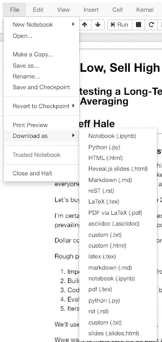

# 使用 nbconvert 跳出 Jupyter 笔记本

> 原文：<https://towardsdatascience.com/jump-out-of-the-jupyter-notebook-with-nbconvert-7d4748960702?source=collection_archive---------4----------------------->

## 轻松将笔记本转换为 Python 脚本和可共享文件

如果你是一名数据科学家*，nbconvert* 是一个很好的工具，可以添加到你的工具箱中。使用 nbconvert，您可以从命令行轻松地将 Jupyter 笔记本转换为 Python 脚本。它还可以让你把你的 Jupyter 笔记本变成像。html and.pdf 文件。多酷啊。


Jumping Out of a Jupyter Notebook

nbconvert 是一个开源软件项目，与 [Anaconda](https://www.anaconda.com/distribution/) 捆绑在一起。引用 [nbconvert docs](https://nbconvert.readthedocs.io/en/latest/) 的话，它支持:

*   **以熟悉的格式呈现**信息，如 PDF。
*   **发表**使用 LaTeX 的研究，为在论文中嵌入笔记本打开了大门。
*   **与工作中不使用笔记本的其他人合作**。
*   使用 HTML 通过网络与许多人分享内容。

本指南自 nbconvert 版本 5.4 起生效。让我们深入研究如何使用它！

# 安装 nbconvert 和朋友

虽然 nbconvert 是随 Anaconda 一起安装的，但是它也可以与 [pip](https://pypi.org/project/nbconvert/) 一起安装。您可以将 Jupyter 笔记本转换为一些文件格式，如 HTML，开箱即用。


然而，如果你想将笔记本转换成 LaTex、PDF、Ascii、reStructuredTExt 或 Markdown，你需要安装 [Pandoc](https://pandoc.org/) 和 [LaTeX](https://www.latex-project.org/) 。这些软件包的安装信息因您的机器而异，您可以在这里找到。

让我们看看如何从 shell 中运行 nbconvert。

# 从命令行运行 nbconvert

从您的终端 shell 中，运行`jupyter nbconvert --to my_format my_notebook.ipynb`。

`my_format`是转换选项之一。

`my_notebook.ipynb`是要转换的笔记本文件路径的名称。

# 信息输出公式

## 超文本标记语言

用`jupyter nbconvert --to html my_notebook.ipynb`把你的 Jupyter 笔记本变成漂亮的 HTML。


默认的输出格式是一个格式良好的 HTML 页面。如果你想要一个基本的 HTML 版本，可能对嵌入另一个 HTML 文档有用，那么把`--template basic`作为参数传递。

让我们看看您可以将笔记本转换成的其他格式。

## PDF、降价、重组文本、LaTeX 和 AsciiDoc

尝试这些格式之前，请先安装 LaTeX 和 Pandoc。这里的安装信息是。

分别是`pdf`、`markdown`、`rst`、`latex`、`asciidoc`。

LaTeX 文件可以在此处[描述的几种不同的报告和文章模板](https://nbconvert.readthedocs.io/en/latest/usage.html)中导出。

选择 Markdown，reStructuredText，LaTeX，ASCII 输出创建一个文件夹。png 图像从您的笔记本电脑的图形。

我刚刚做了一个 [PR](https://github.com/jupyter/nbconvert/pull/956) 将 ASCII 转换添加到文档中，很快这个功能也将被记录下来。

## 运行一个或多个笔记本

当然，在 Jupyter 笔记本中，你可以通过菜单或者快捷键来运行它。我提到这个特性是因为它作为 Python 脚本的一部分可能很有用。就用`--to notebook`作为你的论据吧。如果你想尝试这个功能，有几个选项，所以我建议你参考[文档](https://nbconvert.readthedocs.io/en/latest/usage.html#notebook-and-preprocessors)。

## Reveal.js HTML 幻灯片

用`--to slides`将笔记本转变成幻灯片听起来很有希望，但这还不是一个平稳的过程。您需要首先手动调整 Jupyter 笔记本电池。您还需要安装 Reveal.js 软件包，或者在放映幻灯片时访问互联网。此外，您需要设置一个服务器来使用幻灯片计时。

我个人现在不会使用幻灯片功能，但它值得在未来重新使用。如果你愿意，这方面还有开发工作要做。😄

接下来让我们看看在程序中运行 nbconvert。

## 可执行 Python 脚本


从 Jupyter 笔记本轻松转换到 Python 脚本的能力让我对尝试 nbconvert 感到兴奋。你猜怎么着？有用！

`jupyter nbconvert --to script my_notebook.ipynb`在同一个文件夹中创建 *my_notebook.py* 。然后你就可以跑`python my_notebook.py`笑了。😄

要使用这个脚本，您当然需要确保导入的包在您的环境中可用。另外，注意以`%`、`%%`或`!`开头的 Jupyter 魔法命令会让你的脚本停下来，所以你需要删除它们。

# 将 nbconvert 作为库运行

你可以写一个 Python 程序把 nbconvert 当库用。文档中有一个例子。警告您不完全清楚您需要什么样的文件，如何使用导出器，或者如何编写文件。

我在一个开源项目中使用了 nbconvert，以便轻松地将 Jupyter 笔记本转换为 Python 可执行文件和 HTML 文件。下面是如何使用 [NotebookToAll](https://github.com/notebooktoall/notebooktoall) 包用两行代码创建这些文件。

`pip install notebooktoall`

```
from notebooktoall.transform import transform_notebooktransform_notebook(ipynb_file=”my_jupyter_notebook.ipynb”, export_list=[“html”, “py”])
```

我正在完成一个使用 nbconvert 制作 OSS 软件包的经验指南。在这篇文章中，我将向您展示如何用自动化测试和部署特性创建您自己的 Python 包。跟着我，保证你不会错过！

# Jupyter 实验室/Jupyter 笔记本内部

如果你不想使用命令行或库或我的小软件包，并且你在 Jupyter 笔记本中，你可以通过查看菜单下载转换后的文件。见下图。



Time to hop

与命令行相比，您失去了一点控制，但它很快。😏

**更新 2019 年 2 月 27 日**笔记本也可以从 Jupyter 实验室导出。进入*文件- >将笔记本导出为…* 并选择您的导出格式。


Jump out of your Jupyter Notebook

# 包装

现在您已经看到了 nbconvert 的基础知识。我希望这篇文章能给你一些在工作中使用它的想法。

如果你觉得这篇文章很有趣，请在你最喜欢的社交媒体渠道上分享，这样其他人也可以找到它！👏

我撰写关于数据科学、Python、Docker 和其他技术主题的文章。如果你对此感兴趣，请点击查看。

[](https://dataawesome.com)

感谢阅读！