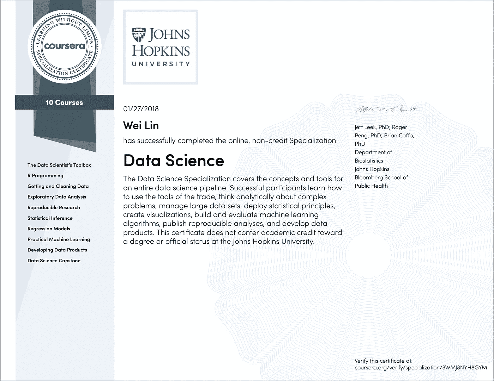

# 在 R 中启动数据科学

> 原文：<https://towardsdatascience.com/jump-start-data-science-in-r-e80cd8273165?source=collection_archive---------29----------------------->

The worn-out Sticker on the lid of my MacBook

像许多人一样，我在 4 年前开始了我的数据科学生涯，当时我的数据科学知识和编程经验都很有限。为了让自己跟上进度，我在网上搜索了一个自学专家在线课程。Coursera 上出现的一门课程是约翰霍普金斯大学的数据科学专业。我最终选择这个专业的几个原因是:

1.  它有体面的在线评论和评级。
2.  这是一门基于 R 的课程/专业。
3.  它几乎涵盖了数据科学的所有方面。

老实说，完成这 10 门专业课的整个旅程并不那么简单。我在 2016 年初报名了整个专业，花了差不多两年时间才最终确定下来。主要原因是 Coursera 过去不需要每月订阅，课程可以在两年内慢慢完成，只需一次性预付费用。回想起来，我想如果我在目前的每月订阅计划下，我会更早完成它。反正我是 2018 年初定的全专。这是我的证件:

JHU Data Science Specialization Certificate

这个专业包括 10 门课程。在完成这个专精的旅途中，我尽力使用 Github。我所有的作业和项目代码都存储在这个[库](https://github.com/wlinInspire/JHU-Coursera-Data-Science)中。在这篇文章中，我将简要回顾每门课程，我希望你能从中获得一些见解。

# 课程 1:数据科学家工具箱

选择正确的工具集是至关重要的，这通常会使您的工作效率提高一倍甚至两倍。当我刚开始使用 R 时，我没有做太多的研究，在找到 Rstudio 之前，在 Linux 环境中使用了相当长一段时间的命令行 R。课程 1 涵盖了基于 R 的数据科学工作所需的大部分工具。他们是

1.  RStudio:R 最流行的 IDE。我应该说如果没有 R studio，R 不可能如此流行。Rstudio 不断集成函数，让 R 编程变得更加简单快捷。自动完成、热键、RStudio 项目等等。喜欢 Rstudio 的理由太多了。
2.  **Git** :最流行的版本控制程序。RStudio 为基本用途提供了非常好的 git 集成。不过最好了解更高级的 git 函数，比如 merge，rebase 等。
3.  **Rmarkdown**:r 中的一体化报表工具，可以使用 Rmarkdown 创建幻灯片、笔记本、学术论文、互动网站等。

# 课程 2: R 编程

了解 R 的工作原理非常重要。课程 2 涵盖了 R 编程的基础知识。除了数据结构、流程控制、函数等常规编程主题之外。，本课程中还有一些其他有趣的主题:

1.  **作用域规则** : R 使用词法作用域。用简单的语言来说，在定义函数的同一层或更高层创建的变量可以被该函数使用。当我第一次开始开发 R 包时，我想减少函数参数的数量，犯了一个错误，天真地假设在函数 A 中计算的一个变量对在 A 体内调用的函数 B 是可用的。
2.  **Xapply 函数族** : R 如果尽可能多地使用向量运算，效率最高。其他语言使用循环可能仍然是最有效的。我不是 Xapply 函数家族的粉丝，也很少使用它们。在我个人看来，这看起来像是元素思维和矢量思维的折衷。它既不像循环那样灵活，也不像向量运算那样快速。

正如我说过的，这门课是 R 编程的一个很好的起点。如果你想学习更多关于 R 编程的知识，我强烈推荐 Hadley Wickham 的《高级 R 编程》一书。

# 课程 3:获取和清理数据

本课程基本分为两个部分:

1.  **获取数据**:关于如何从文件、API 和数据库中本地和远程获取数据。很标准，没什么刺激的。
2.  **清理数据**:是关于数据操作，也是一个重要的概念，叫做“整洁”的数据。

*   数据操作:本课程主要介绍操作数据的基本方法和`dplyr`方法，但是，我强烈推荐使用`data.table`方法操作数据。操作数据要比前两种方式快得多。我也着迷于`data.table`的语法是多么的简单和简洁。绝对值得一探究竟。
*   整齐的数据:整齐数据的思想被用在很多 R 包中，比如`ggplot2`，并且被用在数据库表设计中以获得可伸缩性。如果数据已经是一种整齐的格式，你会发现处理起来容易得多。一定要看看哈德利·韦翰的论文[《整洁的数据》](https://www.jstatsoft.org/article/view/v059i10/v59i10.pdf)。我向你保证，花 30 分钟通读这篇文章将使你成为一名更好的数据科学家。

# 课程 4:探索性数据分析

这门课程是关于探索性数据分析，又名 EDA。对我来说，EDA 90%是关于数据可视化的。数据可视化对于发现异常值、偏斜度、相关性等非常有用。一般来说，做 EDA 之后，即使没有任何建模工作，你也应该能形成一些基本的假设。然而，在整个数据科学工作流程中，应该在 EDA 上投入多少精力是有争议的。根据我的个人经验，我并没有在 EDA 上投入太多精力，原因如下:

1.  EDA 不是模型构建的先决条件。即使你有一个完整的 EDA，有漂亮的图表，对每个特性的分布有一个基本的概念，以及多个特性是如何相互关联的，最终，你仍然需要建立一个基于数据的预测模型。如果预测模型工作正常，它应该证实 EDA 已经显示了什么。
2.  EDA 没有标准的程序。与模型构建不同，几乎没有人人都应该遵循的理论和标准程序，这是我最害怕的。
3.  数据可视化有其自身的局限性。在单个图表上只能显示有限数量的要素。使用可视化不太可能同时发现多个特征之间的复杂关系，因此我们依赖复杂的建模技术来找出。

虽然我不是 EDA 的粉丝，但它仍然是商业智能、报告和仪表板等方面非常重要的工具。

# 课程 5:可重复的研究

个人认为这门课除了介绍 R markdown 之外，没有太大的价值。如题所示，这门课程可能是由学术研究活动激发的。对于行业中的大多数数据科学家来说，从本课程中学到的是，您应该将您的数据分析写在某种类型的报告中，然后其他人可以共享和复制这些报告。为此，R 中最好的方法之一是将您的数据分析、模型构建和思考过程简化为 Rmarkdown，而使用 Python 的对应方法是 Jupyter notebook。

目前，我使用 R notebook(仍然基于 R markdown)的次数比原来的 R markdown 多得多，因为 R notebook 总是被缓存起来以便快速预览。

# 课程 6:统计推断

这对我来说是最难的课程，在整个专业中，我的分数最低。我想大多数学生都会同意我的观点。老实说，到今天为止，我在统计推断方面仍然不太流利和舒服。在本课程中，您将会遇到一些重要而实用的概念

1.  **P 值**。当人们谈论统计显著性时，这是最重要的概念之一。我问几乎所有候选人 P 值的定义，如果他们申请的是数据科学或分析相关的职位。
2.  **假设检验。**我应该说测试是任何数据驱动型公司中最重要的概念之一。流行的 AB 测试就属于这一类。严格地说，在公司正式推出任何新产品之前，我们应该选择一个客户子集，进行假设检验，收集数据，并确认感兴趣的指标的改善，如转化率、流失、终身价值等。

# 课程 7:回归模型

线性回归很可能是每个机器学习或数据科学入门课程或书籍谈论的第一个回归模型。尽管线性回归看起来非常简单明了，但其中有相当多的技术细节。本课程致力于广义线性模型，并很好地涵盖了这些技术细节。以下几个概念值得多加关注。

1.  **回归系数的解释**。当涉及到多元线性回归时，这一点尤为重要。自变量的系数是在其他因变量保持不变的情况下，因变量对自变量的敏感度。当一些独立变量以某种方式相关时，即相互依赖时，独立性假设被违反，它们的回归系数可能显示与直觉相反的值，这是所谓多重共线性的结果。
2.  **型号选择**。本课程介绍了传统的模型选择方法，即基于 AIC 或 BIC 的向后、向前和两者。在实践中，我几乎总是使用带有 LASSO 的广义线性模型来执行带有 n 重交叉验证的模型选择。对我来说，它更直观，更容易理解。
3.  **逻辑回归**。在实践中，我发现逻辑回归是我最常用的分类模型之一，尤其是在模型开发的早期阶段。逻辑回归作为一种广义线性模型，训练速度快，解释性强。

# 课程 8:实用机器学习

如果你对从事机器学习职业很认真的话，这门课是最重要的课程之一。这门课程涵盖了许多实用的技术和细节。我不知道在这门课程中哪个部分更重要，因为我认为每个主题都同等重要，你可能会在以后的机器学习生涯中遇到它们。

本课程介绍 caret 包，这是一个多合一的机器学习包。该软件包适用于数据量较小的问题。然而，caret 的执行速度相当慢，文档也很糟糕。我认为 caret 包有点过时，而且很少维护。实际上，我大部分时间都在使用 H2O R 软件包。我强烈推荐 H2O 套餐。你会惊讶于它的速度和出色的文档。

# 课程 9:开发数据产品

我认为成功的数据科学职业生涯的一个重要因素是对业务产生影响。你希望商业利益相关者同意你和他们的认同。要做到这一点，最好的方法之一就是做一个数据产品。它可以是一个 API、一个仪表板、一个自动报告或一个网站等。它们都是影响业务的可扩展产品。本课程介绍了一些你可以用 r。

在我的职业生涯中，最大的数据产品是一个闪亮的交互式仪表盘。与任何商业智能工具不同，Shiny dashboard 的优势在于它是完全交互式的，这意味着您可以通过它执行输入和输出任务。因此，我构建的仪表板可以作为用户的门户。我喜欢构建产品，我相信端到端数据科学家应该能够执行从 ETL 到数据产品的数据任务。

# 课程 10:数据科学顶点

好的，一旦你完成了这一步，这就是本专业的最后一门课程。老实说，顶点课程中的项目本身并不是那么直接，你需要学习和获取本课程之外的信息。由于学生可能有不同的方法来解决这个问题，所以没有唯一的答案，评分标准也相当宽松。