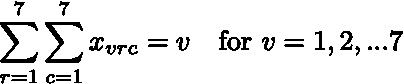
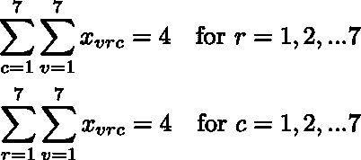

# 用线性规划解决难题

> 原文：<https://towardsdatascience.com/jumping-into-puzzle-solving-with-linear-programming-57852609d516?source=collection_archive---------30----------------------->

## 学习如何在类似数独的数字游戏中使用 Julia 语言制定和解决线性程序


Photo by [Austin Neill](https://unsplash.com/@arstyy?utm_source=unsplash&utm_medium=referral&utm_content=creditCopyText) on [Unsplash](https://unsplash.com/s/photos/jump?utm_source=unsplash&utm_medium=referral&utm_content=creditCopyText)

线性规划(LP)是一种解决优化问题的强大技术，您将经常看到它被应用于从航班调度、车辆路线到收入管理的问题。在这篇文章中，我想探索一个更异想天开的应用——如何使用线性编程来解决一个难题？

这个谜题类似于数独，所以我将为这个新的脑筋急转弯扩展众所周知的[数独 LP 公式](https://www.mathworks.com/help/optim/examples/solve-sudoku-puzzles-via-integer-programming.html)。我建议你在继续之前先理解数独解决方案，因为它会有一些类似的逻辑([这里有一个关于它的中型帖子](/using-integer-linear-programming-to-solve-sudoku-puzzles-15e9d2a70baa))。

## 介绍谜题

这个谜题是一个朋友介绍给我的，他推测可以用 LP 解决。这个问题出现在简街拼图上，你可以在这里阅读描述。仅从约束条件来看，它似乎与数独非常相似——对出现次数有约束，但对首次/最后一次出现、值的总和等也有一些其他约束条件。能用 LP 解决吗？答案是肯定的，且看如何。


The first puzzle that I will use for my example

# 公式化问题

## 定义变量

在阅读了你的问题并对目标有了深刻的理解后，你应该从定义变量开始。决策会是什么样的？是连续的，整数的，二进制的？它有边界吗？从技术上来说，这是一个约束，但在开始时考虑这一点可能会有所帮助，这样你就不会忘记在以后添加它。

对于这个谜题，决定很简单:*给定的单元格中应该放入什么数字？*

我的变量名将是 *x* ，它将是二进制的，它将由三个值索引:

*   v 是我们正在考虑的从 1 到 7 的数值
*   *r* 是从 1 到 7 的行索引
*   *c* 是从 1 到 7 的列索引

在数学符号中，这是


由此产生的解将告诉我们哪个数字应该进入哪个单元格。例如，如果解指定 x_{1，1，1}=1，那么这意味着数字 1 进入位置(1，1)的单元格。如果 x_{3，4，7}=0，那么这意味着数字 3 不会进入位置(4，7)的单元格。当我们知道每个数字和单元格组合的所有这些 1 和 0 时，我们就有了解决方案。

这将创建 777 = 343 个二进制变量。对于 LP 问题，二元变量总是比连续值变量更难解决。幸运的是，如今这只是很少的变量，而拥有成千上万个变量的更大的问题可以由如今的[解算器](https://www.math.uni-bielefeld.de/documenta/vol-ismp/25_bixby-robert.pdf)来解决。在本地解决这个问题应该没有问题。

## 定义目标

这个问题很不寻常——没有客观性！将其设置为常数，如 0。我们的目标只是找到一个满足所有约束的解决方案；没有衡量一个解决方案比另一个更好的标准。只要结果可行，我们就已经达到了目标。因此我们不需要目标函数。

## 定义约束

这就是举重的切入点。让我们一次解决一个。

**每个单元格只能包含一个数字，也可以为空。**


对于一个给定的单元格，如果 *v=1，2，…7* 的二进制变量之和等于零，那么我会把它解释为单元格是空白的。我们应该在约束中使用一个不等式来允许这些空单元格，并将阈值上限设置为 1，因为我们不希望每个单元格有多个数字。


**每个值 v(不包括空值)出现的次数必须等于值 v。**这确保了整个网格中 5 的数量是 5，6 的数量是 6，等等。我们知道这个数的值，因为它等于索引 *v* ，所以这将是约束的右边。



**每行有 4 个数字。**同样，每列有 4 个数字。所以只需对所有列(行)和所有可能的值求和。这必须小于 4，因为必须有 4 个数字。



**每行数字之和应为 20。**此外，每列的总和应为 20。这类似于上面的约束，除了我们需要乘以数字的值， *v.*


**每个 2x2 子正方形必须包含至少一个空单元格。**因此，不是每个单元格都可以被填充，所以子正方形中应该有 3 个或更少的数字。


Need to check that each subsquare (yellow region) cannot have at most 3 numbers.


**结果应该有一个连通区域。**这也意味着一个数字不应该被空值包围。


The question mark should not contain a value if the surrounding cells are empty.

如果我们观察与给定位置相邻的单元格(想象在一个数字周围画一个方框)，就可以实现这一点。如果该区域完全充满了空值，那么该边界的二进制变量之和将为零。在这种情况下，为了满足规则，我们要强制中心数也为空。如果边框中非空值的计数大于零，则允许中间有一个数字。

约束需要根据它们在网格中出现的位置来编写。对于我们可以在单元格周围绘制一个 3x3 框(见下图)的点，将应用以下等式


The equation above applies to these cells.

这个等式被修改以适应网格的剩余区域。例如，对于顶行中的单元格，将针对从 1 到 2 的行修改等式(因为没有 0 行)。


对于第一列和最后一列以及角落中的单元，可以类似地修改等式的其余部分。

**行/列的开始应以特定的数字**开始/结束。对于第 2 行需要从 3 开始的情况，这意味着第 2 行的第一列可以为空或 3。应用后，如果我们在第 2 行一个接一个地移动，那么一个单元格只能有一个数字，如果它左边的单元格有一个 3。


其余的开始/结束约束遵循类似的公式。

**就是这样！这些都是定义问题所需的步骤。干得好，很高兴你还和我在一起。现在，下一步是编写代码。**

# 使用跳转进行线性编程

我在研究生院学习了最优化，在那里 [Julia 语言](https://julialang.org/)被热情地使用。你需要的软件包是 [GLPK](https://github.com/JuliaOpt/GLPK.jl) 和[茱莉亚数学编程(跳转)](http://www.juliaopt.org/JuMP.jl/v0.19.2/)——这就是本文的标题。这是一个了不起的包裹；编写 LP 问题非常快速、直观，在各种求解器之间切换也很简单。如果你不熟悉 Julia 和 JuMP，那么我强烈建议你去看看。即使不理解语言，代码也应该是可以理解的。我用的是茱莉亚 1.1.1，JuMP 0.19.2，GLPK 0.10.0

```
using GLPK
using JuMP# Set variable for number of rows/cols/numbers
N = 7function solve_puzzle(start_grid::Array{Int64,2}, edge_constraints::Array{Int64,2})
    model = Model(with_optimizer(GLPK.Optimizer, Presolve=0, OutputFlag=0));
    # Since we don't care about the objective just set it to something arbitrary
    [@objective](http://twitter.com/objective)(model, Min, 0);# Define variables which will be 7x7x7 matrix
    # Use integer instead of binary because I was having trouble fixing Binary values in step below
    [@variable](http://twitter.com/variable)(model, 0 <= x[1:N, 1:N, 1:N] <= 1, integer=true);# Initialize values
    for idx in 1:size(start_grid)[1]
        v = start_grid[idx, 1]
        r = start_grid[idx, 2]
        c = start_grid[idx, 3]
        # Fix value to 1
        fix(x[v, r, c], 1, force=true)
    end# Create the constraints
    # At most one value per cell
    for c in 1:N
        for r in 1:N
            [@constraint](http://twitter.com/constraint)(model, sum(x[v, r, c] for v in 1:N) <= 1)
        end
    end# The number of occurrences of a number should equal the value of that number
    for v in 1:N
      [@constraint](http://twitter.com/constraint)(model, sum(x[v, r, c] for r in 1:N for c in 1:N) == v)
    end# Each row has 4 non-null numbers
    for r in 1:N
      [@constraint](http://twitter.com/constraint)(model, sum(x[v, r, c] for c in 1:N for v in 1:N) == 4)
    end# Each column has 4 non-null numbers
    for c in 1:N
      [@constraint](http://twitter.com/constraint)(model, sum(x[v, r, c] for r in 1:N for v in 1:N) == 4)
    end# Each row numbers sums to 20
    for r in 1:N
      [@constraint](http://twitter.com/constraint)(model, sum(v*x[v, r, c] for c in 1:N for v in 1:N) == 20)
    end     
    # Each column numbers sums to 20
    for c in 1:N
      [@constraint](http://twitter.com/constraint)(model, sum(v*x[v, r, c] for r in 1:N for v in 1:N) == 20)
    end# Every 2x2 subsquare must contain one or more empty square
    for p in 1:(N-1)
        for q in 1:(N-1)
            [@constraint](http://twitter.com/constraint)(model, sum(x[v, r, c] for r in p:(p+1) for c in q:(q+1) for v in 1:N) <= 3)
        end
    end# Connected region = no islands
    for c in 1:N
        for r in 1:N
            [@constraint](http://twitter.com/constraint)(model, 2*sum(x[v, r, c] for v in 1:N) <= sum(x[v, i, j] for v in 1:N for i in (r-1):(r+1) if i in 1:7 for j in (c-1):(c+1) if j in 1:7  ))
        end
    end# Edge constraints                                                                                                     
    val_set = Set(1:N)  # define all possible values
    for idx in 1:size(edge_constraints)[1]
        v = edge_constraints[idx, 1]  # value
        k = edge_constraints[idx, 2]  # affected row/col
        is_col = Bool(edge_constraints[idx, 3])  # row/col
        is_last = Bool(edge_constraints[idx, 4])v_prime = setdiff(Set(1:7), v)for j in 1:(N-1)
            for not_v in v_prime
                if is_col
                    if is_last
                        # last in column k must be v or null
                        fix(x[not_v, 7, k], 0; force=true)
                        # cell is non-null if the values after cell in column have number
                        [@constraint](http://twitter.com/constraint)(model, x[not_v, j, k] <= sum(x[v, r, k] for r in (j+1):N ))
                    else
                        # first in column k must be v or null
                        fix(x[not_v, 1, k], 0; force=true)
                        # cell is non-null if values before cell in column have number
                        [@constraint](http://twitter.com/constraint)(model, x[not_v, j+1, k] <= sum(x[v, r, k] for r in 1:j) )
                    end
                else
                    if is_last
                        # last in row k must be v or null
                        fix(x[not_v, k, 7], 0; force=true)
                        # cell is non-null if values after cell in row have number
                        [@constraint](http://twitter.com/constraint)(model, x[not_v, k, j] <= sum(x[v, k, c] for c in (j+1):N ))
                    else
                        # first col in row k must be v or null
                        fix(x[not_v, k, 1], 0; force=true)
                        # cell is non-null if values before cell in row have number
                        [@constraint](http://twitter.com/constraint)(model, x[not_v, k, j+1] <= sum(x[v, k, c] for c in 1:j) )
                    end
                end
            end
        end
    endoptimize!(model)
    # want to see the code 1                                                                                                                                
    println(termination_status(model)) 
    primal_status(model)# Create results
    results = zeros(N,N)
    for i in 1:N
        vals = reshape(value.(x[i,:,:]), N, N)
        multiplier = ones(N,N)*i
        results += multiplier.*vals
    end
    return results                                                                                                                            
end
```

要运行它，只需指定边约束和起始网格值，并调用函数。

```
# Initialize starting values
# column 1 specifies number, column 2 is the row number, column 3 is the column number
values = [7 1 2;
          6 1 3;
          6 2 4;
          6 2 5;
          5 3 1;
          6 4 2;
          4 4 6;
          6 5 7;
          4 6 3;
          7 6 4;
          7 7 5;
          7 7 6]
# Encode the first/end row/col constraints (counter-clockwise)
# column 1 specifies the number
# column 2 specifies the affected row/col
# column 3 has values 0 for row and 1 for col
# column 4 has values 0 for start and 1 for end
start_end_constraints = [3 2 0 0;
                         5 5 0 0;
                         1 7 0 0;
                         7 1 1 1;
                         2 2 1 1;
                         2 6 0 1;
                         4 3 0 1;
                         4 1 0 1;
                         7 7 1 0;
                         5 6 1 0];
results = solve_puzzle(values, start_end_constraints)
```

对于那些想要解决方案的人:


感谢阅读！我会试着关注评论中的问题。