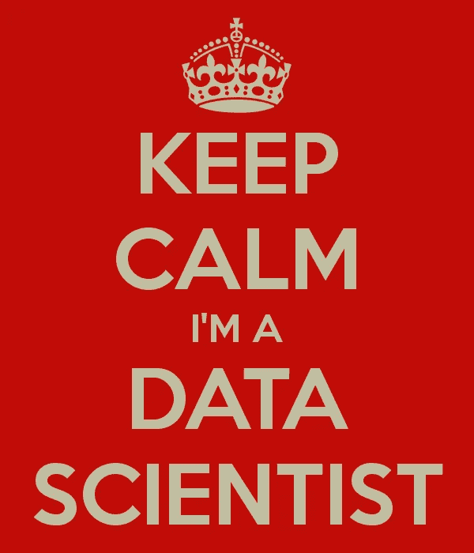

# 初级数据科学—选择您的第一份工作

> 原文：<https://towardsdatascience.com/junior-data-science-choosing-your-first-job-4f74750982dc?source=collection_archive---------26----------------------->

## *当您选择第一份数据科学工作时，有几个陷阱可以很容易避免*

虽然有许多人想成为数据科学家并在寻找他们的第一个职位，但初级数据科学职位很少。数据科学职位的范围从非常面向研究的公司职位(也在科学会议上发表论文，这种情况非常罕见)到更需要动手并涉及大量编码的职位。(初级)数据科学家也来自不同的背景:刚毕业的人(不同领域的 bsc、msc 和 PhD)，有经验的开发人员，他们想学习新的技能，接受再培训等等。

虽然初级数据科学职位很少，但做出准确选择并避免常见陷阱很重要。该帖子是由 Ori Cohen 针对招聘方的帖子“T2 数据科学招聘-为什么你可能做错了”引发的。这篇文章是给正在寻找第一份工作的数据科学家的。这里有一些见解。

**不要做公司里的第一个数据科学家**

这听起来像是一个非常性感的职位——你刚从大学毕业，你的技能能够给一家小公司留下深刻印象。他们让你成为公司里的第一个数据科学家，嘣！您将能够以正确的方式塑造方法、流程和工具，就像您一直想象的那样！

*״In 的理论、理论和实践都是一样的。实际上，他们是 not״* ( [本杰明·布鲁斯特](https://quoteinvestigator.com/2018/04/14/theory/))。

许多实际任务不像教科书或吴恩达的课程那样。您很可能需要一位经验丰富的数据科学家的指导和建议，她已经犯了错误，熟悉数据和产品的限制条件，而且经验丰富。你想学习的技能会随着时间的推移而变化，但总有人在你身边，你可以从中学习，这总是一个好主意。

另一个问题是，小公司通常只有很少的数据，通常不足以训练模型，数据质量也可能是一个问题。这将需要对产品进行变更，并对其进行定义和实施。作为一名初级数据科学家，要完成这种变化所需的技术和政治工作可能很复杂。

您如何知道您正在面试第一个数据科学职位:

1.  您将被如此明确地告知——“您将成为我们的第一位数据科学家”
2.  你的面试官都不是数据科学家，他们问的问题没有反映出对这个话题的深刻理解。

**人们不会辞职——他们会辞掉老板**

在辞职之前——人们为老板工作。

面试是双方面的。公司面试你，你也面试公司。产品让你兴奋吗？你认为这家公司有适合你的价值观和文化吗？你愿意为这位经理工作吗？

你很可能会与你的经理和队友密切合作。他们打动你了吗？你会重视他们的反馈吗？

为了学习和提高，需要大量的反馈和沟通，尤其是在初级职位的时候。有规律的 1:1 吗？有登机计划吗？他们是否参加会议\是否有教育预算？这家公司有你想要的工作生活平衡吗？

在面试中，面试官可能想取悦你，所以如果你直接问这些问题，他们可能会回答你希望听到的问题。与队友和公司的其他同事交谈可以让你对团队和公司有更多的了解。

**工具和技术**

如果你主要关注研究，你可能会发现这一点是次要的。然而，对于你的下一个职位，可能需要实践经验。一定要选择一个使用合理技术的地方，而不是一个利基，深奥的技术。例如使用汇编进行机器学习，在大型机环境下工作等。

数据科学家目前合理的技术栈包括:python(也许是 scala，也许是 [R](https://www.r-bloggers.com/data-science-jobs-report-2019-python-way-up-tensorflow-growing-rapidly-r-use-double-sas/) 取决于你的风险厌恶程度)和科学 python 包(pandas、numpy、scipy 等)，云环境，某种数据库(postgres \ MySQL \ elastic search \ MongoDB)。

最后但同样重要的是——选择一些你热爱的事情，这样你会很高兴早上去上班，晚上梦见你的代码:)

特别感谢[利亚德·波拉克](https://medium.com/@pollakliad/)和[艾迪·科恩](https://medium.com/@cohen.idit10)让这段文字变得可读