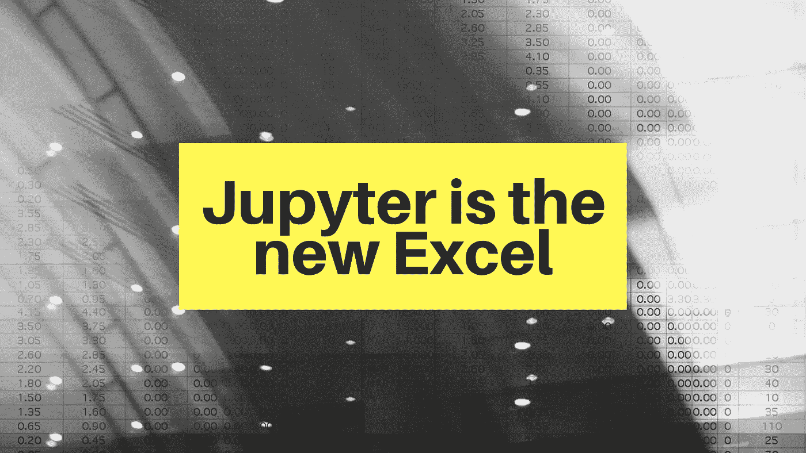
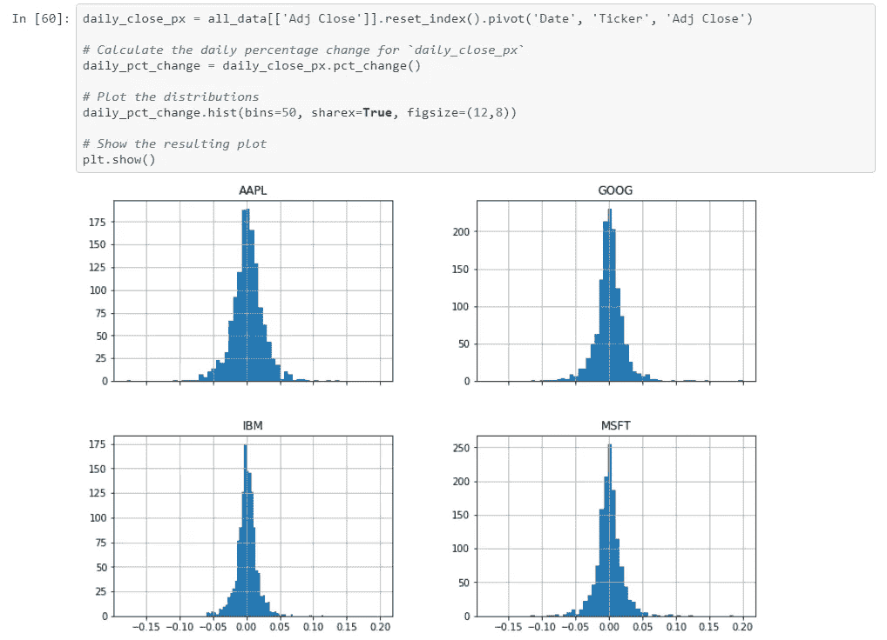
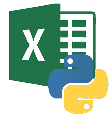

# Jupyter 是新的 Excel

> 原文：<https://towardsdatascience.com/jupyter-is-the-new-excel-a7a22f2fc13a?source=collection_archive---------1----------------------->

## 为什么交易者和金融专业人士需要学习 Python

如果你是一名交易员或者在金融服务行业工作，Excel 就是你的面包和黄油。你可以分析价格和其他分笔成交点数据，评估你的交易组合，计算风险值，进行回溯测试，等等。你是数据透视表、公式、图表甚至 VBA 和 PowerQuery 的专家。你可以快速处理一个解决方案，但是在你意识到之前，你的电子表格会扩展成几十个标签、几千行和意大利面条 VBA——所以它的可读性和可维护性已经荡然无存。当你敢按 F9 键刷新结果时，你可以拿一杯茶，然后再等一会儿(如果你的电脑在这期间没有崩溃的话)！

👉🏻 ***听起来熟悉吗？*** *你大概正在狂热地点头。*

尽管电子表格很有用，但它不能提供你所寻求的所有答案。让我们看看是什么让 Excel 如此受欢迎，它在哪些地方出了问题，但最重要的是，为什么𝕐𝕆𝕌应该开始使用 Jupyter 笔记本作为一种替代的强大的分析工具。

# 超越天堂

一些因素使得 Excel 如此有价值，最值得注意的是它简单而强大的**反应式计算模型**和**内置函数**。电子表格就像一块空白画布，“业余程序员”可以在上面使用 Excel 的专有语言(如公式和 VBA)编写代码。

银行部署了广泛的 IT 系统来运行业务关键流程，但是电子表格形式的[影子 IT](https://en.wikipedia.org/wiki/Shadow_IT) 出现了爆炸式增长，它们补充了这些核心系统，并作为新业务计划的默认工具。由于企业系统不像动态财务环境中所要求的那样**灵活**以适应**快速上市**，Excel 的出现填补了这一空白！虽然这种方法很方便，但它是正确的吗？

> Excel 在企业中的角色需要重新定义！

# Excel 地狱

试图使用电子表格对大量数据进行高级、快速的分析，是使用了错误的工具。

以下是 Excel 高级用户面临的一些问题:

*   **级联错误** : Excel 臭名昭著的错误是沿着一列向下传播，然后穿过整个电子表格，形成一个雪球，变成雪崩式的麻烦。可怕的是，有些人看不见，直到为时已晚。[已经有几个案例被公之于众，在这些案例中，事情出了差错，产生了巨大的成本影响。](https://www.teampay.co/insights/biggest-excel-mistakes-of-all-time/)
*   **可伸缩性** : Excel 对它可以容纳的行数和列数有一个[限制](https://support.office.com/en-ie/article/excel-specifications-and-limits-1672b34d-7043-467e-8e27-269d656771c3)，但是随着数据集以指数速度增长，电子表格很快就会耗尽内存或占用大部分 CPU。当这种情况发生时，数据损坏的风险就会大大增加。
*   **性能**:在复杂的工作簿中，改变一个数字会影响数百次重复计算，Excel 需要时间来解决每个问题。当达到一定大小时，它不仅会降低电子表格本身的速度，还会影响任何其他需要内存空间的应用程序的性能。
*   **测试**:测试一个电子表格的正确性，然后证明后续的修改没有破坏其他任何东西，这几乎是不可能的。
*   **可追溯性/调试**:通常一个很小的变化都会严重破坏您复杂的公式，使其极难识别和修复。
*   **全包**:数据和计算都包含在 Excel 文件中，从本地计算机运行。这意味着协作受到约束，使版本控制成为一场噩梦。此外，数据是基于最新刷新的静态数据，而不是随着条件的变化而实时更新。

> 所有这些问题在几十年前就已经被传统软件解决了。

最后但同样重要的是:

*   **运营风险**:所有电子表格都是从小型/快速修复计算开始，但有些会转变为永久性的企业级解决方案。它们为许多业务流程提供支持，但由于缺乏对整个环境谱系的了解，许多财务、运营和监管流程的完整性受到了威胁。这是我目前工作的热门话题。如果你想了解更多关于终端用户计算(EUC)风险的信息，[这是一篇非常好的文章](https://www.clusterseven.com/what-is-euc-risk)。

Courtesy: [Pixabay](https://pixabay.com/illustrations/excel-spreadsheet-icon-mess-icons-1771393/)

# 各位编码员好；再见交易者

传统上，银行将量化交易团队分为**量化交易员**和**量化开发人员**。前者想出交易的点子，后者把这些点子转化成可执行的代码。当作为一名交易员，你也是一名熟练的编码员，这种分离就不再需要了，这给了你一个竞争优势:不仅银行希望优化他们的**成本**，因此你可以在冗余中生存，而且你可以将你自己的交易模型付诸行动，利用这个**时间优势**为你谋利。能够自动化平凡的任务是如此的解放，事实上编码是如此的有创造性！

这也很大程度上是一代人的事情，因为越来越多的初级交易员已经具备了 uni 的编程技能，所以如果你想保持你的就业能力，你需要参与进来。

# 如何使用 Python 和 Jupyter 笔记本

*——看我做了什么？*😄

那么，对于那些发现 Excel 有局限性(如果不是过时的话)的交易员和金融专业人士，解决方案是什么呢？

> **学习 Python，使用 Jupyter 笔记本作为容器！**

## 计算机编程语言

Python 相当容易学习，并且非常通用，因此在金融界越来越受欢迎。现在，除了 Excel，它还是许多定量角色的先决条件。它没有 C++(或 Java)那么复杂，这意味着:❶的学习曲线没有那么陡峭，❷完成一项任务所需的代码量也少了 1/5 或 1/10。

Python 越来越受欢迎，这从大量的**库**中可见一斑，这些库支持交易者需要的几乎所有东西:

◽读取、写入、清理、按摩、切片/切块数据
◽数学、统计和时间序列
◽金融分析:交易和量化金融、市场数据分析、股票/衍生品市场分析、彭博社数据访问、执行引擎、回溯测试、风险分析等
◽机器学习管道(例如预测市场价格)
◽绘图和漂亮/交互式可视化
◽ SQL 支持
◽发送电子邮件
◽网络抓取(例如在线获取市场价格)【T19

❗️ *在这里* *(非附属)找到一个简明扼要的库* [*。*](https://financetrain.com/best-python-librariespackages-finance-financial-data-scientists)

## 朱皮特

同样，Jupyter Notebook 是一个基于网络的计算环境，使您能够创作文档，包括:实时代码、图表、[小部件](/bring-your-jupyter-notebook-to-life-with-interactive-widgets-bc12e03f0916)、丰富的叙述性文本(包括链接、等式等)、图片等。更具体地说，您可以:

*   **在浏览器**中编辑代码，自动语法高亮、缩进和制表符补全/自检。
*   **从浏览器**运行代码，计算结果附在生成它们的代码上。

它们提供了一个**全包**、自包含的计算记录，因此它们可以代替 Excel 用作实时数据分析平台。

Courtesy: [Python for Finance Tutorial](https://github.com/datacamp/datacamp-community-tutorials/blob/master/Python%20Finance%20Tutorial%20For%20Beginners/Python%20For%20Finance%20Beginners%20Tutorial.ipynb)

# 最佳地点

所以你可能会想:

👉🏻我还会使用 Excel 吗？ *当然……*

在以下用例中，电子表格仍然是您的最佳选择:
◽️的正确性和准确性并不重要
◽的数据不太大(即不需要可伸缩性)
◽不需要实时更新
◽使用 Excel 作为暂存板来快速组装原型
◽不需要长期维护。

你需要的是一些允许快速开发，验证正确性和可扩展性，同时保持**与 Excel** 相同的反应模型。而这正是 Jupyter 笔记本所提供的！

> 不，Excel 没有过时，但是 Jupyter 笔记本是更好的数据分析工具！

尽管我已经明确提到了使用 Python/Jupyter 组合优于 Excel 的一些实质性优势，或者在“Excel 地狱”一节中暗示了它们作为反例，但我还是在这里收集了它们的前 10 个(你看，我确实喜欢列表！):

✔️ **强大的数据操作**——*它毕竟是数据科学家的工具箱！* ✔️ **高级可视化功能** — *不再有无聊的图表！* ✔️ **更好的用户体验**
✔️ **大数据集处理** — *不再死机！* ✔️ **性能管理** — *利用多处理* ✔️ **测试驱动开发** — *思考质量！* ✔️ **开源可访问性**——“*有它的 lib！”* ✔️ **误差溯源**
✔️ **更容易自动化**
✔️ **自记录**——*不要低估这个的价值！*

# 从哪里开始

我意识到进入这个领域可能会令人生畏，但是编程不是学习语言的语法，而是使用正确的语言和工具来解决问题:在我们的例子中，是 Python 和 Jupyter。

这里有两个很好的资源可以帮助你开始(非附属):

*   **想 Python** : [免费电子书下载](http://greenteapress.com/thinkpython2/html/index.html)
*   **Jupyter 初学者笔记本** : [在线教程](https://www.dataquest.io/blog/jupyter-notebook-tutorial)。

关键的一点是:

> 保持相关性！

# 最后的想法

很难想象没有电子表格的公司世界！

银行开始发现 Python 可以替代 Excel 来处理关键工作负载。巴克莱银行最近因努力教他们的交易员编码而成为头条新闻。我认为你也应该遵循这个范例，你不会失望的！

让 Excel 做 Excel 擅长的事情，把分析和自动化搬到 Python 和 Jupyter 笔记本里。

> 有一个动态和交互式分析的快乐世界在等着你！

感谢阅读！

*我经常在媒体上写关于技术的&数据——如果你想阅读我未来的帖子，请*[*‘关注’我*](https://medium.com/@semika) *！*