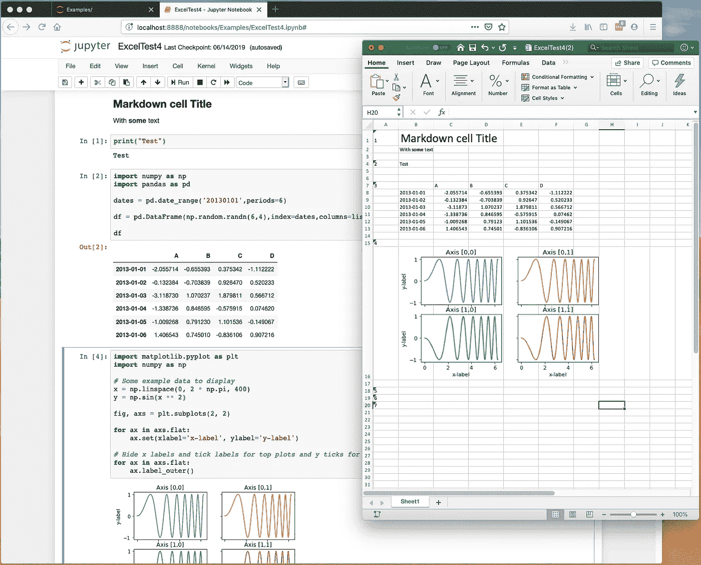
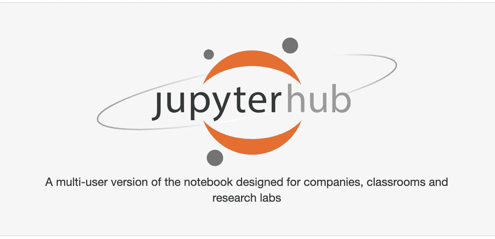
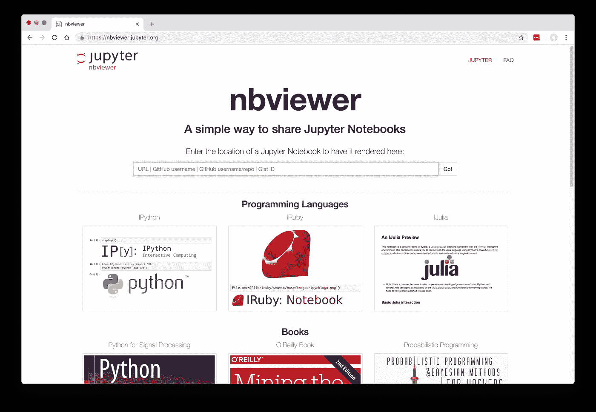
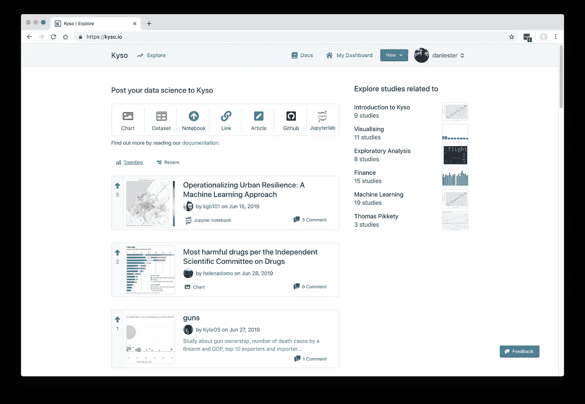

# Jupyter 是新的 Excel(但不是为你的老板)

> 原文：<https://towardsdatascience.com/jupyter-is-the-new-excel-but-not-for-your-boss-d24340ebf314?source=collection_archive---------4----------------------->

最近你可能已经看过 Semi Koen 写的一篇非常有见地的文章，名为 [Jupyter 是新的 Excel](/jupyter-is-the-new-excel-a7a22f2fc13a) 。她描述了许多专业人士在面临大量数据分析任务时会立即使用 Excel，但她认为，对于许多“大数据”挑战，使用 Jupyter 笔记本电脑更有意义。

如果你是一名精通 Jupyter 兼容语言的数据科学家，那么你会明白她的意思——你不会想到从 Excel 开始处理大型数据集。

但是你的老板呢？他仍然喜欢 Excel，如果你让他看你的 Jupyter 笔记本，而不是给他看 Excel 电子表格中的简单表格或图表，他会不高兴的。(好吧，你的顶头上司可能也是数据科学家，但产品经理或公司董事长呢？)西装革履的人喜欢把鼠标拖到一列数字上，看看它们在 Excel 的状态栏上加起来是多少。

这篇文章是关于与那些对代码不太熟悉的人分享你的 Jupyter 笔记本的结果。我们将探索可用的解决方案(包括我自己解决问题的尝试)并讨论仍然存在的挑战。

Photo by [Campaign Creators](https://unsplash.com/@campaign_creators?utm_source=medium&utm_medium=referral) on [Unsplash](https://unsplash.com?utm_source=medium&utm_medium=referral)

# 从哪里开始？

让我们说你的辛勤工作分析数据结果在表格中，如熊猫数据帧和图表选择。你和别人分享这些的选择是什么？

根据您的目标受众，有两条明显的主要途径可供您选择:

*   导出(例如，您可以通过电子邮件发送的单独的 PDF 或 Excel 电子表格)
*   托管(一些易于阅读的笔记本版本，可能已经消毒，但仍具有交互性)

许多选择立即归结于一个简单但令人沮丧的问题:隐藏代码单元的困难。您的管理团队肯定不想看到您用来生成与他们共享的表格和图表的 Python 代码。

## 隐藏您的代码

这被证明是非常困难的，而且似乎没有任何适用于所有场景的标准方法。

Jupyter 有一个扩展[隐藏所有输入](https://github.com/ipython-contrib/jupyter_contrib_nbextensions/tree/master/src/jupyter_contrib_nbextensions/nbextensions/hide_input_all)，它允许你在 Jupyter 中在可见和隐藏之间切换代码单元，但这不会影响到大多数导出/静态共享解决方案。

一个 [StackOverflow 帖子](https://stackoverflow.com/a/28073228/2792760)包含了一个建议粘贴在你的笔记本顶部的代码片段，它可以进入 nbviewer(稍后讨论的“静态托管”共享解决方案之一)并导出 HTML，但没有很多导出选项…

当我们讨论共享笔记本的每种可能方式时，我们将回头讨论这个问题。

# 导出解决方案

首先，让我们看看从任何看起来像托管的 Jupyter 笔记本的东西中取出的最佳方法，并以一个我们可以附加到电子邮件的简单文件结束。

## 下载为

在你的 Jupyter 笔记本中，查看文件菜单，打开“下载为”查看一些可能的文件格式。

“HTML”选项是在独立文件中准确表示原始笔记本的最佳方式。这也可以通过上面提到的“StackOverflow”代码片段保持代码单元格的隐藏，但不会尊重大多数小部件。在任何情况下，HTML 都不是您的管理层习惯于通过电子邮件接收的格式，甚至可能被安全软件阻止。

PDF 听起来更像。但是这很难直接获得(你需要先安装某种形式的 LaTeX 软件，这可能很麻烦)，而且它不会隐藏你的代码单元。事实上，生成 PDF 的最佳方式可能就是使用浏览器自带的打印功能，要求它输出一个 PDF，显示当前在浏览器中显示的笔记本。这将打包你当时在浏览器中看到的所有内容(所以如果代码单元格通过[隐藏所有输入](https://github.com/ipython-contrib/jupyter_contrib_nbextensions/tree/master/src/jupyter_contrib_nbextensions/nbextensions/hide_input_all)被隐藏，那么这也将反映在 PDF 中)。

## 心爱的 Excel 电子表格

大多数其他可用的格式是相当技术性的，并不真正适合我们在这里试图实现的。这让我开始了 [nb2xls 项目](https://github.com/ideonate/nb2xls)——一个易于安装的额外导出选项，允许你根据笔记本的输出单元格(标准情况下不包括输入代码单元格)获得 Excel 电子表格文件。

最棒的是，表格仍然是电子表格中的表格——您的经理可以将鼠标拖到数字上，查看总数和平均值！图表等图形输出也会出现。我们不需要担心页面大小，因为如果笔记本是长或宽，我们有足够的行和列来填充。

nb2xls screenshot

要安装，只需运行`pip install nb2xls`，这将在文件菜单中添加一个额外的“下载为”选项:“Excel 电子表格(。xlsx)'。

在编写的时候，这是一个实验性的包——代码仍然需要一些工作来为复杂的表或 markdown 产生最好的结果。请用您自己的笔记本尝试一下，如果有任何需要改进的地方，请联系(请尽可能发送 ipynb 文件示例)。

更多细节和例子在 [GitHub 这里](https://github.com/ideonate/nb2xls)。

## 在命令行上转换

所有这些“下载为”选项实际上只是命令行实用程序`nbconvert`的包装器，用默认选项调用转换过程。如果您确实需要指定任何转换选项，了解等效命令行可能会有所帮助。

例如， [Hide Input All](https://github.com/ipython-contrib/jupyter_contrib_nbextensions/tree/master/src/jupyter_contrib_nbextensions/nbextensions/hide_input_all) 扩展文档建议使用以下命令来获取一个移除了输入代码单元格的导出 HTML 文件:

`jupyter nbconvert --template=nbextensions --to=html my_notebook.ipynb`

## 自己存文件！

“下载为”选项为将笔记本的框架导出到单独的文件提供了一些有用的基础结构。但是值得记住的是，您已经处于自己熟悉的编码环境中，所以直接从代码单元生成一些文件可能是有意义的。

例如，如果你有一个大型熊猫数据帧，最好的办法是将其保存为 CSV 格式，这样你的收件人就可以完整地加载它。类似这样的:`df.to_csv('./data.csv')`。在实践中，您可能想先将它导入 Excel，这样您就可以设置列的格式并给标题加下划线等。

# 当你无法逃离朱庇特时

虽然上面的导出选项几乎可以让你以独立的文件格式获得笔记本的关键内容，但有时(尤其是当小部件在你的笔记本中占很大比重时)你需要找到一种方法来坚持使用你现有的 Jupyter 格式。

但是您需要找到一种方法来与您的非开发人员共享它，以便它:

*   对他们有意义
*   很容易接近
*   是安全的，因此敏感数据不会在您的组织之外被看到
*   是安全的，因此非开发人员不能破坏任何东西或破坏任何数据

本文的其余部分揭示了一些可能的方法。

# Jupyter 自己的项目

Jupyter 项目组织有一些辅助项目，如果您需要经常共享笔记本电脑，值得投资一些基础设施，可以考虑这些项目。

## 两个枢纽

JupyterHub 是一种在共享资源上集中创建 Jupyter 工作空间的方式，因此至少其他用户不需要运行他们自己的 Jupyter 服务器。除非您有一个可以在内部网络上运行 JupyterHub 的小型组织，否则您将需要考虑如何为适当的用户添加身份验证。这里有一些关于如何在不同用户的工作区内共享笔记本的[建议](http://tljh.jupyter.org/en/latest/howto/content/share-data.html)。

Logo on the JupyterHub homepage

[BinderHub](https://binderhub.readthedocs.io/en/latest/) 通过允许用户启动基于特定计算环境(Python 包等)的 Jupyter 工作空间，真正扩展了 JupyterHub，该工作空间是在 git 存储库中定义的，并带有与项目相关的数据文件和笔记本。用户可以通过直接访问单个 URL 来启动工作区。这为你的作品提供了一个更加正式和易于访问的展示平台。要查看名为[mybinder.org](https://mybinder.org)的 BinderHub 公共实例的示例，请查看 GitHub 上 my [nb2xls repo](https://github.com/ideonate/nb2xls) 的自述文件页面上的“启动活页夹”链接。

实际上，这两个项目都不适合我们开箱即用的任务——管理团队不希望必须通过笔记本输入他们的方式！将工作存储在 git repo 或 workspace 中，以便对非开发人员有意义，这是很大的管理开销。

## nbviewer

nbviewer 是一个更合适的轻量级服务，可以通过一个 URL 轻松托管笔记本电脑。可以把它想象成上面讨论的 HTML 导出选项的托管网页版本:Javascript 可以工作，但它背后没有活动的内核，所以用户只能在最后一次运行笔记本时看到您的工作结果。

和 Binder 一样，nbviewer 也有一个免费托管版本供您试用。通常，你在 GitHub 上提供一个笔记本的 URL，但是它也可以使用 Dropbox 链接。例如，在 Dropbox 中的 ipynb 文件上“复制 Dropbox 链接”,然后将 URL 粘贴到[https://nbviewer.jupyter.org/](https://nbviewer.jupyter.org/)上的框中。您可以与同事共享生成的查看器页面的 URL，但当然要注意这是不安全的。

nbviewer.jupyter.org homepage

分享一个 URL 比通过电子邮件向你的管理团队发送一个 HTML 文件更自然，但实际上你不会从 nbviewer 中获得太多 HTML 导出无法获得的东西。

因此，到目前为止，Jupyter 项目的主要倡议似乎都没有对我们有多大帮助…

## 在那里！

Project Jupyter 最近的一项发展可能正是我们正在寻找的东西:[瞧，](https://github.com/QuantStack/voila)允许你托管一个带有活动内核的笔记本，而不需要任何 shift-enter。默认情况下，代码单元格是隐藏的。默认情况下，来自前端的执行请求是不允许的，所以用户不能破坏任何东西，即使他们尝试！

Jupyter [的博客帖子宣布 voilà](https://blog.jupyter.org/and-voil%C3%A0-f6a2c08a4a93) 在描述他们试图解决的问题方面做得很好(这正是我们正在讨论的问题！)并解释了一些特性。

voilà logo

在我们讨论的情况下，这可能成为分享您笔记本的一种奇妙方式，但它仍需要大量工作。在撰写本文时，您只能共享一个指向笔记本应用程序的单用户链接，如果多个用户的独立操作扰乱了您的笔记本中的数据流，他们可能会发生冲突。

已经有计划将 voilà与 JupyterHub(如上所述)集成，这将允许多用户访问您的 voilà托管的笔记本电脑。当然，您仍然需要确保每当您的同事选择查看您的笔记本电脑时，voilà服务器都在运行，因此这不是您通常会在本地计算机上运行的内容。

# 看得更远

[Kyso](https://kyso.io/) 是一项第三方服务，允许你“记录你的数据科学”。他们的主页上列出了公共笔记本(以及文章、链接、数据集和图表)，这应该会让你对如何在付费计划上共享笔记本有所了解，你可以将协作限制在你的团队内。默认情况下，代码输入单元格是隐藏的！

应该有可能包含实时的 Jupyter 窗口小部件，尽管现在我遇到了一些问题，因为 JupyterLab 还不完全稳定，而且许多 Jupyter 窗口小部件还不适合 JupyterLab。Kyso 目前似乎固定在 JupyterLab 0.35。

如果您认为像这样的第三方服务可能适合您，请联系他们的销售团队了解更多关于功能的详细信息。

Kyso homepage showing some public notebooks

另一项服务， [Saturn Cloud](https://www.saturncloud.io/) 是一个完整的数据科学云托管环境，作为 Google Cloud 或 AWS 等的替代方案，内置了“发布”功能。虽然你的同事可以很容易地发布你的笔记本，但完全保密的发布似乎是不可能的。

我肯定还有其他人。如果您使用了第三方服务来解决这个问题，请在评论中告诉我们。

# 结论

事实证明，与非开发人员分享我们的 Jupyter 笔记本实验结果比我们希望的要困难得多！我们想要的功能是确保代码是隐藏的，结果是易于访问的，显示是交互式的，我们的数据是安全可靠的。

虽然现在有一些导出功能可用(HTML、pdf、Excel 电子表格)，但在共享复杂数据的情况下，这些都存在挑战或限制。看看更实际的托管选项，我们要么需要实施我们自己的基础架构(例如运行我们自己的 nbviewer 或 voilà实例)，要么将我们的数据科学工作流改造成新的第三方云托管服务。

因此，最佳解决方案将在很大程度上取决于您共享的数据，以及您需要提交类似报告的频率。值得注意的是，在你的整个组织中，各种演示都有一定的模式。对于大数据分析的临时共享，您可能仍然需要从仔细导出的 CSV 组装您自己的电子表格；但是如果这种情况经常发生，可能是时候投资一些可重用的基础设施来解决这个问题了。