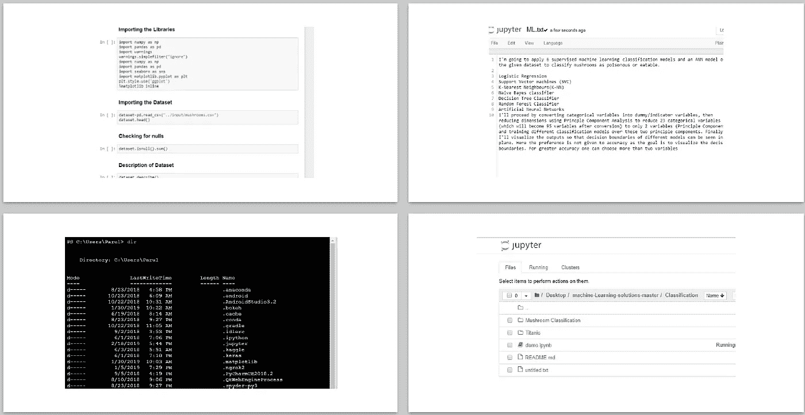

# 朱庇特实验室:朱庇特笔记本的进化

> 原文：<https://towardsdatascience.com/jupyter-lab-evolution-of-the-jupyter-notebook-5297cacde6b?source=collection_archive---------0----------------------->

## JupyterLab 概述，Jupyter 笔记本的下一代。


> 为了给更好的东西让路，所有美好的事情都会结束。

数据显示，Github 上有超过 300 万台 Jupyter 笔记本可供公众使用。私立学校的数量也大致相同。即使没有这些数据，我们也很清楚笔记本电脑在数据科学领域的受欢迎程度。编写代码、检查结果、获得丰富输出的可能性是 Jupyter 笔记本非常受欢迎的一些特性。但是俗话说，天下没有不散的宴席，我们最喜欢的笔记本也是如此。 ***JupyterLab 最终将取代经典的 Jupyter 笔记本*** 但为好。

# 朱庇特实验室


[Source](https://github.com/jupyterlab/jupyterlab-demo/blob/master/slides/jupyterlab-slides.pdf)

不久前，我发表了一篇关于有效使用经典 Jupyter 笔记本的[指南](/bringing-the-best-out-of-jupyter-notebooks-for-data-science-f0871519ca29)。但是正如我们将看到的， [JupyterLab](http://jupyterlab.readthedocs.io/en/stable/) 是 Jupyter 项目[的下一代用户界面，提供经典 Jupyter 笔记本的所有熟悉的构建模块(笔记本、终端、文本编辑器、文件浏览器、丰富输出等)。)中一个灵活而更强大的用户界面 ***。Jupyter 实验室的基本想法是将经典笔记本中的所有构建模块，加上一些新的东西，放在一个屋檐下。***](https://jupyter.org/)

# 目录

1.  [安装](https://medium.com/p/5297cacde6b/#4e68)
2.  [界面](https://medium.com/p/5297cacde6b/#0992)
3.  [创建和保存文件](https://medium.com/p/5297cacde6b/#de91)
4.  [灵活的布局](https://medium.com/p/5297cacde6b/#0dfd)
5.  [增强的笔记本功能](https://medium.com/p/5297cacde6b/#c495)
6.  [支持的文件格式](https://medium.com/p/5297cacde6b/#c8dd)
7.  [互动计算](https://medium.com/p/5297cacde6b/#8b18)
8.  [扩展](https://medium.com/p/5297cacde6b/#6b51)
9.  [结论](https://medium.com/p/5297cacde6b/#7cc2)

> 如果您对 Jupyter Lab 完全不熟悉，您可以从安装开始阅读这篇文章。但是如果您已经使用过它们，并且想要一个高级的概述，跳过前四个部分，直接跳到**第 5 部分**，确保您使用的是最新版本。

# 1.装置

JupyterLab 可以使用`conda, pip` 或 `pipenv.`安装

```
**#conda**
conda install -c conda-forge jupyterlab**#pip** pip install jupyterlab**#pipenv**pipenv install jupyterlab
pipenv shell
```

查看官方安装[文档](https://jupyterlab.readthedocs.io/en/stable/getting_started/installation.html)了解更多详情。

## 启动 JupyterLab

您只需在控制台键入以下命令即可启动 Jupyter:

```
jupyter lab
```

JupyterLab 将在浏览器中自动打开，其界面类似于下图。这意味着一切就绪，你可以开始了。


因为我在 Jupyter 实验室同时使用了`Python`和`R`，所以我的工作表中有它们的图标。

[🔝](https://medium.com/p/5297cacde6b/#8949)

# 2.连接

在使用它的各种功能之前，让我们先了解一下这个接口。


*   **菜单栏**

菜单栏有顶级菜单，显示 Jupyter Lab 中可用的各种操作。

*   **左侧栏**

这包括常用的选项卡。通过在查看菜单中选择`Show Left Sidebar`或点击当前侧边栏标签，可以折叠或展开左侧侧边栏。

您可以从 `Running`面板查看正在运行的会话，而`Commands`面板允许您搜索所有可用的命令。


*   **主要工作区域**

这是实际活动发生的地方。它包括笔记本、文档、控制台、终端等。只需双击或拖动文件到此区域即可开始工作。工作区可以使用命名的工作区 URL 保存在服务器上。


此外，您可以通过将 JupyterLab 的 url 中的`lab`更改为`tree`来在经典的**笔记本视图**和 **JupyterLab 视图**之间切换。


[🔝](https://medium.com/p/5297cacde6b/#8949)

# 3.创建和保存文件

在本节中，我们将快速了解如何在 Jupyter Lab 中处理文件。

## 创建文件

只需点击主菜单中的`+` 图标。这将在主工作区打开一个新的启动器选项卡，使我们能够创建笔记本、控制台、终端或文本编辑器。使用`File`选项卡也可以实现相同的操作。一旦打开，文件可以被重命名，甚至下载。


## 打开现有文件

打开文件是一个非常简单的过程。双击它们或通过上方的 `File`选项卡访问它们。


[🔝](https://medium.com/p/5297cacde6b/#8949)

> 这些只是 Jupyter 实验室的基础，基本上是开始。现在让我们继续讨论它的真正功能，以及它优于传统笔记本的原因。

# 4.灵活的布局

经典的 Jupyter 笔记本也支持内置的文本编辑器和终端，但这些选项很少使用，因为它们大多隐藏在视线之外。另一个原因是，所有这些组件都是作为独立功能工作的，而不是集成的。



Different blocks in a classic Network which worked independently

Jupyter 实验室倾向于通过将所有功能集成到一个单一的交互和协作环境中来填补这一难题。

*   **笔记本**

JupyterLab 中使用的[笔记本文档格式](http://nbformat.readthedocs.io/en/latest/)与经典 Jupyter 笔记本中的相同。现有的笔记本应该可以在 JupyterLab 中正确打开，我们可以在那里进行常规分析。


*   **控制台**

有些控制台是为习惯 QT 控制台类型环境的人准备的。这些控制台使我们能够在内核中交互式地运行代码。


*   **文本编辑器**

文本编辑器使编辑文件成为可能。文本编辑器包括语法高亮、可配置缩进(制表符或空格)、[键映射](https://jupyterlab.readthedocs.io/en/stable/user/interface.html#editor-keymaps)和基本主题化。这些设置可以在设置菜单中找到。


*   **端子**

JupyterLab 终端提供对系统 shell(bash、tsch 等)的全面支持。)和 Windows 上的 PowerShell。我们可以用终端在我们的系统外壳中运行任何东西，包括像 vim 或 emacs 这样的程序。


现在，有人会说，所有这些功能在经典笔记本中都存在，那么是什么让 Jupyter Lab 与众不同呢？事实上，它给了我们一个非常灵活的布局系统，让我们可以选择这些标签，并排拖动它们，并以几乎无限的灵活性调整它们的大小，这是以前所没有的。


[🔝](https://medium.com/p/5297cacde6b/#8949)

# 5.增强的笔记本功能

Jupyter lab 不是笔记本格式的重新实现，而是存在于所有现有架构之上的新前端。然而，这种新的前端实现使我们有可能纳入传统笔记本电脑中遗漏的功能。一些功能包括:

## 展开和折叠单元格


## 在笔记本中拖放单元格


## 编辑器中的制表符自动完成

文本编辑器现在具有代码自动完成特性。然而，到目前为止，只有当文本编辑器有一个附加的控制台时，它才被启用。


## 主题

整个 JupyterLab 和文本编辑器都有可用的主题。


[🔝](https://medium.com/p/5297cacde6b/#8949)

# 6.支持的文件格式

Jupyter Lab 还支持其他格式，如:

*   图片:jpeg，png 等和 gif
*   杰奥森
*   Vegalite 文件，geojson 文件，
*   PDF 文档
*   高性能 CSV 查看器

Jupyter 实验室基本上可以渲染任意大的 CSV，而这些 CSV 在 Excel 中通常被渲染为无响应。它的交互性还不是很强，但预计很快会有一些改进。

[🔝](https://medium.com/p/5297cacde6b/#8949)

# 7.交互式计算

Jupyter 的真正能力在于它支持交互式计算，这在数据科学中尤其有用。

## 为输出创建新视图

我将使用 Jupyter Github 官方页面上的[洛伦兹微分方程](https://en.wikipedia.org/wiki/Lorenz_system)笔记本。在运行了几个细胞后，我们得到了交互式洛伦兹吸引子作为输出。有时当我们有一个交互式输出时，不得不上下滚动到生成它的代码，这有点令人沮丧。作为这个问题的解决方案，Jupyter 实验室给了我们一个选项，将输出分成一个新的选项卡，我们有一种**伪仪表板**，在那里我们可以使用滑块并更改参数。


## 同一文件上的新视图

有时我们的笔记本太长，所以我们可以在一个实例中有相同(或不同)笔记本的两个视图。当我们想同时查看笔记本的顶部和底部时，这可能会很有用。


## 在笔记本之间拖放和编辑单元格

我们知道细胞可以在笔记本中拖动。然而，单元格也可以在不同的笔记本上拖动。此外，一个笔记本中的更改也会反映到另一个笔记本中。


## 简化代码文档过程

正确的说法是**代码被读的次数比它被写的次数多。文档是编程的一个非常重要的方面，Jupyter Lab 会让它变得更容易。在 markdown 文件中编写文档时，我真正面临的一个问题是，我必须在不同的控制台中运行代码，以检查它是否运行正常，然后将它包含在文件中。一次又一次地切换标签是很烦人的。**

Jupyter Labs 允许您将编辑器和控制台合并到一个视图中。因此，您可以检查代码和文档，同时预览整个文件。


[🔝](https://medium.com/p/5297cacde6b/#8949)

# 8.扩展ˌ扩张

JupyterLab 被设计成一个本质上可扩展的环境。扩展是真正强大的工具，可以真正提高一个人的生产力。JupyterLab 扩展是 [npm](https://www.npmjs.com/) 包(Javascript 开发中的标准包格式)。GitHub 上有许多社区开发的扩展。你可以搜索 GitHub 主题 [jupyterlab-extension](https://github.com/topics/jupyterlab-extension) 来查找扩展。

为了安装 JupyterLab 扩展，您需要安装 [Node.js](https://nodejs.org/) ，可以从他们的[网站](https://nodejs.org/en/)安装，或者如下所示。

```
conda install -c conda-forge nodejs
or
brew install node
```

## 安装扩展

可以使用以下命令安装新的扩展:

```
jupyter labextension install <my-extension>
```

其中，`my-extension`是 [npm](https://www.npmjs.com/) 上有效的 JupyterLab 扩展 npm 包的名称。使用`my-extension@version`语法安装特定版本的扩展，例如:

```
jupyter labextension install my-extension**@1**.2.3
```

更多详情，请参考关于扩展的[官方文件](https://jupyterlab.readthedocs.io/en/stable/user/extensions.html)。让我们来讨论几个我经常使用并且非常强大的扩展:

*   [**谷歌驱动扩展**](https://github.com/jupyterlab/jupyterlab-google-drive)


这个扩展在 JupyterLab 的左侧面板添加了一个 Google Drive 文件浏览器。当你登录到你的谷歌账户时，JupyterLab 就可以使用其中存储的文件。

**安装**

```
jupyter labextension install @jupyterlab/google-drive
```

除了安装扩展之外，您还必须向 Google 认证您的 JupyterLab 部署。通过[设置](https://github.com/jupyterlab/jupyterlab-google-drive/blob/master/docs/setup.md)文件或此处链接[了解流程。您将获得一个客户端 ID，您必须手动输入。](https://developers.google.com/identity/sign-in/web/sign-in)


[source](https://github.com/jupyterlab/jupyterlab-google-drive/blob/master/docs/setup.md)

**用法**


现在，如果有人分享一个笔记本或一个 markdown 文件，它会反映在 Jupyter 实验室的`shared with me`文件夹中。我们可以在那里打开并编辑它。

*   [**Github 扩展**](https://github.com/jupyterlab/jupyterlab-github)


这是一个用于访问 GitHub 库的 JupyterLab 扩展。这个扩展允许我们选择 GitHub 组织和用户，浏览他们的存储库，并打开这些存储库中的文件。如果这些文件是笔记本，我们可以像运行任何其他笔记本一样运行它们。

**安装**

```
jupyter labextension install @jupyterlab/github
```

安装后，我们需要从 GitHub 获取凭证。更多详情请阅读此处的[说明。](https://github.com/jupyterlab/jupyterlab-github#2-getting-your-credentials-from-github)

**用法**


*   [**Git 扩展**](https://github.com/jupyterlab/jupyterlab-git)


jupyterlab-git 是一个 jupyterlab 扩展，使用 git 进行版本控制。

**安装**

要安装，请执行以下步骤:

```
jupyter labextension install @jupyterlab/git
pip install jupyterlab-git
jupyter serverextension enable --py jupyterlab_git
```

**用途**


*   [**Drawio 插件**](https://github.com/QuantStack/jupyterlab-drawio)

Drawio 插件是一个 Jupyterlab 扩展，用于将 drawio 独立集成到 JupyterLab 中。**画**。 **io** 是一款免费的在线图表软件，用于制作流程图、过程图、组织图、UML、ER 和网络图。

**安装**

```
jupyter labextension install jupyterlab-drawio
```

**用法**


这些扩展确实让 JupyterLab 脱颖而出。在一个工作场所拥有所有的工具非常有用，因为人们不必在不同的环境之间切换来完成工作。除了上面的扩展之外，还有很多其他的扩展，你也可以随意尝试。

[🔝](https://medium.com/p/5297cacde6b/#8949)

# 结论

JupyterLab 是真正的下一代基于网络的用户界面。它装载了交互式计算工具和设计良好的界面，允许用户以新颖的方式组合它们。它非常强大，提供了各种强大的工具，使数据分析过程更加顺畅，效率也更高。