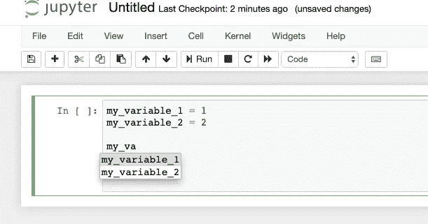
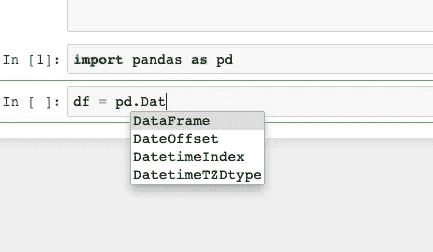
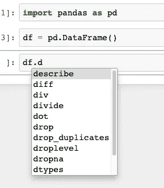
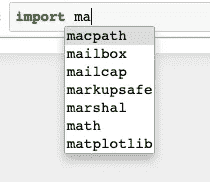

# Jupyter 笔记本自动完成

> 原文：<https://towardsdatascience.com/jupyter-notebook-autocompletion-f291008c66c?source=collection_archive---------5----------------------->

## 数据科学家的最佳生产力工具，如果您还没有使用它，您应该使用它…

大多数程序员都非常熟悉不同的自动完成工具。然而，我注意到许多数据科学家不使用它，至少在他们的职业生涯或教育中不够早。如果你是他们中的一员，是时候开始使用这个生产力工具了

什么是自动完成？

它是由您的编程环境提供的功能，用于完成您正在编写的代码。对于大多数程序员来说，这是一件幸事，如果你现在开始使用它，你也一样。这些只是使用自动完成的几个优点:

*   **节省时间** g .你再也不用输入这么长的变量了！
*   **更少的虫子**。那么你的代码因为变量输入错误而没有运行了多少次。然后当你改正它的时候，你发现同样的错别字在另一行。在调试代码时，只需要 30 分钟就能发现所有的小错别字。不再是了，欢迎自动完成。
*   **快速查找对象方法和属性。您可以使用 autocomplete 来查看对象的方法和属性，而无需查看文档。**

**Jupyter 笔记本自动补全**

如何使用 Jupyter 笔记本自动完成功能？好消息是:你不需要安装任何东西，因为它带有标准的 jupyter 笔记本设置。

要开始使用自动完成功能，你必须开始输入你的变量名，然后按下键盘上的 tab 键。当您这样做时，带有完整的建议变量名的框将会出现，就像下面的截图一样:

在上面的例子中，我输入了‘my _ va’并点击了 tab 键。自动完成功能建议有两个变量名以‘my _ va’开头，我可以使用 *my_variable_1* 和 *my variable_2。*如果我输入的前缀只有一个变量，而不是显示下拉选项，自动完成功能会为我输入完整的变量名。

**类的自动完成**

如果您想创建一个新对象，也可以使用自动完成功能。以下示例显示了“pd”的自动完成功能。Dat ':

 [## Jupyter 笔记本键盘快捷键，适合初学者

### 使用 Jupyter 笔记本编辑器时，了解提高工作效率的最重要的快捷方式。

medium.com](https://medium.com/towards-artificial-intelligence/jupyter-notebook-keyboard-shortcuts-for-beginners-5eef2cb14ce8) 

**方法和对象属性的自动完成**

如果您已经创建了一个对象并将其赋给了某个变量，那么您可以使用自动完成来访问带有类型化前缀的可用方法和参数的列表。正如您在这里看到的，数据帧有几个以字母 d 开头的方法和参数。

**模块的自动完成**

最后但同样重要的是，您可以使用自动完成功能来导入模块的名称。所以你几乎记得这个有很多很酷的算法的库是如何被调用的，但是不完全记得。您可以使用自动完成功能来帮助您。下面是导入以' ma '开头的模块的建议列表。

**结论**

我已经在 jupyter notebook 中展示了自动完成的几种用法，我希望我已经说服您开始使用它(如果您还没有这样做的话)。所以从现在开始，没有借口了，你应该在你的代码编写程序中引入自动完成功能。

对于我在这里没有指出的任何事情，你使用自动完成吗？我敢肯定，数据科学家还有其他方式使用它。如果你有建议，请在下面分享。

*原载于 about data blog . com:*[Jupyter 笔记本自动补全](https://www.aboutdatablog.com/post/jupyter-notebook-autocompletion)，*2019 年 10 月 30 日。*

*PS:我正在 Medium 和*[***aboutdatablog.com***](https://www.aboutdatablog.com/)*上写文章，深入浅出地解释基本的数据科学概念。你可以订阅我的* [***邮件列表***](https://medium.com/subscribe/@konkiewicz.m) *在我每次写新文章的时候得到通知。如果你还不是中等会员，你可以在这里加入***。**

*下面还有一些你可能喜欢的帖子*

* [## 9 大 Jupyter 笔记本扩展

### 改进笔记本电脑功能，提高您的工作效率

towardsdatascience.com](/top-9-jupyter-notebook-extensions-7a5d30269bc8)  [## Jupyter 笔记本中的 8 大魔法命令

### 通过学习最有用的命令来提高您的生产力

towardsdatascience.com](/top-8-magic-commands-in-jupyter-notebook-c1582e813560)  [## 当你开始与图书馆合作时，7 个实用的熊猫提示

### 解释一些乍一看不那么明显的东西…

towardsdatascience.com](/7-practical-pandas-tips-when-you-start-working-with-the-library-e4a9205eb443)*