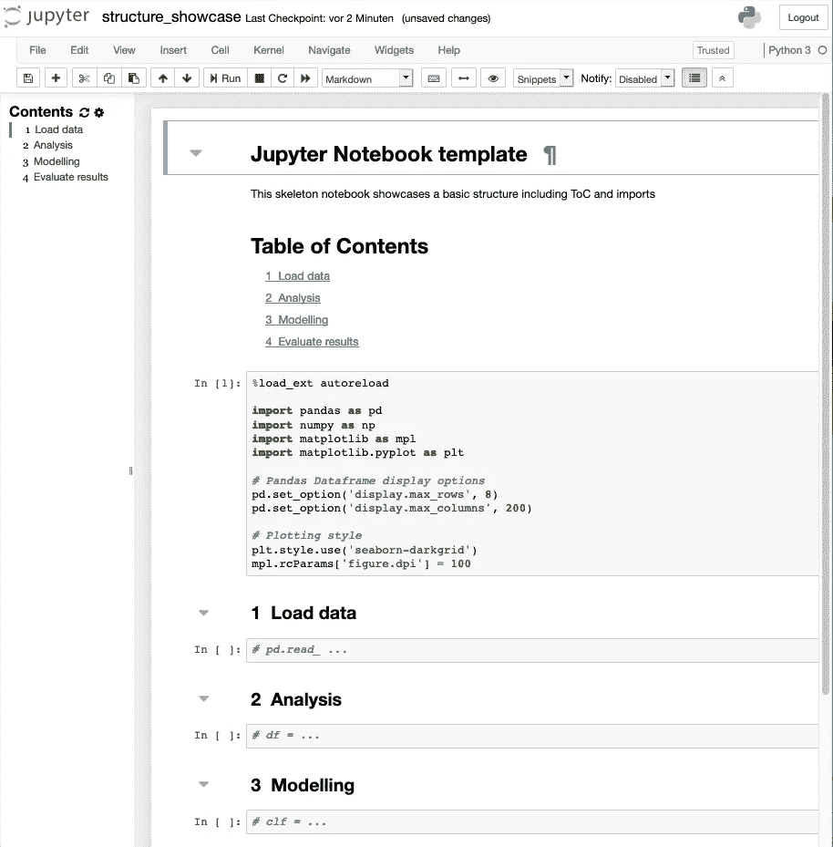

# Jupyter 笔记本最佳实践

> 原文：<https://towardsdatascience.com/jupyter-notebook-best-practices-f430a6ba8c69?source=collection_archive---------5----------------------->

## 更有效地使用 Jupyter 笔记本的简明建议。


Photo by [SpaceX](https://unsplash.com/@spacex?utm_source=medium&utm_medium=referral) on [Unsplash](https://unsplash.com?utm_source=medium&utm_medium=referral)

警告:本文中的建议指的是 Jupyter 的原始笔记本。虽然许多建议可以适用于 JupyterLab，但流行的笔记本扩展不能。

## 目录

[1。构建你的笔记本](https://medium.com/p/f430a6ba8c69#87fc)

[2。重构&外包代码到模块](https://medium.com/p/f430a6ba8c69#f5af)

[3。对生产力技巧保持好奇](https://medium.com/p/f430a6ba8c69#e75a)

[4。拥抱再现性](https://medium.com/p/f430a6ba8c69#dfd1)

[5。延伸阅读](https://medium.com/p/f430a6ba8c69#cafb)

[结论](https://medium.com/p/f430a6ba8c69#2d44)

## 1.构建您的笔记本

*   给你的笔记本一个**标题** (H1 标题)和一个有意义的**序言**来描述它的目的和内容。
*   在 Markdown 单元格中使用**标题和文档**来构建您的笔记本并解释您的工作流程步骤。记住:你这样做不仅是为了你的同事或你的继任者，也是为了你未来的自己。
*   [toc2](https://jupyter-contrib-nbextensions.readthedocs.io/en/latest/nbextensions/toc2/README.html) 扩展可以在侧边栏(可选的浮动窗口)和 markdown 单元格中自动创建标题编号和**目录**。突出显示表示您在文档中的当前位置，这将有助于您在长笔记本中保持方向。
*   [**可折叠标题**](https://jupyter-contrib-nbextensions.readthedocs.io/en/latest/nbextensions/collapsible_headings/readme.html) 扩展允许您隐藏整个代码段，从而让您专注于当前的工作流程阶段。
*   [这个**默认模板**扩展](/set-your-jupyter-notebook-up-right-with-this-extension-24921838a332)导致笔记本不是空的，而是具有默认结构和公共导入。还有，它会反复要求你把名字从`Untitled.ipynb`改成有意义的。
*   Jupyter [snippets](https://jupyter-contrib-nbextensions.readthedocs.io/en/latest/nbextensions/snippets/README.html) 扩展允许您方便地**插入经常需要的代码块**，例如您的典型导入语句。



Using a Jupyter notebook template (which sets up default imports and structure) and the Table of Contents (toc2) extension, which automatically numbers headings. The Collapsible Headings extension enables hiding of section contents by clicking the grey triangles next to the headings.

## 2.将代码重构和外包到模块中

*   在你已经在单元格中编写了简单的代码以快速前进之后，养成这样的习惯:将稳定的代码转化为 T2 函数，并将它们转移到一个专门的模块中。这使得你的笔记本更具可读性，并且在生产你的工作流程时非常有帮助。这个:

```
df = pd.read_csv(filename)
df.drop( ...
df.query( ...
df.groupby( ...
```

变成了这样:

```
def load_and_preprocess_data(filename):
   """DOCSTRING"""
   # do stuff
   # ...
   return df
```

最后是这个:

```
import dataprep
df = dataprep.load_and_preprocess_data(filename)
```

*   如果编辑一个模块文件，Jupyter 的[自动重新加载](https://ipython.readthedocs.io/en/stable/config/extensions/autoreload.html)扩展**重新加载导入的模块**:

```
%load_ext autoreload
%autoreload
```

*   使用 [ipytest](https://pypi.org/project/ipytest/) 在笔记本内部进行**测试**。
*   使用合适的 **IDE** ，例如 [PyCharm](https://www.jetbrains.com/pycharm/) 。了解其高效调试、重构和测试的特性。
*   **坚持好编码的标准** —思考 ***干净代码*原则**和 [**PEP8**](https://www.python.org/dev/peps/pep-0008/) 。使用有意义的变量名和函数名，合理地注释，模块化你的代码，不要懒得重构。

## 3.对生产力黑客保持好奇

*   学习 [**Jupyter 键盘快捷键**](https://www.cheatography.com/weidadeyue/cheat-sheets/jupyter-notebook) 。将清单打印出来，挂在你屏幕旁边的墙上。
*   了解 **Jupyter 扩展:** [Codefolding](https://jupyter-contrib-nbextensions.readthedocs.io/en/latest/nbextensions/codefolding/readme.html) ， [Hide input all](https://jupyter-contrib-nbextensions.readthedocs.io/en/latest/nbextensions/hide_input_all/readme.html) ， [Variable Inspector](https://jupyter-contrib-nbextensions.readthedocs.io/en/latest/nbextensions/varInspector/README.html) ， [Split Cells Notebook，](https://jupyter-contrib-nbextensions.readthedocs.io/en/latest/nbextensions/splitcell/readme.html) zenmode 和[more more](https://jupyter-contrib-nbextensions.readthedocs.io/en/latest/nbextensions.html)。
*   [Jupyter Widgets](https://ipywidgets.readthedocs.io/en/stable/examples/Widget%20Basics.html) (滑块、按钮、下拉菜单……)允许你构建**交互式 GUI**。
*   [tqdm](https://github.com/tqdm/tqdm#ipython-jupyter-integration) 库提供了一个方便的**进度条**。

## 4.拥抱再现性

*   版本控制:学习使用 git——有很多很棒的教程。
*   根据您的项目和目的，使用移除笔记本输出的 [**git 预提交钩子可能是合理的。这将使提交和差异更具可读性，但可能会丢弃输出(绘图等)。)你其实是想储存。**](https://github.com/kynan/nbstripout)
*   在**专用(conda)环境中运行您的笔记本电脑**。将`requirements.txt`文件存储在您的笔记本和模块旁边的 git 存储库中。这将有助于您重现工作流程，并有助于过渡到生产环境。

## 5.进一步阅读

*   [使用 JupyterLab 笔记本电脑高效工作](https://florianwilhelm.info/2018/11/working_efficiently_with_jupyter_lab/)
*   [为数据科学带来 Jupyter 笔记本电脑的最佳性能](/bringing-the-best-out-of-jupyter-notebooks-for-data-science-f0871519ca29)
*   [提高您的 Jupyter 笔记本电脑的工作效率](/jupyter-notebook-hints-1f26b08429ad)
*   …当然还有乔尔·格鲁著名的[我不喜欢笔记本](https://docs.google.com/presentation/d/1n2RlMdmv1p25Xy5thJUhkKGvjtV-dkAIsUXP-AL4ffI/)

# 结论

良好的软件工程实践、构建和记录您的工作流程以及根据您的个人喜好定制 Jupyter 将提高您的笔记本电脑生产力和可持续性。

我很高兴在评论中听到你自己的建议和反馈。