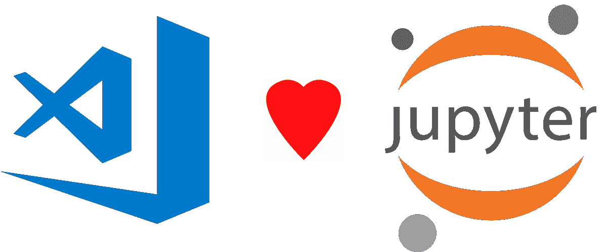
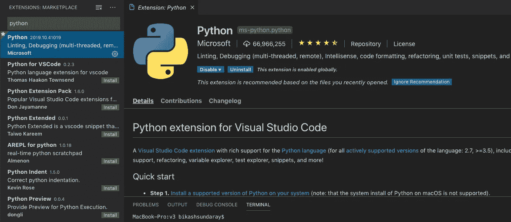
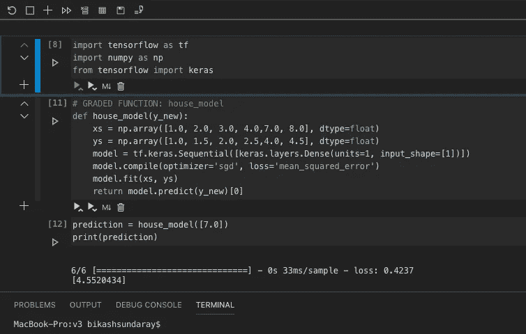
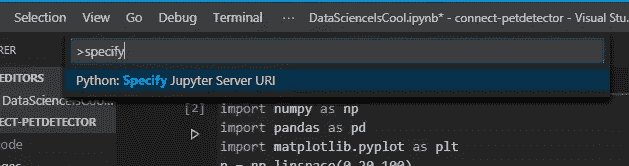
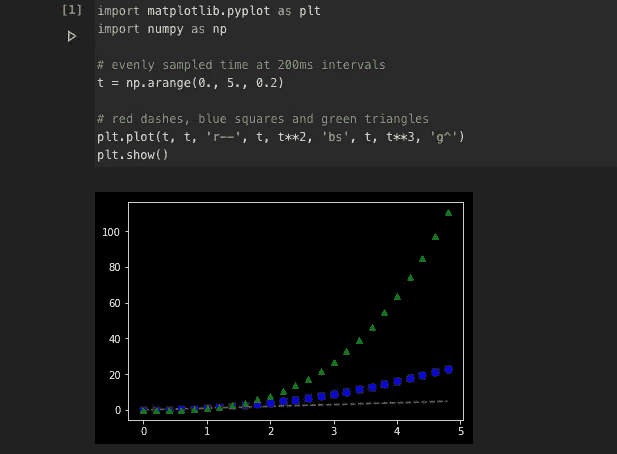
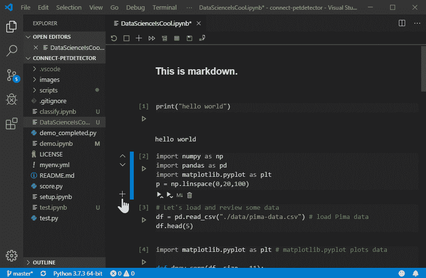
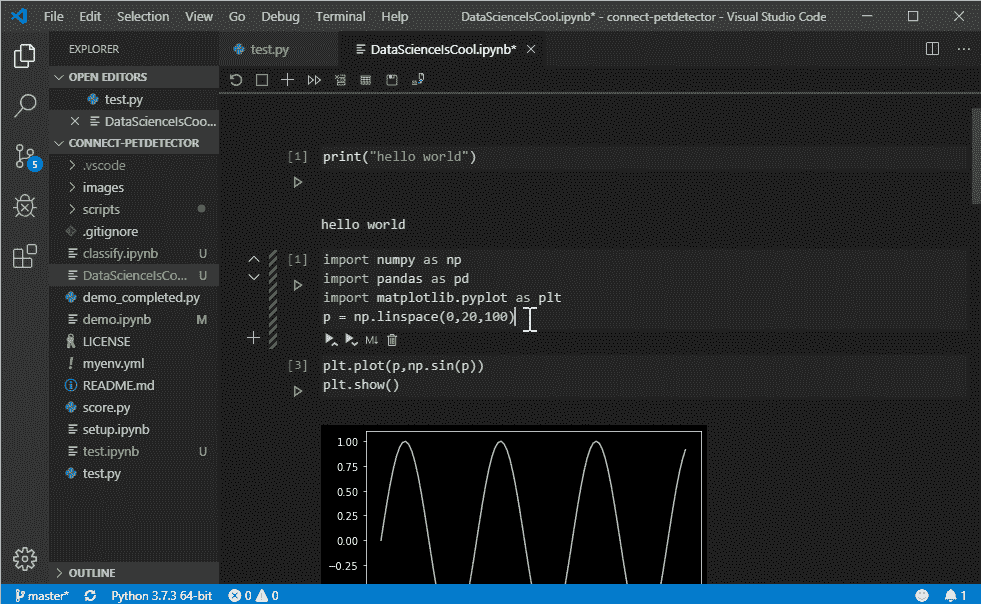

# Visual Studio 代码中的 Jupyter 笔记本

> 原文：<https://towardsdatascience.com/jupyter-notebook-in-visual-studio-code-3fc21a36fe43?source=collection_archive---------2----------------------->

## 如何使用 Microsoft Visual Studio 代码作为您的数据科学工具

从事 Python 工作的人，他们喜欢在 Jupyter Notebook 上做研究和实验。我是 Visual Studio Code (VS Code)和 Sublime 之类的桌面 IDE 的粉丝。Visual Studio 代码是用任何语言编程的世界级工具。不仅仅是程序，它还支持很多 DevOps 工具，比如 Ansible、Kubernetes、Yaml 等等。

全球大多数数据科学家使用 Jupyter Notebook 作为机器学习开发、研究和实验的编辑器。Jupyter Notebook 支持 Python，Java，R，Julia，Matlab，Octave，Scheme，Processing，Scala 等等。它是一个编辑器，准确地说是一个为 python 和其他编程语言设计的基于网络的编辑器。以前 Jupyter notebook 被称为 iPython。它是开源的，全球每个人都在使用它。

微软通过安装官方 Python 扩展，正式宣布 Visual Studio 代码原生支持 Jupyter Notebook。

## **如何在 Visual Studio 代码中使用 Jupyter 笔记本**

下载并安装最新版本的 Visual Studio Code IDE【https://code.visualstudio.com/download 

在 Visual Studio 中安装 **Python** 和 [**IntelliCode**](https://marketplace.visualstudio.com/items?itemName=VisualStudioExptTeam.vscodeintellicode) 扩展并重启。转到分机部分(左侧菜单)并搜索分机。

注意——以防安装了 Visual Studio 代码编辑器 Python 扩展。您可以通过点击 update 来更新您的旧 Python 扩展。

## 如何在 Visual Studio 代码中使用 Jupyter 笔记本

**在 VS 代码中创建新笔记本:**快捷键 CTRL + SHIFT + P (Windows)或 Command + SHIFT + P (macOS)，运行“Python:创建空白新 Jupyter 笔记本”命令。

**在 VS 代码中打开已有的笔记本:**重启 VS 代码 IDE 后，打开 Jypyter 笔记本文件(。ipynb 文件)。

单击每个单元格左侧的播放按钮，执行单元格中的代码。

当创建或打开 Jupyter 笔记本文件时，默认情况下，VS Code 会自动在本地为您创建一个 Jupyter 服务器。

如果你想使用一个远程 Jupyter 服务器——很简单，通过 VS 代码命令面板使用“指定 Jupyter 服务器 URI”命令，并输入服务器 URI。快捷键 CTRL + SHIFT + P (Windows)或 Command + SHIFT + P (macOS)。

你在 Jupyter Notebook 中使用 python 包的方式，你可以使用你所有的 Python 包，你会得到就地结果(cell result)。例如，我使用了 matplotlib，并像 Jupyter 一样就地获得了图形输出。

**在 Visual Studio 代码中调试 Jupyter 笔记本代码:**目前，要调试 Jupyter 笔记本，您需要首先将其导出为 Python 文件。一旦导出为 Python 文件，Visual Studio 代码调试器就允许您逐句通过代码、设置断点、检查状态和分析问题。使用调试器是查找和纠正笔记本代码中问题的一种有用方式。

*   对于整个笔记本，打开命令调板(⇧⌘P)并运行 Python:在 Python 交互式窗口中调试当前文件命令。
*   对于单个单元格，使用出现在单元格上方的调试单元格装饰。调试器专门从该单元格中的代码开始。默认情况下，调试单元只是进入用户代码。如果你想进入非用户代码，你需要在 Python 扩展设置(⌘,).)中取消选中数据科学:调试我的代码

## **Visual Studio 代码中最好的特性——超越 Jupyter 笔记本**

**智能代码自动完成:**当你编写代码时，智能感知会在你的代码单元中给出智能代码完成建议。您可以通过安装我们的 [IntelliCode 扩展](https://marketplace.visualstudio.com/items?itemName=VisualStudioExptTeam.vscodeintellicode)来进一步增强您的编辑器体验，以获得基于您当前代码上下文的智能自动完成建议。

Microsoft

**变量浏览器:**使用 VS 代码的另一个好处是，您可以通过点击笔记本工具栏中的“变量”按钮来利用变量浏览器和绘图查看器。变量浏览器将帮助您实时跟踪笔记本变量的当前状态，一目了然。

Microsoft

编码快乐！！！