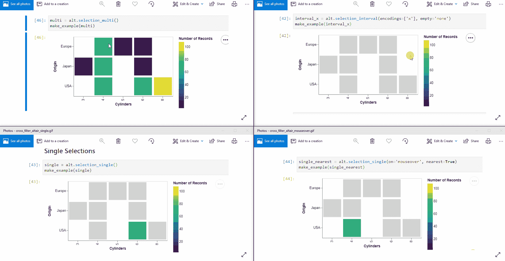
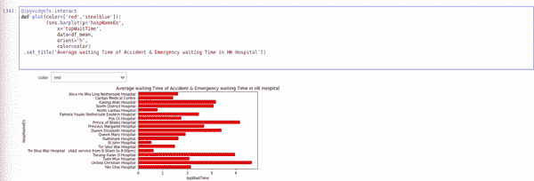
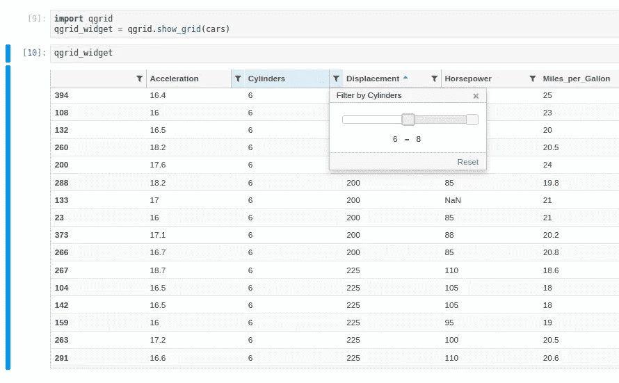
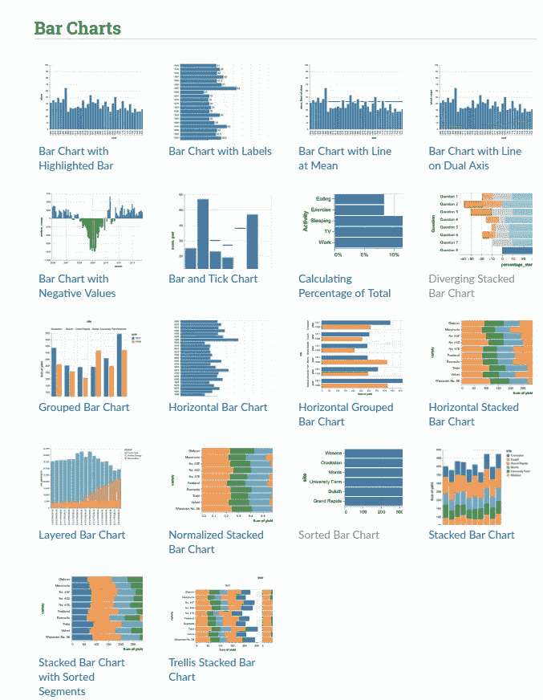
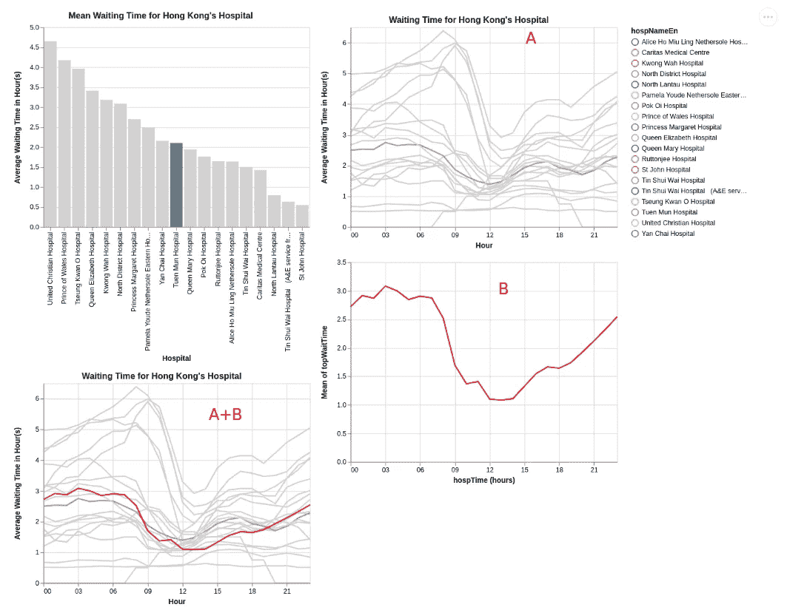

# jupyter Superpower——与 Python 的交互式可视化组合

> 原文：<https://towardsdatascience.com/jupyter-superpower-interactive-visualization-combo-with-python-ffc0adb37b7b?source=collection_archive---------3----------------------->

# **简介**

[**牛郎星**](https://altair-viz.github.io/) 是一个交互式可视化库。它提供了更一致的 API。这是作者对图书馆的描述。

> Python 的声明性统计可视化库

它的意思是，它专注于*要绘制什么*而不是*如何*绘制，你可以像 **ggplot** 一样轻松组合不同的组件。在进入本库之前，我想快速介绍两个对数据探索有用的工具。你可以很容易地给像 **seaborn** 或 **matplotlib 这样的库添加更多的交互性。**在 [Github](https://github.com/noklam/Gallery) 上查看一些简单的例子，我已经将大部分例子包含在资源库中

*   [**ipywidgets**](#6af7)
*   [**qgrid**](#10bf)
*   [**牛郎星**](#ac82)

# **Ipywidgets**

**ipywidgets** 允许你用鼠标与 Jupyter Notebook/Lab **交互，**它让 Jupyter Notebook 看起来几乎就像一个小应用程序本身。您可以在笔记本中添加*切片器、按钮和复选框*。这里有一些使用 **ipywidgets 的好项目。**

[https://www.hongkongfp.com/2019/01/21/hong-kong-nurses-protest-overcrowding-lack-resources-public-hospitals-health-chief-booed/](https://www.hongkongfp.com/2019/01/21/hong-kong-nurses-protest-overcrowding-lack-resources-public-hospitals-health-chief-booed/)

针对香港过度拥挤的医院，我用**事故&急诊【A & E】服务等待时间**做了一个例子。这里的图显示了医院的平均等待时间，而 ipywidgets 在这里简单地添加了一个下拉菜单，您可以交互地更改图的颜色。

Simple dropdown menu to interact with static plotting library

 [## jupyter-widgets/ipyleaflet

### Jupyter-fleet . js 桥。在 GitHub 上创建一个帐户，为 jupyter-widgets/ipyleaflet 开发做出贡献。

github.com](https://github.com/jupyter-widgets/ipyleaflet)  [## jupyter-widgets/pytreejs

### Jupyter - Three.js 桥。在 GitHub 上创建一个帐户，为 jupyter-widgets/pytreejs 的开发做出贡献。

github.com](https://github.com/jupyter-widgets/pythreejs) 

# qgrid

qgrid 让你在 Jupyter 笔记本/实验室里有一个类似 Excel 的表格，在引擎盖下，它使用 ipywidgets。这是非常有用的，当你试图理解你的数据，而不是输入大量的代码，你可以通过点击排序你的数据，通过点击临时过滤一些数据。简直太棒了！

# **牛郎星**

altair 有一个示例库，演示了您可以制作的各种可视化。

Rich Example Gallery of **altair**

## 1.交互式绘图

Upper left: Multiple Selection, Upper right: box style multiple selections, bottom left: single selection, bottom right: mouse hover single selection

牛郎星为交互式绘图提供了很多选择。上面的 gif 给你一种感觉，这有多简单。只需一行代码，您就可以改变图表的行为。交互性对于数据探索是至关重要的，因为您经常想要深入数据的某个子集。交叉过滤等功能在 **Excel** 或 **Tableau** 中非常常见。

## 2.简洁的语法和易于组合的图表

语法有点像`ggplot`，创建一个图表对象并在其上添加编码/颜色/比例。

如果你使用过 matplotlib ，你可能会多次尝试查找文档。牛郎星充分利用了像`+` `&` `|`这样的符号，当你想要组合不同的图表时，这些符号非常直观。例如，`a|b`表示水平叠加图表`a`和图表`b`。`a+b`在图表 a 上平均叠加图表 b。

叠加两个图表的能力非常强大，**它允许我们在同一个图表上绘制两个图表，而不需要实际连接它。**

这里有一个例子。我从两个不同的数据集创建了两个图表，它们都连接到一个带有**医院名称的选择过滤器。你可以在这里找到我的例子。图表 A 按小时显示历史平均等待时间，而图表 B 按小时显示过去 30 天的平均等待时间。**

The bottom left chart is created simply using a+b, both chars are controlled by a filter in the upper left bar chart.

## 3.出口很容易

很多时候你只是想分享一个图表。你只需要做`Chart.save()`，直接和你的同事分享 HTML。事实上，它只是 JSON 和 HTML，这也意味着您可以轻松地将其与您的 web 前端集成。

如果你想要一个拥有大量数据的复杂仪表板， **Tableau 或 Dash (Plotly)之类的工具，Bokeh** 在这一点上还是比较好的。我还没有找到用**牛郎星**处理大数据的好办法。我发现当你试图做不超过 4 个图表的交互式绘图时，它是最有用的，在那里你有一些交叉过滤，下拉菜单或高亮显示。

# 结论

这些是我最近试图包含在我的工作流程中的库。让我知道你的感受，并分享你使用的工具。我觉得 **altair** 的交互控件是最有趣的部分，但在功能上还是要赶上其他库，支持更多的图表类型。

我会尝试实验 **plotly + Dash 看看**是否更好。到目前为止，我一直很喜欢**牵牛星**的 API，但它可能不太适合生产。运行 altair 数据服务器可能是一个解决方案，但我还没有尝试过。

## 请给我一个大拇指，如果你认为这些工具是有用的，不要忘记给这些项目的创造者一颗星。

# **参考**

https://www.youtube.com/watch?v=aRxahWy-ul8(这是《牛郎星》作者之一 Brian Granger 的精彩演讲。我认为 altair 不仅仅是一个可视化库，你也可以从它的 API 设计中学到很多东西)