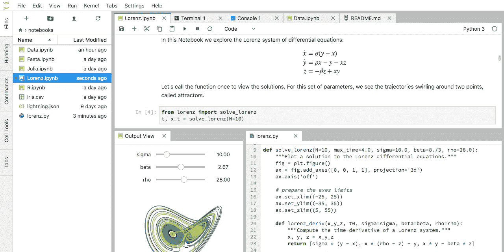
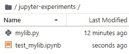
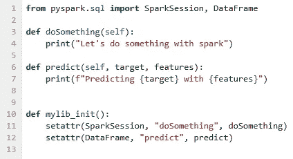
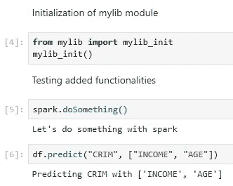
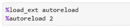
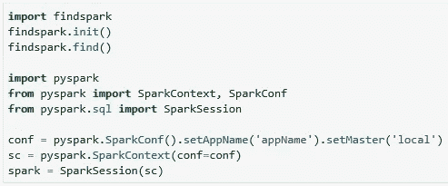
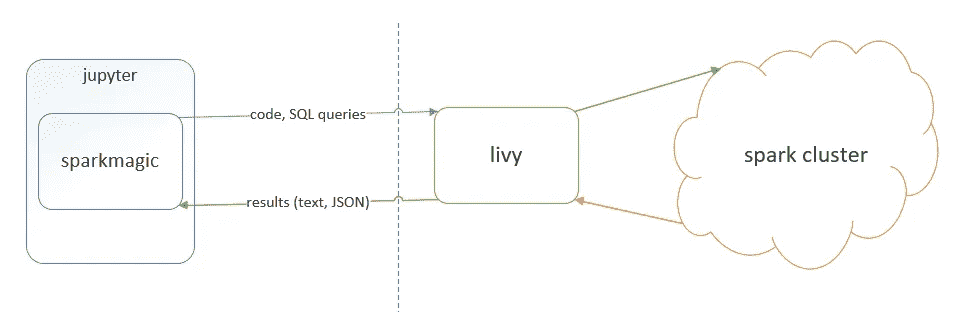
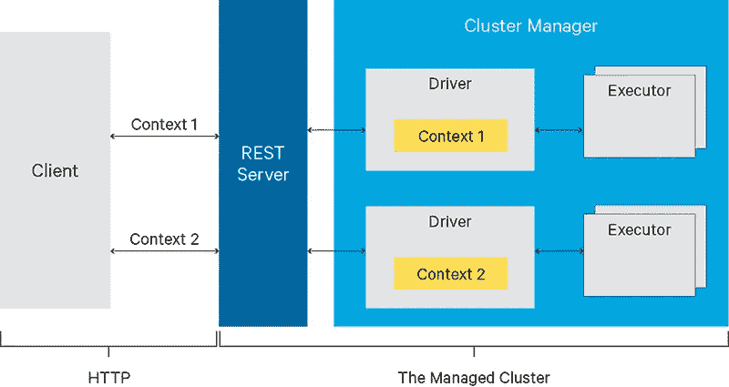
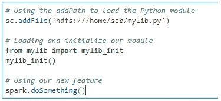

# 复杂 Python 和 Scala Spark 项目的 JupyterLab

> 原文：<https://towardsdatascience.com/jupyterlab-for-complex-python-and-scala-spark-projects-da1aa64fcc12?source=collection_archive---------15----------------------->

JupyterLab 是一项用于原型和自我记录研究的了不起的技术。但是你能把它用于有一个大代码库的项目吗？

# 外部库的情况

笔记本工作流对全球所有数据科学家来说都是一大进步。能够直接看到每个步骤的结果，而不是一遍又一遍地运行同一个程序，这是一个巨大的生产力提升。此外，自我记录的能力使它很容易与同事分享。

也就是说，你在笔记本上所能实现的是有限的。它最适合交互式计算，但是当每个单元超过 100 行代码时，它就不再是交互式的了。在这一点上，你需要的是一个真正的 IDE，比如 T2 VS 代码，或者 T4 py charm，也许还有一些单元测试。

一个好的库是在你当前项目之外开发的，它应该足够通用，能够在广泛的项目中帮助你和你的同事。把它看作是一项未来会有很多倍回报的投资。

现在，你如何把这个图书馆推回朱庇特？

# Python 内核

假设您想要向 Spark 对象添加新的功能，例如 Spark 上的 doSomething()方法和 DataFrame 上的 predict()方法。使用以下代码创建一个模块(Python 中的一个文件，例如 mylib.py ):

mylib_init()使用 setattr()函数来扩展 SparkSession 和 DataFrame 的类定义，并添加新方法。你要做的就是用下面的两行代码创建一个代码块(代码块 4)。首先导入函数“mylib_init()”定义，然后调用它。

小问题是，如果您更改 mylib.py 文件，即使您再次调用 mylib_init()，它也不会更改工作簿中的任何内容。我在[这篇文章](https://florianwilhelm.info/2018/11/working_efficiently_with_jupyter_lab/)中发现了关于自动卸载插件的内容。这将允许 Jupyter 每 2 秒检查一次. py 的新版本，您只需要调用 mylib_init()来使用新的模块。

因此，当您使用 pyspark 库在 Jupyter 实例中创建 Spark 驱动程序时，这是一个简单的例子(例如通过使用下面的代码)。

这是最简单的方法，因为它们都在同一台电脑上。当事情变得遥远时，这就有点复杂了(但没那么难)，例如当使用 [Sparkmagic](https://github.com/jupyter-incubator/sparkmagic) 时。

# Sparkmagic 内核(Python 和 Scala)

[Sparkmagic](https://github.com/jupyter-incubator/sparkmagic) 内核允许你的 Jupyter 实例通过 [Livy](https://livy.apache.org/) 与 Spark 实例通信，Livy 是 Spark 的 REST 服务器。Sparkmagic 会将你的代码块作为 web 请求发送到 Livy 服务器。然后，Livy 会把它翻译成 Spark 驱动程序并返回结果。

正如您在下图中看到的，Spark 驱动程序在集群上是远程的，根本不能访问 Jupyter 实例下的文件。

你如何解决这个问题并使用你的图书馆？

如果您使用 Python，您可以将代码存储在底层 HDFS 上并使用 sc。 [addPath](https://spark.apache.org/docs/0.7.0/api/pyspark/pyspark.context.SparkContext-class.html#addFile) (sc 是 Sparkmagic 自动创建的 SparkContext)。由于驱动程序和执行程序都可以访问 HDFS，所以它会起作用。

对于 Scala，我们希望能够在类路径中添加一个或多个 JAR 文件。JAR 是 Java 生态系统中的库。遗憾的是，虽然 SparkContext 上有 addJar，但这种方式行不通。随着 Scala 的编译和类型化，你不能只是在一大块代码中添加 JAR，然后立刻使用这个 JAR 中的类型。addJar 将使这对于执行者成为可能，但是对于驱动程序来说，当调用 addJar 时，不再可能添加类定义。

幸运的是，有一种方法可以在 Livy 创建 SparkContext 时通知它将哪个 JAR 添加到类路径中(在发送任何代码进行编译之前)。

注意，如果已经有一个上下文，这个块将重新启动一个上下文，所以它应该是您笔记本的第一个块。

# 两全其美

正如我们所看到的，无论您的情况如何，都有一种方法可以利用现有的代码库，只在 Jupyter 笔记本中保留高级的有意义的代码。

我强烈感觉到，高性能数据科学团队的关键是始终在提高生产力的工具上投入时间。共享的高级原语库对生产力至关重要。Jupyter 对此很满意，这是个好消息。

*原载于 2019 年 10 月 6 日*[*https://dataintoresults.com*](https://dataintoresults.com/post/jupyterlab-for-complex-python-and-scala-spark-projects/)*。*