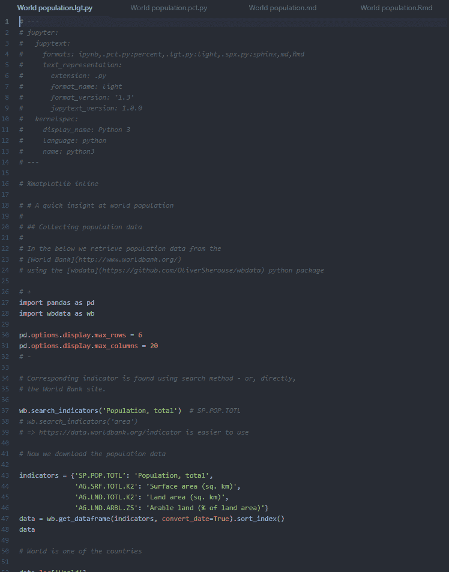
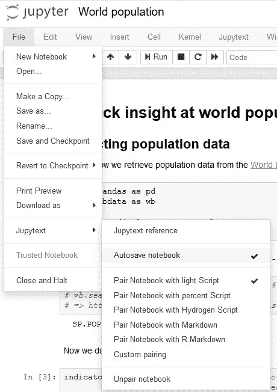
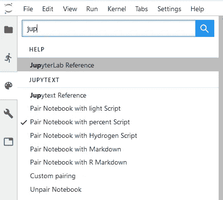
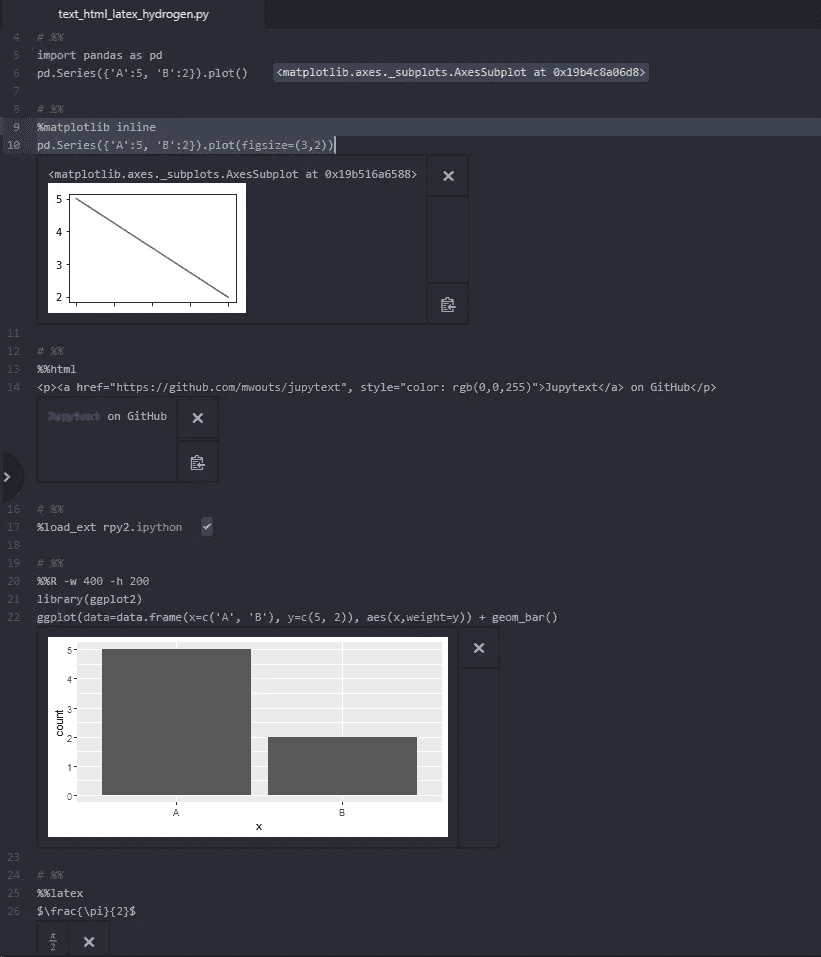

# Jupytext 1.0 亮点

> 原文：<https://towardsdatascience.com/jupytext-1-0-highlights-a49dca9baa7b?source=collection_archive---------14----------------------->

Jupytext 是 Jupyter Notebook 和 JupyterLab 的扩展，可以保存各种文本格式的 Jupyter Notebook:Markdown、R Markdown、Python、Julia 和 R scripts 等等！



A Jupyter Notebook represented as a Python script (light or percent format), Markdown, and R Markdown

Jupytext 将允许您:

*   在您最喜欢的代码编辑器中编写或编辑 Jupyter 笔记本
*   在具有清晰差异历史记录的笔记本上启用版本控制
*   在 Jupyter 笔记本上协作，轻松合并稿件
*   重构笔记本并将它们的代码提取到库中

使用 Jupytext 的一种便捷方式是通过[配对笔记本](https://github.com/mwouts/jupytext/blob/master/README.md#paired-notebooks)。配对笔记本是一个传统的`.ipynb`笔记本，它与一个文本表示同步——比如一个 Python 脚本。保存笔记本后，Jupytext 会更新这两个文件。该脚本有一个清晰的差异历史，只关注输入单元格。

用户可以在代码编辑器中编辑或重构脚本:当在 Jupyter 中读取或刷新笔记本时，将从脚本中读取输入单元格。此外，匹配未更改输入单元格的输出单元格从`.ipynb`文件重新加载。

Jupytext 于 2018 年 9 月[日](/introducing-jupytext-9234fdff6c57)推出，并受益于社区的大量反馈。我们已经建立了反馈，我们很高兴地宣布 Jupytext 达到了 1.0 版本。

现在让我们回顾一下这个主要版本的主要新特性！

# Jupyter 笔记本中的 Jupytext 菜单

Jupytext 获得了一个 Jupyter 笔记本扩展:使用新的 Jupytext 菜单来选择笔记本的配对格式，并在另一个编辑器中编辑文本表示时禁用自动保存功能。



# JupyterLab 中的 Jupytext 命令

Jupytext 1.0 还为 JupyterLab 提供了一个扩展:使用新的 Jupytext 命令将您的笔记本与文本文件配对。



# 一个强大的`jupytext`司令部

`jupytext`命令可能已经:

*   转换笔记本`--from`和`--to`各种笔记本格式、
*   `--update`一个`.ipynb`笔记本中的输入单元格，给定一个笔记本的文本表示，
*   使用 [Git 预提交钩子](https://github.com/mwouts/jupytext/blob/master/README.md#jupytext-as-a-git-pre-commit-hook)维护笔记本的最新文本表示。

在 1.0 版本中，`jupytext`命令扩展了新的模式:

*   `--sync`同步笔记本的多个表示
*   `--set-formats`(以及可选的`--sync`)，设置或更改笔记本或文本文件的配对
*   `--pipe`将笔记本的文本表示输入另一个程序。

也许你想用`[black](https://github.com/ambv/black)`、*不妥协的 Python 代码格式化程序*重新格式化你的 Jupyter 笔记本？就这么简单`jupytext --pipe black *.ipynb`！

# 子文件夹中的配对笔记本

在 Jupytext 的早期版本中，配对的笔记本必须共享同一个目录。在 1.0 版本中，Jupytext 可以将笔记本与不同文件夹中的文本文件配对。

将当前文件夹中的笔记本与带有以下内容的`python`子文件夹中的 Python 脚本配对:

```
jupytext --set-formats ipynb,python//py --sync *.ipynb
```

(使用`--sync`实际创建 Python 文件；如果您想使用`percent`格式，请将`py`替换为`py:percent`。

将文件夹`notebooks`中的笔记本与文件夹`markdown`中的 markdown 文件和文件夹`python`中的 Python 脚本配对，使用

```
jupytext --set-formats notebooks//ipynb,markdown//md,python//py --sync notebooks/*.ipynb
```

关于笔记本前缀和后缀的更多信息可在[文档](https://github.com/mwouts/jupytext/blob/master/README.md#per-notebook-configuration)中找到。也可以激活[所有笔记本](https://github.com/mwouts/jupytext/blob/master/README.md#global-configuration)的默认配对。

# 氢格式

Jupytext 已经可以将 Jupyter 笔记本表示为 [light 或 percent](/jupyter-notebooks-as-light-percent-or-sphinx-scripts-efca8bc3aa44) scripts。Jupytext 1.0 引入了一种新的`hydrogen`格式，这将最适合 [Hydrogen](https://atom.io/packages/hydrogen) 编辑器的用户。`hydrogen`格式与`percent`格式相同，除了 Jupyter magic 命令，这些命令没有注释。

下面是 Python Hydrogen 笔记本的截图，其中包含许多其他语言——看看 Hydroden 如何呈现多种输出类型！



# 久经考验的程序

我们已经尽了最大努力确保 Jupytext 能够完美运行。我们的用户和测试人员已经做了很好的工作。对于他们发现的每个 bug，我们增加了测试数据库。

但是你可能想对你自己的笔记本电脑系列进行压力测试？给`jupytext --test`或`jupytext --test-strict`一个尝试。

# Vim 的插件

感谢[迈克尔·戈尔兹](https://github.com/goerz)，Jupytext 有了一个用于 Vim 的[插件](https://github.com/goerz/jupytext.vim)。安装插件并编辑以 Markdown 文档或脚本表示的 Jupyter 笔记本。`jupytext.vim`是另一种非常方便的使用 Jupytext 的方法！

在未来，我们希望为更多的编辑器提供 Jupytext 插件，包括 PyCharm 和 Visual Studio 代码。请让我们知道你是否能在这里提供帮助——一个好的插件只需从`jupytext --sync`开始！

# 谢谢你

Jupytext 非常感谢社区的反馈！

对于这个版本，我特别感谢:
-[Florian Wetschoreck](https://github.com/FlorianWetschoreck)，[Fran ois Wouts](https://github.com/fwouts)和 Amjad Haouriqui，感谢他们在设计 Jupyter 扩展
- [Philip Austin](https://github.com/phaustin) 时给予的支持，他们提出了将笔记本与其他工具连接的想法，以及将笔记本与不同文件夹中的脚本配对的想法
- [Michael Goerz](https://github.com/goerz) ，[Andre Thrill](https://github.com/andrethrill)

你想帮忙吗？你可以在很多方面做出贡献。我们很乐意了解 bug。欢迎想法！文档的改进也很有帮助。明星让我们保持动力。来加入我们的 GitHub 吧！