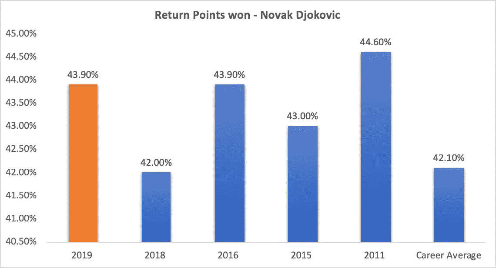

# 诺瓦克·德约科维奇到底有多好？

> 原文：<https://towardsdatascience.com/just-how-good-is-novak-djokovic-401ce07c7ef3?source=collection_archive---------15----------------------->

## 数据分析师-网球运动员对 2019 年澳大利亚网球公开赛决赛中密谋的事件的分析

今年的澳网决赛是 2012 年诺瓦克·德约科维奇和纳达尔之间的决赛的复赛。2012 年的比赛具备了被认为是游戏史上最伟大的比赛之一的所有要素。这场比赛有各种各样的东西，从长时间的艰苦拉力赛，最高的防守打法，来自另一个星球的制胜一击，以及最高级别的精神勇气的展示。这场比赛为网球场上的痛苦提供了一个新的定义，在颁奖仪式上，球员们几乎无法站立。

[Picture Courtesy](https://scroll.in/field/910864/watch-tireless-djokovic-downs-nadal-in-a-near-six-hour-epic-to-win-2012-australian-open)

2012 年的 AO 决赛是一场相当公平的比赛，直到第五盘，纳达尔在第一盘就击败了德约科维奇，并有望获得例行的五盘胜利。德约科维奇是一个不屈不挠的斗士，他继续对纳达尔的发球局施加压力，并以决定性的方式保持自己的发球局，以保持自己在比赛中的相关性。在第五盘的第六局，纳达尔错过了一次常规的反手击球，这被证明是至关重要的，并使诺瓦克回到了比赛中。(下面的视频链接)

剩下的就是历史了，德约科维奇找到了打破纳达尔发球局的方法，赢得了他的第三个澳网冠军。2019 年澳大利亚网球公开赛决赛预计将是两位传奇人物之间的又一场大战，但没有人会记得这场比赛是一场势均力敌的比赛。德约科维奇在三盘比赛中决定性地击败了纳达尔，这场比赛持续了 2 个多小时，赢得了他的第七个澳大利亚网球公开赛冠军。

# **纳达尔**

要了解德约科维奇在比赛中有多好，重要的是要了解纳达尔在过去两周的表现有多好。纳达尔没有丢掉任何一盘，并在通往决赛的道路上击败了一些著名的选手。事实上，纳达尔看起来像是进入决赛前的状态。

**发球**

在 11 月接受脚踝手术和职业生涯中多次膝盖受伤后，纳达尔决定调整他的发球动作。修改后的发球动作旨在增加击球的冲击力，帮助纳达尔更具侵略性，缩短得分，以保护他的身体。

Rafael Nadal’s Serve Stats

在三个重要的方面(第一发球百分比，第一发球得分和第二发球得分)，纳达尔似乎在赢得发球得分方面超越了他的职业生涯最佳数据。这使得纳达尔占据了所有发球比赛的 92.6%，这也是职业生涯的新高。除此之外，第一次发球比去年快了 5 英里。发球的有效性帮助他缩短了比赛时间，并自始至终保持领先。

**地滚球和截击球**

就在几年前，纳达尔以其令人难以置信的回球技巧、从底线后 10 英尺处回球以及多次重新开始得分的能力而闻名。特别是在过去的 3 年里，纳达尔改变了他的战术，在比赛中融入了进攻型打法。这在 2017 年澳大利亚网球公开赛决赛中得到了充分展示，纳达尔与费德勒展开了激烈的进攻。在最近的脚踝手术后，纳达尔缩短了他的后摆，并开始在击球时变得更平。众所周知，纳达尔有一个惊人的截击([看看这个](https://www.youtube.com/watch?v=sfUuQZT-oEc))并且在他的单打比赛中融入这一点后，在过去的几年里，它变得更加强大。这有助于他在进攻中开始得分，并快速完成得分。

**统治地位**

纳达尔在 2019 年澳大利亚网球公开赛上直落两盘击败澳大利亚选手詹姆斯·杜克沃斯。比分无疑表明纳达尔由于缺乏比赛而生疏，但他的发球在比赛中被破了两次。从第二轮开始，他的发球局真的开始变得有节奏了，他在决赛中一次也没有丢掉发球局。他在半决赛中令人信服地击败了 Stefano Tsitsipas(罗杰·费德勒的攻击者)。

# **匹克-德约科维奇**

德约科维奇的肘部受伤让他的统治地位受到了影响，这让他在 2017 年和 2018 年的大部分时间里都没有参加大满贯比赛，后来他在 2018 年赢得了温布尔登网球公开赛，打破了他的大满贯冠军头衔。虽然球迷们觉得他从伤病中复苏已经完成，但很少有人希望他能像在 2019 年澳大利亚网球公开赛决赛中那样统治比赛。

**调整服务动作**

在退出 2017 年下半年的比赛后，德约科维奇团队提出了一个肘部更轻的发球动作。肘部受伤使得德约科维奇的发球不稳定，不可靠，缺乏欺负对手的力量。调整后的发球动作似乎没有改变德约科维奇的命运，他不得不在比赛前接受手术，没有任何痛苦。德约科维奇在 2018 赛季前半段展示的发球动作受到了阿加西发球动作的启发。德约科维奇在美国硬地球场夏天解雇了阿加西和斯捷潘内克，并抨击了他的新发球动作。重新雇用 Marian Vajda 看到他的发球大幅提高，回到了 2016 年的水平。我会让数字自己说话。

费德勒和德约科维奇并不以最强有力的发球而闻名，但却以在正确的时间击中正确的位置而闻名。德约科维奇的发球比以往任何时候都更经常地击中正确的位置。他所有的发球中有 8.3%被证明是 ace 球，他在 ace 球方面从来没有做得更好。下一个要检查的统计数据是第一发球的百分比。

德约科维奇的第一次发球命中率是他能够击败纳达尔的原因，这让他在发球比赛中完全没有表现出来。第一次发球火力全开，对他的所有对手来说都是令人恼火的一致。尽管本赛季开局糟糕，输给了排名前 100 名之外的球员，诺瓦克还是在本赛季的后半段将自己的第一次发球得分率提高到了一个可观的数字。

如果你认为发球的准确度和精确度有所提高，那你就错了。当你看看这些数据时，发球的有效性是不可否认的。我们已经确定，首次发球的次数比以往任何时候都多，而且每次发球都比以往任何时候都有更多的回报。他今年赢得了职业生涯最高的第一发球得分，这包括在多哈锦标赛中的惨淡表现。有一句谚语说“你只像你最薄弱的环节一样强大”，这让我们看到了第二次发球，德约科维奇大大提高了第二次发球，比他的职业生涯平均水平高出近 10 个百分点。在过去，特别是 2011 年，德约科维奇的身体习惯于在他的第二次发球被中和后接管，但这在 2019 年应该是不正确的，因为他变得更老了，因此比以前的自己更弱。不可思议的是，他比以往任何时候都更擅长长基线拉力赛，他的触地击球也比以前更有穿透力。

**回归游戏**

我可以坐一整天，大声谈论诺瓦克过去的回报有多好，但还能更好吗？

诺瓦克赢得的回球点数当然不像 2011 年那样高，当时他连续得分，差点断送了罗杰和拉法的职业生涯。2011 年，他不得不面对纳达尔和费德勒，他们的状态非常好，因此，回报实际上需要那么好。令人惊讶的是，诺瓦克仍然能够与他在 2011 年创下的纪录相抗衡，并在 2016 年平了自己的纪录，他在本赛季结束时获得了 2 个大满贯。罗杰的接发球率是职业生涯平均 40%，对于一个完全处于巅峰状态的球员来说，这并不算太差，但诺瓦克和罗杰的区别在于赢得的破发点的百分比。在澳网期间，罗杰赢得了 14.7%的破发点，诺瓦克赢得了 39.4%的破发点。下面看看今年的断点统计与他在其他年份打网球的情况如何。

**地面“体击”比划**

不幸的是，ATP 没有提供足够的数据来评估某人的正手和反手比赛，但在定性的层面上，正手和反手正在全力以赴。在令人失望地输给罗伯托·布蒂斯塔·阿古特之后，诺瓦克打得如此被动，看起来他无法穿透他的任何对手(Marton Fucsovics，Nikoloz Basilashvilli)。他从澳网第一轮开始就很好地掌握了自己的比赛，并且在每一轮比赛后都有很大的进步。在半决赛对阵 Pouille 的比赛中，他犯了 5 次非受迫性失误，而在决赛对阵 Nadal 的比赛中，他犯了 9 次非受迫性失误，这实在是太可笑了。

他的场地位置非常具有攻击性，并多次压平他的反手，以中和纳达尔多圈的斜线正手。看看下面链接中的照片。

显然，马里昂融入的变化将诺瓦克的比赛带到了一个新的水平，没有任何真正的竞争(除非纳达尔和费德勒能够回到 2017 年的状态)，他可能会在今年赢得 2 个或 3 个大满贯。