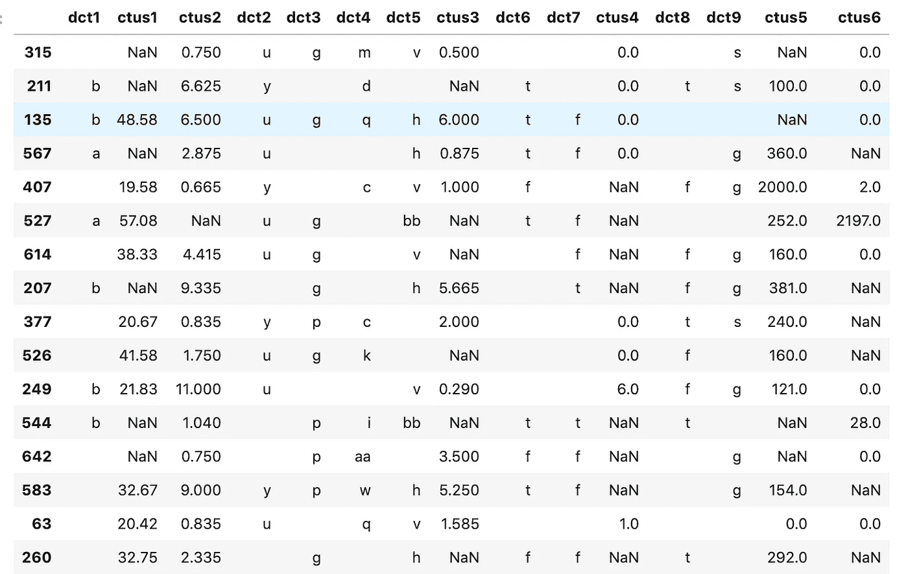
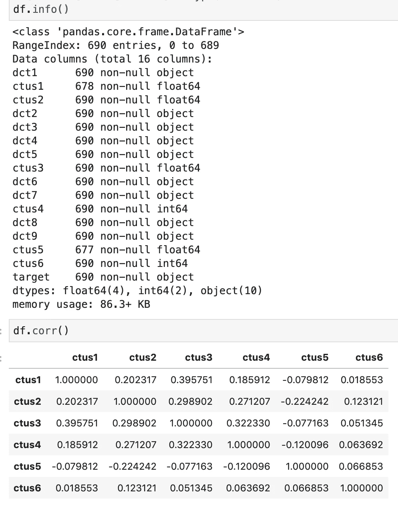
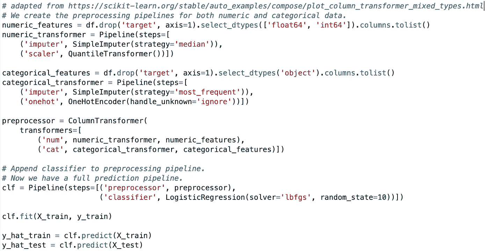
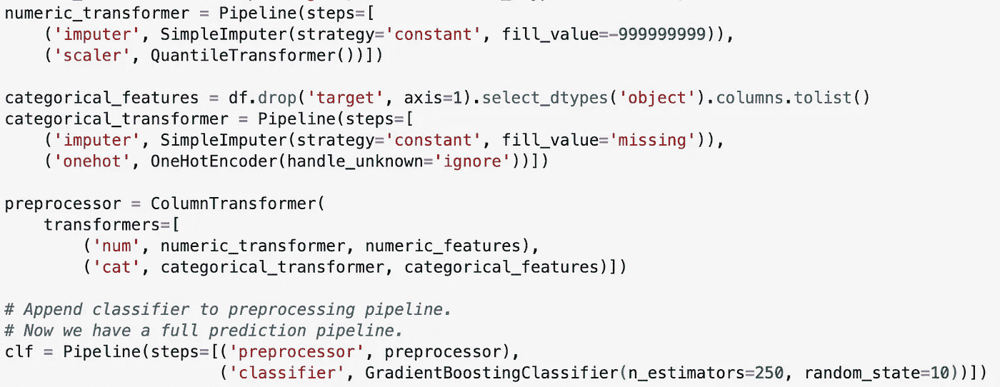
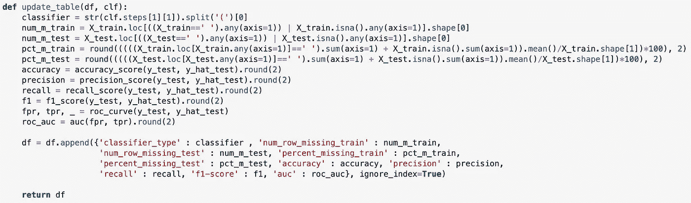
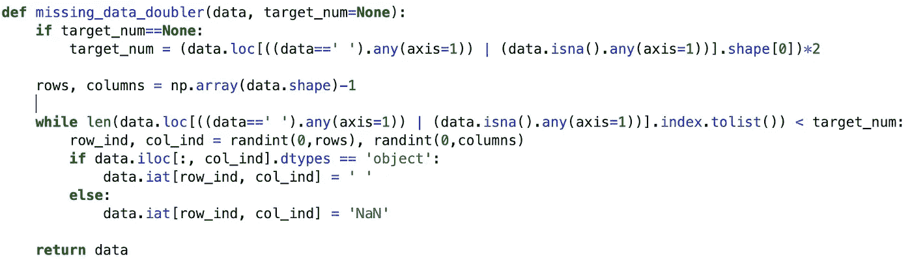
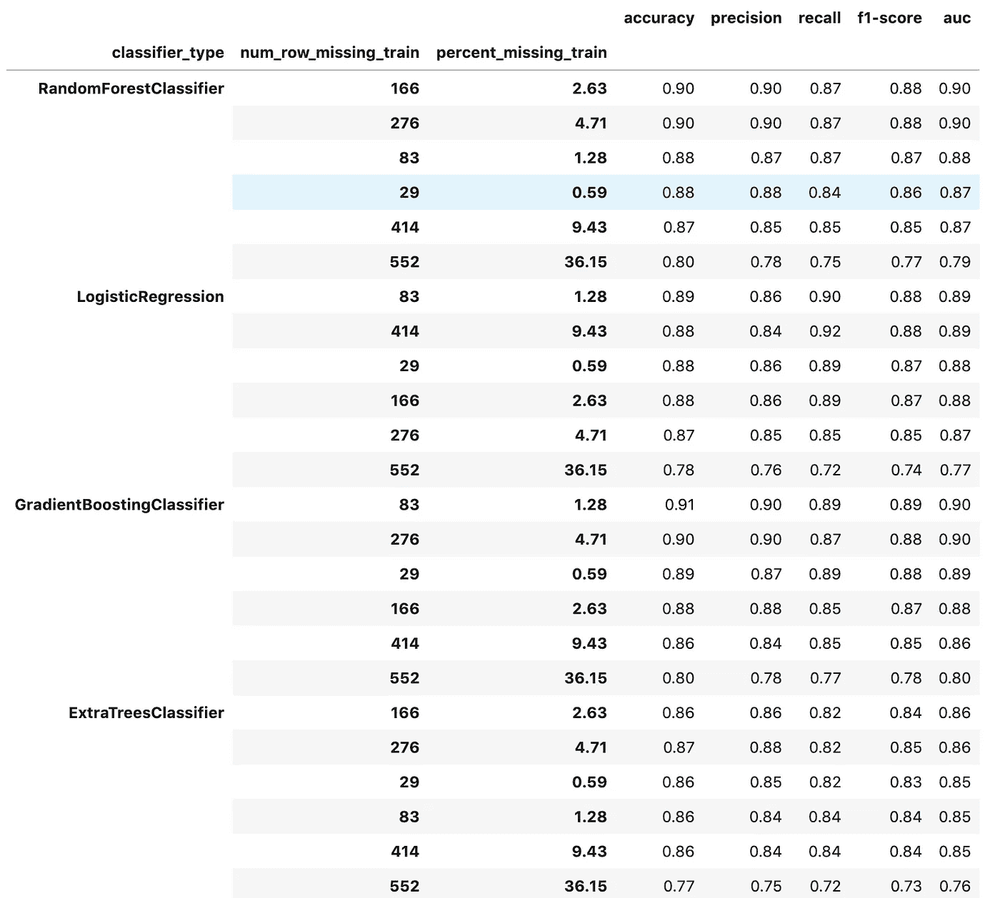
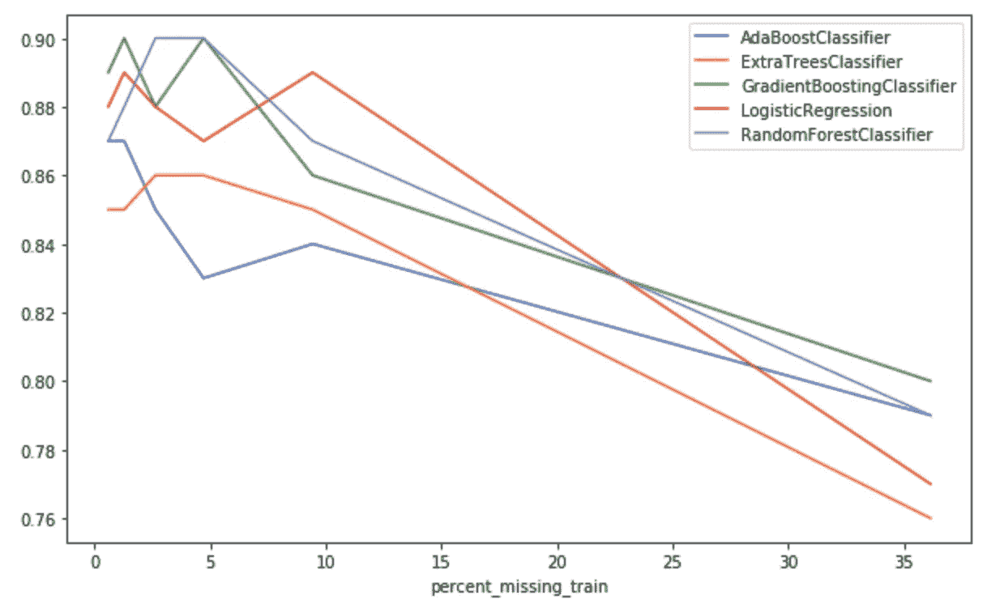
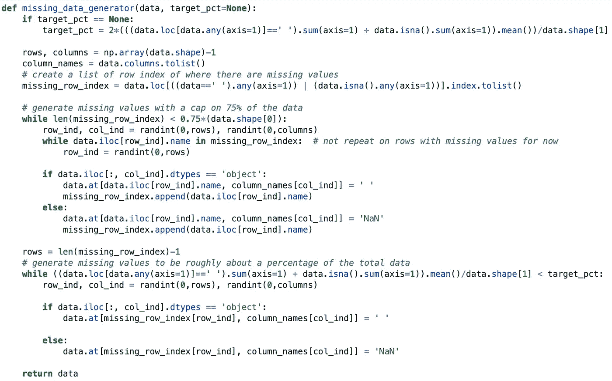
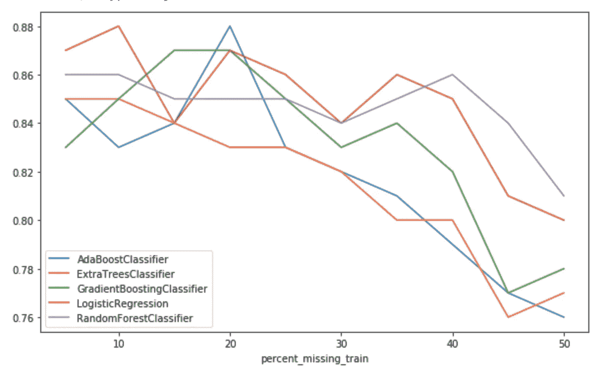

# 基于树的分类器在处理缺失数据时有多健壮？

> 原文：<https://towardsdatascience.com/just-how-robust-are-tree-based-classifiers-in-handling-missing-data-as-is-67d62adaf40c?source=collection_archive---------25----------------------->

**这是一个有趣的小型实验，通过使用中位数和众数插补，对照逻辑回归的预测，测试没有缺失值替换的树集合的预测。**

Train set with 36% of the values missing on average for every row entry.

首先，这不是一个科学实验来确定一个人应该如何预处理缺失值的数据，或者当适合缺失值的数据时，哪个树集成擅长给出最准确的预测。我的主要动机是研究随着数据集中缺失值数量的增加，不同模型的预测如何变化。该实验的结果可能不表示使用不同数据集来拟合相同模型的结果。然而，我希望它可以提供一些关于预测准确性开始加速恶化的临界点的见解。

# **数据来源及描述**

信用批准数据集是从 UCI 机器学习库下载的。它由 690 个条目组成，具有 9 个分类属性和 6 个连续特征属性。为了保护敏感信息的机密性，这些功能的名称和值已被更改为不可识别的类型。有 37 个行条目缺少一个或多个值，但它只占总数据的不到 1%。批准和拒绝这两个目标类别几乎是平衡的，这使得评估不同的模型变得更加简单。

# 模型训练和测试

数据集分为 80%用于训练，20%用于测试。在训练集的 552 个条目和测试集中的 138 个条目中，分别只有 29 个和 8 个缺失值。每个模型都适合一个流水线，其中诸如输入缺失值、定标器转换和模型训练等过程被简化。作为这个实验的设置，我决定估算数据集的均值和模式，以在逻辑回归上进行训练，并估算一个空字段和'-999，999，999 '(看起来很傻，但像我说过的，这只是一个有趣的实验)以使数据集在额外的树、随机森林、Adaboost 和梯度增强上进行训练。

Pipeline for Logistic Regression

Pipeline for Tree Based Classifiers

每个模型的结果和缺失数据的数量都记录在 Pandas 数据框架中。

# 缺少价值生成和阈值

我通过向训练集和测试集随机添加缺失值来引入更多的噪声。我将缺失值的行数设置为函数的阈值。这些阈值大约为 15%、30%、50%、75%和 100%的行。在每个阈值对每个模型进行模型训练和附加结果的过程。

# 初步结果

总的结果肯定不是我所期望的。即使有 75%的行包含至少一个缺失值(即 9.4%的定型集和测试集不包含任何数据)，我的大多数模型的预测得分也只有微不足道的下降。与逻辑相反，任何模型的最佳预测可能不是来自缺失值最少的数据集。如下表所示，在缺失值为 2.6%的数据上构建随机森林比缺失值为 0.6%的初始数据集获得更好的预测。

AUC vs percentage of missing data in training set

# 重新校准的实验

对初始实验的一个疏忽是，应该定期对数据集中发现的缺失数据进行评估。我修改了缺失数据生成器，以 5%的间隔随机删除数据点，直到一半的数据集(训练和测试)不包含任何数据，同时只保留 25%的行没有任何缺失值。

AUC vs percentage of missing data for recalibrated experiment

# 决赛成绩

随着缺失值的百分比变高，所有模型的结果最终都会恶化，但这种关系并不像我最初假设的那样接近线性或二次关系。仍然有可能从任何模型，逻辑回归或基于树的分类器中获得很好的预测，建立在具有 20%缺失数据的数据集上。鉴于我没有为基于树的模型估算有意义的值，我对这些模型的结果印象深刻。我的迷你实验的主要收获是，有相对大量的缺失值并不一定会导致糟糕的模型预测。可能还有其他未知因素影响预测的质量。