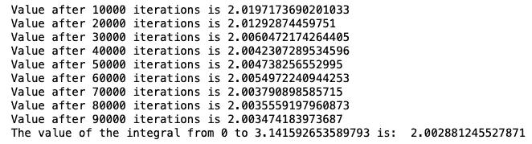

# 继续猜测:蒙特卡罗方法的力量

> 原文：<https://towardsdatascience.com/just-keep-guessing-the-power-of-the-monte-carlo-method-f06bc6f33d19?source=collection_archive---------25----------------------->


Photo by [Martinp1](https://commons.wikimedia.org/wiki/User:Martinp1)

蒙特卡罗方法是一个非常强大的工具，广泛应用于各种领域。从数学到科学到金融，蒙特卡罗方法可以用来解决各种独特而有趣的问题。

蒙特卡罗方法的思想相当简单。它依靠大量的重复随机抽样来获得数值结果，并取所有这些结果的平均值来找到问题的最终答案。

让我们尝试用蒙特卡罗方法找到积分的数值解。在我们开始之前，应该注意到蒙特卡罗模拟对于单变量函数来说并不是最优的。他们在解决多变量函数时做得最好，但是为了清楚和简单起见，我们现在将坚持一个。

先说函数平均值的定义。平均值可以表示为


其中 *a* 和 *b* 是我们的开始和结束积分点， *x* 是我们正在积分的值。因此，从这里我们可以通过将方程的两边乘以范围 *(b-a)来计算积分。*


现在积分等于一个函数的平均值乘以我们想要积分的范围。

从这里我们要求 *F* 的平均值。我们可以这样做:取一个大的随机数样本，找到每个随机数的对应值，将这些值相加，然后用随机数的总数除总和。数学上，这个关系看起来像


值得注意的是，这只在**随机数均匀分布**的情况下有效。记住这一点，感兴趣的积分的最终方程是


现在剩下要做的就是插入我们想要积分的函数，我们积分的极限，以及在计算积分时我们想要猜多少次。

让我们举一个简单的例子。让我们将函数 *sin(x)* 从 0 到 *pi* 进行积分。分析上，这个积分并不太难，计算只是


但是我们的兴趣是看看蒙特卡罗方法能多好地完成这个计算，所以我们要解的方程是


这是你运行自己的蒙特卡洛计算所需的所有代码。

```
import numpy as np
from scipy import randoma, b = 0, np.pi # limits of integration
N = 100_000     # Number of random points
integral = 0.0  # initialize the value of the integralx_random = random.uniform(a,b,N) # array of random numbersdef func(x):
    '''This is the function that we want to integrate'''
    return np.sin(x)# Makes a guess at the integral, adds that guess to the other guesses, and prints intermediate answers
for x in range(N):
    integral += func(x_random[x])
    if (x % 10_000 == 0) & (x != 0):
        intermediate_answer = (b-a)/float(x)*integral
        print(f'Value after {x} iterations is {intermediate_answer}')

answer = (b-a)/float(N)*integral
print(f'The value of the integral from {a} to {b} is: ', answer)
```

结果是



我们可以看到，我们的蒙特卡洛计算正在慢慢地向正确答案靠拢！