# 67%对 45%的 TD 通过率对运行率。随着 NFL 常规赛的结束，这种奇怪的趋势会持续下去吗？

> 原文：<https://towardsdatascience.com/just-run-the-damn-football-at-the-goalline-a7771b190050?source=collection_archive---------43----------------------->

## 你应该跑还是应该越过球门线？

(这篇文章最初发表于 2019 年 10 月 22 日，涵盖了截至第 6 周的统计数据。本次更新涵盖统计数据，直到第 16 周。)

所以你一直走到了对手的 1。传统观点认为你应该直接运行它。然而，许多主教练认为这太容易预测了，所以他们选择传球。基于数据的决策应该是什么？

我收集了从 2014 年到 2019 年在对手 1 码线开始的所有比赛的日志。像往常一样，我在这里排除了投篮尝试，唯一合理的解释是，在那个特定的时刻，你更加重视眼前的收益——时间不多了，和/或投篮实际上帮助你的球队赢得了很多的概率，比如从 6 到 9 分的领先优势，或者追平或在晚些时候领先。剧透一下，1 号位的投篮命中率是 49/49。所以让我们把注意力集中在传球和抢攻上。当然，我也排除了下跪戏。

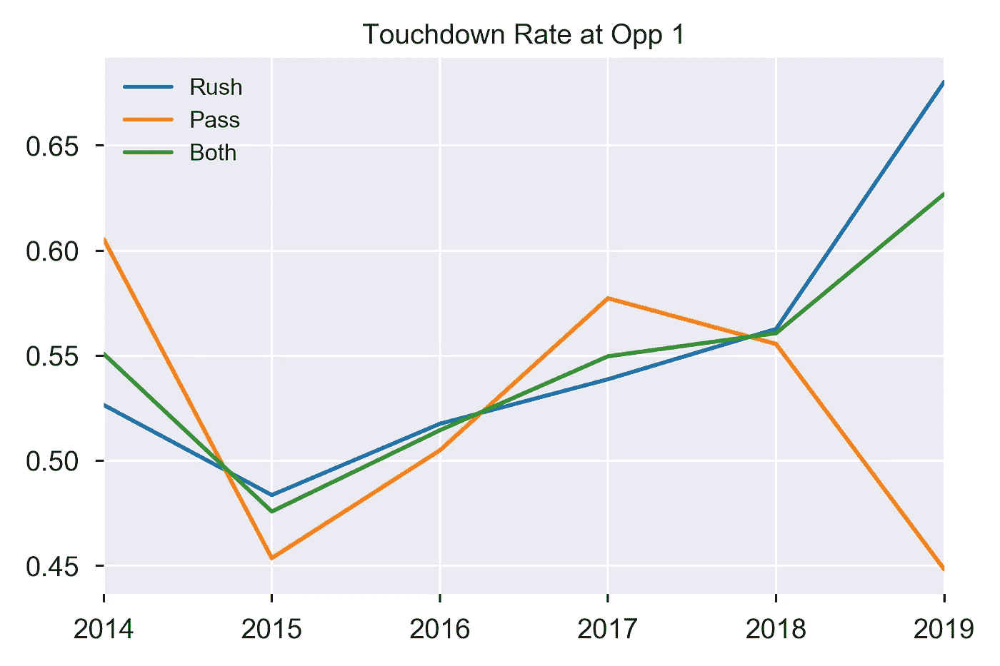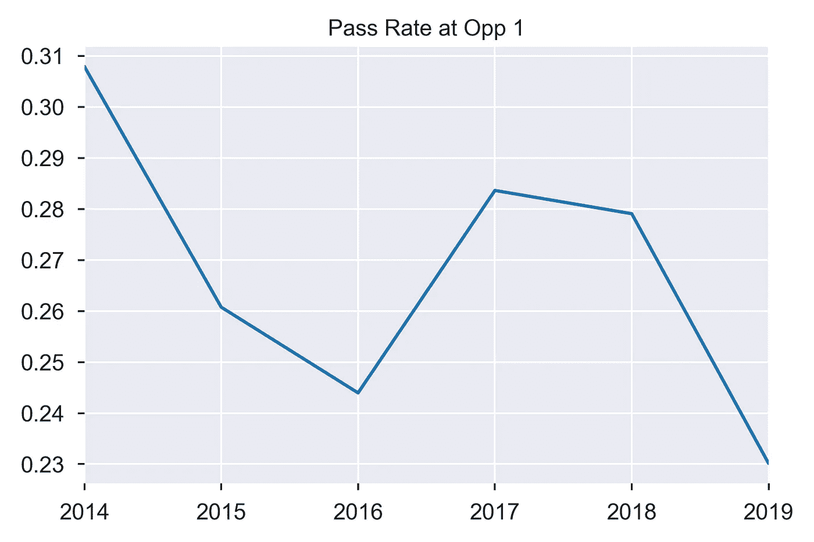

总的来说，触地得分率徘徊在 55%左右，有些年份比其他年份好。2019 年实际上是非常好的一年，整体触地得分率超过 60%。(这不是一个小样本的人工制品，或者只是在赛季初还没有解决的问题，因为当只考虑 9 月和 10 月的比赛时，可以得出相同的结论)。几年过去后，你会有稍微好一点的机会，比如 2014 年和 2017 年，类似的几年，2015 年对两者都不好。但到目前为止，我们从未有过像 2019 年这样的一年，即通过与运行的 TD 比率分别为 67%和 45%。大多数教练知道他们应该少传球，因为他们已经选择传球的时间低于 30%，今年是所有教练中最低的。但不是我的绿湾包装工队。在周四晚上的足球比赛中对阵老鹰队，他们在费城 1 号连续四次传球，导致四次失误和失误。

P(TD，4 次运行)=1-(1–0.68)⁴= 0.985

P(TD，4 遍)=1-(1–0.448)⁴= 0.907

相差 8%！

接下来，一个理念是你应该在第一次传球时多传球，让对手措手不及。从历史上看，这是有数据支持的。TD 通过率在第一次下降时高得多，在第四次下降时低得多。但这在 2019 年不再成立。事实上，在第一、第三和第四次下降时冲得更好，在第二次下降时稍微差一点。

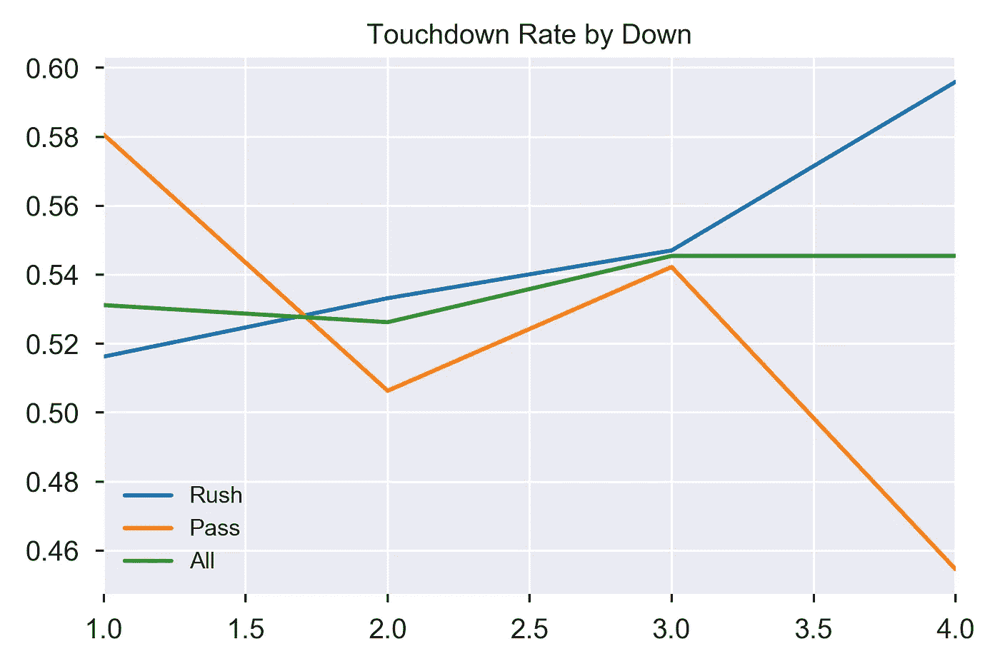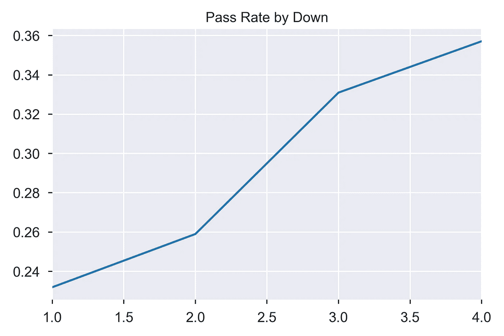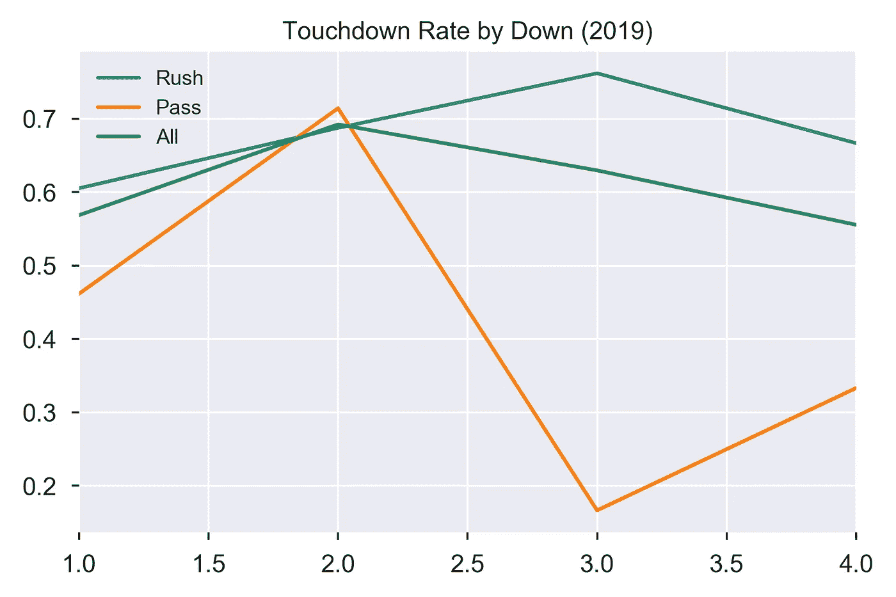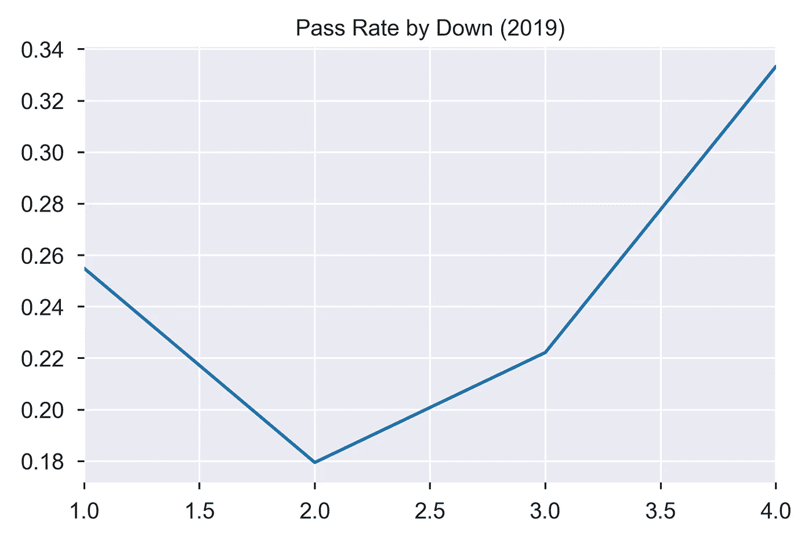

另一个支持足球的理由是风险更小。失误率实际上非常相似——所有传球和跑位的拦截率为 1.8%，失球率为 2.1%。奇怪的是，你甚至可以在前面只有 1 码的绿草地的情况下摸索出一个信号。到目前为止，这项荣誉属于我的数据集中唯一的充电器。

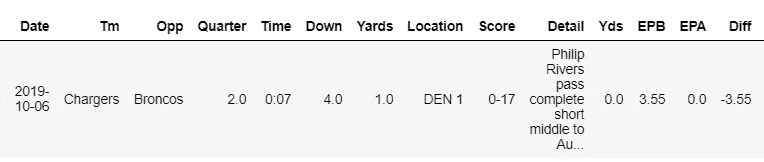

Philip Rivers pass complete short middle to Austin Ekeler for no gain (tackle by Kareem Jackson). Austin Ekeler fumbles ball out of bounds at DEN-1 (forced by Kareem Jackson)

我们应该考虑事情变得非常糟糕的极端情况。就像今年底特律的失球，堪萨斯城的达阵得分。

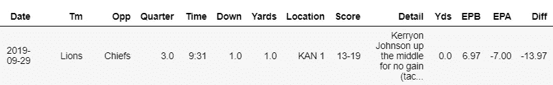

Kerryon Johnson up the middle for no gain (tackle by Xavier Williams). Kerryon Johnson fumbles (forced by Xavier Williams) recovered by Bashaud Breeland at KC-0 and returned for 100 yards touchdown

在我们的数据集中，最糟糕的传球失误是 Blake Bortles 拦截，他在 84 码处回球。

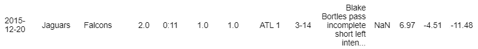

Blake Bortles pass incomplete short left intended for Marcedes Lewis is intercepted by Kemal Ishmael at ATL-0 and returned for 84 yards

这是过去几年中唯一一次比触球收益更高的失误。但当然，100 码的拦截回报是可能发生的，最令人难忘的是匹兹堡钢人队对红雀队的超级碗第四十三届选秀权(库尔特·华纳传球不完整的短中路，打算给安泉·波尔丁，在 0 号坑被詹姆斯·哈里森拦截，并返回 100 码触地得分)。综合来看，冲向或越过球门线的风险似乎不相上下，但冲向现在给团队带来了更大的好处。所以只管跑那该死的足球！

# 那么这种趋势会在赛季末保持吗？

*下图来自 2019 年常规赛第 16 周的更新。*

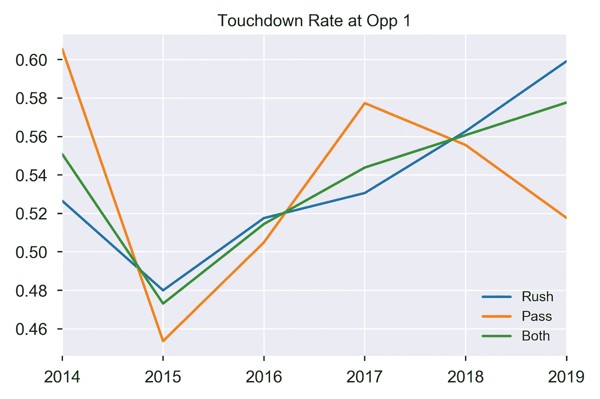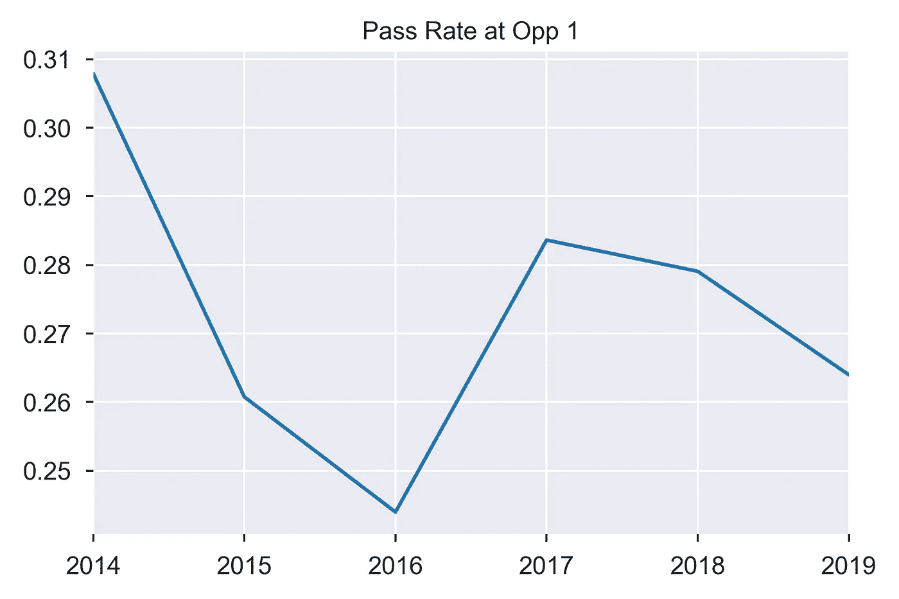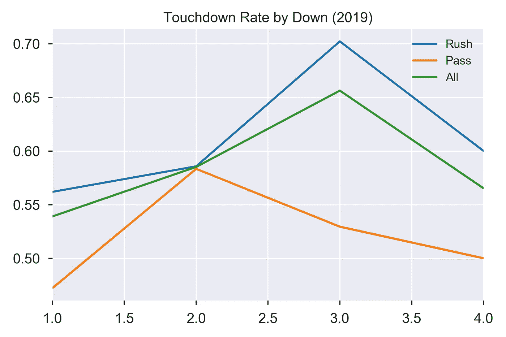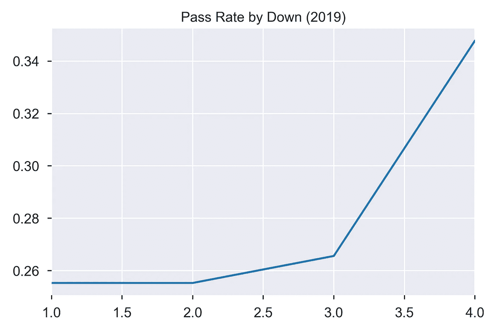

嗯……没那么引人注目，但仍然是一个巨大的差异。在 60%的情况下，冲球仍然能让你触地得分；而现在通过至少让你有 52%的机会获得 50%以上的机会。但是，在必须得分的情况下，6 分在起跑线上， **8%的触地得分率增长**仍然有很大的不同。

更有趣的见解来自唐斯的分解。虽然**的传球率在第四轮比赛中飙升，但 rushing 仍然更加成功**，达阵率高出 10%。如果你真的想传球，第二次触地得分应该是在你传球的时候，因为传球和冲刺给你的触地得分率是 58%。

你可以在我的 [Github](https://github.com/tsofoon/nflgoaline) 上找到我的代码，并在 [LinkedIn](https://www.linkedin.com/in/matttso/) 上与我联系。数据来自 Profootballreference.com。它在 2019 年 NFL 赛季的第 6 周更新，首次发布；并且在第二次发行的第 16 周。